# Telecom Churn Case Study


---


## Overview
In the telecom industry, customers are able to choose from multiple service providers and actively switch from one operator to another. In this highly competitive market, the telecommunications industry experiences an average of 15-25% annual churn rate. Given the fact that it costs 5-10 times more to acquire a new customer than to retain an existing one, customer retention has now become even more important than customer acquisition.

For many incumbent operators, retaining high profitable customers is the number one business goal.

## Business Objective

The objective is to reduce customer churn and improve customer retention in a highly competitive market. Retaining **high profitable customers** is the number one business goal

## Case Study Objective
The goal is to build a machine learning model using customer-level data to identify customers at high risk of churn.


## Steps

#### 1) Data Understanding, Preparation, and Pre-Processing
#### 2) Exploratory Data Analysis
#### 3) Feature Transformation
#### 4) Model Building and Preddiction


```python
# Supress Warnings

import warnings
warnings.filterwarnings('ignore')
```


```python
!pip install Ipython
```

    Requirement already satisfied: Ipython in d:\sw\python\3.8\lib\site-packages (8.12.2)
    Requirement already satisfied: backcall in d:\sw\python\3.8\lib\site-packages (from Ipython) (0.2.0)
    Requirement already satisfied: decorator in d:\sw\python\3.8\lib\site-packages (from Ipython) (5.1.1)
    Requirement already satisfied: jedi>=0.16 in d:\sw\python\3.8\lib\site-packages (from Ipython) (0.19.0)
    Requirement already satisfied: matplotlib-inline in d:\sw\python\3.8\lib\site-packages (from Ipython) (0.1.6)
    Requirement already satisfied: pickleshare in d:\sw\python\3.8\lib\site-packages (from Ipython) (0.7.5)
    Requirement already satisfied: prompt-toolkit!=3.0.37,<3.1.0,>=3.0.30 in d:\sw\python\3.8\lib\site-packages (from Ipython) (3.0.39)
    Requirement already satisfied: pygments>=2.4.0 in d:\sw\python\3.8\lib\site-packages (from Ipython) (2.16.1)
    Requirement already satisfied: stack-data in d:\sw\python\3.8\lib\site-packages (from Ipython) (0.6.2)
    Requirement already satisfied: traitlets>=5 in d:\sw\python\3.8\lib\site-packages (from Ipython) (5.9.0)
    Requirement already satisfied: typing-extensions in d:\sw\python\3.8\lib\site-packages (from Ipython) (4.7.1)
    Requirement already satisfied: colorama in c:\users\timeparity\appdata\roaming\python\python38\site-packages (from Ipython) (0.4.3)
    Requirement already satisfied: parso<0.9.0,>=0.8.3 in d:\sw\python\3.8\lib\site-packages (from jedi>=0.16->Ipython) (0.8.3)
    Requirement already satisfied: wcwidth in d:\sw\python\3.8\lib\site-packages (from prompt-toolkit!=3.0.37,<3.1.0,>=3.0.30->Ipython) (0.2.6)
    Requirement already satisfied: executing>=1.2.0 in d:\sw\python\3.8\lib\site-packages (from stack-data->Ipython) (1.2.0)
    Requirement already satisfied: asttokens>=2.1.0 in d:\sw\python\3.8\lib\site-packages (from stack-data->Ipython) (2.2.1)
    Requirement already satisfied: pure-eval in d:\sw\python\3.8\lib\site-packages (from stack-data->Ipython) (0.2.2)
    Requirement already satisfied: six in c:\users\timeparity\appdata\roaming\python\python38\site-packages (from asttokens>=2.1.0->stack-data->Ipython) (1.14.0)
    

    
    [notice] A new release of pip is available: 23.1.2 -> 23.2.1
    [notice] To update, run: python.exe -m pip install --upgrade pip
    


```python
#Import the required packages

import os
import calendar
from datetime import datetime
import math
import pandas as pd
import numpy as np

from IPython.display import display_markdown
from sklearn.decomposition import PCA
from sklearn.preprocessing import StandardScaler
from sklearn.decomposition import IncrementalPCA
from sklearn.linear_model import LogisticRegression
from sklearn.model_selection import GridSearchCV, RandomizedSearchCV, StratifiedKFold
from sklearn.metrics import roc_auc_score, accuracy_score
from sklearn.preprocessing import OneHotEncoder
from sklearn.model_selection import train_test_split
from sklearn.metrics import classification_report
from sklearn.metrics import confusion_matrix
from sklearn.feature_selection import RFE
from sklearn.linear_model import LogisticRegression
from sklearn.ensemble import RandomForestClassifier
import statsmodels.api as sm
from statsmodels.stats.outliers_influence import variance_inflation_factor

import xgboost as xgb
import matplotlib.pyplot as plt
import seaborn as sns
import plotly.graph_objects as go
```

##  Data Understanding, Preparation, and Pre-Processing


```python
# reading the dataset
telecom = pd.read_csv("train.csv")


```


```python
# summary of the dataset:
telecom.info(verbose=True, show_counts=True)
```

    <class 'pandas.core.frame.DataFrame'>
    RangeIndex: 69999 entries, 0 to 69998
    Data columns (total 172 columns):
     #    Column                    Non-Null Count  Dtype  
    ---   ------                    --------------  -----  
     0    id                        69999 non-null  int64  
     1    circle_id                 69999 non-null  int64  
     2    loc_og_t2o_mou            69297 non-null  float64
     3    std_og_t2o_mou            69297 non-null  float64
     4    loc_ic_t2o_mou            69297 non-null  float64
     5    last_date_of_month_6      69999 non-null  object 
     6    last_date_of_month_7      69600 non-null  object 
     7    last_date_of_month_8      69266 non-null  object 
     8    arpu_6                    69999 non-null  float64
     9    arpu_7                    69999 non-null  float64
     10   arpu_8                    69999 non-null  float64
     11   onnet_mou_6               67231 non-null  float64
     12   onnet_mou_7               67312 non-null  float64
     13   onnet_mou_8               66296 non-null  float64
     14   offnet_mou_6              67231 non-null  float64
     15   offnet_mou_7              67312 non-null  float64
     16   offnet_mou_8              66296 non-null  float64
     17   roam_ic_mou_6             67231 non-null  float64
     18   roam_ic_mou_7             67312 non-null  float64
     19   roam_ic_mou_8             66296 non-null  float64
     20   roam_og_mou_6             67231 non-null  float64
     21   roam_og_mou_7             67312 non-null  float64
     22   roam_og_mou_8             66296 non-null  float64
     23   loc_og_t2t_mou_6          67231 non-null  float64
     24   loc_og_t2t_mou_7          67312 non-null  float64
     25   loc_og_t2t_mou_8          66296 non-null  float64
     26   loc_og_t2m_mou_6          67231 non-null  float64
     27   loc_og_t2m_mou_7          67312 non-null  float64
     28   loc_og_t2m_mou_8          66296 non-null  float64
     29   loc_og_t2f_mou_6          67231 non-null  float64
     30   loc_og_t2f_mou_7          67312 non-null  float64
     31   loc_og_t2f_mou_8          66296 non-null  float64
     32   loc_og_t2c_mou_6          67231 non-null  float64
     33   loc_og_t2c_mou_7          67312 non-null  float64
     34   loc_og_t2c_mou_8          66296 non-null  float64
     35   loc_og_mou_6              67231 non-null  float64
     36   loc_og_mou_7              67312 non-null  float64
     37   loc_og_mou_8              66296 non-null  float64
     38   std_og_t2t_mou_6          67231 non-null  float64
     39   std_og_t2t_mou_7          67312 non-null  float64
     40   std_og_t2t_mou_8          66296 non-null  float64
     41   std_og_t2m_mou_6          67231 non-null  float64
     42   std_og_t2m_mou_7          67312 non-null  float64
     43   std_og_t2m_mou_8          66296 non-null  float64
     44   std_og_t2f_mou_6          67231 non-null  float64
     45   std_og_t2f_mou_7          67312 non-null  float64
     46   std_og_t2f_mou_8          66296 non-null  float64
     47   std_og_t2c_mou_6          67231 non-null  float64
     48   std_og_t2c_mou_7          67312 non-null  float64
     49   std_og_t2c_mou_8          66296 non-null  float64
     50   std_og_mou_6              67231 non-null  float64
     51   std_og_mou_7              67312 non-null  float64
     52   std_og_mou_8              66296 non-null  float64
     53   isd_og_mou_6              67231 non-null  float64
     54   isd_og_mou_7              67312 non-null  float64
     55   isd_og_mou_8              66296 non-null  float64
     56   spl_og_mou_6              67231 non-null  float64
     57   spl_og_mou_7              67312 non-null  float64
     58   spl_og_mou_8              66296 non-null  float64
     59   og_others_6               67231 non-null  float64
     60   og_others_7               67312 non-null  float64
     61   og_others_8               66296 non-null  float64
     62   total_og_mou_6            69999 non-null  float64
     63   total_og_mou_7            69999 non-null  float64
     64   total_og_mou_8            69999 non-null  float64
     65   loc_ic_t2t_mou_6          67231 non-null  float64
     66   loc_ic_t2t_mou_7          67312 non-null  float64
     67   loc_ic_t2t_mou_8          66296 non-null  float64
     68   loc_ic_t2m_mou_6          67231 non-null  float64
     69   loc_ic_t2m_mou_7          67312 non-null  float64
     70   loc_ic_t2m_mou_8          66296 non-null  float64
     71   loc_ic_t2f_mou_6          67231 non-null  float64
     72   loc_ic_t2f_mou_7          67312 non-null  float64
     73   loc_ic_t2f_mou_8          66296 non-null  float64
     74   loc_ic_mou_6              67231 non-null  float64
     75   loc_ic_mou_7              67312 non-null  float64
     76   loc_ic_mou_8              66296 non-null  float64
     77   std_ic_t2t_mou_6          67231 non-null  float64
     78   std_ic_t2t_mou_7          67312 non-null  float64
     79   std_ic_t2t_mou_8          66296 non-null  float64
     80   std_ic_t2m_mou_6          67231 non-null  float64
     81   std_ic_t2m_mou_7          67312 non-null  float64
     82   std_ic_t2m_mou_8          66296 non-null  float64
     83   std_ic_t2f_mou_6          67231 non-null  float64
     84   std_ic_t2f_mou_7          67312 non-null  float64
     85   std_ic_t2f_mou_8          66296 non-null  float64
     86   std_ic_t2o_mou_6          67231 non-null  float64
     87   std_ic_t2o_mou_7          67312 non-null  float64
     88   std_ic_t2o_mou_8          66296 non-null  float64
     89   std_ic_mou_6              67231 non-null  float64
     90   std_ic_mou_7              67312 non-null  float64
     91   std_ic_mou_8              66296 non-null  float64
     92   total_ic_mou_6            69999 non-null  float64
     93   total_ic_mou_7            69999 non-null  float64
     94   total_ic_mou_8            69999 non-null  float64
     95   spl_ic_mou_6              67231 non-null  float64
     96   spl_ic_mou_7              67312 non-null  float64
     97   spl_ic_mou_8              66296 non-null  float64
     98   isd_ic_mou_6              67231 non-null  float64
     99   isd_ic_mou_7              67312 non-null  float64
     100  isd_ic_mou_8              66296 non-null  float64
     101  ic_others_6               67231 non-null  float64
     102  ic_others_7               67312 non-null  float64
     103  ic_others_8               66296 non-null  float64
     104  total_rech_num_6          69999 non-null  int64  
     105  total_rech_num_7          69999 non-null  int64  
     106  total_rech_num_8          69999 non-null  int64  
     107  total_rech_amt_6          69999 non-null  int64  
     108  total_rech_amt_7          69999 non-null  int64  
     109  total_rech_amt_8          69999 non-null  int64  
     110  max_rech_amt_6            69999 non-null  int64  
     111  max_rech_amt_7            69999 non-null  int64  
     112  max_rech_amt_8            69999 non-null  int64  
     113  date_of_last_rech_6       68898 non-null  object 
     114  date_of_last_rech_7       68765 non-null  object 
     115  date_of_last_rech_8       67538 non-null  object 
     116  last_day_rch_amt_6        69999 non-null  int64  
     117  last_day_rch_amt_7        69999 non-null  int64  
     118  last_day_rch_amt_8        69999 non-null  int64  
     119  date_of_last_rech_data_6  17568 non-null  object 
     120  date_of_last_rech_data_7  17865 non-null  object 
     121  date_of_last_rech_data_8  18417 non-null  object 
     122  total_rech_data_6         17568 non-null  float64
     123  total_rech_data_7         17865 non-null  float64
     124  total_rech_data_8         18417 non-null  float64
     125  max_rech_data_6           17568 non-null  float64
     126  max_rech_data_7           17865 non-null  float64
     127  max_rech_data_8           18417 non-null  float64
     128  count_rech_2g_6           17568 non-null  float64
     129  count_rech_2g_7           17865 non-null  float64
     130  count_rech_2g_8           18417 non-null  float64
     131  count_rech_3g_6           17568 non-null  float64
     132  count_rech_3g_7           17865 non-null  float64
     133  count_rech_3g_8           18417 non-null  float64
     134  av_rech_amt_data_6        17568 non-null  float64
     135  av_rech_amt_data_7        17865 non-null  float64
     136  av_rech_amt_data_8        18417 non-null  float64
     137  vol_2g_mb_6               69999 non-null  float64
     138  vol_2g_mb_7               69999 non-null  float64
     139  vol_2g_mb_8               69999 non-null  float64
     140  vol_3g_mb_6               69999 non-null  float64
     141  vol_3g_mb_7               69999 non-null  float64
     142  vol_3g_mb_8               69999 non-null  float64
     143  arpu_3g_6                 17568 non-null  float64
     144  arpu_3g_7                 17865 non-null  float64
     145  arpu_3g_8                 18417 non-null  float64
     146  arpu_2g_6                 17568 non-null  float64
     147  arpu_2g_7                 17865 non-null  float64
     148  arpu_2g_8                 18417 non-null  float64
     149  night_pck_user_6          17568 non-null  float64
     150  night_pck_user_7          17865 non-null  float64
     151  night_pck_user_8          18417 non-null  float64
     152  monthly_2g_6              69999 non-null  int64  
     153  monthly_2g_7              69999 non-null  int64  
     154  monthly_2g_8              69999 non-null  int64  
     155  sachet_2g_6               69999 non-null  int64  
     156  sachet_2g_7               69999 non-null  int64  
     157  sachet_2g_8               69999 non-null  int64  
     158  monthly_3g_6              69999 non-null  int64  
     159  monthly_3g_7              69999 non-null  int64  
     160  monthly_3g_8              69999 non-null  int64  
     161  sachet_3g_6               69999 non-null  int64  
     162  sachet_3g_7               69999 non-null  int64  
     163  sachet_3g_8               69999 non-null  int64  
     164  fb_user_6                 17568 non-null  float64
     165  fb_user_7                 17865 non-null  float64
     166  fb_user_8                 18417 non-null  float64
     167  aon                       69999 non-null  int64  
     168  aug_vbc_3g                69999 non-null  float64
     169  jul_vbc_3g                69999 non-null  float64
     170  jun_vbc_3g                69999 non-null  float64
     171  churn_probability         69999 non-null  int64  
    dtypes: float64(135), int64(28), object(9)
    memory usage: 91.9+ MB
    

### 171 columns, 163 numerical, 9 objects

#### churn_probablity is the target variable


```python
# view the top 5 rows of the data

telecom.head()
```


<div>
<style scoped>
    .dataframe tbody tr th:only-of-type {
        vertical-align: middle;
    }

    .dataframe tbody tr th {
        vertical-align: top;
    }

    .dataframe thead th {
        text-align: right;
    }
</style>
<table border="1" class="dataframe">
  <thead>
    <tr style="text-align: right;">
      <th></th>
      <th>id</th>
      <th>circle_id</th>
      <th>loc_og_t2o_mou</th>
      <th>std_og_t2o_mou</th>
      <th>loc_ic_t2o_mou</th>
      <th>last_date_of_month_6</th>
      <th>last_date_of_month_7</th>
      <th>last_date_of_month_8</th>
      <th>arpu_6</th>
      <th>arpu_7</th>
      <th>...</th>
      <th>sachet_3g_7</th>
      <th>sachet_3g_8</th>
      <th>fb_user_6</th>
      <th>fb_user_7</th>
      <th>fb_user_8</th>
      <th>aon</th>
      <th>aug_vbc_3g</th>
      <th>jul_vbc_3g</th>
      <th>jun_vbc_3g</th>
      <th>churn_probability</th>
    </tr>
  </thead>
  <tbody>
    <tr>
      <th>0</th>
      <td>0</td>
      <td>109</td>
      <td>0.0</td>
      <td>0.0</td>
      <td>0.0</td>
      <td>6/30/2014</td>
      <td>7/31/2014</td>
      <td>8/31/2014</td>
      <td>31.277</td>
      <td>87.009</td>
      <td>...</td>
      <td>0</td>
      <td>0</td>
      <td>NaN</td>
      <td>NaN</td>
      <td>NaN</td>
      <td>1958</td>
      <td>0.0</td>
      <td>0.0</td>
      <td>0.0</td>
      <td>0</td>
    </tr>
    <tr>
      <th>1</th>
      <td>1</td>
      <td>109</td>
      <td>0.0</td>
      <td>0.0</td>
      <td>0.0</td>
      <td>6/30/2014</td>
      <td>7/31/2014</td>
      <td>8/31/2014</td>
      <td>0.000</td>
      <td>122.787</td>
      <td>...</td>
      <td>0</td>
      <td>0</td>
      <td>NaN</td>
      <td>1.0</td>
      <td>NaN</td>
      <td>710</td>
      <td>0.0</td>
      <td>0.0</td>
      <td>0.0</td>
      <td>0</td>
    </tr>
    <tr>
      <th>2</th>
      <td>2</td>
      <td>109</td>
      <td>0.0</td>
      <td>0.0</td>
      <td>0.0</td>
      <td>6/30/2014</td>
      <td>7/31/2014</td>
      <td>8/31/2014</td>
      <td>60.806</td>
      <td>103.176</td>
      <td>...</td>
      <td>0</td>
      <td>0</td>
      <td>NaN</td>
      <td>NaN</td>
      <td>NaN</td>
      <td>882</td>
      <td>0.0</td>
      <td>0.0</td>
      <td>0.0</td>
      <td>0</td>
    </tr>
    <tr>
      <th>3</th>
      <td>3</td>
      <td>109</td>
      <td>0.0</td>
      <td>0.0</td>
      <td>0.0</td>
      <td>6/30/2014</td>
      <td>7/31/2014</td>
      <td>8/31/2014</td>
      <td>156.362</td>
      <td>205.260</td>
      <td>...</td>
      <td>0</td>
      <td>0</td>
      <td>NaN</td>
      <td>NaN</td>
      <td>NaN</td>
      <td>982</td>
      <td>0.0</td>
      <td>0.0</td>
      <td>0.0</td>
      <td>0</td>
    </tr>
    <tr>
      <th>4</th>
      <td>4</td>
      <td>109</td>
      <td>0.0</td>
      <td>0.0</td>
      <td>0.0</td>
      <td>6/30/2014</td>
      <td>7/31/2014</td>
      <td>8/31/2014</td>
      <td>240.708</td>
      <td>128.191</td>
      <td>...</td>
      <td>1</td>
      <td>0</td>
      <td>1.0</td>
      <td>1.0</td>
      <td>1.0</td>
      <td>647</td>
      <td>0.0</td>
      <td>0.0</td>
      <td>0.0</td>
      <td>0</td>
    </tr>
  </tbody>
</table>
<p>5 rows × 172 columns</p>
</div>


#### Understand Data dictionary


```python
#function to plot data as table
def PlotAsTable(df, figName):
    print(f"----------------------------------------------------------------------------------------------------- \n Note: If you dont see the table '{figName}' below,\n please ensure the Jupyter Notebook is marked Trusted (File --> Trusted Notebook) \n-----------------------------------------------------------------------------------------------------")
    display_markdown(f'''#### {figName} ''',  raw=True)
    display_markdown("---",  raw=True)
    display_markdown(df.to_markdown(index = False), raw=True)
    #return df.to_markdown(index = False)
```


```python
# read the data dictonary
data_dict = pd.read_csv("data_dictionary.csv")
PlotAsTable(data_dict, "Data Dictionary" )
```

    ----------------------------------------------------------------------------------------------------- 
     Note: If you dont see the table 'Data Dictionary' below,
     please ensure the Jupyter Notebook is marked Trusted (File --> Trusted Notebook) 
    -----------------------------------------------------------------------------------------------------
    


#### Data Dictionary 


---


| Acronyms   | Description                                                                       |
|:-----------|:----------------------------------------------------------------------------------|
| CIRCLE_ID  | Telecom circle area to which the customer belongs to                              |
| LOC        | Local calls  within same telecom circle                                           |
| STD        | STD calls  outside the calling circle                                             |
| IC         | Incoming calls                                                                    |
| OG         | Outgoing calls                                                                    |
| T2T        | Operator T to T ie within same operator mobile to mobile                          |
| T2M        | Operator T to other operator mobile                                               |
| T2O        | Operator T to other operator fixed line                                           |
| T2F        | Operator T to fixed lines of T                                                    |
| T2C        | Operator T to its own call center                                                 |
| ARPU       | Average revenue per user                                                          |
| MOU        | Minutes of usage  voice calls                                                     |
| AON        | Age on network  number of days the customer is using the operator T network       |
| ONNET      | All kind of calls within the same operator network                                |
| OFFNET     | All kind of calls outside the operator T network                                  |
| ROAM       | Indicates that customer is in roaming zone during the call                        |
| SPL        | Special calls                                                                     |
| ISD        | ISD calls                                                                         |
| RECH       | Recharge                                                                          |
| NUM        | Number                                                                            |
| AMT        | Amount in local currency                                                          |
| MAX        | Maximum                                                                           |
| DATA       | Mobile internet                                                                   |
| 3G         | G network                                                                         |
| AV         | Average                                                                           |
| VOL        | Mobile internet usage volume in MB                                                |
| 2G         | G network                                                                         |
| PCK        | Prepaid service schemes called  PACKS                                             |
| NIGHT      | Scheme to use during specific night hours only                                    |
| MONTHLY    | Service schemes with validity equivalent to a month                               |
| SACHET     | Service schemes with validity smaller than a month                                |
| *.6        | KPI for the month of June                                                         |
| *.7        | KPI for the month of July                                                         |
| *.8        | KPI for the month of August                                                       |
| FB_USER    | Service scheme to avail services of Facebook and similar social networking sites  |
| VBC        | Volume based cost  when no specific scheme is not purchased and paid as per usage |


### From the Data Dictionary we know:

#### 1. "ALL" the below 9 object indicate datetime and and should be converted to datetime

##### last_date_of_month_6, last_date_of_month_7, last_date_of_month_8,
##### date_of_last_rech_6, date_of_last_rech_7, date_of_last_rech_8
##### date_of_last_rech_data_6, date_of_last_rech_data_7, date_of_last_rech_data_8

#### 2. Following columns names are not consistent with naming, we would rename to be consistent
##### aug_vbc_3g  jul_vbc_3g  jun_vbc_3g

#### 3. The total recharge amount for data is missing, it can calculated based on Total Data Recharge Count * Average data recharge amount


```python
# Convert followng columns to datetime
# last_date_of_month_6, last_date_of_month_7, last_date_of_month_8,
# date_of_last_rech_6, date_of_last_rech_7, date_of_last_rech_8
# date_of_last_rech_data_6, date_of_last_rech_data_7, date_of_last_rech_data_8

dateColumns = telecom.select_dtypes(include='object')

#function that converts required columns to datetime
def ConvertDateTimeColumns(df):
    for dCol in dateColumns.columns:
        df[dCol] = pd.to_datetime(df[dCol])

#update the datetime columns
ConvertDateTimeColumns(telecom)
```


```python
#Rename Columns with Meaning full Names
# aug_vbc_3g jul_vbc_3g jun_vbc_3g

#function that renames required columns
def ApplyMeaningfulName(df):
    df.rename(columns={'jun_vbc_3g': 'vbc_3g_6', 'jul_vbc_3g': 'vbc_3g_7', 'aug_vbc_3g': 'vbc_3g_8'}, inplace=True)

ApplyMeaningfulName(telecom)
```


```python
def ShowSummary(df):
    df.info(verbose=True, show_counts=True)
# summary of the updated dataset:
ShowSummary(telecom)
```

    <class 'pandas.core.frame.DataFrame'>
    RangeIndex: 69999 entries, 0 to 69998
    Data columns (total 172 columns):
     #    Column                    Non-Null Count  Dtype         
    ---   ------                    --------------  -----         
     0    id                        69999 non-null  int64         
     1    circle_id                 69999 non-null  int64         
     2    loc_og_t2o_mou            69297 non-null  float64       
     3    std_og_t2o_mou            69297 non-null  float64       
     4    loc_ic_t2o_mou            69297 non-null  float64       
     5    last_date_of_month_6      69999 non-null  datetime64[ns]
     6    last_date_of_month_7      69600 non-null  datetime64[ns]
     7    last_date_of_month_8      69266 non-null  datetime64[ns]
     8    arpu_6                    69999 non-null  float64       
     9    arpu_7                    69999 non-null  float64       
     10   arpu_8                    69999 non-null  float64       
     11   onnet_mou_6               67231 non-null  float64       
     12   onnet_mou_7               67312 non-null  float64       
     13   onnet_mou_8               66296 non-null  float64       
     14   offnet_mou_6              67231 non-null  float64       
     15   offnet_mou_7              67312 non-null  float64       
     16   offnet_mou_8              66296 non-null  float64       
     17   roam_ic_mou_6             67231 non-null  float64       
     18   roam_ic_mou_7             67312 non-null  float64       
     19   roam_ic_mou_8             66296 non-null  float64       
     20   roam_og_mou_6             67231 non-null  float64       
     21   roam_og_mou_7             67312 non-null  float64       
     22   roam_og_mou_8             66296 non-null  float64       
     23   loc_og_t2t_mou_6          67231 non-null  float64       
     24   loc_og_t2t_mou_7          67312 non-null  float64       
     25   loc_og_t2t_mou_8          66296 non-null  float64       
     26   loc_og_t2m_mou_6          67231 non-null  float64       
     27   loc_og_t2m_mou_7          67312 non-null  float64       
     28   loc_og_t2m_mou_8          66296 non-null  float64       
     29   loc_og_t2f_mou_6          67231 non-null  float64       
     30   loc_og_t2f_mou_7          67312 non-null  float64       
     31   loc_og_t2f_mou_8          66296 non-null  float64       
     32   loc_og_t2c_mou_6          67231 non-null  float64       
     33   loc_og_t2c_mou_7          67312 non-null  float64       
     34   loc_og_t2c_mou_8          66296 non-null  float64       
     35   loc_og_mou_6              67231 non-null  float64       
     36   loc_og_mou_7              67312 non-null  float64       
     37   loc_og_mou_8              66296 non-null  float64       
     38   std_og_t2t_mou_6          67231 non-null  float64       
     39   std_og_t2t_mou_7          67312 non-null  float64       
     40   std_og_t2t_mou_8          66296 non-null  float64       
     41   std_og_t2m_mou_6          67231 non-null  float64       
     42   std_og_t2m_mou_7          67312 non-null  float64       
     43   std_og_t2m_mou_8          66296 non-null  float64       
     44   std_og_t2f_mou_6          67231 non-null  float64       
     45   std_og_t2f_mou_7          67312 non-null  float64       
     46   std_og_t2f_mou_8          66296 non-null  float64       
     47   std_og_t2c_mou_6          67231 non-null  float64       
     48   std_og_t2c_mou_7          67312 non-null  float64       
     49   std_og_t2c_mou_8          66296 non-null  float64       
     50   std_og_mou_6              67231 non-null  float64       
     51   std_og_mou_7              67312 non-null  float64       
     52   std_og_mou_8              66296 non-null  float64       
     53   isd_og_mou_6              67231 non-null  float64       
     54   isd_og_mou_7              67312 non-null  float64       
     55   isd_og_mou_8              66296 non-null  float64       
     56   spl_og_mou_6              67231 non-null  float64       
     57   spl_og_mou_7              67312 non-null  float64       
     58   spl_og_mou_8              66296 non-null  float64       
     59   og_others_6               67231 non-null  float64       
     60   og_others_7               67312 non-null  float64       
     61   og_others_8               66296 non-null  float64       
     62   total_og_mou_6            69999 non-null  float64       
     63   total_og_mou_7            69999 non-null  float64       
     64   total_og_mou_8            69999 non-null  float64       
     65   loc_ic_t2t_mou_6          67231 non-null  float64       
     66   loc_ic_t2t_mou_7          67312 non-null  float64       
     67   loc_ic_t2t_mou_8          66296 non-null  float64       
     68   loc_ic_t2m_mou_6          67231 non-null  float64       
     69   loc_ic_t2m_mou_7          67312 non-null  float64       
     70   loc_ic_t2m_mou_8          66296 non-null  float64       
     71   loc_ic_t2f_mou_6          67231 non-null  float64       
     72   loc_ic_t2f_mou_7          67312 non-null  float64       
     73   loc_ic_t2f_mou_8          66296 non-null  float64       
     74   loc_ic_mou_6              67231 non-null  float64       
     75   loc_ic_mou_7              67312 non-null  float64       
     76   loc_ic_mou_8              66296 non-null  float64       
     77   std_ic_t2t_mou_6          67231 non-null  float64       
     78   std_ic_t2t_mou_7          67312 non-null  float64       
     79   std_ic_t2t_mou_8          66296 non-null  float64       
     80   std_ic_t2m_mou_6          67231 non-null  float64       
     81   std_ic_t2m_mou_7          67312 non-null  float64       
     82   std_ic_t2m_mou_8          66296 non-null  float64       
     83   std_ic_t2f_mou_6          67231 non-null  float64       
     84   std_ic_t2f_mou_7          67312 non-null  float64       
     85   std_ic_t2f_mou_8          66296 non-null  float64       
     86   std_ic_t2o_mou_6          67231 non-null  float64       
     87   std_ic_t2o_mou_7          67312 non-null  float64       
     88   std_ic_t2o_mou_8          66296 non-null  float64       
     89   std_ic_mou_6              67231 non-null  float64       
     90   std_ic_mou_7              67312 non-null  float64       
     91   std_ic_mou_8              66296 non-null  float64       
     92   total_ic_mou_6            69999 non-null  float64       
     93   total_ic_mou_7            69999 non-null  float64       
     94   total_ic_mou_8            69999 non-null  float64       
     95   spl_ic_mou_6              67231 non-null  float64       
     96   spl_ic_mou_7              67312 non-null  float64       
     97   spl_ic_mou_8              66296 non-null  float64       
     98   isd_ic_mou_6              67231 non-null  float64       
     99   isd_ic_mou_7              67312 non-null  float64       
     100  isd_ic_mou_8              66296 non-null  float64       
     101  ic_others_6               67231 non-null  float64       
     102  ic_others_7               67312 non-null  float64       
     103  ic_others_8               66296 non-null  float64       
     104  total_rech_num_6          69999 non-null  int64         
     105  total_rech_num_7          69999 non-null  int64         
     106  total_rech_num_8          69999 non-null  int64         
     107  total_rech_amt_6          69999 non-null  int64         
     108  total_rech_amt_7          69999 non-null  int64         
     109  total_rech_amt_8          69999 non-null  int64         
     110  max_rech_amt_6            69999 non-null  int64         
     111  max_rech_amt_7            69999 non-null  int64         
     112  max_rech_amt_8            69999 non-null  int64         
     113  date_of_last_rech_6       68898 non-null  datetime64[ns]
     114  date_of_last_rech_7       68765 non-null  datetime64[ns]
     115  date_of_last_rech_8       67538 non-null  datetime64[ns]
     116  last_day_rch_amt_6        69999 non-null  int64         
     117  last_day_rch_amt_7        69999 non-null  int64         
     118  last_day_rch_amt_8        69999 non-null  int64         
     119  date_of_last_rech_data_6  17568 non-null  datetime64[ns]
     120  date_of_last_rech_data_7  17865 non-null  datetime64[ns]
     121  date_of_last_rech_data_8  18417 non-null  datetime64[ns]
     122  total_rech_data_6         17568 non-null  float64       
     123  total_rech_data_7         17865 non-null  float64       
     124  total_rech_data_8         18417 non-null  float64       
     125  max_rech_data_6           17568 non-null  float64       
     126  max_rech_data_7           17865 non-null  float64       
     127  max_rech_data_8           18417 non-null  float64       
     128  count_rech_2g_6           17568 non-null  float64       
     129  count_rech_2g_7           17865 non-null  float64       
     130  count_rech_2g_8           18417 non-null  float64       
     131  count_rech_3g_6           17568 non-null  float64       
     132  count_rech_3g_7           17865 non-null  float64       
     133  count_rech_3g_8           18417 non-null  float64       
     134  av_rech_amt_data_6        17568 non-null  float64       
     135  av_rech_amt_data_7        17865 non-null  float64       
     136  av_rech_amt_data_8        18417 non-null  float64       
     137  vol_2g_mb_6               69999 non-null  float64       
     138  vol_2g_mb_7               69999 non-null  float64       
     139  vol_2g_mb_8               69999 non-null  float64       
     140  vol_3g_mb_6               69999 non-null  float64       
     141  vol_3g_mb_7               69999 non-null  float64       
     142  vol_3g_mb_8               69999 non-null  float64       
     143  arpu_3g_6                 17568 non-null  float64       
     144  arpu_3g_7                 17865 non-null  float64       
     145  arpu_3g_8                 18417 non-null  float64       
     146  arpu_2g_6                 17568 non-null  float64       
     147  arpu_2g_7                 17865 non-null  float64       
     148  arpu_2g_8                 18417 non-null  float64       
     149  night_pck_user_6          17568 non-null  float64       
     150  night_pck_user_7          17865 non-null  float64       
     151  night_pck_user_8          18417 non-null  float64       
     152  monthly_2g_6              69999 non-null  int64         
     153  monthly_2g_7              69999 non-null  int64         
     154  monthly_2g_8              69999 non-null  int64         
     155  sachet_2g_6               69999 non-null  int64         
     156  sachet_2g_7               69999 non-null  int64         
     157  sachet_2g_8               69999 non-null  int64         
     158  monthly_3g_6              69999 non-null  int64         
     159  monthly_3g_7              69999 non-null  int64         
     160  monthly_3g_8              69999 non-null  int64         
     161  sachet_3g_6               69999 non-null  int64         
     162  sachet_3g_7               69999 non-null  int64         
     163  sachet_3g_8               69999 non-null  int64         
     164  fb_user_6                 17568 non-null  float64       
     165  fb_user_7                 17865 non-null  float64       
     166  fb_user_8                 18417 non-null  float64       
     167  aon                       69999 non-null  int64         
     168  vbc_3g_8                  69999 non-null  float64       
     169  vbc_3g_7                  69999 non-null  float64       
     170  vbc_3g_6                  69999 non-null  float64       
     171  churn_probability         69999 non-null  int64         
    dtypes: datetime64[ns](9), float64(135), int64(28)
    memory usage: 91.9 MB
    


```python
telecom.describe()
```


<div>
<style scoped>
    .dataframe tbody tr th:only-of-type {
        vertical-align: middle;
    }

    .dataframe tbody tr th {
        vertical-align: top;
    }

    .dataframe thead th {
        text-align: right;
    }
</style>
<table border="1" class="dataframe">
  <thead>
    <tr style="text-align: right;">
      <th></th>
      <th>id</th>
      <th>circle_id</th>
      <th>loc_og_t2o_mou</th>
      <th>std_og_t2o_mou</th>
      <th>loc_ic_t2o_mou</th>
      <th>arpu_6</th>
      <th>arpu_7</th>
      <th>arpu_8</th>
      <th>onnet_mou_6</th>
      <th>onnet_mou_7</th>
      <th>...</th>
      <th>sachet_3g_7</th>
      <th>sachet_3g_8</th>
      <th>fb_user_6</th>
      <th>fb_user_7</th>
      <th>fb_user_8</th>
      <th>aon</th>
      <th>vbc_3g_8</th>
      <th>vbc_3g_7</th>
      <th>vbc_3g_6</th>
      <th>churn_probability</th>
    </tr>
  </thead>
  <tbody>
    <tr>
      <th>count</th>
      <td>69999.000000</td>
      <td>69999.0</td>
      <td>69297.0</td>
      <td>69297.0</td>
      <td>69297.0</td>
      <td>69999.000000</td>
      <td>69999.000000</td>
      <td>69999.000000</td>
      <td>67231.000000</td>
      <td>67312.000000</td>
      <td>...</td>
      <td>69999.000000</td>
      <td>69999.000000</td>
      <td>17568.000000</td>
      <td>17865.000000</td>
      <td>18417.000000</td>
      <td>69999.000000</td>
      <td>69999.000000</td>
      <td>69999.000000</td>
      <td>69999.00000</td>
      <td>69999.000000</td>
    </tr>
    <tr>
      <th>mean</th>
      <td>34999.000000</td>
      <td>109.0</td>
      <td>0.0</td>
      <td>0.0</td>
      <td>0.0</td>
      <td>283.134365</td>
      <td>278.185912</td>
      <td>278.858826</td>
      <td>133.153275</td>
      <td>133.894438</td>
      <td>...</td>
      <td>0.081444</td>
      <td>0.085487</td>
      <td>0.916325</td>
      <td>0.909544</td>
      <td>0.890319</td>
      <td>1220.639709</td>
      <td>68.108597</td>
      <td>65.935830</td>
      <td>60.07674</td>
      <td>0.101887</td>
    </tr>
    <tr>
      <th>std</th>
      <td>20207.115084</td>
      <td>0.0</td>
      <td>0.0</td>
      <td>0.0</td>
      <td>0.0</td>
      <td>334.213918</td>
      <td>344.366927</td>
      <td>351.924315</td>
      <td>299.963093</td>
      <td>311.277193</td>
      <td>...</td>
      <td>0.634547</td>
      <td>0.680035</td>
      <td>0.276907</td>
      <td>0.286842</td>
      <td>0.312501</td>
      <td>952.426321</td>
      <td>269.328659</td>
      <td>267.899034</td>
      <td>257.22681</td>
      <td>0.302502</td>
    </tr>
    <tr>
      <th>min</th>
      <td>0.000000</td>
      <td>109.0</td>
      <td>0.0</td>
      <td>0.0</td>
      <td>0.0</td>
      <td>-2258.709000</td>
      <td>-1289.715000</td>
      <td>-945.808000</td>
      <td>0.000000</td>
      <td>0.000000</td>
      <td>...</td>
      <td>0.000000</td>
      <td>0.000000</td>
      <td>0.000000</td>
      <td>0.000000</td>
      <td>0.000000</td>
      <td>180.000000</td>
      <td>0.000000</td>
      <td>0.000000</td>
      <td>0.00000</td>
      <td>0.000000</td>
    </tr>
    <tr>
      <th>25%</th>
      <td>17499.500000</td>
      <td>109.0</td>
      <td>0.0</td>
      <td>0.0</td>
      <td>0.0</td>
      <td>93.581000</td>
      <td>86.714000</td>
      <td>84.095000</td>
      <td>7.410000</td>
      <td>6.675000</td>
      <td>...</td>
      <td>0.000000</td>
      <td>0.000000</td>
      <td>1.000000</td>
      <td>1.000000</td>
      <td>1.000000</td>
      <td>468.000000</td>
      <td>0.000000</td>
      <td>0.000000</td>
      <td>0.00000</td>
      <td>0.000000</td>
    </tr>
    <tr>
      <th>50%</th>
      <td>34999.000000</td>
      <td>109.0</td>
      <td>0.0</td>
      <td>0.0</td>
      <td>0.0</td>
      <td>197.484000</td>
      <td>191.588000</td>
      <td>192.234000</td>
      <td>34.110000</td>
      <td>32.280000</td>
      <td>...</td>
      <td>0.000000</td>
      <td>0.000000</td>
      <td>1.000000</td>
      <td>1.000000</td>
      <td>1.000000</td>
      <td>868.000000</td>
      <td>0.000000</td>
      <td>0.000000</td>
      <td>0.00000</td>
      <td>0.000000</td>
    </tr>
    <tr>
      <th>75%</th>
      <td>52498.500000</td>
      <td>109.0</td>
      <td>0.0</td>
      <td>0.0</td>
      <td>0.0</td>
      <td>370.791000</td>
      <td>365.369500</td>
      <td>369.909000</td>
      <td>119.390000</td>
      <td>115.837500</td>
      <td>...</td>
      <td>0.000000</td>
      <td>0.000000</td>
      <td>1.000000</td>
      <td>1.000000</td>
      <td>1.000000</td>
      <td>1813.000000</td>
      <td>0.000000</td>
      <td>0.000000</td>
      <td>0.00000</td>
      <td>0.000000</td>
    </tr>
    <tr>
      <th>max</th>
      <td>69998.000000</td>
      <td>109.0</td>
      <td>0.0</td>
      <td>0.0</td>
      <td>0.0</td>
      <td>27731.088000</td>
      <td>35145.834000</td>
      <td>33543.624000</td>
      <td>7376.710000</td>
      <td>8157.780000</td>
      <td>...</td>
      <td>33.000000</td>
      <td>41.000000</td>
      <td>1.000000</td>
      <td>1.000000</td>
      <td>1.000000</td>
      <td>4337.000000</td>
      <td>12916.220000</td>
      <td>9165.600000</td>
      <td>11166.21000</td>
      <td>1.000000</td>
    </tr>
  </tbody>
</table>
<p>8 rows × 163 columns</p>
</div>


```python
colDesrciption = []
data_dict['Acronyms'] = data_dict['Acronyms'].str.replace(" ","")
for colName in telecom.columns:
    colDescr = ""
    acronymDescription = data_dict.loc[data_dict['Acronyms'] == colName.upper()].head(1)
    if (not acronymDescription.empty):
        colDescr = f"{acronymDescription.iloc[0]['Description']}"
    else:
        for acronyms in colName.split("_"):
            acronymDescription = data_dict.loc[data_dict['Acronyms'] == acronyms.upper()].head(1)
            if (not acronymDescription.empty):
                colDescr = f" {colDescr} {acronyms}: {acronymDescription.iloc[0]['Description']},"
            elif (acronyms in ["6" , "7", "8"]):
                colDescr = f" {colDescr} {acronyms}: {calendar.month_name[int(acronyms)]},"
            elif (acronyms == "fb"):
                colDescr = f" {colDescr} fb_user: Service scheme to avail services of Facebook and similar social networking sites"
    colDesrciption.append(colDescr)

columnDescription = pd.DataFrame({'ColumnName': telecom.columns, 'Description':colDesrciption})
PlotAsTable(columnDescription, "Column Description" )
```

    ----------------------------------------------------------------------------------------------------- 
     Note: If you dont see the table 'Column Description' below,
     please ensure the Jupyter Notebook is marked Trusted (File --> Trusted Notebook) 
    -----------------------------------------------------------------------------------------------------
    


#### Column Description 


---


| ColumnName               | Description                                                                                                                                                                     |
|:-------------------------|:--------------------------------------------------------------------------------------------------------------------------------------------------------------------------------|
| id                       |                                                                                                                                                                                 |
| circle_id                | Telecom circle area to which the customer belongs to                                                                                                                            |
| loc_og_t2o_mou           | loc: Local calls  within same telecom circle, og: Outgoing calls, t2o: Operator T to other operator fixed line, mou: Minutes of usage  voice calls,                             |
| std_og_t2o_mou           | std: STD calls  outside the calling circle, og: Outgoing calls, t2o: Operator T to other operator fixed line, mou: Minutes of usage  voice calls,                               |
| loc_ic_t2o_mou           | loc: Local calls  within same telecom circle, ic: Incoming calls, t2o: Operator T to other operator fixed line, mou: Minutes of usage  voice calls,                             |
| last_date_of_month_6     | 6: June,                                                                                                                                                                        |
| last_date_of_month_7     | 7: July,                                                                                                                                                                        |
| last_date_of_month_8     | 8: August,                                                                                                                                                                      |
| arpu_6                   | arpu: Average revenue per user, 6: June,                                                                                                                                        |
| arpu_7                   | arpu: Average revenue per user, 7: July,                                                                                                                                        |
| arpu_8                   | arpu: Average revenue per user, 8: August,                                                                                                                                      |
| onnet_mou_6              | onnet: All kind of calls within the same operator network, mou: Minutes of usage  voice calls, 6: June,                                                                         |
| onnet_mou_7              | onnet: All kind of calls within the same operator network, mou: Minutes of usage  voice calls, 7: July,                                                                         |
| onnet_mou_8              | onnet: All kind of calls within the same operator network, mou: Minutes of usage  voice calls, 8: August,                                                                       |
| offnet_mou_6             | offnet: All kind of calls outside the operator T network, mou: Minutes of usage  voice calls, 6: June,                                                                          |
| offnet_mou_7             | offnet: All kind of calls outside the operator T network, mou: Minutes of usage  voice calls, 7: July,                                                                          |
| offnet_mou_8             | offnet: All kind of calls outside the operator T network, mou: Minutes of usage  voice calls, 8: August,                                                                        |
| roam_ic_mou_6            | roam: Indicates that customer is in roaming zone during the call, ic: Incoming calls, mou: Minutes of usage  voice calls, 6: June,                                              |
| roam_ic_mou_7            | roam: Indicates that customer is in roaming zone during the call, ic: Incoming calls, mou: Minutes of usage  voice calls, 7: July,                                              |
| roam_ic_mou_8            | roam: Indicates that customer is in roaming zone during the call, ic: Incoming calls, mou: Minutes of usage  voice calls, 8: August,                                            |
| roam_og_mou_6            | roam: Indicates that customer is in roaming zone during the call, og: Outgoing calls, mou: Minutes of usage  voice calls, 6: June,                                              |
| roam_og_mou_7            | roam: Indicates that customer is in roaming zone during the call, og: Outgoing calls, mou: Minutes of usage  voice calls, 7: July,                                              |
| roam_og_mou_8            | roam: Indicates that customer is in roaming zone during the call, og: Outgoing calls, mou: Minutes of usage  voice calls, 8: August,                                            |
| loc_og_t2t_mou_6         | loc: Local calls  within same telecom circle, og: Outgoing calls, t2t: Operator T to T ie within same operator mobile to mobile, mou: Minutes of usage  voice calls, 6: June,   |
| loc_og_t2t_mou_7         | loc: Local calls  within same telecom circle, og: Outgoing calls, t2t: Operator T to T ie within same operator mobile to mobile, mou: Minutes of usage  voice calls, 7: July,   |
| loc_og_t2t_mou_8         | loc: Local calls  within same telecom circle, og: Outgoing calls, t2t: Operator T to T ie within same operator mobile to mobile, mou: Minutes of usage  voice calls, 8: August, |
| loc_og_t2m_mou_6         | loc: Local calls  within same telecom circle, og: Outgoing calls, t2m: Operator T to other operator mobile, mou: Minutes of usage  voice calls, 6: June,                        |
| loc_og_t2m_mou_7         | loc: Local calls  within same telecom circle, og: Outgoing calls, t2m: Operator T to other operator mobile, mou: Minutes of usage  voice calls, 7: July,                        |
| loc_og_t2m_mou_8         | loc: Local calls  within same telecom circle, og: Outgoing calls, t2m: Operator T to other operator mobile, mou: Minutes of usage  voice calls, 8: August,                      |
| loc_og_t2f_mou_6         | loc: Local calls  within same telecom circle, og: Outgoing calls, t2f: Operator T to fixed lines of T, mou: Minutes of usage  voice calls, 6: June,                             |
| loc_og_t2f_mou_7         | loc: Local calls  within same telecom circle, og: Outgoing calls, t2f: Operator T to fixed lines of T, mou: Minutes of usage  voice calls, 7: July,                             |
| loc_og_t2f_mou_8         | loc: Local calls  within same telecom circle, og: Outgoing calls, t2f: Operator T to fixed lines of T, mou: Minutes of usage  voice calls, 8: August,                           |
| loc_og_t2c_mou_6         | loc: Local calls  within same telecom circle, og: Outgoing calls, t2c: Operator T to its own call center, mou: Minutes of usage  voice calls, 6: June,                          |
| loc_og_t2c_mou_7         | loc: Local calls  within same telecom circle, og: Outgoing calls, t2c: Operator T to its own call center, mou: Minutes of usage  voice calls, 7: July,                          |
| loc_og_t2c_mou_8         | loc: Local calls  within same telecom circle, og: Outgoing calls, t2c: Operator T to its own call center, mou: Minutes of usage  voice calls, 8: August,                        |
| loc_og_mou_6             | loc: Local calls  within same telecom circle, og: Outgoing calls, mou: Minutes of usage  voice calls, 6: June,                                                                  |
| loc_og_mou_7             | loc: Local calls  within same telecom circle, og: Outgoing calls, mou: Minutes of usage  voice calls, 7: July,                                                                  |
| loc_og_mou_8             | loc: Local calls  within same telecom circle, og: Outgoing calls, mou: Minutes of usage  voice calls, 8: August,                                                                |
| std_og_t2t_mou_6         | std: STD calls  outside the calling circle, og: Outgoing calls, t2t: Operator T to T ie within same operator mobile to mobile, mou: Minutes of usage  voice calls, 6: June,     |
| std_og_t2t_mou_7         | std: STD calls  outside the calling circle, og: Outgoing calls, t2t: Operator T to T ie within same operator mobile to mobile, mou: Minutes of usage  voice calls, 7: July,     |
| std_og_t2t_mou_8         | std: STD calls  outside the calling circle, og: Outgoing calls, t2t: Operator T to T ie within same operator mobile to mobile, mou: Minutes of usage  voice calls, 8: August,   |
| std_og_t2m_mou_6         | std: STD calls  outside the calling circle, og: Outgoing calls, t2m: Operator T to other operator mobile, mou: Minutes of usage  voice calls, 6: June,                          |
| std_og_t2m_mou_7         | std: STD calls  outside the calling circle, og: Outgoing calls, t2m: Operator T to other operator mobile, mou: Minutes of usage  voice calls, 7: July,                          |
| std_og_t2m_mou_8         | std: STD calls  outside the calling circle, og: Outgoing calls, t2m: Operator T to other operator mobile, mou: Minutes of usage  voice calls, 8: August,                        |
| std_og_t2f_mou_6         | std: STD calls  outside the calling circle, og: Outgoing calls, t2f: Operator T to fixed lines of T, mou: Minutes of usage  voice calls, 6: June,                               |
| std_og_t2f_mou_7         | std: STD calls  outside the calling circle, og: Outgoing calls, t2f: Operator T to fixed lines of T, mou: Minutes of usage  voice calls, 7: July,                               |
| std_og_t2f_mou_8         | std: STD calls  outside the calling circle, og: Outgoing calls, t2f: Operator T to fixed lines of T, mou: Minutes of usage  voice calls, 8: August,                             |
| std_og_t2c_mou_6         | std: STD calls  outside the calling circle, og: Outgoing calls, t2c: Operator T to its own call center, mou: Minutes of usage  voice calls, 6: June,                            |
| std_og_t2c_mou_7         | std: STD calls  outside the calling circle, og: Outgoing calls, t2c: Operator T to its own call center, mou: Minutes of usage  voice calls, 7: July,                            |
| std_og_t2c_mou_8         | std: STD calls  outside the calling circle, og: Outgoing calls, t2c: Operator T to its own call center, mou: Minutes of usage  voice calls, 8: August,                          |
| std_og_mou_6             | std: STD calls  outside the calling circle, og: Outgoing calls, mou: Minutes of usage  voice calls, 6: June,                                                                    |
| std_og_mou_7             | std: STD calls  outside the calling circle, og: Outgoing calls, mou: Minutes of usage  voice calls, 7: July,                                                                    |
| std_og_mou_8             | std: STD calls  outside the calling circle, og: Outgoing calls, mou: Minutes of usage  voice calls, 8: August,                                                                  |
| isd_og_mou_6             | isd: ISD calls, og: Outgoing calls, mou: Minutes of usage  voice calls, 6: June,                                                                                                |
| isd_og_mou_7             | isd: ISD calls, og: Outgoing calls, mou: Minutes of usage  voice calls, 7: July,                                                                                                |
| isd_og_mou_8             | isd: ISD calls, og: Outgoing calls, mou: Minutes of usage  voice calls, 8: August,                                                                                              |
| spl_og_mou_6             | spl: Special calls, og: Outgoing calls, mou: Minutes of usage  voice calls, 6: June,                                                                                            |
| spl_og_mou_7             | spl: Special calls, og: Outgoing calls, mou: Minutes of usage  voice calls, 7: July,                                                                                            |
| spl_og_mou_8             | spl: Special calls, og: Outgoing calls, mou: Minutes of usage  voice calls, 8: August,                                                                                          |
| og_others_6              | og: Outgoing calls, 6: June,                                                                                                                                                    |
| og_others_7              | og: Outgoing calls, 7: July,                                                                                                                                                    |
| og_others_8              | og: Outgoing calls, 8: August,                                                                                                                                                  |
| total_og_mou_6           | og: Outgoing calls, mou: Minutes of usage  voice calls, 6: June,                                                                                                                |
| total_og_mou_7           | og: Outgoing calls, mou: Minutes of usage  voice calls, 7: July,                                                                                                                |
| total_og_mou_8           | og: Outgoing calls, mou: Minutes of usage  voice calls, 8: August,                                                                                                              |
| loc_ic_t2t_mou_6         | loc: Local calls  within same telecom circle, ic: Incoming calls, t2t: Operator T to T ie within same operator mobile to mobile, mou: Minutes of usage  voice calls, 6: June,   |
| loc_ic_t2t_mou_7         | loc: Local calls  within same telecom circle, ic: Incoming calls, t2t: Operator T to T ie within same operator mobile to mobile, mou: Minutes of usage  voice calls, 7: July,   |
| loc_ic_t2t_mou_8         | loc: Local calls  within same telecom circle, ic: Incoming calls, t2t: Operator T to T ie within same operator mobile to mobile, mou: Minutes of usage  voice calls, 8: August, |
| loc_ic_t2m_mou_6         | loc: Local calls  within same telecom circle, ic: Incoming calls, t2m: Operator T to other operator mobile, mou: Minutes of usage  voice calls, 6: June,                        |
| loc_ic_t2m_mou_7         | loc: Local calls  within same telecom circle, ic: Incoming calls, t2m: Operator T to other operator mobile, mou: Minutes of usage  voice calls, 7: July,                        |
| loc_ic_t2m_mou_8         | loc: Local calls  within same telecom circle, ic: Incoming calls, t2m: Operator T to other operator mobile, mou: Minutes of usage  voice calls, 8: August,                      |
| loc_ic_t2f_mou_6         | loc: Local calls  within same telecom circle, ic: Incoming calls, t2f: Operator T to fixed lines of T, mou: Minutes of usage  voice calls, 6: June,                             |
| loc_ic_t2f_mou_7         | loc: Local calls  within same telecom circle, ic: Incoming calls, t2f: Operator T to fixed lines of T, mou: Minutes of usage  voice calls, 7: July,                             |
| loc_ic_t2f_mou_8         | loc: Local calls  within same telecom circle, ic: Incoming calls, t2f: Operator T to fixed lines of T, mou: Minutes of usage  voice calls, 8: August,                           |
| loc_ic_mou_6             | loc: Local calls  within same telecom circle, ic: Incoming calls, mou: Minutes of usage  voice calls, 6: June,                                                                  |
| loc_ic_mou_7             | loc: Local calls  within same telecom circle, ic: Incoming calls, mou: Minutes of usage  voice calls, 7: July,                                                                  |
| loc_ic_mou_8             | loc: Local calls  within same telecom circle, ic: Incoming calls, mou: Minutes of usage  voice calls, 8: August,                                                                |
| std_ic_t2t_mou_6         | std: STD calls  outside the calling circle, ic: Incoming calls, t2t: Operator T to T ie within same operator mobile to mobile, mou: Minutes of usage  voice calls, 6: June,     |
| std_ic_t2t_mou_7         | std: STD calls  outside the calling circle, ic: Incoming calls, t2t: Operator T to T ie within same operator mobile to mobile, mou: Minutes of usage  voice calls, 7: July,     |
| std_ic_t2t_mou_8         | std: STD calls  outside the calling circle, ic: Incoming calls, t2t: Operator T to T ie within same operator mobile to mobile, mou: Minutes of usage  voice calls, 8: August,   |
| std_ic_t2m_mou_6         | std: STD calls  outside the calling circle, ic: Incoming calls, t2m: Operator T to other operator mobile, mou: Minutes of usage  voice calls, 6: June,                          |
| std_ic_t2m_mou_7         | std: STD calls  outside the calling circle, ic: Incoming calls, t2m: Operator T to other operator mobile, mou: Minutes of usage  voice calls, 7: July,                          |
| std_ic_t2m_mou_8         | std: STD calls  outside the calling circle, ic: Incoming calls, t2m: Operator T to other operator mobile, mou: Minutes of usage  voice calls, 8: August,                        |
| std_ic_t2f_mou_6         | std: STD calls  outside the calling circle, ic: Incoming calls, t2f: Operator T to fixed lines of T, mou: Minutes of usage  voice calls, 6: June,                               |
| std_ic_t2f_mou_7         | std: STD calls  outside the calling circle, ic: Incoming calls, t2f: Operator T to fixed lines of T, mou: Minutes of usage  voice calls, 7: July,                               |
| std_ic_t2f_mou_8         | std: STD calls  outside the calling circle, ic: Incoming calls, t2f: Operator T to fixed lines of T, mou: Minutes of usage  voice calls, 8: August,                             |
| std_ic_t2o_mou_6         | std: STD calls  outside the calling circle, ic: Incoming calls, t2o: Operator T to other operator fixed line, mou: Minutes of usage  voice calls, 6: June,                      |
| std_ic_t2o_mou_7         | std: STD calls  outside the calling circle, ic: Incoming calls, t2o: Operator T to other operator fixed line, mou: Minutes of usage  voice calls, 7: July,                      |
| std_ic_t2o_mou_8         | std: STD calls  outside the calling circle, ic: Incoming calls, t2o: Operator T to other operator fixed line, mou: Minutes of usage  voice calls, 8: August,                    |
| std_ic_mou_6             | std: STD calls  outside the calling circle, ic: Incoming calls, mou: Minutes of usage  voice calls, 6: June,                                                                    |
| std_ic_mou_7             | std: STD calls  outside the calling circle, ic: Incoming calls, mou: Minutes of usage  voice calls, 7: July,                                                                    |
| std_ic_mou_8             | std: STD calls  outside the calling circle, ic: Incoming calls, mou: Minutes of usage  voice calls, 8: August,                                                                  |
| total_ic_mou_6           | ic: Incoming calls, mou: Minutes of usage  voice calls, 6: June,                                                                                                                |
| total_ic_mou_7           | ic: Incoming calls, mou: Minutes of usage  voice calls, 7: July,                                                                                                                |
| total_ic_mou_8           | ic: Incoming calls, mou: Minutes of usage  voice calls, 8: August,                                                                                                              |
| spl_ic_mou_6             | spl: Special calls, ic: Incoming calls, mou: Minutes of usage  voice calls, 6: June,                                                                                            |
| spl_ic_mou_7             | spl: Special calls, ic: Incoming calls, mou: Minutes of usage  voice calls, 7: July,                                                                                            |
| spl_ic_mou_8             | spl: Special calls, ic: Incoming calls, mou: Minutes of usage  voice calls, 8: August,                                                                                          |
| isd_ic_mou_6             | isd: ISD calls, ic: Incoming calls, mou: Minutes of usage  voice calls, 6: June,                                                                                                |
| isd_ic_mou_7             | isd: ISD calls, ic: Incoming calls, mou: Minutes of usage  voice calls, 7: July,                                                                                                |
| isd_ic_mou_8             | isd: ISD calls, ic: Incoming calls, mou: Minutes of usage  voice calls, 8: August,                                                                                              |
| ic_others_6              | ic: Incoming calls, 6: June,                                                                                                                                                    |
| ic_others_7              | ic: Incoming calls, 7: July,                                                                                                                                                    |
| ic_others_8              | ic: Incoming calls, 8: August,                                                                                                                                                  |
| total_rech_num_6         | rech: Recharge, num: Number, 6: June,                                                                                                                                           |
| total_rech_num_7         | rech: Recharge, num: Number, 7: July,                                                                                                                                           |
| total_rech_num_8         | rech: Recharge, num: Number, 8: August,                                                                                                                                         |
| total_rech_amt_6         | rech: Recharge, amt: Amount in local currency, 6: June,                                                                                                                         |
| total_rech_amt_7         | rech: Recharge, amt: Amount in local currency, 7: July,                                                                                                                         |
| total_rech_amt_8         | rech: Recharge, amt: Amount in local currency, 8: August,                                                                                                                       |
| max_rech_amt_6           | max: Maximum, rech: Recharge, amt: Amount in local currency, 6: June,                                                                                                           |
| max_rech_amt_7           | max: Maximum, rech: Recharge, amt: Amount in local currency, 7: July,                                                                                                           |
| max_rech_amt_8           | max: Maximum, rech: Recharge, amt: Amount in local currency, 8: August,                                                                                                         |
| date_of_last_rech_6      | rech: Recharge, 6: June,                                                                                                                                                        |
| date_of_last_rech_7      | rech: Recharge, 7: July,                                                                                                                                                        |
| date_of_last_rech_8      | rech: Recharge, 8: August,                                                                                                                                                      |
| last_day_rch_amt_6       | amt: Amount in local currency, 6: June,                                                                                                                                         |
| last_day_rch_amt_7       | amt: Amount in local currency, 7: July,                                                                                                                                         |
| last_day_rch_amt_8       | amt: Amount in local currency, 8: August,                                                                                                                                       |
| date_of_last_rech_data_6 | rech: Recharge, data: Mobile internet, 6: June,                                                                                                                                 |
| date_of_last_rech_data_7 | rech: Recharge, data: Mobile internet, 7: July,                                                                                                                                 |
| date_of_last_rech_data_8 | rech: Recharge, data: Mobile internet, 8: August,                                                                                                                               |
| total_rech_data_6        | rech: Recharge, data: Mobile internet, 6: June,                                                                                                                                 |
| total_rech_data_7        | rech: Recharge, data: Mobile internet, 7: July,                                                                                                                                 |
| total_rech_data_8        | rech: Recharge, data: Mobile internet, 8: August,                                                                                                                               |
| max_rech_data_6          | max: Maximum, rech: Recharge, data: Mobile internet, 6: June,                                                                                                                   |
| max_rech_data_7          | max: Maximum, rech: Recharge, data: Mobile internet, 7: July,                                                                                                                   |
| max_rech_data_8          | max: Maximum, rech: Recharge, data: Mobile internet, 8: August,                                                                                                                 |
| count_rech_2g_6          | rech: Recharge, 2g: G network, 6: June,                                                                                                                                         |
| count_rech_2g_7          | rech: Recharge, 2g: G network, 7: July,                                                                                                                                         |
| count_rech_2g_8          | rech: Recharge, 2g: G network, 8: August,                                                                                                                                       |
| count_rech_3g_6          | rech: Recharge, 3g: G network, 6: June,                                                                                                                                         |
| count_rech_3g_7          | rech: Recharge, 3g: G network, 7: July,                                                                                                                                         |
| count_rech_3g_8          | rech: Recharge, 3g: G network, 8: August,                                                                                                                                       |
| av_rech_amt_data_6       | av: Average, rech: Recharge, amt: Amount in local currency, data: Mobile internet, 6: June,                                                                                     |
| av_rech_amt_data_7       | av: Average, rech: Recharge, amt: Amount in local currency, data: Mobile internet, 7: July,                                                                                     |
| av_rech_amt_data_8       | av: Average, rech: Recharge, amt: Amount in local currency, data: Mobile internet, 8: August,                                                                                   |
| vol_2g_mb_6              | vol: Mobile internet usage volume in MB, 2g: G network, 6: June,                                                                                                                |
| vol_2g_mb_7              | vol: Mobile internet usage volume in MB, 2g: G network, 7: July,                                                                                                                |
| vol_2g_mb_8              | vol: Mobile internet usage volume in MB, 2g: G network, 8: August,                                                                                                              |
| vol_3g_mb_6              | vol: Mobile internet usage volume in MB, 3g: G network, 6: June,                                                                                                                |
| vol_3g_mb_7              | vol: Mobile internet usage volume in MB, 3g: G network, 7: July,                                                                                                                |
| vol_3g_mb_8              | vol: Mobile internet usage volume in MB, 3g: G network, 8: August,                                                                                                              |
| arpu_3g_6                | arpu: Average revenue per user, 3g: G network, 6: June,                                                                                                                         |
| arpu_3g_7                | arpu: Average revenue per user, 3g: G network, 7: July,                                                                                                                         |
| arpu_3g_8                | arpu: Average revenue per user, 3g: G network, 8: August,                                                                                                                       |
| arpu_2g_6                | arpu: Average revenue per user, 2g: G network, 6: June,                                                                                                                         |
| arpu_2g_7                | arpu: Average revenue per user, 2g: G network, 7: July,                                                                                                                         |
| arpu_2g_8                | arpu: Average revenue per user, 2g: G network, 8: August,                                                                                                                       |
| night_pck_user_6         | night: Scheme to use during specific night hours only, pck: Prepaid service schemes called  PACKS, 6: June,                                                                     |
| night_pck_user_7         | night: Scheme to use during specific night hours only, pck: Prepaid service schemes called  PACKS, 7: July,                                                                     |
| night_pck_user_8         | night: Scheme to use during specific night hours only, pck: Prepaid service schemes called  PACKS, 8: August,                                                                   |
| monthly_2g_6             | monthly: Service schemes with validity equivalent to a month, 2g: G network, 6: June,                                                                                           |
| monthly_2g_7             | monthly: Service schemes with validity equivalent to a month, 2g: G network, 7: July,                                                                                           |
| monthly_2g_8             | monthly: Service schemes with validity equivalent to a month, 2g: G network, 8: August,                                                                                         |
| sachet_2g_6              | sachet: Service schemes with validity smaller than a month, 2g: G network, 6: June,                                                                                             |
| sachet_2g_7              | sachet: Service schemes with validity smaller than a month, 2g: G network, 7: July,                                                                                             |
| sachet_2g_8              | sachet: Service schemes with validity smaller than a month, 2g: G network, 8: August,                                                                                           |
| monthly_3g_6             | monthly: Service schemes with validity equivalent to a month, 3g: G network, 6: June,                                                                                           |
| monthly_3g_7             | monthly: Service schemes with validity equivalent to a month, 3g: G network, 7: July,                                                                                           |
| monthly_3g_8             | monthly: Service schemes with validity equivalent to a month, 3g: G network, 8: August,                                                                                         |
| sachet_3g_6              | sachet: Service schemes with validity smaller than a month, 3g: G network, 6: June,                                                                                             |
| sachet_3g_7              | sachet: Service schemes with validity smaller than a month, 3g: G network, 7: July,                                                                                             |
| sachet_3g_8              | sachet: Service schemes with validity smaller than a month, 3g: G network, 8: August,                                                                                           |
| fb_user_6                | fb_user: Service scheme to avail services of Facebook and similar social networking sites 6: June,                                                                              |
| fb_user_7                | fb_user: Service scheme to avail services of Facebook and similar social networking sites 7: July,                                                                              |
| fb_user_8                | fb_user: Service scheme to avail services of Facebook and similar social networking sites 8: August,                                                                            |
| aon                      | Age on network  number of days the customer is using the operator T network                                                                                                     |
| vbc_3g_8                 | vbc: Volume based cost  when no specific scheme is not purchased and paid as per usage, 3g: G network, 8: August,                                                               |
| vbc_3g_7                 | vbc: Volume based cost  when no specific scheme is not purchased and paid as per usage, 3g: G network, 7: July,                                                                 |
| vbc_3g_6                 | vbc: Volume based cost  when no specific scheme is not purchased and paid as per usage, 3g: G network, 6: June,                                                                 |
| churn_probability        |                                                                                                                                                                                 |


```python
# see the top 5 rows of the data
telecom.head()
```


<div>
<style scoped>
    .dataframe tbody tr th:only-of-type {
        vertical-align: middle;
    }

    .dataframe tbody tr th {
        vertical-align: top;
    }

    .dataframe thead th {
        text-align: right;
    }
</style>
<table border="1" class="dataframe">
  <thead>
    <tr style="text-align: right;">
      <th></th>
      <th>id</th>
      <th>circle_id</th>
      <th>loc_og_t2o_mou</th>
      <th>std_og_t2o_mou</th>
      <th>loc_ic_t2o_mou</th>
      <th>last_date_of_month_6</th>
      <th>last_date_of_month_7</th>
      <th>last_date_of_month_8</th>
      <th>arpu_6</th>
      <th>arpu_7</th>
      <th>...</th>
      <th>sachet_3g_7</th>
      <th>sachet_3g_8</th>
      <th>fb_user_6</th>
      <th>fb_user_7</th>
      <th>fb_user_8</th>
      <th>aon</th>
      <th>vbc_3g_8</th>
      <th>vbc_3g_7</th>
      <th>vbc_3g_6</th>
      <th>churn_probability</th>
    </tr>
  </thead>
  <tbody>
    <tr>
      <th>0</th>
      <td>0</td>
      <td>109</td>
      <td>0.0</td>
      <td>0.0</td>
      <td>0.0</td>
      <td>2014-06-30</td>
      <td>2014-07-31</td>
      <td>2014-08-31</td>
      <td>31.277</td>
      <td>87.009</td>
      <td>...</td>
      <td>0</td>
      <td>0</td>
      <td>NaN</td>
      <td>NaN</td>
      <td>NaN</td>
      <td>1958</td>
      <td>0.0</td>
      <td>0.0</td>
      <td>0.0</td>
      <td>0</td>
    </tr>
    <tr>
      <th>1</th>
      <td>1</td>
      <td>109</td>
      <td>0.0</td>
      <td>0.0</td>
      <td>0.0</td>
      <td>2014-06-30</td>
      <td>2014-07-31</td>
      <td>2014-08-31</td>
      <td>0.000</td>
      <td>122.787</td>
      <td>...</td>
      <td>0</td>
      <td>0</td>
      <td>NaN</td>
      <td>1.0</td>
      <td>NaN</td>
      <td>710</td>
      <td>0.0</td>
      <td>0.0</td>
      <td>0.0</td>
      <td>0</td>
    </tr>
    <tr>
      <th>2</th>
      <td>2</td>
      <td>109</td>
      <td>0.0</td>
      <td>0.0</td>
      <td>0.0</td>
      <td>2014-06-30</td>
      <td>2014-07-31</td>
      <td>2014-08-31</td>
      <td>60.806</td>
      <td>103.176</td>
      <td>...</td>
      <td>0</td>
      <td>0</td>
      <td>NaN</td>
      <td>NaN</td>
      <td>NaN</td>
      <td>882</td>
      <td>0.0</td>
      <td>0.0</td>
      <td>0.0</td>
      <td>0</td>
    </tr>
    <tr>
      <th>3</th>
      <td>3</td>
      <td>109</td>
      <td>0.0</td>
      <td>0.0</td>
      <td>0.0</td>
      <td>2014-06-30</td>
      <td>2014-07-31</td>
      <td>2014-08-31</td>
      <td>156.362</td>
      <td>205.260</td>
      <td>...</td>
      <td>0</td>
      <td>0</td>
      <td>NaN</td>
      <td>NaN</td>
      <td>NaN</td>
      <td>982</td>
      <td>0.0</td>
      <td>0.0</td>
      <td>0.0</td>
      <td>0</td>
    </tr>
    <tr>
      <th>4</th>
      <td>4</td>
      <td>109</td>
      <td>0.0</td>
      <td>0.0</td>
      <td>0.0</td>
      <td>2014-06-30</td>
      <td>2014-07-31</td>
      <td>2014-08-31</td>
      <td>240.708</td>
      <td>128.191</td>
      <td>...</td>
      <td>1</td>
      <td>0</td>
      <td>1.0</td>
      <td>1.0</td>
      <td>1.0</td>
      <td>647</td>
      <td>0.0</td>
      <td>0.0</td>
      <td>0.0</td>
      <td>0</td>
    </tr>
  </tbody>
</table>
<p>5 rows × 172 columns</p>
</div>


### Check for missing values


```python
def ReturnColumnsMissingPercentage(df):
    missing = df.isnull().sum() * 100 / len(df)
    missing.name = "MissingPercentage"
    missing = missing.to_frame().reset_index()
    return missing

percent_missing = ReturnColumnsMissingPercentage(telecom)
percent_missing["Description"] = columnDescription["Description"]
PlotAsTable(percent_missing.sort_values(by=['MissingPercentage'], ascending = False), "Missing Percentage")
```

    ----------------------------------------------------------------------------------------------------- 
     Note: If you dont see the table 'Missing Percentage' below,
     please ensure the Jupyter Notebook is marked Trusted (File --> Trusted Notebook) 
    -----------------------------------------------------------------------------------------------------
    


#### Missing Percentage 


---


| index                    |   MissingPercentage | Description                                                                                                                                                                     |
|:-------------------------|--------------------:|:--------------------------------------------------------------------------------------------------------------------------------------------------------------------------------|
| arpu_3g_6                |           74.9025   | arpu: Average revenue per user, 3g: G network, 6: June,                                                                                                                         |
| count_rech_2g_6          |           74.9025   | rech: Recharge, 2g: G network, 6: June,                                                                                                                                         |
| night_pck_user_6         |           74.9025   | night: Scheme to use during specific night hours only, pck: Prepaid service schemes called  PACKS, 6: June,                                                                     |
| arpu_2g_6                |           74.9025   | arpu: Average revenue per user, 2g: G network, 6: June,                                                                                                                         |
| date_of_last_rech_data_6 |           74.9025   | rech: Recharge, data: Mobile internet, 6: June,                                                                                                                                 |
| total_rech_data_6        |           74.9025   | rech: Recharge, data: Mobile internet, 6: June,                                                                                                                                 |
| av_rech_amt_data_6       |           74.9025   | av: Average, rech: Recharge, amt: Amount in local currency, data: Mobile internet, 6: June,                                                                                     |
| max_rech_data_6          |           74.9025   | max: Maximum, rech: Recharge, data: Mobile internet, 6: June,                                                                                                                   |
| count_rech_3g_6          |           74.9025   | rech: Recharge, 3g: G network, 6: June,                                                                                                                                         |
| fb_user_6                |           74.9025   | fb_user: Service scheme to avail services of Facebook and similar social networking sites 6: June,                                                                              |
| night_pck_user_7         |           74.4782   | night: Scheme to use during specific night hours only, pck: Prepaid service schemes called  PACKS, 7: July,                                                                     |
| date_of_last_rech_data_7 |           74.4782   | rech: Recharge, data: Mobile internet, 7: July,                                                                                                                                 |
| total_rech_data_7        |           74.4782   | rech: Recharge, data: Mobile internet, 7: July,                                                                                                                                 |
| max_rech_data_7          |           74.4782   | max: Maximum, rech: Recharge, data: Mobile internet, 7: July,                                                                                                                   |
| fb_user_7                |           74.4782   | fb_user: Service scheme to avail services of Facebook and similar social networking sites 7: July,                                                                              |
| count_rech_2g_7          |           74.4782   | rech: Recharge, 2g: G network, 7: July,                                                                                                                                         |
| count_rech_3g_7          |           74.4782   | rech: Recharge, 3g: G network, 7: July,                                                                                                                                         |
| arpu_3g_7                |           74.4782   | arpu: Average revenue per user, 3g: G network, 7: July,                                                                                                                         |
| av_rech_amt_data_7       |           74.4782   | av: Average, rech: Recharge, amt: Amount in local currency, data: Mobile internet, 7: July,                                                                                     |
| arpu_2g_7                |           74.4782   | arpu: Average revenue per user, 2g: G network, 7: July,                                                                                                                         |
| count_rech_2g_8          |           73.6896   | rech: Recharge, 2g: G network, 8: August,                                                                                                                                       |
| av_rech_amt_data_8       |           73.6896   | av: Average, rech: Recharge, amt: Amount in local currency, data: Mobile internet, 8: August,                                                                                   |
| night_pck_user_8         |           73.6896   | night: Scheme to use during specific night hours only, pck: Prepaid service schemes called  PACKS, 8: August,                                                                   |
| max_rech_data_8          |           73.6896   | max: Maximum, rech: Recharge, data: Mobile internet, 8: August,                                                                                                                 |
| total_rech_data_8        |           73.6896   | rech: Recharge, data: Mobile internet, 8: August,                                                                                                                               |
| arpu_2g_8                |           73.6896   | arpu: Average revenue per user, 2g: G network, 8: August,                                                                                                                       |
| arpu_3g_8                |           73.6896   | arpu: Average revenue per user, 3g: G network, 8: August,                                                                                                                       |
| date_of_last_rech_data_8 |           73.6896   | rech: Recharge, data: Mobile internet, 8: August,                                                                                                                               |
| fb_user_8                |           73.6896   | fb_user: Service scheme to avail services of Facebook and similar social networking sites 8: August,                                                                            |
| count_rech_3g_8          |           73.6896   | rech: Recharge, 3g: G network, 8: August,                                                                                                                                       |
| isd_og_mou_8             |            5.29008  | isd: ISD calls, og: Outgoing calls, mou: Minutes of usage  voice calls, 8: August,                                                                                              |
| std_ic_t2o_mou_8         |            5.29008  | std: STD calls  outside the calling circle, ic: Incoming calls, t2o: Operator T to other operator fixed line, mou: Minutes of usage  voice calls, 8: August,                    |
| std_og_t2c_mou_8         |            5.29008  | std: STD calls  outside the calling circle, og: Outgoing calls, t2c: Operator T to its own call center, mou: Minutes of usage  voice calls, 8: August,                          |
| std_ic_t2f_mou_8         |            5.29008  | std: STD calls  outside the calling circle, ic: Incoming calls, t2f: Operator T to fixed lines of T, mou: Minutes of usage  voice calls, 8: August,                             |
| std_og_mou_8             |            5.29008  | std: STD calls  outside the calling circle, og: Outgoing calls, mou: Minutes of usage  voice calls, 8: August,                                                                  |
| std_ic_t2m_mou_8         |            5.29008  | std: STD calls  outside the calling circle, ic: Incoming calls, t2m: Operator T to other operator mobile, mou: Minutes of usage  voice calls, 8: August,                        |
| std_ic_mou_8             |            5.29008  | std: STD calls  outside the calling circle, ic: Incoming calls, mou: Minutes of usage  voice calls, 8: August,                                                                  |
| std_ic_t2t_mou_8         |            5.29008  | std: STD calls  outside the calling circle, ic: Incoming calls, t2t: Operator T to T ie within same operator mobile to mobile, mou: Minutes of usage  voice calls, 8: August,   |
| og_others_8              |            5.29008  | og: Outgoing calls, 8: August,                                                                                                                                                  |
| spl_og_mou_8             |            5.29008  | spl: Special calls, og: Outgoing calls, mou: Minutes of usage  voice calls, 8: August,                                                                                          |
| loc_ic_t2m_mou_8         |            5.29008  | loc: Local calls  within same telecom circle, ic: Incoming calls, t2m: Operator T to other operator mobile, mou: Minutes of usage  voice calls, 8: August,                      |
| loc_ic_mou_8             |            5.29008  | loc: Local calls  within same telecom circle, ic: Incoming calls, mou: Minutes of usage  voice calls, 8: August,                                                                |
| loc_ic_t2f_mou_8         |            5.29008  | loc: Local calls  within same telecom circle, ic: Incoming calls, t2f: Operator T to fixed lines of T, mou: Minutes of usage  voice calls, 8: August,                           |
| std_og_t2f_mou_8         |            5.29008  | std: STD calls  outside the calling circle, og: Outgoing calls, t2f: Operator T to fixed lines of T, mou: Minutes of usage  voice calls, 8: August,                             |
| loc_og_t2c_mou_8         |            5.29008  | loc: Local calls  within same telecom circle, og: Outgoing calls, t2c: Operator T to its own call center, mou: Minutes of usage  voice calls, 8: August,                        |
| ic_others_8              |            5.29008  | ic: Incoming calls, 8: August,                                                                                                                                                  |
| loc_og_mou_8             |            5.29008  | loc: Local calls  within same telecom circle, og: Outgoing calls, mou: Minutes of usage  voice calls, 8: August,                                                                |
| onnet_mou_8              |            5.29008  | onnet: All kind of calls within the same operator network, mou: Minutes of usage  voice calls, 8: August,                                                                       |
| offnet_mou_8             |            5.29008  | offnet: All kind of calls outside the operator T network, mou: Minutes of usage  voice calls, 8: August,                                                                        |
| roam_ic_mou_8            |            5.29008  | roam: Indicates that customer is in roaming zone during the call, ic: Incoming calls, mou: Minutes of usage  voice calls, 8: August,                                            |
| roam_og_mou_8            |            5.29008  | roam: Indicates that customer is in roaming zone during the call, og: Outgoing calls, mou: Minutes of usage  voice calls, 8: August,                                            |
| loc_og_t2t_mou_8         |            5.29008  | loc: Local calls  within same telecom circle, og: Outgoing calls, t2t: Operator T to T ie within same operator mobile to mobile, mou: Minutes of usage  voice calls, 8: August, |
| loc_og_t2m_mou_8         |            5.29008  | loc: Local calls  within same telecom circle, og: Outgoing calls, t2m: Operator T to other operator mobile, mou: Minutes of usage  voice calls, 8: August,                      |
| loc_og_t2f_mou_8         |            5.29008  | loc: Local calls  within same telecom circle, og: Outgoing calls, t2f: Operator T to fixed lines of T, mou: Minutes of usage  voice calls, 8: August,                           |
| std_og_t2m_mou_8         |            5.29008  | std: STD calls  outside the calling circle, og: Outgoing calls, t2m: Operator T to other operator mobile, mou: Minutes of usage  voice calls, 8: August,                        |
| loc_ic_t2t_mou_8         |            5.29008  | loc: Local calls  within same telecom circle, ic: Incoming calls, t2t: Operator T to T ie within same operator mobile to mobile, mou: Minutes of usage  voice calls, 8: August, |
| isd_ic_mou_8             |            5.29008  | isd: ISD calls, ic: Incoming calls, mou: Minutes of usage  voice calls, 8: August,                                                                                              |
| std_og_t2t_mou_8         |            5.29008  | std: STD calls  outside the calling circle, og: Outgoing calls, t2t: Operator T to T ie within same operator mobile to mobile, mou: Minutes of usage  voice calls, 8: August,   |
| spl_ic_mou_8             |            5.29008  | spl: Special calls, ic: Incoming calls, mou: Minutes of usage  voice calls, 8: August,                                                                                          |
| std_ic_t2m_mou_6         |            3.95434  | std: STD calls  outside the calling circle, ic: Incoming calls, t2m: Operator T to other operator mobile, mou: Minutes of usage  voice calls, 6: June,                          |
| std_ic_t2t_mou_6         |            3.95434  | std: STD calls  outside the calling circle, ic: Incoming calls, t2t: Operator T to T ie within same operator mobile to mobile, mou: Minutes of usage  voice calls, 6: June,     |
| loc_ic_t2m_mou_6         |            3.95434  | loc: Local calls  within same telecom circle, ic: Incoming calls, t2m: Operator T to other operator mobile, mou: Minutes of usage  voice calls, 6: June,                        |
| ic_others_6              |            3.95434  | ic: Incoming calls, 6: June,                                                                                                                                                    |
| loc_ic_mou_6             |            3.95434  | loc: Local calls  within same telecom circle, ic: Incoming calls, mou: Minutes of usage  voice calls, 6: June,                                                                  |
| std_ic_t2f_mou_6         |            3.95434  | std: STD calls  outside the calling circle, ic: Incoming calls, t2f: Operator T to fixed lines of T, mou: Minutes of usage  voice calls, 6: June,                               |
| isd_ic_mou_6             |            3.95434  | isd: ISD calls, ic: Incoming calls, mou: Minutes of usage  voice calls, 6: June,                                                                                                |
| std_ic_mou_6             |            3.95434  | std: STD calls  outside the calling circle, ic: Incoming calls, mou: Minutes of usage  voice calls, 6: June,                                                                    |
| spl_ic_mou_6             |            3.95434  | spl: Special calls, ic: Incoming calls, mou: Minutes of usage  voice calls, 6: June,                                                                                            |
| std_ic_t2o_mou_6         |            3.95434  | std: STD calls  outside the calling circle, ic: Incoming calls, t2o: Operator T to other operator fixed line, mou: Minutes of usage  voice calls, 6: June,                      |
| loc_ic_t2f_mou_6         |            3.95434  | loc: Local calls  within same telecom circle, ic: Incoming calls, t2f: Operator T to fixed lines of T, mou: Minutes of usage  voice calls, 6: June,                             |
| isd_og_mou_6             |            3.95434  | isd: ISD calls, og: Outgoing calls, mou: Minutes of usage  voice calls, 6: June,                                                                                                |
| std_og_t2m_mou_6         |            3.95434  | std: STD calls  outside the calling circle, og: Outgoing calls, t2m: Operator T to other operator mobile, mou: Minutes of usage  voice calls, 6: June,                          |
| std_og_t2f_mou_6         |            3.95434  | std: STD calls  outside the calling circle, og: Outgoing calls, t2f: Operator T to fixed lines of T, mou: Minutes of usage  voice calls, 6: June,                               |
| loc_og_mou_6             |            3.95434  | loc: Local calls  within same telecom circle, og: Outgoing calls, mou: Minutes of usage  voice calls, 6: June,                                                                  |
| loc_og_t2c_mou_6         |            3.95434  | loc: Local calls  within same telecom circle, og: Outgoing calls, t2c: Operator T to its own call center, mou: Minutes of usage  voice calls, 6: June,                          |
| std_og_t2c_mou_6         |            3.95434  | std: STD calls  outside the calling circle, og: Outgoing calls, t2c: Operator T to its own call center, mou: Minutes of usage  voice calls, 6: June,                            |
| loc_og_t2f_mou_6         |            3.95434  | loc: Local calls  within same telecom circle, og: Outgoing calls, t2f: Operator T to fixed lines of T, mou: Minutes of usage  voice calls, 6: June,                             |
| loc_og_t2m_mou_6         |            3.95434  | loc: Local calls  within same telecom circle, og: Outgoing calls, t2m: Operator T to other operator mobile, mou: Minutes of usage  voice calls, 6: June,                        |
| std_og_mou_6             |            3.95434  | std: STD calls  outside the calling circle, og: Outgoing calls, mou: Minutes of usage  voice calls, 6: June,                                                                    |
| loc_og_t2t_mou_6         |            3.95434  | loc: Local calls  within same telecom circle, og: Outgoing calls, t2t: Operator T to T ie within same operator mobile to mobile, mou: Minutes of usage  voice calls, 6: June,   |
| std_og_t2t_mou_6         |            3.95434  | std: STD calls  outside the calling circle, og: Outgoing calls, t2t: Operator T to T ie within same operator mobile to mobile, mou: Minutes of usage  voice calls, 6: June,     |
| loc_ic_t2t_mou_6         |            3.95434  | loc: Local calls  within same telecom circle, ic: Incoming calls, t2t: Operator T to T ie within same operator mobile to mobile, mou: Minutes of usage  voice calls, 6: June,   |
| spl_og_mou_6             |            3.95434  | spl: Special calls, og: Outgoing calls, mou: Minutes of usage  voice calls, 6: June,                                                                                            |
| onnet_mou_6              |            3.95434  | onnet: All kind of calls within the same operator network, mou: Minutes of usage  voice calls, 6: June,                                                                         |
| roam_ic_mou_6            |            3.95434  | roam: Indicates that customer is in roaming zone during the call, ic: Incoming calls, mou: Minutes of usage  voice calls, 6: June,                                              |
| og_others_6              |            3.95434  | og: Outgoing calls, 6: June,                                                                                                                                                    |
| roam_og_mou_6            |            3.95434  | roam: Indicates that customer is in roaming zone during the call, og: Outgoing calls, mou: Minutes of usage  voice calls, 6: June,                                              |
| offnet_mou_6             |            3.95434  | offnet: All kind of calls outside the operator T network, mou: Minutes of usage  voice calls, 6: June,                                                                          |
| roam_og_mou_7            |            3.83863  | roam: Indicates that customer is in roaming zone during the call, og: Outgoing calls, mou: Minutes of usage  voice calls, 7: July,                                              |
| ic_others_7              |            3.83863  | ic: Incoming calls, 7: July,                                                                                                                                                    |
| loc_og_mou_7             |            3.83863  | loc: Local calls  within same telecom circle, og: Outgoing calls, mou: Minutes of usage  voice calls, 7: July,                                                                  |
| onnet_mou_7              |            3.83863  | onnet: All kind of calls within the same operator network, mou: Minutes of usage  voice calls, 7: July,                                                                         |
| loc_ic_t2t_mou_7         |            3.83863  | loc: Local calls  within same telecom circle, ic: Incoming calls, t2t: Operator T to T ie within same operator mobile to mobile, mou: Minutes of usage  voice calls, 7: July,   |
| loc_og_t2f_mou_7         |            3.83863  | loc: Local calls  within same telecom circle, og: Outgoing calls, t2f: Operator T to fixed lines of T, mou: Minutes of usage  voice calls, 7: July,                             |
| loc_og_t2c_mou_7         |            3.83863  | loc: Local calls  within same telecom circle, og: Outgoing calls, t2c: Operator T to its own call center, mou: Minutes of usage  voice calls, 7: July,                          |
| offnet_mou_7             |            3.83863  | offnet: All kind of calls outside the operator T network, mou: Minutes of usage  voice calls, 7: July,                                                                          |
| loc_og_t2m_mou_7         |            3.83863  | loc: Local calls  within same telecom circle, og: Outgoing calls, t2m: Operator T to other operator mobile, mou: Minutes of usage  voice calls, 7: July,                        |
| roam_ic_mou_7            |            3.83863  | roam: Indicates that customer is in roaming zone during the call, ic: Incoming calls, mou: Minutes of usage  voice calls, 7: July,                                              |
| std_og_t2t_mou_7         |            3.83863  | std: STD calls  outside the calling circle, og: Outgoing calls, t2t: Operator T to T ie within same operator mobile to mobile, mou: Minutes of usage  voice calls, 7: July,     |
| loc_og_t2t_mou_7         |            3.83863  | loc: Local calls  within same telecom circle, og: Outgoing calls, t2t: Operator T to T ie within same operator mobile to mobile, mou: Minutes of usage  voice calls, 7: July,   |
| loc_ic_t2m_mou_7         |            3.83863  | loc: Local calls  within same telecom circle, ic: Incoming calls, t2m: Operator T to other operator mobile, mou: Minutes of usage  voice calls, 7: July,                        |
| isd_ic_mou_7             |            3.83863  | isd: ISD calls, ic: Incoming calls, mou: Minutes of usage  voice calls, 7: July,                                                                                                |
| loc_ic_t2f_mou_7         |            3.83863  | loc: Local calls  within same telecom circle, ic: Incoming calls, t2f: Operator T to fixed lines of T, mou: Minutes of usage  voice calls, 7: July,                             |
| loc_ic_mou_7             |            3.83863  | loc: Local calls  within same telecom circle, ic: Incoming calls, mou: Minutes of usage  voice calls, 7: July,                                                                  |
| spl_og_mou_7             |            3.83863  | spl: Special calls, og: Outgoing calls, mou: Minutes of usage  voice calls, 7: July,                                                                                            |
| std_ic_t2t_mou_7         |            3.83863  | std: STD calls  outside the calling circle, ic: Incoming calls, t2t: Operator T to T ie within same operator mobile to mobile, mou: Minutes of usage  voice calls, 7: July,     |
| isd_og_mou_7             |            3.83863  | isd: ISD calls, og: Outgoing calls, mou: Minutes of usage  voice calls, 7: July,                                                                                                |
| std_ic_t2m_mou_7         |            3.83863  | std: STD calls  outside the calling circle, ic: Incoming calls, t2m: Operator T to other operator mobile, mou: Minutes of usage  voice calls, 7: July,                          |
| std_og_mou_7             |            3.83863  | std: STD calls  outside the calling circle, og: Outgoing calls, mou: Minutes of usage  voice calls, 7: July,                                                                    |
| std_ic_t2f_mou_7         |            3.83863  | std: STD calls  outside the calling circle, ic: Incoming calls, t2f: Operator T to fixed lines of T, mou: Minutes of usage  voice calls, 7: July,                               |
| std_og_t2m_mou_7         |            3.83863  | std: STD calls  outside the calling circle, og: Outgoing calls, t2m: Operator T to other operator mobile, mou: Minutes of usage  voice calls, 7: July,                          |
| std_ic_t2o_mou_7         |            3.83863  | std: STD calls  outside the calling circle, ic: Incoming calls, t2o: Operator T to other operator fixed line, mou: Minutes of usage  voice calls, 7: July,                      |
| std_og_t2c_mou_7         |            3.83863  | std: STD calls  outside the calling circle, og: Outgoing calls, t2c: Operator T to its own call center, mou: Minutes of usage  voice calls, 7: July,                            |
| std_ic_mou_7             |            3.83863  | std: STD calls  outside the calling circle, ic: Incoming calls, mou: Minutes of usage  voice calls, 7: July,                                                                    |
| std_og_t2f_mou_7         |            3.83863  | std: STD calls  outside the calling circle, og: Outgoing calls, t2f: Operator T to fixed lines of T, mou: Minutes of usage  voice calls, 7: July,                               |
| og_others_7              |            3.83863  | og: Outgoing calls, 7: July,                                                                                                                                                    |
| spl_ic_mou_7             |            3.83863  | spl: Special calls, ic: Incoming calls, mou: Minutes of usage  voice calls, 7: July,                                                                                            |
| date_of_last_rech_8      |            3.51576  | rech: Recharge, 8: August,                                                                                                                                                      |
| date_of_last_rech_7      |            1.76288  | rech: Recharge, 7: July,                                                                                                                                                        |
| date_of_last_rech_6      |            1.57288  | rech: Recharge, 6: June,                                                                                                                                                        |
| last_date_of_month_8     |            1.04716  | 8: August,                                                                                                                                                                      |
| loc_ic_t2o_mou           |            1.00287  | loc: Local calls  within same telecom circle, ic: Incoming calls, t2o: Operator T to other operator fixed line, mou: Minutes of usage  voice calls,                             |
| std_og_t2o_mou           |            1.00287  | std: STD calls  outside the calling circle, og: Outgoing calls, t2o: Operator T to other operator fixed line, mou: Minutes of usage  voice calls,                               |
| loc_og_t2o_mou           |            1.00287  | loc: Local calls  within same telecom circle, og: Outgoing calls, t2o: Operator T to other operator fixed line, mou: Minutes of usage  voice calls,                             |
| last_date_of_month_7     |            0.570008 | 7: July,                                                                                                                                                                        |
| vol_3g_mb_8              |            0        | vol: Mobile internet usage volume in MB, 3g: G network, 8: August,                                                                                                              |
| aon                      |            0        | Age on network  number of days the customer is using the operator T network                                                                                                     |
| vbc_3g_8                 |            0        | vbc: Volume based cost  when no specific scheme is not purchased and paid as per usage, 3g: G network, 8: August,                                                               |
| vbc_3g_7                 |            0        | vbc: Volume based cost  when no specific scheme is not purchased and paid as per usage, 3g: G network, 7: July,                                                                 |
| vbc_3g_6                 |            0        | vbc: Volume based cost  when no specific scheme is not purchased and paid as per usage, 3g: G network, 6: June,                                                                 |
| sachet_3g_8              |            0        | sachet: Service schemes with validity smaller than a month, 3g: G network, 8: August,                                                                                           |
| sachet_3g_7              |            0        | sachet: Service schemes with validity smaller than a month, 3g: G network, 7: July,                                                                                             |
| sachet_3g_6              |            0        | sachet: Service schemes with validity smaller than a month, 3g: G network, 6: June,                                                                                             |
| monthly_2g_6             |            0        | monthly: Service schemes with validity equivalent to a month, 2g: G network, 6: June,                                                                                           |
| monthly_2g_7             |            0        | monthly: Service schemes with validity equivalent to a month, 2g: G network, 7: July,                                                                                           |
| monthly_2g_8             |            0        | monthly: Service schemes with validity equivalent to a month, 2g: G network, 8: August,                                                                                         |
| sachet_2g_6              |            0        | sachet: Service schemes with validity smaller than a month, 2g: G network, 6: June,                                                                                             |
| sachet_2g_7              |            0        | sachet: Service schemes with validity smaller than a month, 2g: G network, 7: July,                                                                                             |
| sachet_2g_8              |            0        | sachet: Service schemes with validity smaller than a month, 2g: G network, 8: August,                                                                                           |
| monthly_3g_8             |            0        | monthly: Service schemes with validity equivalent to a month, 3g: G network, 8: August,                                                                                         |
| monthly_3g_7             |            0        | monthly: Service schemes with validity equivalent to a month, 3g: G network, 7: July,                                                                                           |
| monthly_3g_6             |            0        | monthly: Service schemes with validity equivalent to a month, 3g: G network, 6: June,                                                                                           |
| id                       |            0        |                                                                                                                                                                                 |
| vol_3g_mb_7              |            0        | vol: Mobile internet usage volume in MB, 3g: G network, 7: July,                                                                                                                |
| total_rech_num_7         |            0        | rech: Recharge, num: Number, 7: July,                                                                                                                                           |
| last_date_of_month_6     |            0        | 6: June,                                                                                                                                                                        |
| arpu_6                   |            0        | arpu: Average revenue per user, 6: June,                                                                                                                                        |
| arpu_7                   |            0        | arpu: Average revenue per user, 7: July,                                                                                                                                        |
| arpu_8                   |            0        | arpu: Average revenue per user, 8: August,                                                                                                                                      |
| total_og_mou_6           |            0        | og: Outgoing calls, mou: Minutes of usage  voice calls, 6: June,                                                                                                                |
| total_og_mou_7           |            0        | og: Outgoing calls, mou: Minutes of usage  voice calls, 7: July,                                                                                                                |
| total_og_mou_8           |            0        | og: Outgoing calls, mou: Minutes of usage  voice calls, 8: August,                                                                                                              |
| circle_id                |            0        | Telecom circle area to which the customer belongs to                                                                                                                            |
| total_ic_mou_6           |            0        | ic: Incoming calls, mou: Minutes of usage  voice calls, 6: June,                                                                                                                |
| total_ic_mou_7           |            0        | ic: Incoming calls, mou: Minutes of usage  voice calls, 7: July,                                                                                                                |
| total_ic_mou_8           |            0        | ic: Incoming calls, mou: Minutes of usage  voice calls, 8: August,                                                                                                              |
| total_rech_num_6         |            0        | rech: Recharge, num: Number, 6: June,                                                                                                                                           |
| total_rech_num_8         |            0        | rech: Recharge, num: Number, 8: August,                                                                                                                                         |
| vol_3g_mb_6              |            0        | vol: Mobile internet usage volume in MB, 3g: G network, 6: June,                                                                                                                |
| total_rech_amt_6         |            0        | rech: Recharge, amt: Amount in local currency, 6: June,                                                                                                                         |
| total_rech_amt_7         |            0        | rech: Recharge, amt: Amount in local currency, 7: July,                                                                                                                         |
| total_rech_amt_8         |            0        | rech: Recharge, amt: Amount in local currency, 8: August,                                                                                                                       |
| max_rech_amt_6           |            0        | max: Maximum, rech: Recharge, amt: Amount in local currency, 6: June,                                                                                                           |
| max_rech_amt_7           |            0        | max: Maximum, rech: Recharge, amt: Amount in local currency, 7: July,                                                                                                           |
| max_rech_amt_8           |            0        | max: Maximum, rech: Recharge, amt: Amount in local currency, 8: August,                                                                                                         |
| last_day_rch_amt_6       |            0        | amt: Amount in local currency, 6: June,                                                                                                                                         |
| last_day_rch_amt_7       |            0        | amt: Amount in local currency, 7: July,                                                                                                                                         |
| last_day_rch_amt_8       |            0        | amt: Amount in local currency, 8: August,                                                                                                                                       |
| vol_2g_mb_6              |            0        | vol: Mobile internet usage volume in MB, 2g: G network, 6: June,                                                                                                                |
| vol_2g_mb_7              |            0        | vol: Mobile internet usage volume in MB, 2g: G network, 7: July,                                                                                                                |
| vol_2g_mb_8              |            0        | vol: Mobile internet usage volume in MB, 2g: G network, 8: August,                                                                                                              |
| churn_probability        |            0        |                                                                                                                                                                                 |


#### We have more than 70 % missing data for many columns, lets further look into them


```python
def GetHighMissingCols(df):
    high_missing = df.loc[(df["MissingPercentage"] > 70.0)]["index"]
    return high_missing

high_missing_cols = GetHighMissingCols(percent_missing)
telecom.loc[:,high_missing_cols].describe()
```


<div>
<style scoped>
    .dataframe tbody tr th:only-of-type {
        vertical-align: middle;
    }

    .dataframe tbody tr th {
        vertical-align: top;
    }

    .dataframe thead th {
        text-align: right;
    }
</style>
<table border="1" class="dataframe">
  <thead>
    <tr style="text-align: right;">
      <th></th>
      <th>total_rech_data_6</th>
      <th>total_rech_data_7</th>
      <th>total_rech_data_8</th>
      <th>max_rech_data_6</th>
      <th>max_rech_data_7</th>
      <th>max_rech_data_8</th>
      <th>count_rech_2g_6</th>
      <th>count_rech_2g_7</th>
      <th>count_rech_2g_8</th>
      <th>count_rech_3g_6</th>
      <th>...</th>
      <th>arpu_3g_8</th>
      <th>arpu_2g_6</th>
      <th>arpu_2g_7</th>
      <th>arpu_2g_8</th>
      <th>night_pck_user_6</th>
      <th>night_pck_user_7</th>
      <th>night_pck_user_8</th>
      <th>fb_user_6</th>
      <th>fb_user_7</th>
      <th>fb_user_8</th>
    </tr>
  </thead>
  <tbody>
    <tr>
      <th>count</th>
      <td>17568.000000</td>
      <td>17865.000000</td>
      <td>18417.000000</td>
      <td>17568.000000</td>
      <td>17865.000000</td>
      <td>18417.000000</td>
      <td>17568.000000</td>
      <td>17865.000000</td>
      <td>18417.000000</td>
      <td>17568.000000</td>
      <td>...</td>
      <td>18417.000000</td>
      <td>17568.000000</td>
      <td>17865.000000</td>
      <td>18417.000000</td>
      <td>17568.000000</td>
      <td>17865.000000</td>
      <td>18417.000000</td>
      <td>17568.000000</td>
      <td>17865.000000</td>
      <td>18417.000000</td>
    </tr>
    <tr>
      <th>mean</th>
      <td>2.467612</td>
      <td>2.679989</td>
      <td>2.652441</td>
      <td>126.500000</td>
      <td>126.402071</td>
      <td>125.374925</td>
      <td>1.865323</td>
      <td>2.056311</td>
      <td>2.016018</td>
      <td>0.602288</td>
      <td>...</td>
      <td>90.618564</td>
      <td>86.863900</td>
      <td>85.846074</td>
      <td>86.348404</td>
      <td>0.025273</td>
      <td>0.024069</td>
      <td>0.021013</td>
      <td>0.916325</td>
      <td>0.909544</td>
      <td>0.890319</td>
    </tr>
    <tr>
      <th>std</th>
      <td>2.794610</td>
      <td>3.073472</td>
      <td>3.101265</td>
      <td>109.352573</td>
      <td>109.459266</td>
      <td>109.648799</td>
      <td>2.566377</td>
      <td>2.799916</td>
      <td>2.728246</td>
      <td>1.279297</td>
      <td>...</td>
      <td>189.907986</td>
      <td>171.321203</td>
      <td>178.067280</td>
      <td>170.297094</td>
      <td>0.156958</td>
      <td>0.153269</td>
      <td>0.143432</td>
      <td>0.276907</td>
      <td>0.286842</td>
      <td>0.312501</td>
    </tr>
    <tr>
      <th>min</th>
      <td>1.000000</td>
      <td>1.000000</td>
      <td>1.000000</td>
      <td>1.000000</td>
      <td>1.000000</td>
      <td>1.000000</td>
      <td>0.000000</td>
      <td>0.000000</td>
      <td>0.000000</td>
      <td>0.000000</td>
      <td>...</td>
      <td>-24.490000</td>
      <td>-35.830000</td>
      <td>-13.090000</td>
      <td>-55.830000</td>
      <td>0.000000</td>
      <td>0.000000</td>
      <td>0.000000</td>
      <td>0.000000</td>
      <td>0.000000</td>
      <td>0.000000</td>
    </tr>
    <tr>
      <th>25%</th>
      <td>1.000000</td>
      <td>1.000000</td>
      <td>1.000000</td>
      <td>25.000000</td>
      <td>25.000000</td>
      <td>25.000000</td>
      <td>1.000000</td>
      <td>1.000000</td>
      <td>1.000000</td>
      <td>0.000000</td>
      <td>...</td>
      <td>0.000000</td>
      <td>0.000000</td>
      <td>0.000000</td>
      <td>0.000000</td>
      <td>0.000000</td>
      <td>0.000000</td>
      <td>0.000000</td>
      <td>1.000000</td>
      <td>1.000000</td>
      <td>1.000000</td>
    </tr>
    <tr>
      <th>50%</th>
      <td>1.000000</td>
      <td>2.000000</td>
      <td>1.000000</td>
      <td>145.000000</td>
      <td>145.000000</td>
      <td>145.000000</td>
      <td>1.000000</td>
      <td>1.000000</td>
      <td>1.000000</td>
      <td>0.000000</td>
      <td>...</td>
      <td>0.840000</td>
      <td>11.300000</td>
      <td>8.800000</td>
      <td>9.090000</td>
      <td>0.000000</td>
      <td>0.000000</td>
      <td>0.000000</td>
      <td>1.000000</td>
      <td>1.000000</td>
      <td>1.000000</td>
    </tr>
    <tr>
      <th>75%</th>
      <td>3.000000</td>
      <td>3.000000</td>
      <td>3.000000</td>
      <td>177.000000</td>
      <td>177.000000</td>
      <td>179.000000</td>
      <td>2.000000</td>
      <td>2.000000</td>
      <td>2.000000</td>
      <td>1.000000</td>
      <td>...</td>
      <td>122.070000</td>
      <td>122.070000</td>
      <td>122.070000</td>
      <td>122.070000</td>
      <td>0.000000</td>
      <td>0.000000</td>
      <td>0.000000</td>
      <td>1.000000</td>
      <td>1.000000</td>
      <td>1.000000</td>
    </tr>
    <tr>
      <th>max</th>
      <td>61.000000</td>
      <td>54.000000</td>
      <td>60.000000</td>
      <td>1555.000000</td>
      <td>1555.000000</td>
      <td>1555.000000</td>
      <td>42.000000</td>
      <td>48.000000</td>
      <td>44.000000</td>
      <td>29.000000</td>
      <td>...</td>
      <td>3716.900000</td>
      <td>5054.350000</td>
      <td>4809.360000</td>
      <td>3483.170000</td>
      <td>1.000000</td>
      <td>1.000000</td>
      <td>1.000000</td>
      <td>1.000000</td>
      <td>1.000000</td>
      <td>1.000000</td>
    </tr>
  </tbody>
</table>
<p>8 rows × 27 columns</p>
</div>


##### Imputation: We notice that a lot of "recharge" related columns have missing values, however this could indicate no recharge. Also the minimum recharge is atleast 1, hence we can safely impute 0 to indicate no recharge


```python
recharge_cols_missing = ['total_rech_data_6','total_rech_data_7','total_rech_data_8',
                         'av_rech_amt_data_6','av_rech_amt_data_7','av_rech_amt_data_8']
def ReplaceRechargeColsForNoRecharge(df):
    for col in recharge_cols_missing:
        df[col] = df[col].replace(np.NaN,0.0)


ReplaceRechargeColsForNoRecharge(telecom)
ShowSummary(telecom)
```

    <class 'pandas.core.frame.DataFrame'>
    RangeIndex: 69999 entries, 0 to 69998
    Data columns (total 172 columns):
     #    Column                    Non-Null Count  Dtype         
    ---   ------                    --------------  -----         
     0    id                        69999 non-null  int64         
     1    circle_id                 69999 non-null  int64         
     2    loc_og_t2o_mou            69297 non-null  float64       
     3    std_og_t2o_mou            69297 non-null  float64       
     4    loc_ic_t2o_mou            69297 non-null  float64       
     5    last_date_of_month_6      69999 non-null  datetime64[ns]
     6    last_date_of_month_7      69600 non-null  datetime64[ns]
     7    last_date_of_month_8      69266 non-null  datetime64[ns]
     8    arpu_6                    69999 non-null  float64       
     9    arpu_7                    69999 non-null  float64       
     10   arpu_8                    69999 non-null  float64       
     11   onnet_mou_6               67231 non-null  float64       
     12   onnet_mou_7               67312 non-null  float64       
     13   onnet_mou_8               66296 non-null  float64       
     14   offnet_mou_6              67231 non-null  float64       
     15   offnet_mou_7              67312 non-null  float64       
     16   offnet_mou_8              66296 non-null  float64       
     17   roam_ic_mou_6             67231 non-null  float64       
     18   roam_ic_mou_7             67312 non-null  float64       
     19   roam_ic_mou_8             66296 non-null  float64       
     20   roam_og_mou_6             67231 non-null  float64       
     21   roam_og_mou_7             67312 non-null  float64       
     22   roam_og_mou_8             66296 non-null  float64       
     23   loc_og_t2t_mou_6          67231 non-null  float64       
     24   loc_og_t2t_mou_7          67312 non-null  float64       
     25   loc_og_t2t_mou_8          66296 non-null  float64       
     26   loc_og_t2m_mou_6          67231 non-null  float64       
     27   loc_og_t2m_mou_7          67312 non-null  float64       
     28   loc_og_t2m_mou_8          66296 non-null  float64       
     29   loc_og_t2f_mou_6          67231 non-null  float64       
     30   loc_og_t2f_mou_7          67312 non-null  float64       
     31   loc_og_t2f_mou_8          66296 non-null  float64       
     32   loc_og_t2c_mou_6          67231 non-null  float64       
     33   loc_og_t2c_mou_7          67312 non-null  float64       
     34   loc_og_t2c_mou_8          66296 non-null  float64       
     35   loc_og_mou_6              67231 non-null  float64       
     36   loc_og_mou_7              67312 non-null  float64       
     37   loc_og_mou_8              66296 non-null  float64       
     38   std_og_t2t_mou_6          67231 non-null  float64       
     39   std_og_t2t_mou_7          67312 non-null  float64       
     40   std_og_t2t_mou_8          66296 non-null  float64       
     41   std_og_t2m_mou_6          67231 non-null  float64       
     42   std_og_t2m_mou_7          67312 non-null  float64       
     43   std_og_t2m_mou_8          66296 non-null  float64       
     44   std_og_t2f_mou_6          67231 non-null  float64       
     45   std_og_t2f_mou_7          67312 non-null  float64       
     46   std_og_t2f_mou_8          66296 non-null  float64       
     47   std_og_t2c_mou_6          67231 non-null  float64       
     48   std_og_t2c_mou_7          67312 non-null  float64       
     49   std_og_t2c_mou_8          66296 non-null  float64       
     50   std_og_mou_6              67231 non-null  float64       
     51   std_og_mou_7              67312 non-null  float64       
     52   std_og_mou_8              66296 non-null  float64       
     53   isd_og_mou_6              67231 non-null  float64       
     54   isd_og_mou_7              67312 non-null  float64       
     55   isd_og_mou_8              66296 non-null  float64       
     56   spl_og_mou_6              67231 non-null  float64       
     57   spl_og_mou_7              67312 non-null  float64       
     58   spl_og_mou_8              66296 non-null  float64       
     59   og_others_6               67231 non-null  float64       
     60   og_others_7               67312 non-null  float64       
     61   og_others_8               66296 non-null  float64       
     62   total_og_mou_6            69999 non-null  float64       
     63   total_og_mou_7            69999 non-null  float64       
     64   total_og_mou_8            69999 non-null  float64       
     65   loc_ic_t2t_mou_6          67231 non-null  float64       
     66   loc_ic_t2t_mou_7          67312 non-null  float64       
     67   loc_ic_t2t_mou_8          66296 non-null  float64       
     68   loc_ic_t2m_mou_6          67231 non-null  float64       
     69   loc_ic_t2m_mou_7          67312 non-null  float64       
     70   loc_ic_t2m_mou_8          66296 non-null  float64       
     71   loc_ic_t2f_mou_6          67231 non-null  float64       
     72   loc_ic_t2f_mou_7          67312 non-null  float64       
     73   loc_ic_t2f_mou_8          66296 non-null  float64       
     74   loc_ic_mou_6              67231 non-null  float64       
     75   loc_ic_mou_7              67312 non-null  float64       
     76   loc_ic_mou_8              66296 non-null  float64       
     77   std_ic_t2t_mou_6          67231 non-null  float64       
     78   std_ic_t2t_mou_7          67312 non-null  float64       
     79   std_ic_t2t_mou_8          66296 non-null  float64       
     80   std_ic_t2m_mou_6          67231 non-null  float64       
     81   std_ic_t2m_mou_7          67312 non-null  float64       
     82   std_ic_t2m_mou_8          66296 non-null  float64       
     83   std_ic_t2f_mou_6          67231 non-null  float64       
     84   std_ic_t2f_mou_7          67312 non-null  float64       
     85   std_ic_t2f_mou_8          66296 non-null  float64       
     86   std_ic_t2o_mou_6          67231 non-null  float64       
     87   std_ic_t2o_mou_7          67312 non-null  float64       
     88   std_ic_t2o_mou_8          66296 non-null  float64       
     89   std_ic_mou_6              67231 non-null  float64       
     90   std_ic_mou_7              67312 non-null  float64       
     91   std_ic_mou_8              66296 non-null  float64       
     92   total_ic_mou_6            69999 non-null  float64       
     93   total_ic_mou_7            69999 non-null  float64       
     94   total_ic_mou_8            69999 non-null  float64       
     95   spl_ic_mou_6              67231 non-null  float64       
     96   spl_ic_mou_7              67312 non-null  float64       
     97   spl_ic_mou_8              66296 non-null  float64       
     98   isd_ic_mou_6              67231 non-null  float64       
     99   isd_ic_mou_7              67312 non-null  float64       
     100  isd_ic_mou_8              66296 non-null  float64       
     101  ic_others_6               67231 non-null  float64       
     102  ic_others_7               67312 non-null  float64       
     103  ic_others_8               66296 non-null  float64       
     104  total_rech_num_6          69999 non-null  int64         
     105  total_rech_num_7          69999 non-null  int64         
     106  total_rech_num_8          69999 non-null  int64         
     107  total_rech_amt_6          69999 non-null  int64         
     108  total_rech_amt_7          69999 non-null  int64         
     109  total_rech_amt_8          69999 non-null  int64         
     110  max_rech_amt_6            69999 non-null  int64         
     111  max_rech_amt_7            69999 non-null  int64         
     112  max_rech_amt_8            69999 non-null  int64         
     113  date_of_last_rech_6       68898 non-null  datetime64[ns]
     114  date_of_last_rech_7       68765 non-null  datetime64[ns]
     115  date_of_last_rech_8       67538 non-null  datetime64[ns]
     116  last_day_rch_amt_6        69999 non-null  int64         
     117  last_day_rch_amt_7        69999 non-null  int64         
     118  last_day_rch_amt_8        69999 non-null  int64         
     119  date_of_last_rech_data_6  17568 non-null  datetime64[ns]
     120  date_of_last_rech_data_7  17865 non-null  datetime64[ns]
     121  date_of_last_rech_data_8  18417 non-null  datetime64[ns]
     122  total_rech_data_6         69999 non-null  float64       
     123  total_rech_data_7         69999 non-null  float64       
     124  total_rech_data_8         69999 non-null  float64       
     125  max_rech_data_6           17568 non-null  float64       
     126  max_rech_data_7           17865 non-null  float64       
     127  max_rech_data_8           18417 non-null  float64       
     128  count_rech_2g_6           17568 non-null  float64       
     129  count_rech_2g_7           17865 non-null  float64       
     130  count_rech_2g_8           18417 non-null  float64       
     131  count_rech_3g_6           17568 non-null  float64       
     132  count_rech_3g_7           17865 non-null  float64       
     133  count_rech_3g_8           18417 non-null  float64       
     134  av_rech_amt_data_6        69999 non-null  float64       
     135  av_rech_amt_data_7        69999 non-null  float64       
     136  av_rech_amt_data_8        69999 non-null  float64       
     137  vol_2g_mb_6               69999 non-null  float64       
     138  vol_2g_mb_7               69999 non-null  float64       
     139  vol_2g_mb_8               69999 non-null  float64       
     140  vol_3g_mb_6               69999 non-null  float64       
     141  vol_3g_mb_7               69999 non-null  float64       
     142  vol_3g_mb_8               69999 non-null  float64       
     143  arpu_3g_6                 17568 non-null  float64       
     144  arpu_3g_7                 17865 non-null  float64       
     145  arpu_3g_8                 18417 non-null  float64       
     146  arpu_2g_6                 17568 non-null  float64       
     147  arpu_2g_7                 17865 non-null  float64       
     148  arpu_2g_8                 18417 non-null  float64       
     149  night_pck_user_6          17568 non-null  float64       
     150  night_pck_user_7          17865 non-null  float64       
     151  night_pck_user_8          18417 non-null  float64       
     152  monthly_2g_6              69999 non-null  int64         
     153  monthly_2g_7              69999 non-null  int64         
     154  monthly_2g_8              69999 non-null  int64         
     155  sachet_2g_6               69999 non-null  int64         
     156  sachet_2g_7               69999 non-null  int64         
     157  sachet_2g_8               69999 non-null  int64         
     158  monthly_3g_6              69999 non-null  int64         
     159  monthly_3g_7              69999 non-null  int64         
     160  monthly_3g_8              69999 non-null  int64         
     161  sachet_3g_6               69999 non-null  int64         
     162  sachet_3g_7               69999 non-null  int64         
     163  sachet_3g_8               69999 non-null  int64         
     164  fb_user_6                 17568 non-null  float64       
     165  fb_user_7                 17865 non-null  float64       
     166  fb_user_8                 18417 non-null  float64       
     167  aon                       69999 non-null  int64         
     168  vbc_3g_8                  69999 non-null  float64       
     169  vbc_3g_7                  69999 non-null  float64       
     170  vbc_3g_6                  69999 non-null  float64       
     171  churn_probability         69999 non-null  int64         
    dtypes: datetime64[ns](9), float64(135), int64(28)
    memory usage: 91.9 MB
    

#### Calculate the new column total recharge amount for data


```python
# Calclate new column total recharge amount for data:  av_rech_amt_data * total_rech_data

#function that create total recharge amount data columns
def CreateTotalRechAmtDataCols(df):
    df['total_rech_amt_data_6'] = df.av_rech_amt_data_6 * df.total_rech_data_6
    df['total_rech_amt_data_7'] = df.av_rech_amt_data_7 * df.total_rech_data_7
    df['total_rech_amt_data_8'] = df.av_rech_amt_data_8 * df.total_rech_data_8

CreateTotalRechAmtDataCols(telecom)
telecom.describe()

```


<div>
<style scoped>
    .dataframe tbody tr th:only-of-type {
        vertical-align: middle;
    }

    .dataframe tbody tr th {
        vertical-align: top;
    }

    .dataframe thead th {
        text-align: right;
    }
</style>
<table border="1" class="dataframe">
  <thead>
    <tr style="text-align: right;">
      <th></th>
      <th>id</th>
      <th>circle_id</th>
      <th>loc_og_t2o_mou</th>
      <th>std_og_t2o_mou</th>
      <th>loc_ic_t2o_mou</th>
      <th>arpu_6</th>
      <th>arpu_7</th>
      <th>arpu_8</th>
      <th>onnet_mou_6</th>
      <th>onnet_mou_7</th>
      <th>...</th>
      <th>fb_user_7</th>
      <th>fb_user_8</th>
      <th>aon</th>
      <th>vbc_3g_8</th>
      <th>vbc_3g_7</th>
      <th>vbc_3g_6</th>
      <th>churn_probability</th>
      <th>total_rech_amt_data_6</th>
      <th>total_rech_amt_data_7</th>
      <th>total_rech_amt_data_8</th>
    </tr>
  </thead>
  <tbody>
    <tr>
      <th>count</th>
      <td>69999.000000</td>
      <td>69999.0</td>
      <td>69297.0</td>
      <td>69297.0</td>
      <td>69297.0</td>
      <td>69999.000000</td>
      <td>69999.000000</td>
      <td>69999.000000</td>
      <td>67231.000000</td>
      <td>67312.000000</td>
      <td>...</td>
      <td>17865.000000</td>
      <td>18417.000000</td>
      <td>69999.000000</td>
      <td>69999.000000</td>
      <td>69999.000000</td>
      <td>69999.00000</td>
      <td>69999.000000</td>
      <td>69999.000000</td>
      <td>69999.000000</td>
      <td>69999.000000</td>
    </tr>
    <tr>
      <th>mean</th>
      <td>34999.000000</td>
      <td>109.0</td>
      <td>0.0</td>
      <td>0.0</td>
      <td>0.0</td>
      <td>283.134365</td>
      <td>278.185912</td>
      <td>278.858826</td>
      <td>133.153275</td>
      <td>133.894438</td>
      <td>...</td>
      <td>0.909544</td>
      <td>0.890319</td>
      <td>1220.639709</td>
      <td>68.108597</td>
      <td>65.935830</td>
      <td>60.07674</td>
      <td>0.101887</td>
      <td>148.479217</td>
      <td>172.524819</td>
      <td>174.246063</td>
    </tr>
    <tr>
      <th>std</th>
      <td>20207.115084</td>
      <td>0.0</td>
      <td>0.0</td>
      <td>0.0</td>
      <td>0.0</td>
      <td>334.213918</td>
      <td>344.366927</td>
      <td>351.924315</td>
      <td>299.963093</td>
      <td>311.277193</td>
      <td>...</td>
      <td>0.286842</td>
      <td>0.312501</td>
      <td>952.426321</td>
      <td>269.328659</td>
      <td>267.899034</td>
      <td>257.22681</td>
      <td>0.302502</td>
      <td>749.012768</td>
      <td>856.608088</td>
      <td>950.062467</td>
    </tr>
    <tr>
      <th>min</th>
      <td>0.000000</td>
      <td>109.0</td>
      <td>0.0</td>
      <td>0.0</td>
      <td>0.0</td>
      <td>-2258.709000</td>
      <td>-1289.715000</td>
      <td>-945.808000</td>
      <td>0.000000</td>
      <td>0.000000</td>
      <td>...</td>
      <td>0.000000</td>
      <td>0.000000</td>
      <td>180.000000</td>
      <td>0.000000</td>
      <td>0.000000</td>
      <td>0.00000</td>
      <td>0.000000</td>
      <td>0.000000</td>
      <td>0.000000</td>
      <td>0.000000</td>
    </tr>
    <tr>
      <th>25%</th>
      <td>17499.500000</td>
      <td>109.0</td>
      <td>0.0</td>
      <td>0.0</td>
      <td>0.0</td>
      <td>93.581000</td>
      <td>86.714000</td>
      <td>84.095000</td>
      <td>7.410000</td>
      <td>6.675000</td>
      <td>...</td>
      <td>1.000000</td>
      <td>1.000000</td>
      <td>468.000000</td>
      <td>0.000000</td>
      <td>0.000000</td>
      <td>0.00000</td>
      <td>0.000000</td>
      <td>0.000000</td>
      <td>0.000000</td>
      <td>0.000000</td>
    </tr>
    <tr>
      <th>50%</th>
      <td>34999.000000</td>
      <td>109.0</td>
      <td>0.0</td>
      <td>0.0</td>
      <td>0.0</td>
      <td>197.484000</td>
      <td>191.588000</td>
      <td>192.234000</td>
      <td>34.110000</td>
      <td>32.280000</td>
      <td>...</td>
      <td>1.000000</td>
      <td>1.000000</td>
      <td>868.000000</td>
      <td>0.000000</td>
      <td>0.000000</td>
      <td>0.00000</td>
      <td>0.000000</td>
      <td>0.000000</td>
      <td>0.000000</td>
      <td>0.000000</td>
    </tr>
    <tr>
      <th>75%</th>
      <td>52498.500000</td>
      <td>109.0</td>
      <td>0.0</td>
      <td>0.0</td>
      <td>0.0</td>
      <td>370.791000</td>
      <td>365.369500</td>
      <td>369.909000</td>
      <td>119.390000</td>
      <td>115.837500</td>
      <td>...</td>
      <td>1.000000</td>
      <td>1.000000</td>
      <td>1813.000000</td>
      <td>0.000000</td>
      <td>0.000000</td>
      <td>0.00000</td>
      <td>0.000000</td>
      <td>8.000000</td>
      <td>17.000000</td>
      <td>23.000000</td>
    </tr>
    <tr>
      <th>max</th>
      <td>69998.000000</td>
      <td>109.0</td>
      <td>0.0</td>
      <td>0.0</td>
      <td>0.0</td>
      <td>27731.088000</td>
      <td>35145.834000</td>
      <td>33543.624000</td>
      <td>7376.710000</td>
      <td>8157.780000</td>
      <td>...</td>
      <td>1.000000</td>
      <td>1.000000</td>
      <td>4337.000000</td>
      <td>12916.220000</td>
      <td>9165.600000</td>
      <td>11166.21000</td>
      <td>1.000000</td>
      <td>55296.000000</td>
      <td>55080.000000</td>
      <td>89106.500000</td>
    </tr>
  </tbody>
</table>
<p>8 rows × 166 columns</p>
</div>


#### Outliers handling


```python
# Looking at percentage change in quantiles from 0.90 to 1.
telecom.quantile(np.arange(0.9,1.01,0.01)).pct_change().mul(100)
```


<div>
<style scoped>
    .dataframe tbody tr th:only-of-type {
        vertical-align: middle;
    }

    .dataframe tbody tr th {
        vertical-align: top;
    }

    .dataframe thead th {
        text-align: right;
    }
</style>
<table border="1" class="dataframe">
  <thead>
    <tr style="text-align: right;">
      <th></th>
      <th>id</th>
      <th>circle_id</th>
      <th>loc_og_t2o_mou</th>
      <th>std_og_t2o_mou</th>
      <th>loc_ic_t2o_mou</th>
      <th>arpu_6</th>
      <th>arpu_7</th>
      <th>arpu_8</th>
      <th>onnet_mou_6</th>
      <th>onnet_mou_7</th>
      <th>...</th>
      <th>fb_user_7</th>
      <th>fb_user_8</th>
      <th>aon</th>
      <th>vbc_3g_8</th>
      <th>vbc_3g_7</th>
      <th>vbc_3g_6</th>
      <th>churn_probability</th>
      <th>total_rech_amt_data_6</th>
      <th>total_rech_amt_data_7</th>
      <th>total_rech_amt_data_8</th>
    </tr>
  </thead>
  <tbody>
    <tr>
      <th>0.90</th>
      <td>NaN</td>
      <td>NaN</td>
      <td>NaN</td>
      <td>NaN</td>
      <td>NaN</td>
      <td>NaN</td>
      <td>NaN</td>
      <td>NaN</td>
      <td>NaN</td>
      <td>NaN</td>
      <td>...</td>
      <td>NaN</td>
      <td>NaN</td>
      <td>NaN</td>
      <td>NaN</td>
      <td>NaN</td>
      <td>NaN</td>
      <td>NaN</td>
      <td>NaN</td>
      <td>NaN</td>
      <td>NaN</td>
    </tr>
    <tr>
      <th>0.91</th>
      <td>1.111111</td>
      <td>0.0</td>
      <td>NaN</td>
      <td>NaN</td>
      <td>NaN</td>
      <td>4.970850</td>
      <td>4.990188</td>
      <td>5.248189</td>
      <td>10.298192</td>
      <td>11.130098</td>
      <td>...</td>
      <td>0.0</td>
      <td>0.0</td>
      <td>2.477794</td>
      <td>27.306350</td>
      <td>31.963279</td>
      <td>35.718403</td>
      <td>0.0</td>
      <td>21.571429</td>
      <td>24.378109</td>
      <td>16.959064</td>
    </tr>
    <tr>
      <th>0.92</th>
      <td>1.098901</td>
      <td>0.0</td>
      <td>NaN</td>
      <td>NaN</td>
      <td>NaN</td>
      <td>5.703631</td>
      <td>5.634585</td>
      <td>5.256292</td>
      <td>11.239908</td>
      <td>11.448114</td>
      <td>...</td>
      <td>0.0</td>
      <td>0.0</td>
      <td>2.195598</td>
      <td>25.946633</td>
      <td>27.303828</td>
      <td>33.892720</td>
      <td>0.0</td>
      <td>30.565348</td>
      <td>26.250000</td>
      <td>26.000000</td>
    </tr>
    <tr>
      <th>0.93</th>
      <td>1.086957</td>
      <td>0.0</td>
      <td>NaN</td>
      <td>NaN</td>
      <td>NaN</td>
      <td>5.680925</td>
      <td>5.910029</td>
      <td>5.924859</td>
      <td>11.943372</td>
      <td>13.497708</td>
      <td>...</td>
      <td>0.0</td>
      <td>0.0</td>
      <td>2.325581</td>
      <td>24.003626</td>
      <td>26.971221</td>
      <td>27.669429</td>
      <td>0.0</td>
      <td>30.570000</td>
      <td>20.396040</td>
      <td>20.634921</td>
    </tr>
    <tr>
      <th>0.94</th>
      <td>1.075269</td>
      <td>0.0</td>
      <td>NaN</td>
      <td>NaN</td>
      <td>NaN</td>
      <td>6.607158</td>
      <td>6.577676</td>
      <td>6.579162</td>
      <td>12.993759</td>
      <td>12.366308</td>
      <td>...</td>
      <td>0.0</td>
      <td>0.0</td>
      <td>2.774064</td>
      <td>19.297762</td>
      <td>23.583173</td>
      <td>25.689157</td>
      <td>0.0</td>
      <td>16.412652</td>
      <td>2.796053</td>
      <td>7.934211</td>
    </tr>
    <tr>
      <th>0.95</th>
      <td>1.063830</td>
      <td>0.0</td>
      <td>NaN</td>
      <td>NaN</td>
      <td>NaN</td>
      <td>7.351036</td>
      <td>6.813125</td>
      <td>7.713418</td>
      <td>15.242778</td>
      <td>14.358922</td>
      <td>...</td>
      <td>0.0</td>
      <td>0.0</td>
      <td>1.073171</td>
      <td>21.997345</td>
      <td>24.254644</td>
      <td>24.376770</td>
      <td>0.0</td>
      <td>8.881579</td>
      <td>32.480000</td>
      <td>26.173351</td>
    </tr>
    <tr>
      <th>0.96</th>
      <td>1.052632</td>
      <td>0.0</td>
      <td>NaN</td>
      <td>NaN</td>
      <td>NaN</td>
      <td>8.854929</td>
      <td>8.621163</td>
      <td>8.733821</td>
      <td>15.851487</td>
      <td>16.191411</td>
      <td>...</td>
      <td>0.0</td>
      <td>0.0</td>
      <td>2.799228</td>
      <td>21.862164</td>
      <td>23.784269</td>
      <td>23.877501</td>
      <td>0.0</td>
      <td>35.951662</td>
      <td>21.739130</td>
      <td>21.739130</td>
    </tr>
    <tr>
      <th>0.97</th>
      <td>1.041667</td>
      <td>0.0</td>
      <td>NaN</td>
      <td>NaN</td>
      <td>NaN</td>
      <td>10.224539</td>
      <td>10.894776</td>
      <td>11.223482</td>
      <td>19.346926</td>
      <td>19.910985</td>
      <td>...</td>
      <td>0.0</td>
      <td>0.0</td>
      <td>2.943975</td>
      <td>22.982795</td>
      <td>24.874736</td>
      <td>25.757914</td>
      <td>0.0</td>
      <td>25.020000</td>
      <td>36.309524</td>
      <td>34.523810</td>
    </tr>
    <tr>
      <th>0.98</th>
      <td>1.030928</td>
      <td>0.0</td>
      <td>NaN</td>
      <td>NaN</td>
      <td>NaN</td>
      <td>13.780994</td>
      <td>15.277179</td>
      <td>15.809976</td>
      <td>24.525635</td>
      <td>23.282082</td>
      <td>...</td>
      <td>0.0</td>
      <td>0.0</td>
      <td>5.957325</td>
      <td>27.939425</td>
      <td>27.944374</td>
      <td>29.701912</td>
      <td>0.0</td>
      <td>43.998294</td>
      <td>44.445415</td>
      <td>41.156342</td>
    </tr>
    <tr>
      <th>0.99</th>
      <td>1.020408</td>
      <td>0.0</td>
      <td>NaN</td>
      <td>NaN</td>
      <td>NaN</td>
      <td>23.277141</td>
      <td>23.774021</td>
      <td>24.538377</td>
      <td>36.179259</td>
      <td>36.974049</td>
      <td>...</td>
      <td>0.0</td>
      <td>0.0</td>
      <td>4.763271</td>
      <td>37.793688</td>
      <td>42.087037</td>
      <td>46.972044</td>
      <td>0.0</td>
      <td>61.457562</td>
      <td>52.417518</td>
      <td>54.592285</td>
    </tr>
    <tr>
      <th>1.00</th>
      <td>1.010101</td>
      <td>0.0</td>
      <td>NaN</td>
      <td>NaN</td>
      <td>NaN</td>
      <td>1880.400673</td>
      <td>2383.995203</td>
      <td>2221.270031</td>
      <td>409.758841</td>
      <td>451.745305</td>
      <td>...</td>
      <td>0.0</td>
      <td>0.0</td>
      <td>18.789373</td>
      <td>952.958612</td>
      <td>630.746509</td>
      <td>839.704838</td>
      <td>0.0</td>
      <td>2013.761468</td>
      <td>1720.826446</td>
      <td>2911.351731</td>
    </tr>
  </tbody>
</table>
<p>11 rows × 166 columns</p>
</div>


```python
# Columns with outliers
def CalculateOutlierColumns(df, perc):
    pct_change_99_1 = telecom.quantile(np.arange(perc,1.01,0.01)).pct_change().mul(100).iloc[-1]
    outlier_condition = pct_change_99_1 > 100
    return pct_change_99_1[outlier_condition].index.values
```


```python
def HandleOutliers(data, perc = 0.9, quant = 0.99):
    # capping outliers to 99th percentile values
    outlier_treatment = pd.DataFrame(columns=['Column', 'Outlier Threshold', 'Outliers replaced'])
    columns_with_outliers = CalculateOutlierColumns(data, perc)
    print('Columns with outliers :\n', columns_with_outliers)
    for col in columns_with_outliers :
        outlier_threshold = data[col].quantile(quant)
        condition = data[col] > outlier_threshold
        outlier_treatment = outlier_treatment.append({'Column' : col , 'Outlier Threshold' : outlier_threshold, 'Outliers replaced' : data.loc[condition,col].shape[0] }, ignore_index=True)
        data.loc[condition, col] = outlier_threshold
    PlotAsTable(outlier_treatment, f"Outliers handled(above {str(quant * 100)} percentile)")
```


```python

```

#### Drop Columns with very high missing values


```python
#check for columns with high missing values and drop them
percent_missing = ReturnColumnsMissingPercentage(telecom)
high_missing_cols = GetHighMissingCols(percent_missing)
high_missing_df = telecom.loc[:,high_missing_cols]

def DropHighMissingColumns(df):
    df.drop(high_missing_df.columns, axis=1,  inplace=True)

DropHighMissingColumns(telecom)

```


```python
#Plot the missing percentage
percent_missing = ReturnColumnsMissingPercentage(telecom)
percent_missing["Description"] = columnDescription["Description"]
PlotAsTable(percent_missing, "Missing Percentage(After Imputation & dropping >70% missing columns)")
```

    ----------------------------------------------------------------------------------------------------- 
     Note: If you dont see the table 'Missing Percentage(After Imputation & dropping >70% missing columns)' below,
     please ensure the Jupyter Notebook is marked Trusted (File --> Trusted Notebook) 
    -----------------------------------------------------------------------------------------------------
    


#### Missing Percentage(After Imputation & dropping >70% missing columns) 


---


| index                 |   MissingPercentage | Description                                                                                                                                                                     |
|:----------------------|--------------------:|:--------------------------------------------------------------------------------------------------------------------------------------------------------------------------------|
| id                    |            0        |                                                                                                                                                                                 |
| circle_id             |            0        | Telecom circle area to which the customer belongs to                                                                                                                            |
| loc_og_t2o_mou        |            1.00287  | loc: Local calls  within same telecom circle, og: Outgoing calls, t2o: Operator T to other operator fixed line, mou: Minutes of usage  voice calls,                             |
| std_og_t2o_mou        |            1.00287  | std: STD calls  outside the calling circle, og: Outgoing calls, t2o: Operator T to other operator fixed line, mou: Minutes of usage  voice calls,                               |
| loc_ic_t2o_mou        |            1.00287  | loc: Local calls  within same telecom circle, ic: Incoming calls, t2o: Operator T to other operator fixed line, mou: Minutes of usage  voice calls,                             |
| last_date_of_month_6  |            0        | 6: June,                                                                                                                                                                        |
| last_date_of_month_7  |            0.570008 | 7: July,                                                                                                                                                                        |
| last_date_of_month_8  |            1.04716  | 8: August,                                                                                                                                                                      |
| arpu_6                |            0        | arpu: Average revenue per user, 6: June,                                                                                                                                        |
| arpu_7                |            0        | arpu: Average revenue per user, 7: July,                                                                                                                                        |
| arpu_8                |            0        | arpu: Average revenue per user, 8: August,                                                                                                                                      |
| onnet_mou_6           |            3.95434  | onnet: All kind of calls within the same operator network, mou: Minutes of usage  voice calls, 6: June,                                                                         |
| onnet_mou_7           |            3.83863  | onnet: All kind of calls within the same operator network, mou: Minutes of usage  voice calls, 7: July,                                                                         |
| onnet_mou_8           |            5.29008  | onnet: All kind of calls within the same operator network, mou: Minutes of usage  voice calls, 8: August,                                                                       |
| offnet_mou_6          |            3.95434  | offnet: All kind of calls outside the operator T network, mou: Minutes of usage  voice calls, 6: June,                                                                          |
| offnet_mou_7          |            3.83863  | offnet: All kind of calls outside the operator T network, mou: Minutes of usage  voice calls, 7: July,                                                                          |
| offnet_mou_8          |            5.29008  | offnet: All kind of calls outside the operator T network, mou: Minutes of usage  voice calls, 8: August,                                                                        |
| roam_ic_mou_6         |            3.95434  | roam: Indicates that customer is in roaming zone during the call, ic: Incoming calls, mou: Minutes of usage  voice calls, 6: June,                                              |
| roam_ic_mou_7         |            3.83863  | roam: Indicates that customer is in roaming zone during the call, ic: Incoming calls, mou: Minutes of usage  voice calls, 7: July,                                              |
| roam_ic_mou_8         |            5.29008  | roam: Indicates that customer is in roaming zone during the call, ic: Incoming calls, mou: Minutes of usage  voice calls, 8: August,                                            |
| roam_og_mou_6         |            3.95434  | roam: Indicates that customer is in roaming zone during the call, og: Outgoing calls, mou: Minutes of usage  voice calls, 6: June,                                              |
| roam_og_mou_7         |            3.83863  | roam: Indicates that customer is in roaming zone during the call, og: Outgoing calls, mou: Minutes of usage  voice calls, 7: July,                                              |
| roam_og_mou_8         |            5.29008  | roam: Indicates that customer is in roaming zone during the call, og: Outgoing calls, mou: Minutes of usage  voice calls, 8: August,                                            |
| loc_og_t2t_mou_6      |            3.95434  | loc: Local calls  within same telecom circle, og: Outgoing calls, t2t: Operator T to T ie within same operator mobile to mobile, mou: Minutes of usage  voice calls, 6: June,   |
| loc_og_t2t_mou_7      |            3.83863  | loc: Local calls  within same telecom circle, og: Outgoing calls, t2t: Operator T to T ie within same operator mobile to mobile, mou: Minutes of usage  voice calls, 7: July,   |
| loc_og_t2t_mou_8      |            5.29008  | loc: Local calls  within same telecom circle, og: Outgoing calls, t2t: Operator T to T ie within same operator mobile to mobile, mou: Minutes of usage  voice calls, 8: August, |
| loc_og_t2m_mou_6      |            3.95434  | loc: Local calls  within same telecom circle, og: Outgoing calls, t2m: Operator T to other operator mobile, mou: Minutes of usage  voice calls, 6: June,                        |
| loc_og_t2m_mou_7      |            3.83863  | loc: Local calls  within same telecom circle, og: Outgoing calls, t2m: Operator T to other operator mobile, mou: Minutes of usage  voice calls, 7: July,                        |
| loc_og_t2m_mou_8      |            5.29008  | loc: Local calls  within same telecom circle, og: Outgoing calls, t2m: Operator T to other operator mobile, mou: Minutes of usage  voice calls, 8: August,                      |
| loc_og_t2f_mou_6      |            3.95434  | loc: Local calls  within same telecom circle, og: Outgoing calls, t2f: Operator T to fixed lines of T, mou: Minutes of usage  voice calls, 6: June,                             |
| loc_og_t2f_mou_7      |            3.83863  | loc: Local calls  within same telecom circle, og: Outgoing calls, t2f: Operator T to fixed lines of T, mou: Minutes of usage  voice calls, 7: July,                             |
| loc_og_t2f_mou_8      |            5.29008  | loc: Local calls  within same telecom circle, og: Outgoing calls, t2f: Operator T to fixed lines of T, mou: Minutes of usage  voice calls, 8: August,                           |
| loc_og_t2c_mou_6      |            3.95434  | loc: Local calls  within same telecom circle, og: Outgoing calls, t2c: Operator T to its own call center, mou: Minutes of usage  voice calls, 6: June,                          |
| loc_og_t2c_mou_7      |            3.83863  | loc: Local calls  within same telecom circle, og: Outgoing calls, t2c: Operator T to its own call center, mou: Minutes of usage  voice calls, 7: July,                          |
| loc_og_t2c_mou_8      |            5.29008  | loc: Local calls  within same telecom circle, og: Outgoing calls, t2c: Operator T to its own call center, mou: Minutes of usage  voice calls, 8: August,                        |
| loc_og_mou_6          |            3.95434  | loc: Local calls  within same telecom circle, og: Outgoing calls, mou: Minutes of usage  voice calls, 6: June,                                                                  |
| loc_og_mou_7          |            3.83863  | loc: Local calls  within same telecom circle, og: Outgoing calls, mou: Minutes of usage  voice calls, 7: July,                                                                  |
| loc_og_mou_8          |            5.29008  | loc: Local calls  within same telecom circle, og: Outgoing calls, mou: Minutes of usage  voice calls, 8: August,                                                                |
| std_og_t2t_mou_6      |            3.95434  | std: STD calls  outside the calling circle, og: Outgoing calls, t2t: Operator T to T ie within same operator mobile to mobile, mou: Minutes of usage  voice calls, 6: June,     |
| std_og_t2t_mou_7      |            3.83863  | std: STD calls  outside the calling circle, og: Outgoing calls, t2t: Operator T to T ie within same operator mobile to mobile, mou: Minutes of usage  voice calls, 7: July,     |
| std_og_t2t_mou_8      |            5.29008  | std: STD calls  outside the calling circle, og: Outgoing calls, t2t: Operator T to T ie within same operator mobile to mobile, mou: Minutes of usage  voice calls, 8: August,   |
| std_og_t2m_mou_6      |            3.95434  | std: STD calls  outside the calling circle, og: Outgoing calls, t2m: Operator T to other operator mobile, mou: Minutes of usage  voice calls, 6: June,                          |
| std_og_t2m_mou_7      |            3.83863  | std: STD calls  outside the calling circle, og: Outgoing calls, t2m: Operator T to other operator mobile, mou: Minutes of usage  voice calls, 7: July,                          |
| std_og_t2m_mou_8      |            5.29008  | std: STD calls  outside the calling circle, og: Outgoing calls, t2m: Operator T to other operator mobile, mou: Minutes of usage  voice calls, 8: August,                        |
| std_og_t2f_mou_6      |            3.95434  | std: STD calls  outside the calling circle, og: Outgoing calls, t2f: Operator T to fixed lines of T, mou: Minutes of usage  voice calls, 6: June,                               |
| std_og_t2f_mou_7      |            3.83863  | std: STD calls  outside the calling circle, og: Outgoing calls, t2f: Operator T to fixed lines of T, mou: Minutes of usage  voice calls, 7: July,                               |
| std_og_t2f_mou_8      |            5.29008  | std: STD calls  outside the calling circle, og: Outgoing calls, t2f: Operator T to fixed lines of T, mou: Minutes of usage  voice calls, 8: August,                             |
| std_og_t2c_mou_6      |            3.95434  | std: STD calls  outside the calling circle, og: Outgoing calls, t2c: Operator T to its own call center, mou: Minutes of usage  voice calls, 6: June,                            |
| std_og_t2c_mou_7      |            3.83863  | std: STD calls  outside the calling circle, og: Outgoing calls, t2c: Operator T to its own call center, mou: Minutes of usage  voice calls, 7: July,                            |
| std_og_t2c_mou_8      |            5.29008  | std: STD calls  outside the calling circle, og: Outgoing calls, t2c: Operator T to its own call center, mou: Minutes of usage  voice calls, 8: August,                          |
| std_og_mou_6          |            3.95434  | std: STD calls  outside the calling circle, og: Outgoing calls, mou: Minutes of usage  voice calls, 6: June,                                                                    |
| std_og_mou_7          |            3.83863  | std: STD calls  outside the calling circle, og: Outgoing calls, mou: Minutes of usage  voice calls, 7: July,                                                                    |
| std_og_mou_8          |            5.29008  | std: STD calls  outside the calling circle, og: Outgoing calls, mou: Minutes of usage  voice calls, 8: August,                                                                  |
| isd_og_mou_6          |            3.95434  | isd: ISD calls, og: Outgoing calls, mou: Minutes of usage  voice calls, 6: June,                                                                                                |
| isd_og_mou_7          |            3.83863  | isd: ISD calls, og: Outgoing calls, mou: Minutes of usage  voice calls, 7: July,                                                                                                |
| isd_og_mou_8          |            5.29008  | isd: ISD calls, og: Outgoing calls, mou: Minutes of usage  voice calls, 8: August,                                                                                              |
| spl_og_mou_6          |            3.95434  | spl: Special calls, og: Outgoing calls, mou: Minutes of usage  voice calls, 6: June,                                                                                            |
| spl_og_mou_7          |            3.83863  | spl: Special calls, og: Outgoing calls, mou: Minutes of usage  voice calls, 7: July,                                                                                            |
| spl_og_mou_8          |            5.29008  | spl: Special calls, og: Outgoing calls, mou: Minutes of usage  voice calls, 8: August,                                                                                          |
| og_others_6           |            3.95434  | og: Outgoing calls, 6: June,                                                                                                                                                    |
| og_others_7           |            3.83863  | og: Outgoing calls, 7: July,                                                                                                                                                    |
| og_others_8           |            5.29008  | og: Outgoing calls, 8: August,                                                                                                                                                  |
| total_og_mou_6        |            0        | og: Outgoing calls, mou: Minutes of usage  voice calls, 6: June,                                                                                                                |
| total_og_mou_7        |            0        | og: Outgoing calls, mou: Minutes of usage  voice calls, 7: July,                                                                                                                |
| total_og_mou_8        |            0        | og: Outgoing calls, mou: Minutes of usage  voice calls, 8: August,                                                                                                              |
| loc_ic_t2t_mou_6      |            3.95434  | loc: Local calls  within same telecom circle, ic: Incoming calls, t2t: Operator T to T ie within same operator mobile to mobile, mou: Minutes of usage  voice calls, 6: June,   |
| loc_ic_t2t_mou_7      |            3.83863  | loc: Local calls  within same telecom circle, ic: Incoming calls, t2t: Operator T to T ie within same operator mobile to mobile, mou: Minutes of usage  voice calls, 7: July,   |
| loc_ic_t2t_mou_8      |            5.29008  | loc: Local calls  within same telecom circle, ic: Incoming calls, t2t: Operator T to T ie within same operator mobile to mobile, mou: Minutes of usage  voice calls, 8: August, |
| loc_ic_t2m_mou_6      |            3.95434  | loc: Local calls  within same telecom circle, ic: Incoming calls, t2m: Operator T to other operator mobile, mou: Minutes of usage  voice calls, 6: June,                        |
| loc_ic_t2m_mou_7      |            3.83863  | loc: Local calls  within same telecom circle, ic: Incoming calls, t2m: Operator T to other operator mobile, mou: Minutes of usage  voice calls, 7: July,                        |
| loc_ic_t2m_mou_8      |            5.29008  | loc: Local calls  within same telecom circle, ic: Incoming calls, t2m: Operator T to other operator mobile, mou: Minutes of usage  voice calls, 8: August,                      |
| loc_ic_t2f_mou_6      |            3.95434  | loc: Local calls  within same telecom circle, ic: Incoming calls, t2f: Operator T to fixed lines of T, mou: Minutes of usage  voice calls, 6: June,                             |
| loc_ic_t2f_mou_7      |            3.83863  | loc: Local calls  within same telecom circle, ic: Incoming calls, t2f: Operator T to fixed lines of T, mou: Minutes of usage  voice calls, 7: July,                             |
| loc_ic_t2f_mou_8      |            5.29008  | loc: Local calls  within same telecom circle, ic: Incoming calls, t2f: Operator T to fixed lines of T, mou: Minutes of usage  voice calls, 8: August,                           |
| loc_ic_mou_6          |            3.95434  | loc: Local calls  within same telecom circle, ic: Incoming calls, mou: Minutes of usage  voice calls, 6: June,                                                                  |
| loc_ic_mou_7          |            3.83863  | loc: Local calls  within same telecom circle, ic: Incoming calls, mou: Minutes of usage  voice calls, 7: July,                                                                  |
| loc_ic_mou_8          |            5.29008  | loc: Local calls  within same telecom circle, ic: Incoming calls, mou: Minutes of usage  voice calls, 8: August,                                                                |
| std_ic_t2t_mou_6      |            3.95434  | std: STD calls  outside the calling circle, ic: Incoming calls, t2t: Operator T to T ie within same operator mobile to mobile, mou: Minutes of usage  voice calls, 6: June,     |
| std_ic_t2t_mou_7      |            3.83863  | std: STD calls  outside the calling circle, ic: Incoming calls, t2t: Operator T to T ie within same operator mobile to mobile, mou: Minutes of usage  voice calls, 7: July,     |
| std_ic_t2t_mou_8      |            5.29008  | std: STD calls  outside the calling circle, ic: Incoming calls, t2t: Operator T to T ie within same operator mobile to mobile, mou: Minutes of usage  voice calls, 8: August,   |
| std_ic_t2m_mou_6      |            3.95434  | std: STD calls  outside the calling circle, ic: Incoming calls, t2m: Operator T to other operator mobile, mou: Minutes of usage  voice calls, 6: June,                          |
| std_ic_t2m_mou_7      |            3.83863  | std: STD calls  outside the calling circle, ic: Incoming calls, t2m: Operator T to other operator mobile, mou: Minutes of usage  voice calls, 7: July,                          |
| std_ic_t2m_mou_8      |            5.29008  | std: STD calls  outside the calling circle, ic: Incoming calls, t2m: Operator T to other operator mobile, mou: Minutes of usage  voice calls, 8: August,                        |
| std_ic_t2f_mou_6      |            3.95434  | std: STD calls  outside the calling circle, ic: Incoming calls, t2f: Operator T to fixed lines of T, mou: Minutes of usage  voice calls, 6: June,                               |
| std_ic_t2f_mou_7      |            3.83863  | std: STD calls  outside the calling circle, ic: Incoming calls, t2f: Operator T to fixed lines of T, mou: Minutes of usage  voice calls, 7: July,                               |
| std_ic_t2f_mou_8      |            5.29008  | std: STD calls  outside the calling circle, ic: Incoming calls, t2f: Operator T to fixed lines of T, mou: Minutes of usage  voice calls, 8: August,                             |
| std_ic_t2o_mou_6      |            3.95434  | std: STD calls  outside the calling circle, ic: Incoming calls, t2o: Operator T to other operator fixed line, mou: Minutes of usage  voice calls, 6: June,                      |
| std_ic_t2o_mou_7      |            3.83863  | std: STD calls  outside the calling circle, ic: Incoming calls, t2o: Operator T to other operator fixed line, mou: Minutes of usage  voice calls, 7: July,                      |
| std_ic_t2o_mou_8      |            5.29008  | std: STD calls  outside the calling circle, ic: Incoming calls, t2o: Operator T to other operator fixed line, mou: Minutes of usage  voice calls, 8: August,                    |
| std_ic_mou_6          |            3.95434  | std: STD calls  outside the calling circle, ic: Incoming calls, mou: Minutes of usage  voice calls, 6: June,                                                                    |
| std_ic_mou_7          |            3.83863  | std: STD calls  outside the calling circle, ic: Incoming calls, mou: Minutes of usage  voice calls, 7: July,                                                                    |
| std_ic_mou_8          |            5.29008  | std: STD calls  outside the calling circle, ic: Incoming calls, mou: Minutes of usage  voice calls, 8: August,                                                                  |
| total_ic_mou_6        |            0        | ic: Incoming calls, mou: Minutes of usage  voice calls, 6: June,                                                                                                                |
| total_ic_mou_7        |            0        | ic: Incoming calls, mou: Minutes of usage  voice calls, 7: July,                                                                                                                |
| total_ic_mou_8        |            0        | ic: Incoming calls, mou: Minutes of usage  voice calls, 8: August,                                                                                                              |
| spl_ic_mou_6          |            3.95434  | spl: Special calls, ic: Incoming calls, mou: Minutes of usage  voice calls, 6: June,                                                                                            |
| spl_ic_mou_7          |            3.83863  | spl: Special calls, ic: Incoming calls, mou: Minutes of usage  voice calls, 7: July,                                                                                            |
| spl_ic_mou_8          |            5.29008  | spl: Special calls, ic: Incoming calls, mou: Minutes of usage  voice calls, 8: August,                                                                                          |
| isd_ic_mou_6          |            3.95434  | isd: ISD calls, ic: Incoming calls, mou: Minutes of usage  voice calls, 6: June,                                                                                                |
| isd_ic_mou_7          |            3.83863  | isd: ISD calls, ic: Incoming calls, mou: Minutes of usage  voice calls, 7: July,                                                                                                |
| isd_ic_mou_8          |            5.29008  | isd: ISD calls, ic: Incoming calls, mou: Minutes of usage  voice calls, 8: August,                                                                                              |
| ic_others_6           |            3.95434  | ic: Incoming calls, 6: June,                                                                                                                                                    |
| ic_others_7           |            3.83863  | ic: Incoming calls, 7: July,                                                                                                                                                    |
| ic_others_8           |            5.29008  | ic: Incoming calls, 8: August,                                                                                                                                                  |
| total_rech_num_6      |            0        | rech: Recharge, num: Number, 6: June,                                                                                                                                           |
| total_rech_num_7      |            0        | rech: Recharge, num: Number, 7: July,                                                                                                                                           |
| total_rech_num_8      |            0        | rech: Recharge, num: Number, 8: August,                                                                                                                                         |
| total_rech_amt_6      |            0        | rech: Recharge, amt: Amount in local currency, 6: June,                                                                                                                         |
| total_rech_amt_7      |            0        | rech: Recharge, amt: Amount in local currency, 7: July,                                                                                                                         |
| total_rech_amt_8      |            0        | rech: Recharge, amt: Amount in local currency, 8: August,                                                                                                                       |
| max_rech_amt_6        |            0        | max: Maximum, rech: Recharge, amt: Amount in local currency, 6: June,                                                                                                           |
| max_rech_amt_7        |            0        | max: Maximum, rech: Recharge, amt: Amount in local currency, 7: July,                                                                                                           |
| max_rech_amt_8        |            0        | max: Maximum, rech: Recharge, amt: Amount in local currency, 8: August,                                                                                                         |
| date_of_last_rech_6   |            1.57288  | rech: Recharge, 6: June,                                                                                                                                                        |
| date_of_last_rech_7   |            1.76288  | rech: Recharge, 7: July,                                                                                                                                                        |
| date_of_last_rech_8   |            3.51576  | rech: Recharge, 8: August,                                                                                                                                                      |
| last_day_rch_amt_6    |            0        | amt: Amount in local currency, 6: June,                                                                                                                                         |
| last_day_rch_amt_7    |            0        | amt: Amount in local currency, 7: July,                                                                                                                                         |
| last_day_rch_amt_8    |            0        | amt: Amount in local currency, 8: August,                                                                                                                                       |
| total_rech_data_6     |            0        | rech: Recharge, data: Mobile internet, 6: June,                                                                                                                                 |
| total_rech_data_7     |            0        | rech: Recharge, data: Mobile internet, 7: July,                                                                                                                                 |
| total_rech_data_8     |            0        | rech: Recharge, data: Mobile internet, 8: August,                                                                                                                               |
| av_rech_amt_data_6    |            0        | rech: Recharge, data: Mobile internet, 6: June,                                                                                                                                 |
| av_rech_amt_data_7    |            0        | rech: Recharge, data: Mobile internet, 7: July,                                                                                                                                 |
| av_rech_amt_data_8    |            0        | rech: Recharge, data: Mobile internet, 8: August,                                                                                                                               |
| vol_2g_mb_6           |            0        | max: Maximum, rech: Recharge, data: Mobile internet, 6: June,                                                                                                                   |
| vol_2g_mb_7           |            0        | max: Maximum, rech: Recharge, data: Mobile internet, 7: July,                                                                                                                   |
| vol_2g_mb_8           |            0        | max: Maximum, rech: Recharge, data: Mobile internet, 8: August,                                                                                                                 |
| vol_3g_mb_6           |            0        | rech: Recharge, 2g: G network, 6: June,                                                                                                                                         |
| vol_3g_mb_7           |            0        | rech: Recharge, 2g: G network, 7: July,                                                                                                                                         |
| vol_3g_mb_8           |            0        | rech: Recharge, 2g: G network, 8: August,                                                                                                                                       |
| monthly_2g_6          |            0        | rech: Recharge, 3g: G network, 6: June,                                                                                                                                         |
| monthly_2g_7          |            0        | rech: Recharge, 3g: G network, 7: July,                                                                                                                                         |
| monthly_2g_8          |            0        | rech: Recharge, 3g: G network, 8: August,                                                                                                                                       |
| sachet_2g_6           |            0        | av: Average, rech: Recharge, amt: Amount in local currency, data: Mobile internet, 6: June,                                                                                     |
| sachet_2g_7           |            0        | av: Average, rech: Recharge, amt: Amount in local currency, data: Mobile internet, 7: July,                                                                                     |
| sachet_2g_8           |            0        | av: Average, rech: Recharge, amt: Amount in local currency, data: Mobile internet, 8: August,                                                                                   |
| monthly_3g_6          |            0        | vol: Mobile internet usage volume in MB, 2g: G network, 6: June,                                                                                                                |
| monthly_3g_7          |            0        | vol: Mobile internet usage volume in MB, 2g: G network, 7: July,                                                                                                                |
| monthly_3g_8          |            0        | vol: Mobile internet usage volume in MB, 2g: G network, 8: August,                                                                                                              |
| sachet_3g_6           |            0        | vol: Mobile internet usage volume in MB, 3g: G network, 6: June,                                                                                                                |
| sachet_3g_7           |            0        | vol: Mobile internet usage volume in MB, 3g: G network, 7: July,                                                                                                                |
| sachet_3g_8           |            0        | vol: Mobile internet usage volume in MB, 3g: G network, 8: August,                                                                                                              |
| aon                   |            0        | arpu: Average revenue per user, 3g: G network, 6: June,                                                                                                                         |
| vbc_3g_8              |            0        | arpu: Average revenue per user, 3g: G network, 7: July,                                                                                                                         |
| vbc_3g_7              |            0        | arpu: Average revenue per user, 3g: G network, 8: August,                                                                                                                       |
| vbc_3g_6              |            0        | arpu: Average revenue per user, 2g: G network, 6: June,                                                                                                                         |
| churn_probability     |            0        | arpu: Average revenue per user, 2g: G network, 7: July,                                                                                                                         |
| total_rech_amt_data_6 |            0        | arpu: Average revenue per user, 2g: G network, 8: August,                                                                                                                       |
| total_rech_amt_data_7 |            0        | night: Scheme to use during specific night hours only, pck: Prepaid service schemes called  PACKS, 6: June,                                                                     |
| total_rech_amt_data_8 |            0        | night: Scheme to use during specific night hours only, pck: Prepaid service schemes called  PACKS, 7: July,                                                                     |


## Exploratory Data Analysis


```python
# Checking information about data.
def metadata_display(df, sort_by="Null_Percentage", sortAsc = False) :
    return pd.DataFrame({
                'Columns' : df.columns,
                'Datatype' : df.dtypes.astype(str),
                'Non_Null_Count': df.count(axis = 0).astype(int),
                'Null_Count': df.isnull().sum().astype(int),
                'Null_Percentage': round(df.isnull().sum()/len(df) * 100 , 2),
                'Unique_Values_Count': df.nunique().astype(int)
                 }).sort_values(by=sort_by, ascending=sortAsc)

PlotAsTable(metadata_display(telecom, "Unique_Values_Count", True), "Telecom Metadata (Sorted by Unique Values)")
```

    ----------------------------------------------------------------------------------------------------- 
     Note: If you dont see the table 'Telecom Metadata (Sorted by Unique Values)' below,
     please ensure the Jupyter Notebook is marked Trusted (File --> Trusted Notebook) 
    -----------------------------------------------------------------------------------------------------
    


#### Telecom Metadata (Sorted by Unique Values) 


---


| Columns               | Datatype       |   Non_Null_Count |   Null_Count |   Null_Percentage |   Unique_Values_Count |
|:----------------------|:---------------|-----------------:|-------------:|------------------:|----------------------:|
| std_og_t2c_mou_8      | float64        |            66296 |         3703 |              5.29 |                     1 |
| circle_id             | int64          |            69999 |            0 |              0    |                     1 |
| loc_og_t2o_mou        | float64        |            69297 |          702 |              1    |                     1 |
| std_og_t2o_mou        | float64        |            69297 |          702 |              1    |                     1 |
| loc_ic_t2o_mou        | float64        |            69297 |          702 |              1    |                     1 |
| last_date_of_month_6  | datetime64[ns] |            69999 |            0 |              0    |                     1 |
| last_date_of_month_7  | datetime64[ns] |            69600 |          399 |              0.57 |                     1 |
| last_date_of_month_8  | datetime64[ns] |            69266 |          733 |              1.05 |                     1 |
| std_ic_t2o_mou_8      | float64        |            66296 |         3703 |              5.29 |                     1 |
| std_ic_t2o_mou_7      | float64        |            67312 |         2687 |              3.84 |                     1 |
| std_ic_t2o_mou_6      | float64        |            67231 |         2768 |              3.95 |                     1 |
| std_og_t2c_mou_6      | float64        |            67231 |         2768 |              3.95 |                     1 |
| std_og_t2c_mou_7      | float64        |            67312 |         2687 |              3.84 |                     1 |
| churn_probability     | int64          |            69999 |            0 |              0    |                     2 |
| monthly_2g_6          | int64          |            69999 |            0 |              0    |                     5 |
| monthly_2g_8          | int64          |            69999 |            0 |              0    |                     6 |
| monthly_2g_7          | int64          |            69999 |            0 |              0    |                     6 |
| monthly_3g_6          | int64          |            69999 |            0 |              0    |                    10 |
| monthly_3g_8          | int64          |            69999 |            0 |              0    |                    12 |
| monthly_3g_7          | int64          |            69999 |            0 |              0    |                    13 |
| sachet_3g_6           | int64          |            69999 |            0 |              0    |                    23 |
| sachet_3g_7           | int64          |            69999 |            0 |              0    |                    26 |
| sachet_3g_8           | int64          |            69999 |            0 |              0    |                    28 |
| date_of_last_rech_6   | datetime64[ns] |            68898 |         1101 |              1.57 |                    30 |
| sachet_2g_6           | int64          |            69999 |            0 |              0    |                    30 |
| date_of_last_rech_8   | datetime64[ns] |            67538 |         2461 |              3.52 |                    31 |
| date_of_last_rech_7   | datetime64[ns] |            68765 |         1234 |              1.76 |                    31 |
| sachet_2g_8           | int64          |            69999 |            0 |              0    |                    32 |
| sachet_2g_7           | int64          |            69999 |            0 |              0    |                    33 |
| total_rech_data_6     | float64        |            69999 |            0 |              0    |                    37 |
| total_rech_data_7     | float64        |            69999 |            0 |              0    |                    42 |
| total_rech_data_8     | float64        |            69999 |            0 |              0    |                    45 |
| spl_ic_mou_6          | float64        |            67231 |         2768 |              3.95 |                    78 |
| total_rech_num_8      | int64          |            69999 |            0 |              0    |                    92 |
| total_rech_num_6      | int64          |            69999 |            0 |              0    |                    94 |
| spl_ic_mou_8          | float64        |            66296 |         3703 |              5.29 |                    95 |
| total_rech_num_7      | int64          |            69999 |            0 |              0    |                    96 |
| spl_ic_mou_7          | float64        |            67312 |         2687 |              3.84 |                   103 |
| og_others_7           | float64        |            67312 |         2687 |              3.84 |                   148 |
| last_day_rch_amt_7    | int64          |            69999 |            0 |              0    |                   166 |
| max_rech_amt_7        | int64          |            69999 |            0 |              0    |                   178 |
| og_others_8           | float64        |            66296 |         3703 |              5.29 |                   179 |
| last_day_rch_amt_6    | int64          |            69999 |            0 |              0    |                   179 |
| max_rech_amt_6        | int64          |            69999 |            0 |              0    |                   190 |
| last_day_rch_amt_8    | int64          |            69999 |            0 |              0    |                   191 |
| max_rech_amt_8        | int64          |            69999 |            0 |              0    |                   202 |
| av_rech_amt_data_6    | float64        |            69999 |            0 |              0    |                   793 |
| av_rech_amt_data_7    | float64        |            69999 |            0 |              0    |                   838 |
| av_rech_amt_data_8    | float64        |            69999 |            0 |              0    |                   856 |
| og_others_6           | float64        |            67231 |         2768 |              3.95 |                   914 |
| isd_og_mou_8          | float64        |            66296 |         3703 |              5.29 |                  1008 |
| isd_og_mou_7          | float64        |            67312 |         2687 |              3.84 |                  1084 |
| isd_og_mou_6          | float64        |            67231 |         2768 |              3.95 |                  1103 |
| total_rech_amt_data_6 | float64        |            69999 |            0 |              0    |                  1398 |
| total_rech_amt_data_7 | float64        |            69999 |            0 |              0    |                  1490 |
| total_rech_amt_data_8 | float64        |            69999 |            0 |              0    |                  1521 |
| ic_others_6           | float64        |            67231 |         2768 |              3.95 |                  1523 |
| ic_others_8           | float64        |            66296 |         3703 |              5.29 |                  1565 |
| ic_others_7           | float64        |            67312 |         2687 |              3.84 |                  1658 |
| std_og_t2f_mou_8      | float64        |            66296 |         3703 |              5.29 |                  1945 |
| loc_og_t2c_mou_6      | float64        |            67231 |         2768 |              3.95 |                  1945 |
| std_og_t2f_mou_7      | float64        |            67312 |         2687 |              3.84 |                  1991 |
| std_og_t2f_mou_6      | float64        |            67231 |         2768 |              3.95 |                  2074 |
| loc_og_t2c_mou_7      | float64        |            67312 |         2687 |              3.84 |                  2103 |
| total_rech_amt_6      | int64          |            69999 |            0 |              0    |                  2108 |
| total_rech_amt_7      | int64          |            69999 |            0 |              0    |                  2147 |
| total_rech_amt_8      | int64          |            69999 |            0 |              0    |                  2149 |
| loc_og_t2c_mou_8      | float64        |            66296 |         3703 |              5.29 |                  2204 |
| std_ic_t2f_mou_8      | float64        |            66296 |         3703 |              5.29 |                  2583 |
| std_ic_t2f_mou_6      | float64        |            67231 |         2768 |              3.95 |                  2624 |
| std_ic_t2f_mou_7      | float64        |            67312 |         2687 |              3.84 |                  2695 |
| loc_og_t2f_mou_8      | float64        |            66296 |         3703 |              5.29 |                  3311 |
| loc_og_t2f_mou_7      | float64        |            67312 |         2687 |              3.84 |                  3365 |
| loc_og_t2f_mou_6      | float64        |            67231 |         2768 |              3.95 |                  3376 |
| aon                   | int64          |            69999 |            0 |              0    |                  3455 |
| spl_og_mou_6          | float64        |            67231 |         2768 |              3.95 |                  3503 |
| spl_og_mou_7          | float64        |            67312 |         2687 |              3.84 |                  3827 |
| spl_og_mou_8          | float64        |            66296 |         3703 |              5.29 |                  3848 |
| roam_ic_mou_7         | float64        |            67312 |         2687 |              3.84 |                  4240 |
| roam_ic_mou_8         | float64        |            66296 |         3703 |              5.29 |                  4252 |
| isd_ic_mou_6          | float64        |            67231 |         2768 |              3.95 |                  4421 |
| isd_ic_mou_7          | float64        |            67312 |         2687 |              3.84 |                  4640 |
| isd_ic_mou_8          | float64        |            66296 |         3703 |              5.29 |                  4694 |
| roam_og_mou_8         | float64        |            66296 |         3703 |              5.29 |                  5215 |
| roam_og_mou_7         | float64        |            67312 |         2687 |              3.84 |                  5305 |
| roam_ic_mou_6         | float64        |            67231 |         2768 |              3.95 |                  5306 |
| std_ic_t2t_mou_6      | float64        |            67231 |         2768 |              3.95 |                  5323 |
| std_ic_t2t_mou_8      | float64        |            66296 |         3703 |              5.29 |                  5367 |
| std_ic_t2t_mou_7      | float64        |            67312 |         2687 |              3.84 |                  5479 |
| loc_ic_t2f_mou_8      | float64        |            66296 |         3703 |              5.29 |                  6092 |
| loc_ic_t2f_mou_6      | float64        |            67231 |         2768 |              3.95 |                  6200 |
| loc_ic_t2f_mou_7      | float64        |            67312 |         2687 |              3.84 |                  6287 |
| roam_og_mou_6         | float64        |            67231 |         2768 |              3.95 |                  6568 |
| std_ic_t2m_mou_8      | float64        |            66296 |         3703 |              5.29 |                  7906 |
| std_ic_t2m_mou_6      | float64        |            67231 |         2768 |              3.95 |                  7931 |
| std_ic_t2m_mou_7      | float64        |            67312 |         2687 |              3.84 |                  8033 |
| vbc_3g_6              | float64        |            69999 |            0 |              0    |                  9617 |
| vol_3g_mb_6           | float64        |            69999 |            0 |              0    |                  9768 |
| std_ic_mou_6          | float64        |            67231 |         2768 |              3.95 |                  9876 |
| std_ic_mou_8          | float64        |            66296 |         3703 |              5.29 |                  9939 |
| std_ic_mou_7          | float64        |            67312 |         2687 |              3.84 |                 10112 |
| vbc_3g_7              | float64        |            69999 |            0 |              0    |                 10257 |
| vol_3g_mb_7           | float64        |            69999 |            0 |              0    |                 10296 |
| vbc_3g_8              | float64        |            69999 |            0 |              0    |                 10609 |
| vol_3g_mb_8           | float64        |            69999 |            0 |              0    |                 10663 |
| loc_og_t2t_mou_8      | float64        |            66296 |         3703 |              5.29 |                 11296 |
| vol_2g_mb_8           | float64        |            69999 |            0 |              0    |                 11359 |
| loc_og_t2t_mou_7      | float64        |            67312 |         2687 |              3.84 |                 11359 |
| vol_2g_mb_7           | float64        |            69999 |            0 |              0    |                 11443 |
| loc_ic_t2t_mou_8      | float64        |            66296 |         3703 |              5.29 |                 11446 |
| loc_og_t2t_mou_6      | float64        |            67231 |         2768 |              3.95 |                 11491 |
| vol_2g_mb_6           | float64        |            69999 |            0 |              0    |                 11494 |
| loc_ic_t2t_mou_7      | float64        |            67312 |         2687 |              3.84 |                 11595 |
| loc_ic_t2t_mou_6      | float64        |            67231 |         2768 |              3.95 |                 11637 |
| std_og_t2t_mou_8      | float64        |            66296 |         3703 |              5.29 |                 14483 |
| std_og_t2t_mou_6      | float64        |            67231 |         2768 |              3.95 |                 14554 |
| std_og_t2t_mou_7      | float64        |            67312 |         2687 |              3.84 |                 14745 |
| std_og_t2m_mou_8      | float64        |            66296 |         3703 |              5.29 |                 15968 |
| std_og_t2m_mou_6      | float64        |            67231 |         2768 |              3.95 |                 16059 |
| std_og_t2m_mou_7      | float64        |            67312 |         2687 |              3.84 |                 16234 |
| loc_og_t2m_mou_8      | float64        |            66296 |         3703 |              5.29 |                 17616 |
| loc_og_t2m_mou_7      | float64        |            67312 |         2687 |              3.84 |                 17641 |
| loc_og_t2m_mou_6      | float64        |            67231 |         2768 |              3.95 |                 17848 |
| loc_ic_t2m_mou_7      | float64        |            67312 |         2687 |              3.84 |                 18945 |
| loc_ic_t2m_mou_8      | float64        |            66296 |         3703 |              5.29 |                 19022 |
| loc_ic_t2m_mou_6      | float64        |            67231 |         2768 |              3.95 |                 19034 |
| onnet_mou_8           | float64        |            66296 |         3703 |              5.29 |                 19725 |
| onnet_mou_6           | float64        |            67231 |         2768 |              3.95 |                 20057 |
| onnet_mou_7           | float64        |            67312 |         2687 |              3.84 |                 20076 |
| std_og_mou_8          | float64        |            66296 |         3703 |              5.29 |                 21745 |
| std_og_mou_6          | float64        |            67231 |         2768 |              3.95 |                 21837 |
| loc_og_mou_8          | float64        |            66296 |         3703 |              5.29 |                 21950 |
| loc_og_mou_7          | float64        |            67312 |         2687 |              3.84 |                 22012 |
| std_og_mou_7          | float64        |            67312 |         2687 |              3.84 |                 22088 |
| loc_og_mou_6          | float64        |            67231 |         2768 |              3.95 |                 22309 |
| loc_ic_mou_8          | float64        |            66296 |         3703 |              5.29 |                 24182 |
| loc_ic_mou_7          | float64        |            67312 |         2687 |              3.84 |                 24258 |
| loc_ic_mou_6          | float64        |            67231 |         2768 |              3.95 |                 24442 |
| offnet_mou_8          | float64        |            66296 |         3703 |              5.29 |                 25995 |
| offnet_mou_7          | float64        |            67312 |         2687 |              3.84 |                 26139 |
| offnet_mou_6          | float64        |            67231 |         2768 |              3.95 |                 26254 |
| total_ic_mou_8        | float64        |            69999 |            0 |              0    |                 27318 |
| total_ic_mou_7        | float64        |            69999 |            0 |              0    |                 27418 |
| total_ic_mou_6        | float64        |            69999 |            0 |              0    |                 27432 |
| total_og_mou_8        | float64        |            69999 |            0 |              0    |                 32897 |
| total_og_mou_6        | float64        |            69999 |            0 |              0    |                 33135 |
| total_og_mou_7        | float64        |            69999 |            0 |              0    |                 33195 |
| arpu_8                | float64        |            69999 |            0 |              0    |                 60194 |
| arpu_7                | float64        |            69999 |            0 |              0    |                 61425 |
| arpu_6                | float64        |            69999 |            0 |              0    |                 61615 |
| id                    | int64          |            69999 |            0 |              0    |                 69999 |


####  Dropping features with only **one unique** value as they will not add any value to our model building and analysis


```python
unique_val_cols =['circle_id', 'loc_og_t2o_mou', 'std_og_t2o_mou', 'loc_ic_t2o_mou',
                          'last_date_of_month_6', 'last_date_of_month_7', 'last_date_of_month_8',
                          'std_og_t2c_mou_6', 'std_og_t2c_mou_7',
                          'std_og_t2c_mou_8',  'std_ic_t2o_mou_6',
                          'std_ic_t2o_mou_7', 'std_ic_t2o_mou_8']

def DropUniqueValColumns(df):
    df.drop(unique_val_cols, axis=1,  inplace=True)

DropUniqueValColumns(telecom)

PlotAsTable(metadata_display(telecom, "Unique_Values_Count", True), "Telecom Metadata (Dropped All 1 Unique Value columns)")
```

    ----------------------------------------------------------------------------------------------------- 
     Note: If you dont see the table 'Telecom Metadata (Dropped All 1 Unique Value columns)' below,
     please ensure the Jupyter Notebook is marked Trusted (File --> Trusted Notebook) 
    -----------------------------------------------------------------------------------------------------
    


#### Telecom Metadata (Dropped All 1 Unique Value columns) 


---


| Columns               | Datatype       |   Non_Null_Count |   Null_Count |   Null_Percentage |   Unique_Values_Count |
|:----------------------|:---------------|-----------------:|-------------:|------------------:|----------------------:|
| churn_probability     | int64          |            69999 |            0 |              0    |                     2 |
| monthly_2g_6          | int64          |            69999 |            0 |              0    |                     5 |
| monthly_2g_8          | int64          |            69999 |            0 |              0    |                     6 |
| monthly_2g_7          | int64          |            69999 |            0 |              0    |                     6 |
| monthly_3g_6          | int64          |            69999 |            0 |              0    |                    10 |
| monthly_3g_8          | int64          |            69999 |            0 |              0    |                    12 |
| monthly_3g_7          | int64          |            69999 |            0 |              0    |                    13 |
| sachet_3g_6           | int64          |            69999 |            0 |              0    |                    23 |
| sachet_3g_7           | int64          |            69999 |            0 |              0    |                    26 |
| sachet_3g_8           | int64          |            69999 |            0 |              0    |                    28 |
| date_of_last_rech_6   | datetime64[ns] |            68898 |         1101 |              1.57 |                    30 |
| sachet_2g_6           | int64          |            69999 |            0 |              0    |                    30 |
| date_of_last_rech_8   | datetime64[ns] |            67538 |         2461 |              3.52 |                    31 |
| date_of_last_rech_7   | datetime64[ns] |            68765 |         1234 |              1.76 |                    31 |
| sachet_2g_8           | int64          |            69999 |            0 |              0    |                    32 |
| sachet_2g_7           | int64          |            69999 |            0 |              0    |                    33 |
| total_rech_data_6     | float64        |            69999 |            0 |              0    |                    37 |
| total_rech_data_7     | float64        |            69999 |            0 |              0    |                    42 |
| total_rech_data_8     | float64        |            69999 |            0 |              0    |                    45 |
| spl_ic_mou_6          | float64        |            67231 |         2768 |              3.95 |                    78 |
| total_rech_num_8      | int64          |            69999 |            0 |              0    |                    92 |
| total_rech_num_6      | int64          |            69999 |            0 |              0    |                    94 |
| spl_ic_mou_8          | float64        |            66296 |         3703 |              5.29 |                    95 |
| total_rech_num_7      | int64          |            69999 |            0 |              0    |                    96 |
| spl_ic_mou_7          | float64        |            67312 |         2687 |              3.84 |                   103 |
| og_others_7           | float64        |            67312 |         2687 |              3.84 |                   148 |
| last_day_rch_amt_7    | int64          |            69999 |            0 |              0    |                   166 |
| max_rech_amt_7        | int64          |            69999 |            0 |              0    |                   178 |
| og_others_8           | float64        |            66296 |         3703 |              5.29 |                   179 |
| last_day_rch_amt_6    | int64          |            69999 |            0 |              0    |                   179 |
| max_rech_amt_6        | int64          |            69999 |            0 |              0    |                   190 |
| last_day_rch_amt_8    | int64          |            69999 |            0 |              0    |                   191 |
| max_rech_amt_8        | int64          |            69999 |            0 |              0    |                   202 |
| av_rech_amt_data_6    | float64        |            69999 |            0 |              0    |                   793 |
| av_rech_amt_data_7    | float64        |            69999 |            0 |              0    |                   838 |
| av_rech_amt_data_8    | float64        |            69999 |            0 |              0    |                   856 |
| og_others_6           | float64        |            67231 |         2768 |              3.95 |                   914 |
| isd_og_mou_8          | float64        |            66296 |         3703 |              5.29 |                  1008 |
| isd_og_mou_7          | float64        |            67312 |         2687 |              3.84 |                  1084 |
| isd_og_mou_6          | float64        |            67231 |         2768 |              3.95 |                  1103 |
| total_rech_amt_data_6 | float64        |            69999 |            0 |              0    |                  1398 |
| total_rech_amt_data_7 | float64        |            69999 |            0 |              0    |                  1490 |
| total_rech_amt_data_8 | float64        |            69999 |            0 |              0    |                  1521 |
| ic_others_6           | float64        |            67231 |         2768 |              3.95 |                  1523 |
| ic_others_8           | float64        |            66296 |         3703 |              5.29 |                  1565 |
| ic_others_7           | float64        |            67312 |         2687 |              3.84 |                  1658 |
| std_og_t2f_mou_8      | float64        |            66296 |         3703 |              5.29 |                  1945 |
| loc_og_t2c_mou_6      | float64        |            67231 |         2768 |              3.95 |                  1945 |
| std_og_t2f_mou_7      | float64        |            67312 |         2687 |              3.84 |                  1991 |
| std_og_t2f_mou_6      | float64        |            67231 |         2768 |              3.95 |                  2074 |
| loc_og_t2c_mou_7      | float64        |            67312 |         2687 |              3.84 |                  2103 |
| total_rech_amt_6      | int64          |            69999 |            0 |              0    |                  2108 |
| total_rech_amt_7      | int64          |            69999 |            0 |              0    |                  2147 |
| total_rech_amt_8      | int64          |            69999 |            0 |              0    |                  2149 |
| loc_og_t2c_mou_8      | float64        |            66296 |         3703 |              5.29 |                  2204 |
| std_ic_t2f_mou_8      | float64        |            66296 |         3703 |              5.29 |                  2583 |
| std_ic_t2f_mou_6      | float64        |            67231 |         2768 |              3.95 |                  2624 |
| std_ic_t2f_mou_7      | float64        |            67312 |         2687 |              3.84 |                  2695 |
| loc_og_t2f_mou_8      | float64        |            66296 |         3703 |              5.29 |                  3311 |
| loc_og_t2f_mou_7      | float64        |            67312 |         2687 |              3.84 |                  3365 |
| loc_og_t2f_mou_6      | float64        |            67231 |         2768 |              3.95 |                  3376 |
| aon                   | int64          |            69999 |            0 |              0    |                  3455 |
| spl_og_mou_6          | float64        |            67231 |         2768 |              3.95 |                  3503 |
| spl_og_mou_7          | float64        |            67312 |         2687 |              3.84 |                  3827 |
| spl_og_mou_8          | float64        |            66296 |         3703 |              5.29 |                  3848 |
| roam_ic_mou_7         | float64        |            67312 |         2687 |              3.84 |                  4240 |
| roam_ic_mou_8         | float64        |            66296 |         3703 |              5.29 |                  4252 |
| isd_ic_mou_6          | float64        |            67231 |         2768 |              3.95 |                  4421 |
| isd_ic_mou_7          | float64        |            67312 |         2687 |              3.84 |                  4640 |
| isd_ic_mou_8          | float64        |            66296 |         3703 |              5.29 |                  4694 |
| roam_og_mou_8         | float64        |            66296 |         3703 |              5.29 |                  5215 |
| roam_og_mou_7         | float64        |            67312 |         2687 |              3.84 |                  5305 |
| roam_ic_mou_6         | float64        |            67231 |         2768 |              3.95 |                  5306 |
| std_ic_t2t_mou_6      | float64        |            67231 |         2768 |              3.95 |                  5323 |
| std_ic_t2t_mou_8      | float64        |            66296 |         3703 |              5.29 |                  5367 |
| std_ic_t2t_mou_7      | float64        |            67312 |         2687 |              3.84 |                  5479 |
| loc_ic_t2f_mou_8      | float64        |            66296 |         3703 |              5.29 |                  6092 |
| loc_ic_t2f_mou_6      | float64        |            67231 |         2768 |              3.95 |                  6200 |
| loc_ic_t2f_mou_7      | float64        |            67312 |         2687 |              3.84 |                  6287 |
| roam_og_mou_6         | float64        |            67231 |         2768 |              3.95 |                  6568 |
| std_ic_t2m_mou_8      | float64        |            66296 |         3703 |              5.29 |                  7906 |
| std_ic_t2m_mou_6      | float64        |            67231 |         2768 |              3.95 |                  7931 |
| std_ic_t2m_mou_7      | float64        |            67312 |         2687 |              3.84 |                  8033 |
| vbc_3g_6              | float64        |            69999 |            0 |              0    |                  9617 |
| vol_3g_mb_6           | float64        |            69999 |            0 |              0    |                  9768 |
| std_ic_mou_6          | float64        |            67231 |         2768 |              3.95 |                  9876 |
| std_ic_mou_8          | float64        |            66296 |         3703 |              5.29 |                  9939 |
| std_ic_mou_7          | float64        |            67312 |         2687 |              3.84 |                 10112 |
| vbc_3g_7              | float64        |            69999 |            0 |              0    |                 10257 |
| vol_3g_mb_7           | float64        |            69999 |            0 |              0    |                 10296 |
| vbc_3g_8              | float64        |            69999 |            0 |              0    |                 10609 |
| vol_3g_mb_8           | float64        |            69999 |            0 |              0    |                 10663 |
| loc_og_t2t_mou_8      | float64        |            66296 |         3703 |              5.29 |                 11296 |
| loc_og_t2t_mou_7      | float64        |            67312 |         2687 |              3.84 |                 11359 |
| vol_2g_mb_8           | float64        |            69999 |            0 |              0    |                 11359 |
| vol_2g_mb_7           | float64        |            69999 |            0 |              0    |                 11443 |
| loc_ic_t2t_mou_8      | float64        |            66296 |         3703 |              5.29 |                 11446 |
| loc_og_t2t_mou_6      | float64        |            67231 |         2768 |              3.95 |                 11491 |
| vol_2g_mb_6           | float64        |            69999 |            0 |              0    |                 11494 |
| loc_ic_t2t_mou_7      | float64        |            67312 |         2687 |              3.84 |                 11595 |
| loc_ic_t2t_mou_6      | float64        |            67231 |         2768 |              3.95 |                 11637 |
| std_og_t2t_mou_8      | float64        |            66296 |         3703 |              5.29 |                 14483 |
| std_og_t2t_mou_6      | float64        |            67231 |         2768 |              3.95 |                 14554 |
| std_og_t2t_mou_7      | float64        |            67312 |         2687 |              3.84 |                 14745 |
| std_og_t2m_mou_8      | float64        |            66296 |         3703 |              5.29 |                 15968 |
| std_og_t2m_mou_6      | float64        |            67231 |         2768 |              3.95 |                 16059 |
| std_og_t2m_mou_7      | float64        |            67312 |         2687 |              3.84 |                 16234 |
| loc_og_t2m_mou_8      | float64        |            66296 |         3703 |              5.29 |                 17616 |
| loc_og_t2m_mou_7      | float64        |            67312 |         2687 |              3.84 |                 17641 |
| loc_og_t2m_mou_6      | float64        |            67231 |         2768 |              3.95 |                 17848 |
| loc_ic_t2m_mou_7      | float64        |            67312 |         2687 |              3.84 |                 18945 |
| loc_ic_t2m_mou_8      | float64        |            66296 |         3703 |              5.29 |                 19022 |
| loc_ic_t2m_mou_6      | float64        |            67231 |         2768 |              3.95 |                 19034 |
| onnet_mou_8           | float64        |            66296 |         3703 |              5.29 |                 19725 |
| onnet_mou_6           | float64        |            67231 |         2768 |              3.95 |                 20057 |
| onnet_mou_7           | float64        |            67312 |         2687 |              3.84 |                 20076 |
| std_og_mou_8          | float64        |            66296 |         3703 |              5.29 |                 21745 |
| std_og_mou_6          | float64        |            67231 |         2768 |              3.95 |                 21837 |
| loc_og_mou_8          | float64        |            66296 |         3703 |              5.29 |                 21950 |
| loc_og_mou_7          | float64        |            67312 |         2687 |              3.84 |                 22012 |
| std_og_mou_7          | float64        |            67312 |         2687 |              3.84 |                 22088 |
| loc_og_mou_6          | float64        |            67231 |         2768 |              3.95 |                 22309 |
| loc_ic_mou_8          | float64        |            66296 |         3703 |              5.29 |                 24182 |
| loc_ic_mou_7          | float64        |            67312 |         2687 |              3.84 |                 24258 |
| loc_ic_mou_6          | float64        |            67231 |         2768 |              3.95 |                 24442 |
| offnet_mou_8          | float64        |            66296 |         3703 |              5.29 |                 25995 |
| offnet_mou_7          | float64        |            67312 |         2687 |              3.84 |                 26139 |
| offnet_mou_6          | float64        |            67231 |         2768 |              3.95 |                 26254 |
| total_ic_mou_8        | float64        |            69999 |            0 |              0    |                 27318 |
| total_ic_mou_7        | float64        |            69999 |            0 |              0    |                 27418 |
| total_ic_mou_6        | float64        |            69999 |            0 |              0    |                 27432 |
| total_og_mou_8        | float64        |            69999 |            0 |              0    |                 32897 |
| total_og_mou_6        | float64        |            69999 |            0 |              0    |                 33135 |
| total_og_mou_7        | float64        |            69999 |            0 |              0    |                 33195 |
| arpu_8                | float64        |            69999 |            0 |              0    |                 60194 |
| arpu_7                | float64        |            69999 |            0 |              0    |                 61425 |
| arpu_6                | float64        |            69999 |            0 |              0    |                 61615 |
| id                    | int64          |            69999 |            0 |              0    |                 69999 |


```python
#Converting columns into appropriate data types and extracting singe value columns.
# Columns with unique values < 29 are considered as categorical variables.
# The number 30 is arrived at, by looking at the above metadata output.

def IdentifyCategoricalColumns(data):
    cat_col_df = metadata_display(data, "Unique_Values_Count", True)
    cat_col_df = cat_col_df[cat_col_df["Unique_Values_Count"] < 30]
    PlotAsTable(cat_col_df, "Categorical Columns")
    return cat_col_df

cat_df = IdentifyCategoricalColumns(telecom)
change_to_cat = cat_df["Columns"]
```

    ----------------------------------------------------------------------------------------------------- 
     Note: If you dont see the table 'Categorical Columns' below,
     please ensure the Jupyter Notebook is marked Trusted (File --> Trusted Notebook) 
    -----------------------------------------------------------------------------------------------------
    


#### Categorical Columns 


---


| Columns           | Datatype   |   Non_Null_Count |   Null_Count |   Null_Percentage |   Unique_Values_Count |
|:------------------|:-----------|-----------------:|-------------:|------------------:|----------------------:|
| churn_probability | int64      |            69999 |            0 |                 0 |                     2 |
| monthly_2g_6      | int64      |            69999 |            0 |                 0 |                     5 |
| monthly_2g_8      | int64      |            69999 |            0 |                 0 |                     6 |
| monthly_2g_7      | int64      |            69999 |            0 |                 0 |                     6 |
| monthly_3g_6      | int64      |            69999 |            0 |                 0 |                    10 |
| monthly_3g_8      | int64      |            69999 |            0 |                 0 |                    12 |
| monthly_3g_7      | int64      |            69999 |            0 |                 0 |                    13 |
| sachet_3g_6       | int64      |            69999 |            0 |                 0 |                    23 |
| sachet_3g_7       | int64      |            69999 |            0 |                 0 |                    26 |
| sachet_3g_8       | int64      |            69999 |            0 |                 0 |                    28 |


```python
sachet_columns = telecom.filter(regex='.*sachet.*', axis=1).columns.values
# Converting all the above columns having <=29 unique values into categorical data type.
def ConverToCategorical(data, cat = change_to_cat):
    data[cat]= data[cat].astype('category')
    data[sachet_columns] = data[sachet_columns].astype('category')

ConverToCategorical(telecom)
```


```python
HandleOutliers(telecom, 0.9, 0.99)
```

    Columns with outliers :
     ['arpu_6' 'arpu_7' 'arpu_8' 'onnet_mou_6' 'onnet_mou_7' 'onnet_mou_8'
     'offnet_mou_6' 'offnet_mou_7' 'offnet_mou_8' 'roam_ic_mou_6'
     'roam_ic_mou_7' 'roam_ic_mou_8' 'roam_og_mou_6' 'roam_og_mou_7'
     'roam_og_mou_8' 'loc_og_t2t_mou_6' 'loc_og_t2t_mou_7' 'loc_og_t2t_mou_8'
     'loc_og_t2m_mou_6' 'loc_og_t2m_mou_7' 'loc_og_t2m_mou_8'
     'loc_og_t2f_mou_6' 'loc_og_t2f_mou_7' 'loc_og_t2f_mou_8'
     'loc_og_t2c_mou_6' 'loc_og_t2c_mou_7' 'loc_og_t2c_mou_8' 'loc_og_mou_6'
     'loc_og_mou_7' 'loc_og_mou_8' 'std_og_t2t_mou_6' 'std_og_t2t_mou_7'
     'std_og_t2t_mou_8' 'std_og_t2m_mou_6' 'std_og_t2m_mou_7'
     'std_og_t2m_mou_8' 'std_og_t2f_mou_6' 'std_og_t2f_mou_7'
     'std_og_t2f_mou_8' 'std_og_mou_6' 'std_og_mou_7' 'std_og_mou_8'
     'isd_og_mou_6' 'isd_og_mou_7' 'isd_og_mou_8' 'spl_og_mou_6'
     'spl_og_mou_7' 'spl_og_mou_8' 'og_others_6' 'og_others_7' 'og_others_8'
     'total_og_mou_6' 'total_og_mou_7' 'total_og_mou_8' 'loc_ic_t2t_mou_6'
     'loc_ic_t2t_mou_7' 'loc_ic_t2t_mou_8' 'loc_ic_t2m_mou_6'
     'loc_ic_t2m_mou_7' 'loc_ic_t2m_mou_8' 'loc_ic_t2f_mou_6'
     'loc_ic_t2f_mou_7' 'loc_ic_t2f_mou_8' 'loc_ic_mou_6' 'loc_ic_mou_7'
     'loc_ic_mou_8' 'std_ic_t2t_mou_6' 'std_ic_t2t_mou_7' 'std_ic_t2t_mou_8'
     'std_ic_t2m_mou_6' 'std_ic_t2m_mou_7' 'std_ic_t2m_mou_8'
     'std_ic_t2f_mou_6' 'std_ic_t2f_mou_7' 'std_ic_t2f_mou_8' 'std_ic_mou_6'
     'std_ic_mou_7' 'std_ic_mou_8' 'total_ic_mou_6' 'total_ic_mou_7'
     'total_ic_mou_8' 'spl_ic_mou_6' 'spl_ic_mou_7' 'spl_ic_mou_8'
     'isd_ic_mou_6' 'isd_ic_mou_7' 'isd_ic_mou_8' 'ic_others_6' 'ic_others_7'
     'ic_others_8' 'total_rech_num_6' 'total_rech_num_7' 'total_rech_num_8'
     'total_rech_amt_6' 'total_rech_amt_7' 'total_rech_amt_8' 'max_rech_amt_6'
     'max_rech_amt_7' 'max_rech_amt_8' 'last_day_rch_amt_6'
     'last_day_rch_amt_7' 'last_day_rch_amt_8' 'total_rech_data_6'
     'total_rech_data_7' 'total_rech_data_8' 'av_rech_amt_data_6'
     'av_rech_amt_data_7' 'av_rech_amt_data_8' 'vol_2g_mb_6' 'vol_2g_mb_7'
     'vol_2g_mb_8' 'vol_3g_mb_6' 'vol_3g_mb_7' 'vol_3g_mb_8' 'vbc_3g_8'
     'vbc_3g_7' 'vbc_3g_6' 'total_rech_amt_data_6' 'total_rech_amt_data_7'
     'total_rech_amt_data_8']
    ----------------------------------------------------------------------------------------------------- 
     Note: If you dont see the table 'Outliers handled(above 99.0 percentile)' below,
     please ensure the Jupyter Notebook is marked Trusted (File --> Trusted Notebook) 
    -----------------------------------------------------------------------------------------------------
    


#### Outliers handled(above 99.0 percentile) 


---


| Column                |   Outlier Threshold |   Outliers replaced |
|:----------------------|--------------------:|--------------------:|
| arpu_6                |           1400.28   |                 700 |
| arpu_7                |           1414.89   |                 700 |
| arpu_8                |           1445.05   |                 700 |
| onnet_mou_6           |           1447.1    |                 673 |
| onnet_mou_7           |           1478.54   |                 674 |
| onnet_mou_8           |           1472.48   |                 663 |
| offnet_mou_6          |           1546.47   |                 673 |
| offnet_mou_7          |           1545.1    |                 674 |
| offnet_mou_8          |           1522.47   |                 663 |
| roam_ic_mou_6         |            219.649  |                 673 |
| roam_ic_mou_7         |            153.007  |                 674 |
| roam_ic_mou_8         |            159.714  |                 663 |
| roam_og_mou_6         |            290.851  |                 673 |
| roam_og_mou_7         |            221.867  |                 674 |
| roam_og_mou_8         |            213.817  |                 663 |
| loc_og_t2t_mou_6      |            548.148  |                 673 |
| loc_og_t2t_mou_7      |            530.901  |                 674 |
| loc_og_t2t_mou_8      |            526.528  |                 663 |
| loc_og_t2m_mou_6      |            744.779  |                 673 |
| loc_og_t2m_mou_7      |            723.736  |                 674 |
| loc_og_t2m_mou_8      |            733.399  |                 663 |
| loc_og_t2f_mou_6      |             54.515  |                 673 |
| loc_og_t2f_mou_7      |             55.7545 |                 674 |
| loc_og_t2f_mou_8      |             54.884  |                 663 |
| loc_og_t2c_mou_6      |             20.287  |                 673 |
| loc_og_t2c_mou_7      |             23.6067 |                 674 |
| loc_og_t2c_mou_8      |             24.3425 |                 663 |
| loc_og_mou_6          |           1154.44   |                 673 |
| loc_og_mou_7          |           1130.44   |                 674 |
| loc_og_mou_8          |           1108.48   |                 663 |
| std_og_t2t_mou_6      |           1232.31   |                 673 |
| std_og_t2t_mou_7      |           1281.42   |                 674 |
| std_og_t2t_mou_8      |           1283.88   |                 663 |
| std_og_t2m_mou_6      |           1250.53   |                 673 |
| std_og_t2m_mou_7      |           1275.2    |                 674 |
| std_og_t2m_mou_8      |           1235.26   |                 663 |
| std_og_t2f_mou_6      |             25.53   |                 672 |
| std_og_t2f_mou_7      |             24.5045 |                 674 |
| std_og_t2f_mou_8      |             23.9505 |                 663 |
| std_og_mou_6          |           1881.72   |                 673 |
| std_og_mou_7          |           1915.99   |                 674 |
| std_og_mou_8          |           1924.51   |                 663 |
| isd_og_mou_6          |              8.43   |                 672 |
| isd_og_mou_7          |              8.4245 |                 674 |
| isd_og_mou_8          |              6.911  |                 663 |
| spl_og_mou_6          |             51.403  |                 673 |
| spl_og_mou_7          |             61.2778 |                 674 |
| spl_og_mou_8          |             60.5005 |                 663 |
| og_others_6           |              6.93   |                 671 |
| og_others_7           |              0      |                 240 |
| og_others_8           |              0      |                 300 |
| total_og_mou_6        |           2235.61   |                 700 |
| total_og_mou_7        |           2275.61   |                 700 |
| total_og_mou_8        |           2242.85   |                 700 |
| loc_ic_t2t_mou_6      |            488.36   |                 673 |
| loc_ic_t2t_mou_7      |            486.413  |                 674 |
| loc_ic_t2t_mou_8      |            468.483  |                 663 |
| loc_ic_t2m_mou_6      |            760.31   |                 673 |
| loc_ic_t2m_mou_7      |            750.332  |                 674 |
| loc_ic_t2m_mou_8      |            764.277  |                 663 |
| loc_ic_t2f_mou_6      |            165.016  |                 673 |
| loc_ic_t2f_mou_7      |            173.837  |                 674 |
| loc_ic_t2f_mou_8      |            158.084  |                 663 |
| loc_ic_mou_6          |           1154.64   |                 672 |
| loc_ic_mou_7          |           1169.55   |                 674 |
| loc_ic_mou_8          |           1144.1    |                 663 |
| std_ic_t2t_mou_6      |            140.525  |                 673 |
| std_ic_t2t_mou_7      |            150.93   |                 673 |
| std_ic_t2t_mou_8      |            152.298  |                 663 |
| std_ic_t2m_mou_6      |            272.089  |                 673 |
| std_ic_t2m_mou_7      |            282.568  |                 674 |
| std_ic_t2m_mou_8      |            282.968  |                 663 |
| std_ic_t2f_mou_6      |             40.731  |                 673 |
| std_ic_t2f_mou_7      |             42.4867 |                 674 |
| std_ic_t2f_mou_8      |             38.7305 |                 663 |
| std_ic_mou_6          |            400.449  |                 673 |
| std_ic_mou_7          |            419.468  |                 674 |
| std_ic_mou_8          |            413.21   |                 662 |
| total_ic_mou_6        |           1366.03   |                 699 |
| total_ic_mou_7        |           1382.07   |                 700 |
| total_ic_mou_8        |           1353.3    |                 700 |
| spl_ic_mou_6          |              0.66   |                 601 |
| spl_ic_mou_7          |              0.64   |                 657 |
| spl_ic_mou_8          |              0.7    |                 652 |
| isd_ic_mou_6          |            165.436  |                 673 |
| isd_ic_mou_7          |            174.872  |                 674 |
| isd_ic_mou_8          |            176.07   |                 663 |
| ic_others_6           |             14.887  |                 673 |
| ic_others_7           |             16.6278 |                 674 |
| ic_others_8           |             16.4635 |                 663 |
| total_rech_num_6      |             35      |                 665 |
| total_rech_num_7      |             35      |                 698 |
| total_rech_num_8      |             35      |                 695 |
| total_rech_amt_6      |           1683.02   |                 700 |
| total_rech_amt_7      |           1712      |                 699 |
| total_rech_amt_8      |           1706.02   |                 700 |
| max_rech_amt_6        |            550      |                 547 |
| max_rech_amt_7        |            550      |                 600 |
| max_rech_amt_8        |            550      |                 596 |
| last_day_rch_amt_6    |            400      |                 687 |
| last_day_rch_amt_7    |            398      |                 687 |
| last_day_rch_amt_8    |            455      |                 649 |
| total_rech_data_6     |              9      |                 579 |
| total_rech_data_7     |             10      |                 526 |
| total_rech_data_8     |             10      |                 528 |
| av_rech_amt_data_6    |            505      |                 692 |
| av_rech_amt_data_7    |            554.02   |                 700 |
| av_rech_amt_data_8    |            556      |                 696 |
| vol_2g_mb_6           |            995.815  |                 700 |
| vol_2g_mb_7           |            999.26   |                 700 |
| vol_2g_mb_8           |            986.36   |                 699 |
| vol_3g_mb_6           |           2179.58   |                 700 |
| vol_3g_mb_7           |           2235.61   |                 700 |
| vol_3g_mb_8           |           2327.37   |                 700 |
| vbc_3g_8              |           1226.66   |                 700 |
| vbc_3g_7              |           1254.28   |                 700 |
| vbc_3g_6              |           1188.27   |                 700 |
| total_rech_amt_data_6 |           2616      |                 699 |
| total_rech_amt_data_7 |           3025      |                 660 |
| total_rech_amt_data_8 |           2959.02   |                 700 |


```python
ShowSummary(telecom)
```

    <class 'pandas.core.frame.DataFrame'>
    RangeIndex: 69999 entries, 0 to 69998
    Data columns (total 138 columns):
     #    Column                 Non-Null Count  Dtype         
    ---   ------                 --------------  -----         
     0    id                     69999 non-null  int64         
     1    arpu_6                 69999 non-null  float64       
     2    arpu_7                 69999 non-null  float64       
     3    arpu_8                 69999 non-null  float64       
     4    onnet_mou_6            67231 non-null  float64       
     5    onnet_mou_7            67312 non-null  float64       
     6    onnet_mou_8            66296 non-null  float64       
     7    offnet_mou_6           67231 non-null  float64       
     8    offnet_mou_7           67312 non-null  float64       
     9    offnet_mou_8           66296 non-null  float64       
     10   roam_ic_mou_6          67231 non-null  float64       
     11   roam_ic_mou_7          67312 non-null  float64       
     12   roam_ic_mou_8          66296 non-null  float64       
     13   roam_og_mou_6          67231 non-null  float64       
     14   roam_og_mou_7          67312 non-null  float64       
     15   roam_og_mou_8          66296 non-null  float64       
     16   loc_og_t2t_mou_6       67231 non-null  float64       
     17   loc_og_t2t_mou_7       67312 non-null  float64       
     18   loc_og_t2t_mou_8       66296 non-null  float64       
     19   loc_og_t2m_mou_6       67231 non-null  float64       
     20   loc_og_t2m_mou_7       67312 non-null  float64       
     21   loc_og_t2m_mou_8       66296 non-null  float64       
     22   loc_og_t2f_mou_6       67231 non-null  float64       
     23   loc_og_t2f_mou_7       67312 non-null  float64       
     24   loc_og_t2f_mou_8       66296 non-null  float64       
     25   loc_og_t2c_mou_6       67231 non-null  float64       
     26   loc_og_t2c_mou_7       67312 non-null  float64       
     27   loc_og_t2c_mou_8       66296 non-null  float64       
     28   loc_og_mou_6           67231 non-null  float64       
     29   loc_og_mou_7           67312 non-null  float64       
     30   loc_og_mou_8           66296 non-null  float64       
     31   std_og_t2t_mou_6       67231 non-null  float64       
     32   std_og_t2t_mou_7       67312 non-null  float64       
     33   std_og_t2t_mou_8       66296 non-null  float64       
     34   std_og_t2m_mou_6       67231 non-null  float64       
     35   std_og_t2m_mou_7       67312 non-null  float64       
     36   std_og_t2m_mou_8       66296 non-null  float64       
     37   std_og_t2f_mou_6       67231 non-null  float64       
     38   std_og_t2f_mou_7       67312 non-null  float64       
     39   std_og_t2f_mou_8       66296 non-null  float64       
     40   std_og_mou_6           67231 non-null  float64       
     41   std_og_mou_7           67312 non-null  float64       
     42   std_og_mou_8           66296 non-null  float64       
     43   isd_og_mou_6           67231 non-null  float64       
     44   isd_og_mou_7           67312 non-null  float64       
     45   isd_og_mou_8           66296 non-null  float64       
     46   spl_og_mou_6           67231 non-null  float64       
     47   spl_og_mou_7           67312 non-null  float64       
     48   spl_og_mou_8           66296 non-null  float64       
     49   og_others_6            67231 non-null  float64       
     50   og_others_7            67312 non-null  float64       
     51   og_others_8            66296 non-null  float64       
     52   total_og_mou_6         69999 non-null  float64       
     53   total_og_mou_7         69999 non-null  float64       
     54   total_og_mou_8         69999 non-null  float64       
     55   loc_ic_t2t_mou_6       67231 non-null  float64       
     56   loc_ic_t2t_mou_7       67312 non-null  float64       
     57   loc_ic_t2t_mou_8       66296 non-null  float64       
     58   loc_ic_t2m_mou_6       67231 non-null  float64       
     59   loc_ic_t2m_mou_7       67312 non-null  float64       
     60   loc_ic_t2m_mou_8       66296 non-null  float64       
     61   loc_ic_t2f_mou_6       67231 non-null  float64       
     62   loc_ic_t2f_mou_7       67312 non-null  float64       
     63   loc_ic_t2f_mou_8       66296 non-null  float64       
     64   loc_ic_mou_6           67231 non-null  float64       
     65   loc_ic_mou_7           67312 non-null  float64       
     66   loc_ic_mou_8           66296 non-null  float64       
     67   std_ic_t2t_mou_6       67231 non-null  float64       
     68   std_ic_t2t_mou_7       67312 non-null  float64       
     69   std_ic_t2t_mou_8       66296 non-null  float64       
     70   std_ic_t2m_mou_6       67231 non-null  float64       
     71   std_ic_t2m_mou_7       67312 non-null  float64       
     72   std_ic_t2m_mou_8       66296 non-null  float64       
     73   std_ic_t2f_mou_6       67231 non-null  float64       
     74   std_ic_t2f_mou_7       67312 non-null  float64       
     75   std_ic_t2f_mou_8       66296 non-null  float64       
     76   std_ic_mou_6           67231 non-null  float64       
     77   std_ic_mou_7           67312 non-null  float64       
     78   std_ic_mou_8           66296 non-null  float64       
     79   total_ic_mou_6         69999 non-null  float64       
     80   total_ic_mou_7         69999 non-null  float64       
     81   total_ic_mou_8         69999 non-null  float64       
     82   spl_ic_mou_6           67231 non-null  float64       
     83   spl_ic_mou_7           67312 non-null  float64       
     84   spl_ic_mou_8           66296 non-null  float64       
     85   isd_ic_mou_6           67231 non-null  float64       
     86   isd_ic_mou_7           67312 non-null  float64       
     87   isd_ic_mou_8           66296 non-null  float64       
     88   ic_others_6            67231 non-null  float64       
     89   ic_others_7            67312 non-null  float64       
     90   ic_others_8            66296 non-null  float64       
     91   total_rech_num_6       69999 non-null  int64         
     92   total_rech_num_7       69999 non-null  int64         
     93   total_rech_num_8       69999 non-null  int64         
     94   total_rech_amt_6       69999 non-null  float64       
     95   total_rech_amt_7       69999 non-null  int64         
     96   total_rech_amt_8       69999 non-null  float64       
     97   max_rech_amt_6         69999 non-null  int64         
     98   max_rech_amt_7         69999 non-null  int64         
     99   max_rech_amt_8         69999 non-null  int64         
     100  date_of_last_rech_6    68898 non-null  datetime64[ns]
     101  date_of_last_rech_7    68765 non-null  datetime64[ns]
     102  date_of_last_rech_8    67538 non-null  datetime64[ns]
     103  last_day_rch_amt_6     69999 non-null  int64         
     104  last_day_rch_amt_7     69999 non-null  int64         
     105  last_day_rch_amt_8     69999 non-null  int64         
     106  total_rech_data_6      69999 non-null  float64       
     107  total_rech_data_7      69999 non-null  float64       
     108  total_rech_data_8      69999 non-null  float64       
     109  av_rech_amt_data_6     69999 non-null  float64       
     110  av_rech_amt_data_7     69999 non-null  float64       
     111  av_rech_amt_data_8     69999 non-null  float64       
     112  vol_2g_mb_6            69999 non-null  float64       
     113  vol_2g_mb_7            69999 non-null  float64       
     114  vol_2g_mb_8            69999 non-null  float64       
     115  vol_3g_mb_6            69999 non-null  float64       
     116  vol_3g_mb_7            69999 non-null  float64       
     117  vol_3g_mb_8            69999 non-null  float64       
     118  monthly_2g_6           69999 non-null  category      
     119  monthly_2g_7           69999 non-null  category      
     120  monthly_2g_8           69999 non-null  category      
     121  sachet_2g_6            69999 non-null  category      
     122  sachet_2g_7            69999 non-null  category      
     123  sachet_2g_8            69999 non-null  category      
     124  monthly_3g_6           69999 non-null  category      
     125  monthly_3g_7           69999 non-null  category      
     126  monthly_3g_8           69999 non-null  category      
     127  sachet_3g_6            69999 non-null  category      
     128  sachet_3g_7            69999 non-null  category      
     129  sachet_3g_8            69999 non-null  category      
     130  aon                    69999 non-null  int64         
     131  vbc_3g_8               69999 non-null  float64       
     132  vbc_3g_7               69999 non-null  float64       
     133  vbc_3g_6               69999 non-null  float64       
     134  churn_probability      69999 non-null  category      
     135  total_rech_amt_data_6  69999 non-null  float64       
     136  total_rech_amt_data_7  69999 non-null  float64       
     137  total_rech_amt_data_8  69999 non-null  float64       
    dtypes: category(13), datetime64[ns](3), float64(110), int64(12)
    memory usage: 67.6 MB
    


```python
# create box plot for  Jun, Jul and Aug months
def plot_month_wise_box_chart(attribute, df):
    plt.clf()
    plt.figure(figsize=(20,16))
    plt.subplot(2,3,1)
    sns.boxplot(data=df, y=attribute+"_6",x="churn_probability",hue="churn_probability",
                showfliers=False,palette=("plasma"))
    plt.subplot(2,3,2)
    sns.boxplot(data=df, y=attribute+"_7",x="churn_probability",hue="churn_probability",
                showfliers=False,palette=("plasma"))
    plt.subplot(2,3,3)
    sns.boxplot(data=df, y=attribute+"_8",x="churn_probability",hue="churn_probability",
                showfliers=False,palette=("plasma"))
    plt.show()
```

### Plot Recharge Amount related columns


```python
# Plot Recharge Amount related columns
recharge_amnt_columns =  telecom.columns[telecom.columns.str.contains('rech_amt')]
recharge_amnt_columns.tolist()
```


    ['total_rech_amt_6',
     'total_rech_amt_7',
     'total_rech_amt_8',
     'max_rech_amt_6',
     'max_rech_amt_7',
     'max_rech_amt_8',
     'av_rech_amt_data_6',
     'av_rech_amt_data_7',
     'av_rech_amt_data_8',
     'total_rech_amt_data_6',
     'total_rech_amt_data_7',
     'total_rech_amt_data_8']


#### Ploting for total recharge amount


```python
# Ploting for total recharge amount:
plot_month_wise_box_chart('total_rech_amt', telecom)
```


    <Figure size 640x480 with 0 Axes>


    
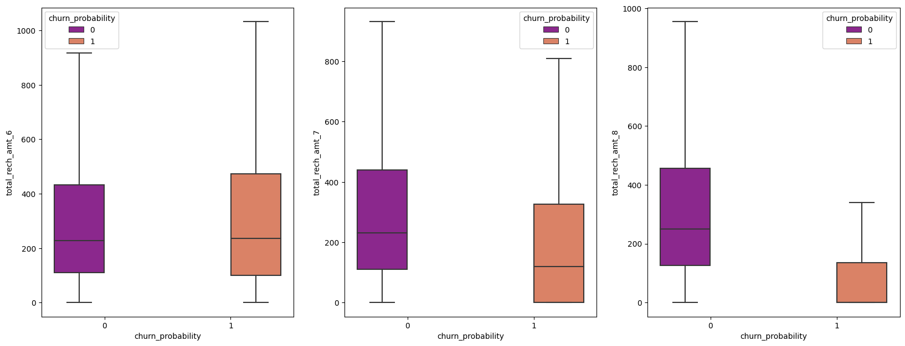
    


 We can see a drop in the total recharge amount for churned customers in the 8th Month.

#### Ploting for total recharge amount for data


```python
# Ploting for total recharge amount for data:
plot_month_wise_box_chart('total_rech_amt_data', telecom)
```


    <Figure size 640x480 with 0 Axes>


    
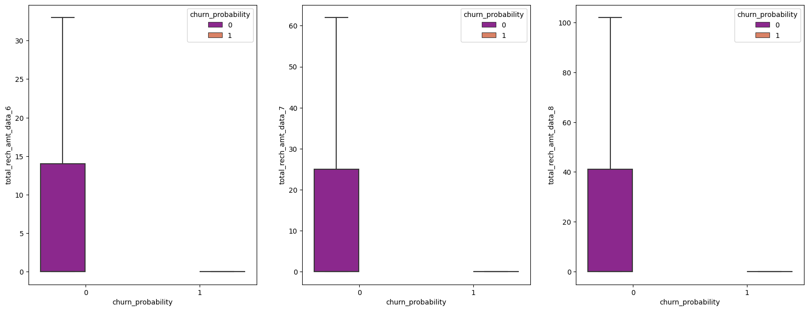
    


#### Ploting for max recharge amount for data


```python
# Ploting for max recharge amount for data:
plot_month_wise_box_chart('max_rech_amt', telecom)
```


    <Figure size 640x480 with 0 Axes>


    
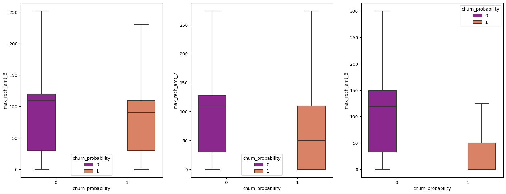
    


```python
vbc_column = telecom.columns[telecom.columns.str.contains('vbc_3g',regex=True)]
vbc_column.tolist()
```


    ['vbc_3g_8', 'vbc_3g_7', 'vbc_3g_6']


```python
ax = sns.kdeplot(telecom.vbc_3g_6[(telecom["churn_probability"] == 0)],
                color="Red", shade = True)
ax = sns.kdeplot(telecom.vbc_3g_6[(telecom["churn_probability"] == 1)],
                ax =ax, color="Blue", shade= True)
ax.legend(["Not Churn","Churn"],loc='upper right')
ax.set_ylabel('Density')
ax.set_xlabel('Volume based cost')
ax.set_title('Distribution of Volume based cost by churn June')
```


    Text(0.5, 1.0, 'Distribution of Volume based cost by churn June')


    
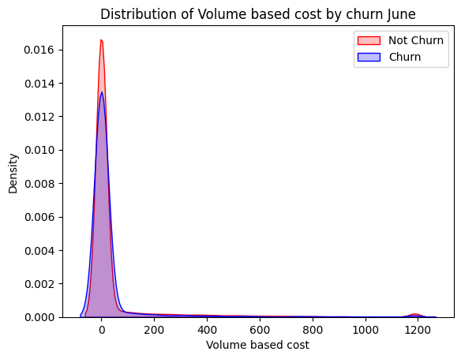
    


```python
ax = sns.kdeplot(telecom.vbc_3g_7[(telecom["churn_probability"] == 0)],
                color="Red", shade = True)
ax = sns.kdeplot(telecom.vbc_3g_7[(telecom["churn_probability"] == 1)],
                ax =ax, color="Blue", shade= True)
ax.legend(["Not Churn","Churn"],loc='upper right')
ax.set_ylabel('Density')
ax.set_xlabel('Volume based cost')
ax.set_title('Distribution of Volume based cost by churn July')
```


    Text(0.5, 1.0, 'Distribution of Volume based cost by churn July')


    
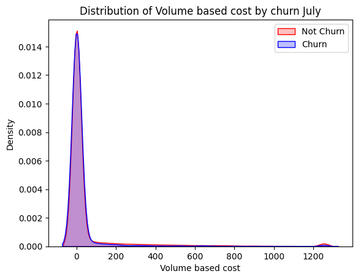
    


```python
ax = sns.kdeplot(telecom.vbc_3g_8[(telecom["churn_probability"] == 0)],
                color="Red", shade = True)
ax = sns.kdeplot(telecom.vbc_3g_8[(telecom["churn_probability"] == 1)],
                ax =ax, color="Blue", shade= True)
ax.legend(["Not Churn","Churn"],loc='upper right')
ax.set_ylabel('Density')
ax.set_xlabel('Volume based cost')
ax.set_title('Distribution of Volume based cost by churn Aug')
```


    Text(0.5, 1.0, 'Distribution of Volume based cost by churn Aug')


    
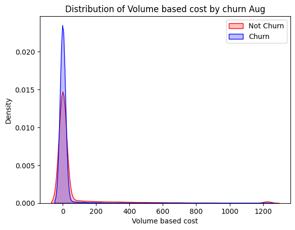
    


#### Average Revenue Per User


```python
# Checking columns for average revenue per user
arpu_cols = telecom.columns[telecom.columns.str.contains('arpu_')]

# Plotting arpu
plot_month_wise_box_chart('arpu', telecom)
```


    <Figure size 640x480 with 0 Axes>


    
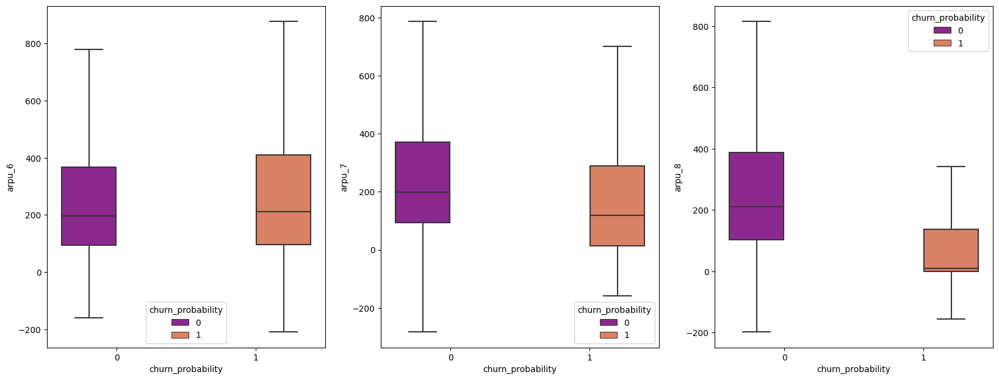
    


  We can see that huge drops for Arpu in 8th month for churned customers


#### MOU columns


```python
mou_cols = telecom.columns[telecom.columns.str.contains('mou')]
mou_cols
```


    Index(['onnet_mou_6', 'onnet_mou_7', 'onnet_mou_8', 'offnet_mou_6',
           'offnet_mou_7', 'offnet_mou_8', 'roam_ic_mou_6', 'roam_ic_mou_7',
           'roam_ic_mou_8', 'roam_og_mou_6', 'roam_og_mou_7', 'roam_og_mou_8',
           'loc_og_t2t_mou_6', 'loc_og_t2t_mou_7', 'loc_og_t2t_mou_8',
           'loc_og_t2m_mou_6', 'loc_og_t2m_mou_7', 'loc_og_t2m_mou_8',
           'loc_og_t2f_mou_6', 'loc_og_t2f_mou_7', 'loc_og_t2f_mou_8',
           'loc_og_t2c_mou_6', 'loc_og_t2c_mou_7', 'loc_og_t2c_mou_8',
           'loc_og_mou_6', 'loc_og_mou_7', 'loc_og_mou_8', 'std_og_t2t_mou_6',
           'std_og_t2t_mou_7', 'std_og_t2t_mou_8', 'std_og_t2m_mou_6',
           'std_og_t2m_mou_7', 'std_og_t2m_mou_8', 'std_og_t2f_mou_6',
           'std_og_t2f_mou_7', 'std_og_t2f_mou_8', 'std_og_mou_6', 'std_og_mou_7',
           'std_og_mou_8', 'isd_og_mou_6', 'isd_og_mou_7', 'isd_og_mou_8',
           'spl_og_mou_6', 'spl_og_mou_7', 'spl_og_mou_8', 'total_og_mou_6',
           'total_og_mou_7', 'total_og_mou_8', 'loc_ic_t2t_mou_6',
           'loc_ic_t2t_mou_7', 'loc_ic_t2t_mou_8', 'loc_ic_t2m_mou_6',
           'loc_ic_t2m_mou_7', 'loc_ic_t2m_mou_8', 'loc_ic_t2f_mou_6',
           'loc_ic_t2f_mou_7', 'loc_ic_t2f_mou_8', 'loc_ic_mou_6', 'loc_ic_mou_7',
           'loc_ic_mou_8', 'std_ic_t2t_mou_6', 'std_ic_t2t_mou_7',
           'std_ic_t2t_mou_8', 'std_ic_t2m_mou_6', 'std_ic_t2m_mou_7',
           'std_ic_t2m_mou_8', 'std_ic_t2f_mou_6', 'std_ic_t2f_mou_7',
           'std_ic_t2f_mou_8', 'std_ic_mou_6', 'std_ic_mou_7', 'std_ic_mou_8',
           'total_ic_mou_6', 'total_ic_mou_7', 'total_ic_mou_8', 'spl_ic_mou_6',
           'spl_ic_mou_7', 'spl_ic_mou_8', 'isd_ic_mou_6', 'isd_ic_mou_7',
           'isd_ic_mou_8'],
          dtype='object')


```python

PlotAsTable(metadata_display(telecom[mou_cols], "Null_Percentage", False), "MOU Null Percentage Sorted")


```

    ----------------------------------------------------------------------------------------------------- 
     Note: If you dont see the table 'MOU Null Percentage Sorted' below,
     please ensure the Jupyter Notebook is marked Trusted (File --> Trusted Notebook) 
    -----------------------------------------------------------------------------------------------------
    


#### MOU Null Percentage Sorted 


---


| Columns          | Datatype   |   Non_Null_Count |   Null_Count |   Null_Percentage |   Unique_Values_Count |
|:-----------------|:-----------|-----------------:|-------------:|------------------:|----------------------:|
| isd_ic_mou_8     | float64    |            66296 |         3703 |              5.29 |                  4038 |
| loc_ic_t2t_mou_8 | float64    |            66296 |         3703 |              5.29 |                 10786 |
| loc_ic_t2m_mou_8 | float64    |            66296 |         3703 |              5.29 |                 18365 |
| std_og_t2t_mou_8 | float64    |            66296 |         3703 |              5.29 |                 13826 |
| loc_og_t2c_mou_8 | float64    |            66296 |         3703 |              5.29 |                  1636 |
| loc_ic_t2f_mou_8 | float64    |            66296 |         3703 |              5.29 |                  5442 |
| loc_og_t2f_mou_8 | float64    |            66296 |         3703 |              5.29 |                  2692 |
| loc_ic_mou_8     | float64    |            66296 |         3703 |              5.29 |                 23523 |
| std_og_mou_8     | float64    |            66296 |         3703 |              5.29 |                 21085 |
| loc_og_t2m_mou_8 | float64    |            66296 |         3703 |              5.29 |                 16955 |
| std_ic_t2t_mou_8 | float64    |            66296 |         3703 |              5.29 |                  4720 |
| spl_og_mou_8     | float64    |            66296 |         3703 |              5.29 |                  3225 |
| loc_og_t2t_mou_8 | float64    |            66296 |         3703 |              5.29 |                 10638 |
| std_ic_t2m_mou_8 | float64    |            66296 |         3703 |              5.29 |                  7247 |
| std_og_t2m_mou_8 | float64    |            66296 |         3703 |              5.29 |                 15312 |
| roam_og_mou_8    | float64    |            66296 |         3703 |              5.29 |                  4564 |
| std_ic_t2f_mou_8 | float64    |            66296 |         3703 |              5.29 |                  1968 |
| roam_ic_mou_8    | float64    |            66296 |         3703 |              5.29 |                  3598 |
| std_ic_mou_8     | float64    |            66296 |         3703 |              5.29 |                  9285 |
| isd_og_mou_8     | float64    |            66296 |         3703 |              5.29 |                   407 |
| offnet_mou_8     | float64    |            66296 |         3703 |              5.29 |                 25334 |
| spl_ic_mou_8     | float64    |            66296 |         3703 |              5.29 |                    57 |
| std_og_t2f_mou_8 | float64    |            66296 |         3703 |              5.29 |                  1354 |
| onnet_mou_8      | float64    |            66296 |         3703 |              5.29 |                 19066 |
| loc_og_mou_8     | float64    |            66296 |         3703 |              5.29 |                 21294 |
| spl_og_mou_6     | float64    |            67231 |         2768 |              3.95 |                  2872 |
| loc_ic_t2t_mou_6 | float64    |            67231 |         2768 |              3.95 |                 10969 |
| std_ic_t2t_mou_6 | float64    |            67231 |         2768 |              3.95 |                  4666 |
| loc_ic_t2m_mou_6 | float64    |            67231 |         2768 |              3.95 |                 18367 |
| loc_ic_t2f_mou_6 | float64    |            67231 |         2768 |              3.95 |                  5549 |
| loc_ic_mou_6     | float64    |            67231 |         2768 |              3.95 |                 23771 |
| std_ic_t2m_mou_6 | float64    |            67231 |         2768 |              3.95 |                  7265 |
| std_ic_t2f_mou_6 | float64    |            67231 |         2768 |              3.95 |                  1987 |
| std_ic_mou_6     | float64    |            67231 |         2768 |              3.95 |                  9208 |
| spl_ic_mou_6     | float64    |            67231 |         2768 |              3.95 |                    54 |
| isd_ic_mou_6     | float64    |            67231 |         2768 |              3.95 |                  3766 |
| isd_og_mou_6     | float64    |            67231 |         2768 |              3.95 |                   486 |
| onnet_mou_6      | float64    |            67231 |         2768 |              3.95 |                 19387 |
| roam_og_mou_6    | float64    |            67231 |         2768 |              3.95 |                  5905 |
| std_og_t2m_mou_6 | float64    |            67231 |         2768 |              3.95 |                 15391 |
| std_og_mou_6     | float64    |            67231 |         2768 |              3.95 |                 21170 |
| loc_og_t2m_mou_6 | float64    |            67231 |         2768 |              3.95 |                 17185 |
| loc_og_t2c_mou_6 | float64    |            67231 |         2768 |              3.95 |                  1384 |
| loc_og_mou_6     | float64    |            67231 |         2768 |              3.95 |                 21637 |
| loc_og_t2t_mou_6 | float64    |            67231 |         2768 |              3.95 |                 10822 |
| std_og_t2t_mou_6 | float64    |            67231 |         2768 |              3.95 |                 13889 |
| loc_og_t2f_mou_6 | float64    |            67231 |         2768 |              3.95 |                  2749 |
| roam_ic_mou_6    | float64    |            67231 |         2768 |              3.95 |                  4647 |
| std_og_t2f_mou_6 | float64    |            67231 |         2768 |              3.95 |                  1453 |
| offnet_mou_6     | float64    |            67231 |         2768 |              3.95 |                 25583 |
| std_ic_mou_7     | float64    |            67312 |         2687 |              3.84 |                  9444 |
| roam_ic_mou_7    | float64    |            67312 |         2687 |              3.84 |                  3576 |
| loc_og_t2m_mou_7 | float64    |            67312 |         2687 |              3.84 |                 16973 |
| roam_og_mou_7    | float64    |            67312 |         2687 |              3.84 |                  4642 |
| std_ic_t2f_mou_7 | float64    |            67312 |         2687 |              3.84 |                  2058 |
| spl_ic_mou_7     | float64    |            67312 |         2687 |              3.84 |                    52 |
| offnet_mou_7     | float64    |            67312 |         2687 |              3.84 |                 25471 |
| loc_og_t2t_mou_7 | float64    |            67312 |         2687 |              3.84 |                 10691 |
| std_ic_t2m_mou_7 | float64    |            67312 |         2687 |              3.84 |                  7364 |
| isd_ic_mou_7     | float64    |            67312 |         2687 |              3.84 |                  3977 |
| std_og_mou_7     | float64    |            67312 |         2687 |              3.84 |                 21417 |
| loc_og_t2f_mou_7 | float64    |            67312 |         2687 |              3.84 |                  2754 |
| std_ic_t2t_mou_7 | float64    |            67312 |         2687 |              3.84 |                  4818 |
| loc_ic_t2t_mou_7 | float64    |            67312 |         2687 |              3.84 |                 10926 |
| onnet_mou_7      | float64    |            67312 |         2687 |              3.84 |                 19405 |
| std_og_t2f_mou_7 | float64    |            67312 |         2687 |              3.84 |                  1374 |
| spl_og_mou_7     | float64    |            67312 |         2687 |              3.84 |                  3187 |
| std_og_t2m_mou_7 | float64    |            67312 |         2687 |              3.84 |                 15564 |
| loc_ic_mou_7     | float64    |            67312 |         2687 |              3.84 |                 23590 |
| isd_og_mou_7     | float64    |            67312 |         2687 |              3.84 |                   477 |
| std_og_t2t_mou_7 | float64    |            67312 |         2687 |              3.84 |                 14074 |
| loc_ic_t2m_mou_7 | float64    |            67312 |         2687 |              3.84 |                 18277 |
| loc_og_mou_7     | float64    |            67312 |         2687 |              3.84 |                 21345 |
| loc_ic_t2f_mou_7 | float64    |            67312 |         2687 |              3.84 |                  5626 |
| loc_og_t2c_mou_7 | float64    |            67312 |         2687 |              3.84 |                  1539 |
| total_og_mou_8   | float64    |            69999 |            0 |              0    |                 32202 |
| total_ic_mou_6   | float64    |            69999 |            0 |              0    |                 26735 |
| total_ic_mou_7   | float64    |            69999 |            0 |              0    |                 26720 |
| total_ic_mou_8   | float64    |            69999 |            0 |              0    |                 26622 |
| total_og_mou_6   | float64    |            69999 |            0 |              0    |                 32442 |
| total_og_mou_7   | float64    |            69999 |            0 |              0    |                 32501 |


So for all minutes of usage columns the maximum missing % is 5.29 , means in these case the customer has not been used at all for that particular call type, thus we can fill the missing values with zero


```python
# replacing null values by 0 for minutes of usage variables
def ImputeMOUCols(df):
    df.loc[:,mou_cols] = df.loc[:,mou_cols].replace(np.NaN,0)

ImputeMOUCols(telecom)
```


```python
percent_missing = ReturnColumnsMissingPercentage(telecom)

PlotAsTable(percent_missing, "Missing Percentage EDA")
```

    ----------------------------------------------------------------------------------------------------- 
     Note: If you dont see the table 'Missing Percentage EDA' below,
     please ensure the Jupyter Notebook is marked Trusted (File --> Trusted Notebook) 
    -----------------------------------------------------------------------------------------------------
    


#### Missing Percentage EDA 


---


| index                 |   MissingPercentage |
|:----------------------|--------------------:|
| id                    |             0       |
| arpu_6                |             0       |
| arpu_7                |             0       |
| arpu_8                |             0       |
| onnet_mou_6           |             0       |
| onnet_mou_7           |             0       |
| onnet_mou_8           |             0       |
| offnet_mou_6          |             0       |
| offnet_mou_7          |             0       |
| offnet_mou_8          |             0       |
| roam_ic_mou_6         |             0       |
| roam_ic_mou_7         |             0       |
| roam_ic_mou_8         |             0       |
| roam_og_mou_6         |             0       |
| roam_og_mou_7         |             0       |
| roam_og_mou_8         |             0       |
| loc_og_t2t_mou_6      |             0       |
| loc_og_t2t_mou_7      |             0       |
| loc_og_t2t_mou_8      |             0       |
| loc_og_t2m_mou_6      |             0       |
| loc_og_t2m_mou_7      |             0       |
| loc_og_t2m_mou_8      |             0       |
| loc_og_t2f_mou_6      |             0       |
| loc_og_t2f_mou_7      |             0       |
| loc_og_t2f_mou_8      |             0       |
| loc_og_t2c_mou_6      |             0       |
| loc_og_t2c_mou_7      |             0       |
| loc_og_t2c_mou_8      |             0       |
| loc_og_mou_6          |             0       |
| loc_og_mou_7          |             0       |
| loc_og_mou_8          |             0       |
| std_og_t2t_mou_6      |             0       |
| std_og_t2t_mou_7      |             0       |
| std_og_t2t_mou_8      |             0       |
| std_og_t2m_mou_6      |             0       |
| std_og_t2m_mou_7      |             0       |
| std_og_t2m_mou_8      |             0       |
| std_og_t2f_mou_6      |             0       |
| std_og_t2f_mou_7      |             0       |
| std_og_t2f_mou_8      |             0       |
| std_og_mou_6          |             0       |
| std_og_mou_7          |             0       |
| std_og_mou_8          |             0       |
| isd_og_mou_6          |             0       |
| isd_og_mou_7          |             0       |
| isd_og_mou_8          |             0       |
| spl_og_mou_6          |             0       |
| spl_og_mou_7          |             0       |
| spl_og_mou_8          |             0       |
| og_others_6           |             3.95434 |
| og_others_7           |             3.83863 |
| og_others_8           |             5.29008 |
| total_og_mou_6        |             0       |
| total_og_mou_7        |             0       |
| total_og_mou_8        |             0       |
| loc_ic_t2t_mou_6      |             0       |
| loc_ic_t2t_mou_7      |             0       |
| loc_ic_t2t_mou_8      |             0       |
| loc_ic_t2m_mou_6      |             0       |
| loc_ic_t2m_mou_7      |             0       |
| loc_ic_t2m_mou_8      |             0       |
| loc_ic_t2f_mou_6      |             0       |
| loc_ic_t2f_mou_7      |             0       |
| loc_ic_t2f_mou_8      |             0       |
| loc_ic_mou_6          |             0       |
| loc_ic_mou_7          |             0       |
| loc_ic_mou_8          |             0       |
| std_ic_t2t_mou_6      |             0       |
| std_ic_t2t_mou_7      |             0       |
| std_ic_t2t_mou_8      |             0       |
| std_ic_t2m_mou_6      |             0       |
| std_ic_t2m_mou_7      |             0       |
| std_ic_t2m_mou_8      |             0       |
| std_ic_t2f_mou_6      |             0       |
| std_ic_t2f_mou_7      |             0       |
| std_ic_t2f_mou_8      |             0       |
| std_ic_mou_6          |             0       |
| std_ic_mou_7          |             0       |
| std_ic_mou_8          |             0       |
| total_ic_mou_6        |             0       |
| total_ic_mou_7        |             0       |
| total_ic_mou_8        |             0       |
| spl_ic_mou_6          |             0       |
| spl_ic_mou_7          |             0       |
| spl_ic_mou_8          |             0       |
| isd_ic_mou_6          |             0       |
| isd_ic_mou_7          |             0       |
| isd_ic_mou_8          |             0       |
| ic_others_6           |             3.95434 |
| ic_others_7           |             3.83863 |
| ic_others_8           |             5.29008 |
| total_rech_num_6      |             0       |
| total_rech_num_7      |             0       |
| total_rech_num_8      |             0       |
| total_rech_amt_6      |             0       |
| total_rech_amt_7      |             0       |
| total_rech_amt_8      |             0       |
| max_rech_amt_6        |             0       |
| max_rech_amt_7        |             0       |
| max_rech_amt_8        |             0       |
| date_of_last_rech_6   |             1.57288 |
| date_of_last_rech_7   |             1.76288 |
| date_of_last_rech_8   |             3.51576 |
| last_day_rch_amt_6    |             0       |
| last_day_rch_amt_7    |             0       |
| last_day_rch_amt_8    |             0       |
| total_rech_data_6     |             0       |
| total_rech_data_7     |             0       |
| total_rech_data_8     |             0       |
| av_rech_amt_data_6    |             0       |
| av_rech_amt_data_7    |             0       |
| av_rech_amt_data_8    |             0       |
| vol_2g_mb_6           |             0       |
| vol_2g_mb_7           |             0       |
| vol_2g_mb_8           |             0       |
| vol_3g_mb_6           |             0       |
| vol_3g_mb_7           |             0       |
| vol_3g_mb_8           |             0       |
| monthly_2g_6          |             0       |
| monthly_2g_7          |             0       |
| monthly_2g_8          |             0       |
| sachet_2g_6           |             0       |
| sachet_2g_7           |             0       |
| sachet_2g_8           |             0       |
| monthly_3g_6          |             0       |
| monthly_3g_7          |             0       |
| monthly_3g_8          |             0       |
| sachet_3g_6           |             0       |
| sachet_3g_7           |             0       |
| sachet_3g_8           |             0       |
| aon                   |             0       |
| vbc_3g_8              |             0       |
| vbc_3g_7              |             0       |
| vbc_3g_6              |             0       |
| churn_probability     |             0       |
| total_rech_amt_data_6 |             0       |
| total_rech_amt_data_7 |             0       |
| total_rech_amt_data_8 |             0       |


```python
telecom.info()
```

    <class 'pandas.core.frame.DataFrame'>
    RangeIndex: 69999 entries, 0 to 69998
    Columns: 138 entries, id to total_rech_amt_data_8
    dtypes: category(13), datetime64[ns](3), float64(110), int64(12)
    memory usage: 67.6 MB
    


```python
numeric_col = ['og_others_8', 'ic_others_8', 'og_others_6','ic_others_6', 'og_others_7', 'ic_others_7']
```


```python
def ImputeNumericColumns(df):
    for i in numeric_col:
        df.loc[df[i].isnull(),i]=0

ImputeNumericColumns(telecom)
```


```python
# Visalizing the correlation between the numerical variables
corr = telecom.corr()

```


```python
# function to correlate variables
def correlation(cor0) :
    type(cor0)
    cor0.where(np.triu(np.ones(cor0.shape),k=1).astype(np.bool))
    cor0=cor0.unstack().reset_index()
    cor0.columns=['VAR1','VAR2','CORR']
    cor0.dropna(subset=['CORR'], inplace=True)
    cor0.CORR=round(cor0['CORR'],2)
    cor0.CORR=cor0.CORR.abs()
    cor0.sort_values(by=['CORR'],ascending=False)
    cor0=cor0[~(cor0['VAR1']==cor0['VAR2'])]

    # removing duplicate correlations
    cor0['pair'] = cor0[['VAR1', 'VAR2']].apply(lambda x: '{}-{}'.format(*sorted((x[0], x[1]))), axis=1)

    cor0 = cor0.drop_duplicates(subset=['pair'], keep='first')
    cor0 = cor0[['VAR1', 'VAR2','CORR']]
    return pd.DataFrame(cor0.sort_values(by=['CORR'],ascending=False))
```


```python
cor_0 = correlation(corr)

# filtering for correlations >= 40%
condition = cor_0['CORR'] > 0.4
cor_0 = cor_0[condition]
PlotAsTable(cor_0, "Correlation Matrix (>40%) Sorted")
```

    ----------------------------------------------------------------------------------------------------- 
     Note: If you dont see the table 'Correlation Matrix (>40%) Sorted' below,
     please ensure the Jupyter Notebook is marked Trusted (File --> Trusted Notebook) 
    -----------------------------------------------------------------------------------------------------
    


#### Correlation Matrix (>40%) Sorted 


---


| VAR1                  | VAR2                  |   CORR |
|:----------------------|:----------------------|-------:|
| arpu_7                | total_rech_amt_7      |   0.95 |
| arpu_8                | total_rech_amt_8      |   0.95 |
| arpu_6                | total_rech_amt_6      |   0.95 |
| loc_ic_mou_7          | total_ic_mou_7        |   0.91 |
| loc_ic_mou_6          | total_ic_mou_6        |   0.91 |
| loc_ic_mou_8          | total_ic_mou_8        |   0.91 |
| loc_og_t2m_mou_6      | loc_og_mou_6          |   0.89 |
| loc_og_t2m_mou_8      | loc_og_mou_8          |   0.89 |
| loc_ic_t2m_mou_8      | loc_ic_mou_8          |   0.89 |
| loc_ic_t2m_mou_7      | loc_ic_mou_7          |   0.88 |
| onnet_mou_8           | std_og_t2t_mou_8      |   0.88 |
| loc_ic_t2m_mou_6      | loc_ic_mou_6          |   0.88 |
| loc_og_t2m_mou_7      | loc_og_mou_7          |   0.88 |
| onnet_mou_7           | std_og_t2t_mou_7      |   0.88 |
| std_ic_t2m_mou_8      | std_ic_mou_8          |   0.87 |
| std_ic_t2m_mou_7      | std_ic_mou_7          |   0.87 |
| std_ic_t2m_mou_6      | std_ic_mou_6          |   0.87 |
| onnet_mou_6           | std_og_t2t_mou_6      |   0.87 |
| total_rech_data_8     | total_rech_amt_data_8 |   0.86 |
| total_rech_data_7     | total_rech_amt_data_7 |   0.86 |
| total_rech_data_6     | total_rech_amt_data_6 |   0.86 |
| loc_og_mou_7          | loc_og_mou_8          |   0.85 |
| std_og_mou_7          | total_og_mou_7        |   0.85 |
| std_og_mou_8          | total_og_mou_8        |   0.85 |
| loc_ic_mou_7          | loc_ic_mou_8          |   0.84 |
| loc_og_t2t_mou_7      | loc_og_t2t_mou_8      |   0.83 |
| total_ic_mou_7        | total_ic_mou_8        |   0.83 |
| loc_og_mou_6          | loc_og_mou_7          |   0.83 |
| loc_og_t2m_mou_7      | loc_og_t2m_mou_8      |   0.83 |
| std_og_mou_6          | total_og_mou_6        |   0.83 |
| offnet_mou_8          | std_og_t2m_mou_8      |   0.82 |
| loc_og_t2t_mou_6      | loc_og_t2t_mou_7      |   0.82 |
| loc_ic_t2m_mou_7      | loc_ic_t2m_mou_8      |   0.82 |
| loc_ic_mou_6          | loc_ic_mou_7          |   0.82 |
| offnet_mou_7          | std_og_t2m_mou_7      |   0.82 |
| loc_og_t2m_mou_6      | loc_og_t2m_mou_7      |   0.81 |
| loc_ic_t2t_mou_7      | loc_ic_t2t_mou_8      |   0.81 |
| offnet_mou_8          | total_og_mou_8        |   0.8  |
| loc_ic_t2f_mou_7      | loc_ic_t2f_mou_8      |   0.8  |
| loc_ic_t2m_mou_6      | loc_ic_t2m_mou_7      |   0.8  |
| loc_ic_t2m_mou_8      | total_ic_mou_8        |   0.8  |
| loc_ic_t2m_mou_7      | total_ic_mou_7        |   0.8  |
| total_ic_mou_6        | total_ic_mou_7        |   0.8  |
| loc_ic_t2m_mou_6      | total_ic_mou_6        |   0.8  |
| offnet_mou_6          | std_og_t2m_mou_6      |   0.8  |
| std_og_t2t_mou_7      | std_og_t2t_mou_8      |   0.79 |
| loc_ic_t2f_mou_6      | loc_ic_t2f_mou_7      |   0.79 |
| roam_ic_mou_7         | roam_og_mou_7         |   0.79 |
| loc_ic_t2t_mou_6      | loc_ic_t2t_mou_7      |   0.79 |
| offnet_mou_6          | total_og_mou_6        |   0.79 |
| offnet_mou_7          | total_og_mou_7        |   0.79 |
| onnet_mou_7           | onnet_mou_8           |   0.79 |
| std_og_t2m_mou_8      | std_og_mou_8          |   0.78 |
| std_og_mou_7          | std_og_mou_8          |   0.78 |
| av_rech_amt_data_8    | total_rech_amt_data_8 |   0.78 |
| offnet_mou_7          | offnet_mou_8          |   0.78 |
| av_rech_amt_data_7    | total_rech_amt_data_7 |   0.78 |
| av_rech_amt_data_6    | total_rech_amt_data_6 |   0.78 |
| loc_og_t2t_mou_8      | loc_og_mou_8          |   0.78 |
| loc_og_t2t_mou_7      | loc_og_mou_7          |   0.78 |
| std_og_t2m_mou_6      | std_og_mou_6          |   0.78 |
| loc_og_t2t_mou_6      | loc_og_mou_6          |   0.78 |
| roam_ic_mou_8         | roam_og_mou_8         |   0.78 |
| std_og_t2t_mou_8      | std_og_mou_8          |   0.78 |
| std_og_t2m_mou_7      | std_og_mou_7          |   0.78 |
| std_og_t2t_mou_6      | std_og_mou_6          |   0.77 |
| std_og_t2t_mou_7      | std_og_mou_7          |   0.77 |
| std_og_t2m_mou_7      | std_og_t2m_mou_8      |   0.77 |
| loc_ic_mou_7          | total_ic_mou_8        |   0.77 |
| arpu_6                | total_og_mou_6        |   0.77 |
| roam_ic_mou_6         | roam_og_mou_6         |   0.77 |
| arpu_7                | total_og_mou_7        |   0.77 |
| total_og_mou_7        | total_og_mou_8        |   0.77 |
| onnet_mou_8           | total_og_mou_8        |   0.76 |
| onnet_mou_7           | total_og_mou_7        |   0.76 |
| av_rech_amt_data_8    | vol_3g_mb_8           |   0.76 |
| loc_ic_mou_7          | total_ic_mou_6        |   0.76 |
| arpu_8                | total_og_mou_8        |   0.76 |
| loc_ic_mou_8          | total_ic_mou_7        |   0.76 |
| onnet_mou_6           | onnet_mou_7           |   0.75 |
| av_rech_amt_data_7    | vol_3g_mb_7           |   0.75 |
| av_rech_amt_data_6    | vol_3g_mb_6           |   0.75 |
| total_og_mou_6        | total_rech_amt_6      |   0.75 |
| total_og_mou_8        | total_rech_amt_8      |   0.75 |
| onnet_mou_6           | total_og_mou_6        |   0.75 |
| total_og_mou_7        | total_rech_amt_7      |   0.75 |
| loc_ic_t2m_mou_7      | loc_ic_mou_8          |   0.75 |
| std_ic_mou_7          | std_ic_mou_8          |   0.75 |
| loc_og_t2m_mou_7      | loc_og_mou_8          |   0.75 |
| loc_og_t2m_mou_8      | loc_og_mou_7          |   0.75 |
| loc_og_mou_6          | loc_og_mou_8          |   0.75 |
| vbc_3g_8              | vbc_3g_7              |   0.74 |
| loc_ic_mou_6          | total_ic_mou_7        |   0.74 |
| offnet_mou_6          | offnet_mou_7          |   0.74 |
| loc_og_t2f_mou_7      | loc_og_t2f_mou_8      |   0.74 |
| loc_og_t2m_mou_6      | loc_og_mou_7          |   0.74 |
| loc_ic_mou_6          | loc_ic_mou_8          |   0.74 |
| loc_ic_t2m_mou_8      | loc_ic_mou_7          |   0.74 |
| arpu_7                | arpu_8                |   0.74 |
| isd_ic_mou_7          | isd_ic_mou_8          |   0.74 |
| arpu_8                | total_rech_amt_7      |   0.74 |
| std_og_mou_6          | std_og_mou_7          |   0.73 |
| loc_og_t2f_mou_6      | loc_og_t2f_mou_7      |   0.73 |
| loc_og_t2m_mou_7      | loc_og_mou_6          |   0.73 |
| std_og_t2t_mou_6      | std_og_t2t_mou_7      |   0.73 |
| std_og_t2m_mou_6      | std_og_t2m_mou_7      |   0.73 |
| loc_og_t2m_mou_6      | loc_og_t2m_mou_8      |   0.73 |
| loc_og_t2t_mou_6      | loc_og_t2t_mou_8      |   0.73 |
| total_og_mou_6        | total_og_mou_7        |   0.73 |
| vbc_3g_7              | vbc_3g_6              |   0.73 |
| isd_ic_mou_6          | isd_ic_mou_7          |   0.73 |
| loc_ic_t2m_mou_6      | loc_ic_mou_7          |   0.73 |
| vol_3g_mb_6           | vbc_3g_6              |   0.73 |
| vol_3g_mb_6           | vol_3g_mb_7           |   0.72 |
| loc_ic_t2f_mou_6      | loc_ic_t2f_mou_8      |   0.72 |
| arpu_7                | total_rech_amt_8      |   0.72 |
| vol_3g_mb_8           | vbc_3g_8              |   0.72 |
| vol_3g_mb_7           | vbc_3g_7              |   0.72 |
| std_ic_mou_6          | std_ic_mou_7          |   0.72 |
| vol_3g_mb_7           | vol_3g_mb_8           |   0.72 |
| loc_ic_t2m_mou_7      | loc_ic_mou_6          |   0.72 |
| std_ic_t2m_mou_7      | std_ic_t2m_mou_8      |   0.72 |
| loc_ic_t2m_mou_6      | loc_ic_t2m_mou_8      |   0.72 |
| total_rech_num_7      | total_rech_num_8      |   0.71 |
| loc_ic_t2t_mou_6      | loc_ic_mou_6          |   0.71 |
| loc_ic_t2t_mou_6      | loc_ic_t2t_mou_8      |   0.71 |
| loc_ic_t2t_mou_8      | loc_ic_mou_8          |   0.71 |
| loc_ic_t2t_mou_7      | loc_ic_mou_7          |   0.71 |
| total_ic_mou_6        | total_ic_mou_8        |   0.71 |
| arpu_6                | offnet_mou_6          |   0.7  |
| std_ic_t2m_mou_6      | std_ic_t2m_mou_7      |   0.7  |
| arpu_6                | arpu_7                |   0.7  |
| arpu_8                | offnet_mou_8          |   0.7  |
| total_rech_data_6     | total_rech_data_7     |   0.7  |
| arpu_7                | total_rech_amt_6      |   0.7  |
| onnet_mou_8           | std_og_t2t_mou_7      |   0.69 |
| offnet_mou_6          | total_rech_amt_6      |   0.69 |
| total_rech_data_7     | total_rech_data_8     |   0.69 |
| onnet_mou_8           | std_og_mou_8          |   0.69 |
| onnet_mou_7           | std_og_t2t_mou_8      |   0.69 |
| std_ic_t2t_mou_7      | std_ic_t2t_mou_8      |   0.69 |
| arpu_7                | offnet_mou_7          |   0.69 |
| onnet_mou_7           | std_og_mou_7          |   0.68 |
| onnet_mou_6           | std_og_mou_6          |   0.68 |
| offnet_mou_8          | total_rech_amt_8      |   0.68 |
| loc_ic_t2m_mou_7      | total_ic_mou_8        |   0.68 |
| std_ic_t2t_mou_8      | std_ic_mou_8          |   0.68 |
| offnet_mou_7          | total_rech_amt_7      |   0.68 |
| total_rech_amt_7      | total_rech_amt_8      |   0.68 |
| arpu_6                | total_rech_amt_7      |   0.68 |
| loc_og_t2f_mou_6      | loc_og_t2f_mou_8      |   0.68 |
| loc_ic_mou_8          | total_ic_mou_6        |   0.68 |
| loc_ic_t2m_mou_8      | total_ic_mou_7        |   0.67 |
| std_og_t2m_mou_7      | total_og_mou_7        |   0.67 |
| loc_og_t2t_mou_7      | loc_og_mou_8          |   0.67 |
| loc_og_t2t_mou_8      | loc_og_mou_7          |   0.67 |
| loc_og_t2m_mou_6      | loc_og_mou_8          |   0.67 |
| std_og_t2m_mou_8      | total_og_mou_8        |   0.67 |
| max_rech_amt_8        | last_day_rch_amt_8    |   0.67 |
| loc_ic_mou_6          | total_ic_mou_8        |   0.66 |
| loc_ic_t2m_mou_6      | loc_ic_mou_8          |   0.66 |
| std_og_t2m_mou_6      | total_og_mou_6        |   0.66 |
| loc_og_t2t_mou_6      | loc_og_mou_7          |   0.66 |
| av_rech_amt_data_7    | av_rech_amt_data_8    |   0.66 |
| total_rech_num_6      | total_rech_num_7      |   0.66 |
| loc_og_t2t_mou_7      | loc_og_mou_6          |   0.66 |
| std_ic_t2m_mou_7      | std_ic_mou_8          |   0.66 |
| loc_og_t2m_mou_8      | loc_og_mou_6          |   0.66 |
| std_ic_t2t_mou_6      | std_ic_mou_6          |   0.66 |
| std_ic_t2t_mou_6      | std_ic_t2t_mou_7      |   0.66 |
| std_ic_t2t_mou_7      | std_ic_mou_7          |   0.66 |
| std_ic_t2m_mou_8      | std_ic_mou_7          |   0.66 |
| loc_ic_t2m_mou_7      | total_ic_mou_6        |   0.66 |
| std_og_mou_8          | total_og_mou_7        |   0.65 |
| loc_ic_t2m_mou_8      | loc_ic_mou_6          |   0.65 |
| loc_ic_t2t_mou_8      | total_ic_mou_8        |   0.65 |
| std_og_t2t_mou_8      | total_og_mou_8        |   0.65 |
| loc_ic_t2m_mou_6      | total_ic_mou_7        |   0.65 |
| isd_ic_mou_6          | isd_ic_mou_8          |   0.65 |
| vol_2g_mb_6           | vol_2g_mb_7           |   0.65 |
| std_og_t2t_mou_7      | total_og_mou_7        |   0.65 |
| av_rech_amt_data_6    | av_rech_amt_data_7    |   0.65 |
| loc_ic_t2t_mou_6      | total_ic_mou_6        |   0.65 |
| total_rech_amt_6      | total_rech_amt_7      |   0.65 |
| std_og_mou_7          | total_og_mou_8        |   0.65 |
| onnet_mou_6           | std_og_t2t_mou_7      |   0.64 |
| max_rech_amt_6        | last_day_rch_amt_6    |   0.64 |
| loc_ic_t2t_mou_7      | total_ic_mou_7        |   0.64 |
| total_rech_data_6     | av_rech_amt_data_6    |   0.64 |
| onnet_mou_7           | std_og_t2t_mou_6      |   0.64 |
| std_ic_t2m_mou_7      | std_ic_mou_6          |   0.64 |
| total_rech_data_7     | av_rech_amt_data_7    |   0.64 |
| offnet_mou_7          | std_og_mou_7          |   0.64 |
| vol_3g_mb_6           | vol_3g_mb_8           |   0.63 |
| vol_2g_mb_7           | vol_2g_mb_8           |   0.63 |
| std_ic_t2m_mou_6      | std_ic_mou_7          |   0.63 |
| total_rech_data_8     | av_rech_amt_data_8    |   0.63 |
| loc_og_t2c_mou_8      | spl_og_mou_8          |   0.63 |
| offnet_mou_8          | std_og_t2m_mou_7      |   0.63 |
| offnet_mou_8          | std_og_mou_8          |   0.63 |
| std_og_t2t_mou_6      | total_og_mou_6        |   0.63 |
| vbc_3g_8              | vbc_3g_6              |   0.63 |
| loc_og_t2c_mou_7      | spl_og_mou_7          |   0.62 |
| std_og_t2t_mou_7      | std_og_mou_8          |   0.62 |
| offnet_mou_7          | total_og_mou_8        |   0.62 |
| offnet_mou_6          | std_og_mou_6          |   0.62 |
| offnet_mou_7          | std_og_t2m_mou_8      |   0.62 |
| max_rech_amt_7        | last_day_rch_amt_7    |   0.62 |
| offnet_mou_8          | total_og_mou_7        |   0.62 |
| total_rech_amt_8      | max_rech_amt_8        |   0.62 |
| std_og_t2t_mou_8      | std_og_mou_7          |   0.62 |
| av_rech_amt_data_6    | av_rech_amt_data_8    |   0.61 |
| std_og_t2m_mou_8      | std_og_mou_7          |   0.61 |
| onnet_mou_6           | onnet_mou_8           |   0.61 |
| std_og_t2m_mou_7      | std_og_mou_8          |   0.61 |
| loc_ic_t2t_mou_8      | loc_ic_mou_7          |   0.61 |
| std_og_mou_6          | total_og_mou_7        |   0.61 |
| total_rech_amt_7      | max_rech_amt_7        |   0.61 |
| std_ic_mou_6          | std_ic_mou_8          |   0.61 |
| onnet_mou_8           | total_og_mou_7        |   0.61 |
| total_rech_amt_data_7 | total_rech_amt_data_8 |   0.61 |
| std_ic_t2f_mou_6      | std_ic_t2f_mou_7      |   0.6  |
| total_rech_amt_data_6 | total_rech_amt_data_7 |   0.6  |
| loc_og_t2m_mou_6      | loc_ic_t2m_mou_6      |   0.6  |
| loc_ic_t2t_mou_7      | loc_ic_mou_8          |   0.6  |
| loc_og_t2m_mou_8      | loc_ic_t2m_mou_8      |   0.6  |
| arpu_7                | total_og_mou_8        |   0.6  |
| av_rech_amt_data_7    | vol_3g_mb_8           |   0.6  |
| onnet_mou_7           | total_og_mou_8        |   0.6  |
| total_og_mou_8        | total_rech_amt_7      |   0.6  |
| loc_og_t2t_mou_8      | loc_og_mou_6          |   0.6  |
| std_ic_t2f_mou_7      | std_ic_t2f_mou_8      |   0.6  |
| std_ic_t2m_mou_6      | std_ic_t2m_mou_8      |   0.59 |
| std_og_t2t_mou_6      | std_og_t2t_mou_8      |   0.59 |
| offnet_mou_7          | std_og_t2m_mou_6      |   0.59 |
| offnet_mou_6          | offnet_mou_8          |   0.59 |
| vol_3g_mb_6           | vbc_3g_7              |   0.59 |
| total_rech_data_6     | total_rech_data_8     |   0.59 |
| std_og_t2f_mou_7      | std_og_t2f_mou_8      |   0.59 |
| loc_ic_t2t_mou_6      | loc_ic_mou_7          |   0.59 |
| loc_ic_t2t_mou_7      | loc_ic_mou_6          |   0.59 |
| loc_ic_t2m_mou_6      | total_ic_mou_8        |   0.59 |
| av_rech_amt_data_6    | vol_3g_mb_7           |   0.59 |
| total_rech_data_7     | total_rech_amt_data_8 |   0.59 |
| offnet_mou_7          | total_og_mou_6        |   0.59 |
| total_rech_data_6     | total_rech_amt_data_7 |   0.59 |
| arpu_8                | total_og_mou_7        |   0.59 |
| loc_ic_t2m_mou_8      | total_ic_mou_6        |   0.59 |
| loc_og_t2t_mou_6      | loc_og_mou_8          |   0.59 |
| offnet_mou_6          | total_og_mou_7        |   0.59 |
| loc_og_t2m_mou_7      | loc_ic_t2m_mou_7      |   0.59 |
| loc_og_t2c_mou_6      | spl_og_mou_6          |   0.58 |
| total_rech_amt_6      | max_rech_amt_6        |   0.58 |
| total_rech_num_6      | total_rech_amt_6      |   0.58 |
| arpu_7                | std_og_mou_7          |   0.58 |
| av_rech_amt_data_8    | vbc_3g_8              |   0.58 |
| arpu_6                | arpu_8                |   0.58 |
| av_rech_amt_data_6    | vbc_3g_6              |   0.58 |
| offnet_mou_8          | loc_og_t2m_mou_8      |   0.58 |
| av_rech_amt_data_8    | vol_3g_mb_7           |   0.58 |
| std_og_mou_7          | total_og_mou_6        |   0.58 |
| vol_3g_mb_7           | vbc_3g_8              |   0.58 |
| std_og_t2f_mou_6      | std_og_t2f_mou_7      |   0.58 |
| offnet_mou_6          | loc_og_t2m_mou_6      |   0.58 |
| total_rech_data_8     | total_rech_amt_data_7 |   0.58 |
| arpu_6                | total_rech_num_6      |   0.58 |
| std_og_t2m_mou_6      | std_og_t2m_mou_8      |   0.57 |
| arpu_8                | std_og_mou_8          |   0.57 |
| offnet_mou_7          | loc_og_t2m_mou_7      |   0.57 |
| av_rech_amt_data_7    | vbc_3g_7              |   0.57 |
| total_og_mou_7        | total_rech_amt_8      |   0.57 |
| total_og_mou_7        | total_rech_amt_6      |   0.57 |
| std_og_t2m_mou_7      | std_og_mou_6          |   0.57 |
| loc_og_mou_8          | loc_ic_mou_8          |   0.57 |
| total_rech_data_7     | total_rech_amt_data_6 |   0.57 |
| std_og_t2t_mou_6      | std_og_mou_7          |   0.57 |
| std_og_t2m_mou_6      | std_og_mou_7          |   0.57 |
| arpu_6                | std_og_mou_6          |   0.57 |
| total_og_mou_6        | total_og_mou_8        |   0.57 |
| av_rech_amt_data_7    | vol_3g_mb_6           |   0.57 |
| arpu_7                | total_og_mou_6        |   0.57 |
| std_og_mou_7          | total_rech_amt_7      |   0.57 |
| vol_3g_mb_7           | vbc_3g_6              |   0.57 |
| arpu_8                | total_rech_amt_6      |   0.57 |
| std_og_mou_6          | total_rech_amt_6      |   0.57 |
| offnet_mou_6          | std_og_t2m_mou_7      |   0.57 |
| loc_og_mou_6          | loc_ic_mou_6          |   0.57 |
| std_og_t2t_mou_7      | std_og_mou_6          |   0.57 |
| vol_3g_mb_8           | total_rech_amt_data_8 |   0.57 |
| vol_3g_mb_6           | total_rech_amt_data_6 |   0.57 |
| vol_3g_mb_8           | vbc_3g_7              |   0.57 |
| std_og_mou_6          | std_og_mou_8          |   0.57 |
| onnet_mou_7           | total_og_mou_6        |   0.56 |
| onnet_mou_6           | total_og_mou_7        |   0.56 |
| isd_og_mou_6          | isd_og_mou_7          |   0.56 |
| arpu_6                | total_og_mou_7        |   0.56 |
| isd_og_mou_7          | isd_og_mou_8          |   0.56 |
| std_og_mou_8          | total_rech_amt_8      |   0.56 |
| arpu_8                | max_rech_amt_8        |   0.55 |
| onnet_mou_8           | std_og_mou_7          |   0.55 |
| loc_og_t2m_mou_6      | loc_ic_mou_6          |   0.55 |
| loc_ic_t2t_mou_8      | total_ic_mou_7        |   0.55 |
| loc_og_mou_6          | total_og_mou_6        |   0.55 |
| total_og_mou_6        | total_rech_amt_7      |   0.55 |
| vol_3g_mb_7           | total_rech_amt_data_7 |   0.55 |
| std_ic_t2t_mou_6      | std_ic_t2t_mou_8      |   0.55 |
| total_rech_amt_6      | total_rech_amt_8      |   0.55 |
| loc_ic_t2t_mou_7      | total_ic_mou_6        |   0.55 |
| arpu_8                | offnet_mou_7          |   0.55 |
| loc_og_t2m_mou_8      | loc_ic_mou_8          |   0.55 |
| arpu_8                | loc_og_mou_8          |   0.55 |
| loc_ic_t2t_mou_7      | total_ic_mou_8        |   0.55 |
| arpu_6                | total_rech_amt_8      |   0.55 |
| arpu_7                | offnet_mou_8          |   0.55 |
| offnet_mou_8          | total_rech_amt_7      |   0.55 |
| loc_og_mou_7          | loc_ic_mou_7          |   0.55 |
| onnet_mou_7           | std_og_mou_8          |   0.54 |
| total_rech_num_7      | total_rech_amt_7      |   0.54 |
| av_rech_amt_data_6    | vol_3g_mb_8           |   0.54 |
| std_ic_t2m_mou_6      | std_ic_mou_8          |   0.54 |
| arpu_7                | loc_og_mou_7          |   0.54 |
| loc_og_mou_8          | total_rech_amt_8      |   0.54 |
| loc_ic_t2t_mou_8      | loc_ic_mou_6          |   0.54 |
| arpu_8                | onnet_mou_8           |   0.54 |
| onnet_mou_6           | total_rech_amt_6      |   0.54 |
| std_ic_t2m_mou_8      | std_ic_mou_6          |   0.54 |
| max_rech_amt_7        | max_rech_amt_8        |   0.54 |
| loc_og_mou_8          | loc_ic_t2m_mou_8      |   0.54 |
| arpu_6                | onnet_mou_6           |   0.54 |
| loc_og_mou_8          | total_og_mou_8        |   0.54 |
| arpu_7                | total_rech_num_7      |   0.54 |
| arpu_7                | onnet_mou_7           |   0.54 |
| loc_og_t2m_mou_7      | loc_ic_mou_7          |   0.54 |
| arpu_6                | loc_og_mou_6          |   0.54 |
| loc_og_mou_6          | loc_ic_t2m_mou_6      |   0.54 |
| arpu_8                | loc_og_t2m_mou_8      |   0.54 |
| loc_ic_t2t_mou_6      | loc_ic_mou_8          |   0.53 |
| onnet_mou_7           | total_rech_amt_7      |   0.53 |
| loc_og_mou_7          | loc_ic_t2m_mou_7      |   0.53 |
| loc_ic_t2t_mou_6      | total_ic_mou_7        |   0.53 |
| loc_og_mou_7          | total_og_mou_7        |   0.53 |
| onnet_mou_8           | total_rech_amt_8      |   0.53 |
| loc_og_t2m_mou_7      | loc_ic_t2m_mou_8      |   0.53 |
| loc_og_mou_7          | total_rech_amt_7      |   0.53 |
| std_og_t2f_mou_6      | std_og_t2f_mou_8      |   0.53 |
| loc_og_mou_6          | total_rech_amt_6      |   0.53 |
| total_rech_num_8      | total_rech_amt_8      |   0.53 |
| arpu_7                | offnet_mou_6          |   0.53 |
| arpu_8                | total_rech_num_8      |   0.53 |
| arpu_7                | max_rech_amt_7        |   0.53 |
| av_rech_amt_data_7    | vbc_3g_8              |   0.52 |
| offnet_mou_6          | loc_og_mou_6          |   0.52 |
| arpu_7                | loc_og_t2m_mou_7      |   0.52 |
| arpu_6                | loc_og_t2m_mou_6      |   0.52 |
| onnet_mou_8           | std_og_t2t_mou_6      |   0.52 |
| offnet_mou_7          | total_rech_amt_6      |   0.52 |
| offnet_mou_7          | total_rech_amt_8      |   0.52 |
| loc_og_t2m_mou_6      | loc_ic_t2m_mou_7      |   0.52 |
| loc_og_t2m_mou_8      | total_rech_amt_8      |   0.52 |
| av_rech_amt_data_6    | vbc_3g_7              |   0.52 |
| std_ic_t2f_mou_6      | std_ic_t2f_mou_8      |   0.52 |
| offnet_mou_8          | loc_og_mou_8          |   0.52 |
| total_rech_amt_data_6 | total_rech_amt_data_8 |   0.52 |
| loc_og_t2m_mou_8      | loc_ic_t2m_mou_7      |   0.52 |
| arpu_6                | offnet_mou_7          |   0.52 |
| max_rech_amt_6        | max_rech_amt_7        |   0.52 |
| av_rech_amt_data_8    | vol_3g_mb_6           |   0.52 |
| av_rech_amt_data_7    | total_rech_amt_data_6 |   0.52 |
| arpu_6                | max_rech_amt_6        |   0.51 |
| av_rech_amt_data_7    | total_rech_amt_data_8 |   0.51 |
| std_ic_t2t_mou_8      | std_ic_mou_7          |   0.51 |
| loc_og_t2m_mou_7      | loc_ic_t2m_mou_6      |   0.51 |
| total_rech_data_6     | total_rech_amt_data_8 |   0.51 |
| std_ic_t2t_mou_7      | std_ic_mou_8          |   0.51 |
| std_og_t2m_mou_7      | total_og_mou_8        |   0.51 |
| max_rech_amt_6        | max_rech_amt_8        |   0.51 |
| total_og_mou_6        | total_rech_num_6      |   0.51 |
| roam_ic_mou_7         | roam_ic_mou_8         |   0.51 |
| loc_og_mou_8          | total_ic_mou_8        |   0.51 |
| vol_3g_mb_6           | vbc_3g_8              |   0.51 |
| std_og_t2m_mou_8      | total_og_mou_7        |   0.51 |
| total_rech_num_6      | total_rech_num_8      |   0.51 |
| loc_og_mou_6          | total_ic_mou_6        |   0.51 |
| loc_og_t2m_mou_7      | total_rech_amt_7      |   0.51 |
| offnet_mou_7          | loc_og_mou_7          |   0.51 |
| loc_og_t2m_mou_6      | total_rech_amt_6      |   0.51 |
| vol_2g_mb_6           | vol_2g_mb_8           |   0.51 |
| offnet_mou_6          | total_rech_amt_7      |   0.51 |
| av_rech_amt_data_8    | total_rech_amt_data_7 |   0.51 |
| loc_og_t2t_mou_8      | loc_ic_t2t_mou_8      |   0.51 |
| onnet_mou_6           | std_og_t2t_mou_8      |   0.51 |
| isd_og_mou_6          | isd_og_mou_8          |   0.5  |
| loc_og_mou_7          | loc_ic_mou_8          |   0.5  |
| std_og_t2t_mou_8      | total_og_mou_7        |   0.5  |
| onnet_mou_7           | std_og_mou_6          |   0.5  |
| loc_og_t2t_mou_7      | loc_ic_t2t_mou_7      |   0.5  |
| std_og_t2t_mou_7      | total_og_mou_8        |   0.5  |
| total_og_mou_8        | total_rech_num_8      |   0.5  |
| loc_og_t2m_mou_6      | total_ic_mou_6        |   0.5  |
| av_rech_amt_data_6    | total_rech_amt_data_7 |   0.5  |
| loc_og_t2t_mou_6      | loc_ic_t2t_mou_6      |   0.5  |
| vol_3g_mb_8           | vbc_3g_6              |   0.5  |
| loc_og_mou_7          | total_ic_mou_7        |   0.5  |
| loc_og_mou_6          | loc_ic_mou_7          |   0.49 |
| onnet_mou_6           | std_og_mou_7          |   0.49 |
| std_ic_t2t_mou_6      | std_ic_mou_7          |   0.49 |
| loc_ic_t2t_mou_8      | total_ic_mou_6        |   0.49 |
| loc_og_t2m_mou_8      | total_ic_mou_8        |   0.49 |
| offnet_mou_8          | std_og_mou_7          |   0.49 |
| total_rech_amt_7      | last_day_rch_amt_7    |   0.49 |
| loc_og_t2m_mou_7      | loc_ic_mou_8          |   0.49 |
| roam_og_mou_7         | roam_og_mou_8         |   0.49 |
| total_og_mou_7        | total_rech_num_7      |   0.49 |
| loc_og_mou_8          | loc_ic_mou_7          |   0.49 |
| total_rech_data_8     | total_rech_amt_data_6 |   0.49 |
| loc_og_t2m_mou_7      | total_ic_mou_7        |   0.48 |
| offnet_mou_6          | loc_og_t2m_mou_7      |   0.48 |
| offnet_mou_7          | std_og_mou_8          |   0.48 |
| spl_og_mou_7          | spl_og_mou_8          |   0.48 |
| av_rech_amt_data_8    | vbc_3g_7              |   0.48 |
| loc_og_mou_7          | loc_ic_mou_6          |   0.48 |
| std_og_t2m_mou_6      | total_og_mou_7        |   0.48 |
| av_rech_amt_data_7    | vbc_3g_6              |   0.48 |
| std_ic_t2t_mou_7      | std_ic_mou_6          |   0.48 |
| loc_og_mou_7          | loc_ic_t2m_mou_8      |   0.48 |
| loc_og_t2m_mou_8      | loc_ic_mou_7          |   0.47 |
| loc_og_mou_6          | loc_ic_t2m_mou_7      |   0.47 |
| loc_og_t2m_mou_6      | total_og_mou_6        |   0.47 |
| av_rech_amt_data_8    | total_rech_amt_data_6 |   0.47 |
| loc_og_t2m_mou_6      | loc_ic_mou_7          |   0.47 |
| loc_og_t2m_mou_6      | loc_ic_t2m_mou_8      |   0.47 |
| loc_ic_t2t_mou_6      | total_ic_mou_8        |   0.47 |
| loc_og_mou_8          | loc_ic_t2m_mou_7      |   0.47 |
| arpu_7                | std_og_t2m_mou_7      |   0.47 |
| total_rech_amt_8      | last_day_rch_amt_8    |   0.47 |
| loc_og_mou_7          | loc_ic_t2m_mou_6      |   0.46 |
| std_ic_mou_8          | total_ic_mou_8        |   0.46 |
| total_rech_data_6     | av_rech_amt_data_7    |   0.46 |
| std_og_t2m_mou_7      | total_rech_amt_7      |   0.46 |
| total_rech_data_6     | vol_2g_mb_6           |   0.46 |
| loc_ic_t2f_mou_7      | loc_ic_mou_7          |   0.46 |
| std_ic_mou_7          | total_ic_mou_7        |   0.46 |
| arpu_6                | std_og_t2m_mou_6      |   0.46 |
| loc_og_t2m_mou_7      | total_og_mou_7        |   0.46 |
| std_og_mou_8          | total_rech_num_8      |   0.46 |
| std_og_t2m_mou_7      | total_og_mou_6        |   0.46 |
| loc_og_t2m_mou_8      | loc_ic_t2m_mou_6      |   0.46 |
| loc_og_t2m_mou_8      | total_og_mou_8        |   0.46 |
| loc_og_t2m_mou_7      | loc_ic_mou_6          |   0.46 |
| std_og_t2t_mou_8      | std_og_mou_6          |   0.46 |
| std_og_t2m_mou_6      | total_rech_amt_6      |   0.46 |
| offnet_mou_8          | total_og_mou_6        |   0.46 |
| std_og_t2t_mou_6      | total_og_mou_7        |   0.46 |
| std_og_t2t_mou_6      | std_og_mou_8          |   0.46 |
| av_rech_amt_data_6    | vbc_3g_8              |   0.46 |
| loc_ic_t2f_mou_8      | loc_ic_mou_8          |   0.46 |
| offnet_mou_7          | loc_og_t2m_mou_8      |   0.46 |
| arpu_8                | std_og_t2m_mou_8      |   0.46 |
| offnet_mou_7          | std_og_mou_6          |   0.46 |
| offnet_mou_6          | total_og_mou_8        |   0.46 |
| loc_og_mou_8          | total_rech_amt_7      |   0.46 |
| arpu_7                | loc_og_mou_8          |   0.46 |
| offnet_mou_8          | loc_og_t2m_mou_7      |   0.46 |
| std_og_mou_6          | total_og_mou_8        |   0.46 |
| total_rech_amt_6      | last_day_rch_amt_6    |   0.45 |
| vol_3g_mb_7           | total_rech_amt_data_6 |   0.45 |
| roam_ic_mou_6         | roam_ic_mou_7         |   0.45 |
| onnet_mou_6           | loc_og_t2t_mou_6      |   0.45 |
| offnet_mou_8          | std_og_t2m_mou_6      |   0.45 |
| arpu_6                | loc_og_mou_7          |   0.45 |
| onnet_mou_6           | total_og_mou_8        |   0.45 |
| std_og_t2m_mou_8      | total_rech_amt_8      |   0.45 |
| onnet_mou_8           | total_og_mou_6        |   0.45 |
| std_og_t2m_mou_6      | std_og_mou_8          |   0.45 |
| loc_og_t2t_mou_7      | loc_ic_t2t_mou_8      |   0.45 |
| av_rech_amt_data_6    | total_rech_amt_data_8 |   0.45 |
| arpu_8                | loc_og_mou_7          |   0.45 |
| loc_ic_t2f_mou_6      | loc_ic_mou_6          |   0.45 |
| av_rech_amt_data_6    | vol_2g_mb_6           |   0.45 |
| loc_og_mou_7          | total_ic_mou_8        |   0.45 |
| loc_og_t2t_mou_8      | loc_og_t2m_mou_8      |   0.45 |
| loc_og_mou_7          | total_rech_amt_6      |   0.45 |
| total_og_mou_8        | total_rech_amt_6      |   0.45 |
| std_ic_mou_6          | total_ic_mou_6        |   0.45 |
| roam_ic_mou_8         | roam_og_mou_7         |   0.45 |
| std_og_t2t_mou_7      | total_og_mou_6        |   0.45 |
| loc_og_mou_6          | loc_ic_mou_8          |   0.45 |
| offnet_mou_6          | total_rech_num_6      |   0.44 |
| onnet_mou_7           | loc_og_t2t_mou_7      |   0.44 |
| offnet_mou_6          | std_og_mou_7          |   0.44 |
| offnet_mou_6          | std_og_t2m_mou_8      |   0.44 |
| loc_og_t2t_mou_8      | total_og_mou_8        |   0.44 |
| loc_og_t2t_mou_7      | loc_og_t2m_mou_7      |   0.44 |
| av_rech_amt_data_7    | vol_2g_mb_7           |   0.44 |
| loc_og_t2t_mou_6      | loc_ic_t2t_mou_7      |   0.44 |
| loc_og_t2t_mou_6      | total_og_mou_6        |   0.44 |
| loc_og_t2t_mou_6      | loc_og_t2m_mou_6      |   0.44 |
| loc_og_t2m_mou_6      | loc_ic_mou_8          |   0.44 |
| arpu_6                | total_og_mou_8        |   0.44 |
| onnet_mou_8           | loc_og_t2t_mou_8      |   0.44 |
| total_rech_data_7     | av_rech_amt_data_8    |   0.44 |
| loc_og_t2t_mou_8      | loc_ic_t2t_mou_7      |   0.44 |
| av_rech_amt_data_8    | vbc_3g_6              |   0.44 |
| loc_og_t2m_mou_8      | total_rech_amt_7      |   0.44 |
| arpu_8                | total_og_mou_6        |   0.44 |
| std_og_mou_7          | total_rech_num_7      |   0.44 |
| arpu_7                | std_og_mou_8          |   0.44 |
| loc_og_mou_7          | total_rech_amt_8      |   0.44 |
| std_og_mou_8          | total_og_mou_6        |   0.44 |
| std_og_t2m_mou_8      | std_og_mou_6          |   0.44 |
| arpu_6                | loc_og_t2m_mou_7      |   0.44 |
| std_og_mou_8          | total_rech_amt_7      |   0.44 |
| loc_og_mou_8          | loc_ic_mou_6          |   0.44 |
| std_og_mou_6          | total_rech_num_6      |   0.44 |
| arpu_8                | loc_og_t2m_mou_7      |   0.44 |
| loc_og_mou_7          | total_og_mou_6        |   0.44 |
| arpu_7                | loc_og_t2m_mou_8      |   0.44 |
| arpu_7                | std_og_t2t_mou_7      |   0.43 |
| loc_og_mou_6          | loc_ic_t2m_mou_8      |   0.43 |
| spl_og_mou_6          | spl_og_mou_7          |   0.43 |
| loc_og_t2m_mou_7      | total_rech_amt_6      |   0.43 |
| loc_og_mou_8          | total_ic_mou_7        |   0.43 |
| loc_og_t2m_mou_7      | total_ic_mou_8        |   0.43 |
| arpu_8                | std_og_mou_7          |   0.43 |
| roam_ic_mou_7         | roam_og_mou_8         |   0.43 |
| onnet_mou_8           | total_rech_amt_7      |   0.43 |
| total_rech_data_8     | av_rech_amt_data_7    |   0.43 |
| loc_og_t2t_mou_7      | loc_ic_t2t_mou_6      |   0.43 |
| loc_og_mou_7          | total_ic_mou_6        |   0.43 |
| loc_og_mou_7          | total_og_mou_8        |   0.43 |
| loc_og_mou_6          | total_ic_mou_7        |   0.43 |
| arpu_8                | max_rech_amt_7        |   0.43 |
| roam_og_mou_6         | roam_og_mou_7         |   0.43 |
| loc_og_mou_8          | total_og_mou_7        |   0.43 |
| total_rech_data_7     | vol_2g_mb_7           |   0.43 |
| loc_og_t2t_mou_7      | total_og_mou_7        |   0.43 |
| loc_og_mou_8          | loc_ic_t2t_mou_8      |   0.43 |
| offnet_mou_6          | loc_og_mou_7          |   0.43 |
| offnet_mou_7          | loc_og_t2m_mou_6      |   0.43 |
| vol_3g_mb_8           | total_rech_amt_data_7 |   0.43 |
| arpu_7                | onnet_mou_8           |   0.43 |
| loc_og_mou_6          | loc_ic_t2t_mou_6      |   0.42 |
| total_og_mou_6        | total_rech_amt_8      |   0.42 |
| offnet_mou_8          | total_rech_num_8      |   0.42 |
| offnet_mou_8          | total_rech_amt_6      |   0.42 |
| loc_og_t2m_mou_7      | total_rech_amt_8      |   0.42 |
| total_rech_data_8     | vol_2g_mb_8           |   0.42 |
| loc_og_mou_8          | loc_ic_t2m_mou_6      |   0.42 |
| std_og_t2t_mou_8      | total_rech_amt_8      |   0.42 |
| std_og_t2t_mou_6      | total_rech_amt_6      |   0.42 |
| vbc_3g_6              | total_rech_amt_data_6 |   0.42 |
| arpu_6                | offnet_mou_8          |   0.42 |
| std_og_mou_7          | total_rech_amt_8      |   0.42 |
| vol_3g_mb_7           | total_rech_amt_data_8 |   0.42 |
| loc_og_t2m_mou_7      | total_ic_mou_6        |   0.42 |
| offnet_mou_8          | loc_og_mou_7          |   0.42 |
| arpu_8                | offnet_mou_6          |   0.42 |
| loc_og_t2m_mou_8      | total_ic_mou_7        |   0.42 |
| std_ic_t2t_mou_6      | std_ic_mou_8          |   0.42 |
| loc_og_t2m_mou_8      | loc_ic_mou_6          |   0.42 |
| loc_og_t2t_mou_6      | loc_ic_mou_6          |   0.42 |
| total_rech_data_7     | av_rech_amt_data_6    |   0.42 |
| arpu_7                | loc_og_mou_6          |   0.42 |
| vol_3g_mb_6           | total_rech_amt_data_7 |   0.42 |
| loc_og_t2t_mou_8      | loc_ic_mou_8          |   0.42 |
| arpu_6                | std_og_t2t_mou_6      |   0.42 |
| arpu_8                | onnet_mou_7           |   0.42 |
| std_og_t2t_mou_7      | total_rech_amt_7      |   0.42 |
| offnet_mou_7          | loc_og_mou_8          |   0.42 |
| arpu_8                | std_og_t2t_mou_8      |   0.42 |
| av_rech_amt_data_8    | vol_2g_mb_8           |   0.42 |
| loc_og_mou_6          | total_rech_amt_7      |   0.41 |
| loc_og_t2m_mou_6      | total_ic_mou_7        |   0.41 |
| arpu_7                | max_rech_amt_8        |   0.41 |
| arpu_7                | last_day_rch_amt_7    |   0.41 |
| loc_ic_t2f_mou_7      | total_ic_mou_7        |   0.41 |
| loc_ic_t2f_mou_8      | total_ic_mou_8        |   0.41 |
| loc_og_mou_7          | loc_ic_t2t_mou_7      |   0.41 |
| offnet_mou_7          | total_rech_num_7      |   0.41 |
| loc_og_t2t_mou_7      | loc_ic_mou_7          |   0.41 |
| arpu_7                | loc_og_t2m_mou_6      |   0.41 |
| loc_og_t2t_mou_6      | loc_ic_t2t_mou_8      |   0.41 |
| loc_ic_t2f_mou_6      | total_ic_mou_6        |   0.41 |
| onnet_mou_7           | total_rech_amt_8      |   0.41 |
| arpu_7                | std_og_mou_6          |   0.41 |
| loc_ic_t2f_mou_8      | loc_ic_mou_7          |   0.41 |
| offnet_mou_6          | loc_og_t2m_mou_8      |   0.41 |
| std_ic_t2t_mou_8      | std_ic_mou_6          |   0.41 |


### Feature Engineering and Variable Transformation

#### Derived Features

##### Delta variables: Derived variables to measure change  in usage/revenue between August and previous months average (June, July)


```python
# Derived variables to measure change in usage between August and previous months average (June, July)

# Usage
def CalculateDeltaCols(data):
    data['delta_vol_2g'] = data['vol_2g_mb_8'] - data['vol_2g_mb_6'].add(data['vol_2g_mb_7']).div(2)
    data['delta_vol_3g'] = data['vol_3g_mb_8'] - data['vol_3g_mb_6'].add(data['vol_3g_mb_7']).div(2)
    data['delta_total_og_mou'] = data['total_og_mou_8'] - data['total_og_mou_6'].add(data['total_og_mou_7']).div(2)
    data['delta_total_ic_mou'] = data['total_ic_mou_8'] - data['total_ic_mou_6'].add(data['total_ic_mou_7']).div(2)
    data['delta_vbc_3g'] = data['vbc_3g_8'] - data['vbc_3g_6'].add(data['vbc_3g_7']).div(2)

    # Revenue
    data['delta_arpu'] = data['arpu_8'] - data['arpu_6'].add(data['arpu_7']).div(2)
    data['delta_total_rech_amt'] = data['total_rech_amt_8'] - data['total_rech_amt_6'].add(data['total_rech_amt_7']).div(2)
    # Removing variables used for derivation :
    data.drop(columns=[
     'vol_2g_mb_8', 'vol_2g_mb_6', 'vol_2g_mb_7',
      'vol_3g_mb_8'  , 'vol_3g_mb_6', 'vol_3g_mb_7' ,
        'total_og_mou_8','total_og_mou_6', 'total_og_mou_7',
        'total_ic_mou_8','total_ic_mou_6', 'total_ic_mou_7',
        'vbc_3g_8','vbc_3g_6','vbc_3g_7',
        'arpu_8','arpu_6','arpu_7',
        'total_rech_amt_8', 'total_rech_amt_6', 'total_rech_amt_7'

    ], inplace=True)

CalculateDeltaCols(telecom)
```


```python
# AON convert from days to months

def ConvertAONToMonths(df):
    df["aon_months"] = (df.aon / 30).astype(int, errors='ignore')
    df.drop(columns=['aon'], inplace=True)


ConvertAONToMonths(telecom)
```


```python
telecom.head()
```


<div>
<style scoped>
    .dataframe tbody tr th:only-of-type {
        vertical-align: middle;
    }

    .dataframe tbody tr th {
        vertical-align: top;
    }

    .dataframe thead th {
        text-align: right;
    }
</style>
<table border="1" class="dataframe">
  <thead>
    <tr style="text-align: right;">
      <th></th>
      <th>id</th>
      <th>onnet_mou_6</th>
      <th>onnet_mou_7</th>
      <th>onnet_mou_8</th>
      <th>offnet_mou_6</th>
      <th>offnet_mou_7</th>
      <th>offnet_mou_8</th>
      <th>roam_ic_mou_6</th>
      <th>roam_ic_mou_7</th>
      <th>roam_ic_mou_8</th>
      <th>...</th>
      <th>total_rech_amt_data_7</th>
      <th>total_rech_amt_data_8</th>
      <th>delta_vol_2g</th>
      <th>delta_vol_3g</th>
      <th>delta_total_og_mou</th>
      <th>delta_total_ic_mou</th>
      <th>delta_vbc_3g</th>
      <th>delta_arpu</th>
      <th>delta_total_rech_amt</th>
      <th>aon_months</th>
    </tr>
  </thead>
  <tbody>
    <tr>
      <th>0</th>
      <td>0</td>
      <td>48.58</td>
      <td>124.38</td>
      <td>1.29</td>
      <td>32.24</td>
      <td>96.68</td>
      <td>2.33</td>
      <td>0.00</td>
      <td>0.0</td>
      <td>0.0</td>
      <td>...</td>
      <td>0.0</td>
      <td>0.0</td>
      <td>0.000</td>
      <td>0.00</td>
      <td>-147.815</td>
      <td>8.120</td>
      <td>0.0</td>
      <td>-51.6160</td>
      <td>-61.0</td>
      <td>65</td>
    </tr>
    <tr>
      <th>1</th>
      <td>1</td>
      <td>0.00</td>
      <td>0.00</td>
      <td>0.00</td>
      <td>0.00</td>
      <td>25.99</td>
      <td>30.89</td>
      <td>0.00</td>
      <td>0.0</td>
      <td>0.0</td>
      <td>...</td>
      <td>145.0</td>
      <td>0.0</td>
      <td>-176.455</td>
      <td>-1.98</td>
      <td>16.295</td>
      <td>3.600</td>
      <td>0.0</td>
      <td>-18.4405</td>
      <td>-22.5</td>
      <td>23</td>
    </tr>
    <tr>
      <th>2</th>
      <td>2</td>
      <td>0.53</td>
      <td>15.93</td>
      <td>0.00</td>
      <td>53.99</td>
      <td>82.05</td>
      <td>0.00</td>
      <td>0.00</td>
      <td>0.0</td>
      <td>0.0</td>
      <td>...</td>
      <td>0.0</td>
      <td>0.0</td>
      <td>0.000</td>
      <td>0.00</td>
      <td>-77.925</td>
      <td>-42.420</td>
      <td>0.0</td>
      <td>-81.9910</td>
      <td>-95.0</td>
      <td>29</td>
    </tr>
    <tr>
      <th>3</th>
      <td>3</td>
      <td>7.26</td>
      <td>16.01</td>
      <td>0.00</td>
      <td>68.76</td>
      <td>78.48</td>
      <td>50.23</td>
      <td>0.00</td>
      <td>0.0</td>
      <td>0.0</td>
      <td>...</td>
      <td>0.0</td>
      <td>0.0</td>
      <td>0.000</td>
      <td>0.00</td>
      <td>-32.165</td>
      <td>11.195</td>
      <td>0.0</td>
      <td>-69.7160</td>
      <td>-70.0</td>
      <td>32</td>
    </tr>
    <tr>
      <th>4</th>
      <td>4</td>
      <td>21.28</td>
      <td>4.83</td>
      <td>6.13</td>
      <td>56.99</td>
      <td>38.11</td>
      <td>9.63</td>
      <td>53.64</td>
      <td>0.0</td>
      <td>0.0</td>
      <td>...</td>
      <td>1337.0</td>
      <td>852.0</td>
      <td>-136.375</td>
      <td>0.00</td>
      <td>-37.340</td>
      <td>12.860</td>
      <td>0.0</td>
      <td>-82.8845</td>
      <td>-91.0</td>
      <td>21</td>
    </tr>
  </tbody>
</table>
<p>5 rows × 124 columns</p>
</div>


```python
ShowSummary(telecom)
```

    <class 'pandas.core.frame.DataFrame'>
    RangeIndex: 69999 entries, 0 to 69998
    Data columns (total 124 columns):
     #    Column                 Non-Null Count  Dtype         
    ---   ------                 --------------  -----         
     0    id                     69999 non-null  int64         
     1    onnet_mou_6            69999 non-null  float64       
     2    onnet_mou_7            69999 non-null  float64       
     3    onnet_mou_8            69999 non-null  float64       
     4    offnet_mou_6           69999 non-null  float64       
     5    offnet_mou_7           69999 non-null  float64       
     6    offnet_mou_8           69999 non-null  float64       
     7    roam_ic_mou_6          69999 non-null  float64       
     8    roam_ic_mou_7          69999 non-null  float64       
     9    roam_ic_mou_8          69999 non-null  float64       
     10   roam_og_mou_6          69999 non-null  float64       
     11   roam_og_mou_7          69999 non-null  float64       
     12   roam_og_mou_8          69999 non-null  float64       
     13   loc_og_t2t_mou_6       69999 non-null  float64       
     14   loc_og_t2t_mou_7       69999 non-null  float64       
     15   loc_og_t2t_mou_8       69999 non-null  float64       
     16   loc_og_t2m_mou_6       69999 non-null  float64       
     17   loc_og_t2m_mou_7       69999 non-null  float64       
     18   loc_og_t2m_mou_8       69999 non-null  float64       
     19   loc_og_t2f_mou_6       69999 non-null  float64       
     20   loc_og_t2f_mou_7       69999 non-null  float64       
     21   loc_og_t2f_mou_8       69999 non-null  float64       
     22   loc_og_t2c_mou_6       69999 non-null  float64       
     23   loc_og_t2c_mou_7       69999 non-null  float64       
     24   loc_og_t2c_mou_8       69999 non-null  float64       
     25   loc_og_mou_6           69999 non-null  float64       
     26   loc_og_mou_7           69999 non-null  float64       
     27   loc_og_mou_8           69999 non-null  float64       
     28   std_og_t2t_mou_6       69999 non-null  float64       
     29   std_og_t2t_mou_7       69999 non-null  float64       
     30   std_og_t2t_mou_8       69999 non-null  float64       
     31   std_og_t2m_mou_6       69999 non-null  float64       
     32   std_og_t2m_mou_7       69999 non-null  float64       
     33   std_og_t2m_mou_8       69999 non-null  float64       
     34   std_og_t2f_mou_6       69999 non-null  float64       
     35   std_og_t2f_mou_7       69999 non-null  float64       
     36   std_og_t2f_mou_8       69999 non-null  float64       
     37   std_og_mou_6           69999 non-null  float64       
     38   std_og_mou_7           69999 non-null  float64       
     39   std_og_mou_8           69999 non-null  float64       
     40   isd_og_mou_6           69999 non-null  float64       
     41   isd_og_mou_7           69999 non-null  float64       
     42   isd_og_mou_8           69999 non-null  float64       
     43   spl_og_mou_6           69999 non-null  float64       
     44   spl_og_mou_7           69999 non-null  float64       
     45   spl_og_mou_8           69999 non-null  float64       
     46   og_others_6            69999 non-null  float64       
     47   og_others_7            69999 non-null  float64       
     48   og_others_8            69999 non-null  float64       
     49   loc_ic_t2t_mou_6       69999 non-null  float64       
     50   loc_ic_t2t_mou_7       69999 non-null  float64       
     51   loc_ic_t2t_mou_8       69999 non-null  float64       
     52   loc_ic_t2m_mou_6       69999 non-null  float64       
     53   loc_ic_t2m_mou_7       69999 non-null  float64       
     54   loc_ic_t2m_mou_8       69999 non-null  float64       
     55   loc_ic_t2f_mou_6       69999 non-null  float64       
     56   loc_ic_t2f_mou_7       69999 non-null  float64       
     57   loc_ic_t2f_mou_8       69999 non-null  float64       
     58   loc_ic_mou_6           69999 non-null  float64       
     59   loc_ic_mou_7           69999 non-null  float64       
     60   loc_ic_mou_8           69999 non-null  float64       
     61   std_ic_t2t_mou_6       69999 non-null  float64       
     62   std_ic_t2t_mou_7       69999 non-null  float64       
     63   std_ic_t2t_mou_8       69999 non-null  float64       
     64   std_ic_t2m_mou_6       69999 non-null  float64       
     65   std_ic_t2m_mou_7       69999 non-null  float64       
     66   std_ic_t2m_mou_8       69999 non-null  float64       
     67   std_ic_t2f_mou_6       69999 non-null  float64       
     68   std_ic_t2f_mou_7       69999 non-null  float64       
     69   std_ic_t2f_mou_8       69999 non-null  float64       
     70   std_ic_mou_6           69999 non-null  float64       
     71   std_ic_mou_7           69999 non-null  float64       
     72   std_ic_mou_8           69999 non-null  float64       
     73   spl_ic_mou_6           69999 non-null  float64       
     74   spl_ic_mou_7           69999 non-null  float64       
     75   spl_ic_mou_8           69999 non-null  float64       
     76   isd_ic_mou_6           69999 non-null  float64       
     77   isd_ic_mou_7           69999 non-null  float64       
     78   isd_ic_mou_8           69999 non-null  float64       
     79   ic_others_6            69999 non-null  float64       
     80   ic_others_7            69999 non-null  float64       
     81   ic_others_8            69999 non-null  float64       
     82   total_rech_num_6       69999 non-null  int64         
     83   total_rech_num_7       69999 non-null  int64         
     84   total_rech_num_8       69999 non-null  int64         
     85   max_rech_amt_6         69999 non-null  int64         
     86   max_rech_amt_7         69999 non-null  int64         
     87   max_rech_amt_8         69999 non-null  int64         
     88   date_of_last_rech_6    68898 non-null  datetime64[ns]
     89   date_of_last_rech_7    68765 non-null  datetime64[ns]
     90   date_of_last_rech_8    67538 non-null  datetime64[ns]
     91   last_day_rch_amt_6     69999 non-null  int64         
     92   last_day_rch_amt_7     69999 non-null  int64         
     93   last_day_rch_amt_8     69999 non-null  int64         
     94   total_rech_data_6      69999 non-null  float64       
     95   total_rech_data_7      69999 non-null  float64       
     96   total_rech_data_8      69999 non-null  float64       
     97   av_rech_amt_data_6     69999 non-null  float64       
     98   av_rech_amt_data_7     69999 non-null  float64       
     99   av_rech_amt_data_8     69999 non-null  float64       
     100  monthly_2g_6           69999 non-null  category      
     101  monthly_2g_7           69999 non-null  category      
     102  monthly_2g_8           69999 non-null  category      
     103  sachet_2g_6            69999 non-null  category      
     104  sachet_2g_7            69999 non-null  category      
     105  sachet_2g_8            69999 non-null  category      
     106  monthly_3g_6           69999 non-null  category      
     107  monthly_3g_7           69999 non-null  category      
     108  monthly_3g_8           69999 non-null  category      
     109  sachet_3g_6            69999 non-null  category      
     110  sachet_3g_7            69999 non-null  category      
     111  sachet_3g_8            69999 non-null  category      
     112  churn_probability      69999 non-null  category      
     113  total_rech_amt_data_6  69999 non-null  float64       
     114  total_rech_amt_data_7  69999 non-null  float64       
     115  total_rech_amt_data_8  69999 non-null  float64       
     116  delta_vol_2g           69999 non-null  float64       
     117  delta_vol_3g           69999 non-null  float64       
     118  delta_total_og_mou     69999 non-null  float64       
     119  delta_total_ic_mou     69999 non-null  float64       
     120  delta_vbc_3g           69999 non-null  float64       
     121  delta_arpu             69999 non-null  float64       
     122  delta_total_rech_amt   69999 non-null  float64       
     123  aon_months             69999 non-null  int32         
    dtypes: category(13), datetime64[ns](3), float64(97), int32(1), int64(10)
    memory usage: 59.9 MB
    

#### Grouping Categorical column values with less Contribution


```python
categorical = telecom.dtypes == 'category'
categorical_vars = telecom.columns[categorical].to_list()
ind_categorical_vars = list(set(categorical_vars) - {'churn_probability'}) #independent categorical variables
ind_categorical_vars
```


    ['sachet_3g_6',
     'sachet_2g_8',
     'monthly_2g_6',
     'monthly_2g_8',
     'sachet_2g_6',
     'monthly_3g_7',
     'sachet_3g_8',
     'sachet_2g_7',
     'monthly_3g_8',
     'sachet_3g_7',
     'monthly_3g_6',
     'monthly_2g_7']


```python
# Finding & Grouping categories with less than 1% contribution in each column into "Others"
def GroupAsOtherInCategorical(data):
    for col in ind_categorical_vars :
        category_counts = 100*data[col
                                  ].value_counts(normalize=True)
        PlotAsTable(pd.DataFrame(category_counts),f"{col} categorical_counts")
        low_count_categories = category_counts[category_counts <= 1].index.to_list()
        print(f"Replaced {low_count_categories} in {col} with category : Others")
        data[col].replace(low_count_categories,'Others',inplace=True)
```


```python
GroupAsOtherInCategorical(telecom)
ShowSummary(telecom)
```

    ----------------------------------------------------------------------------------------------------- 
     Note: If you dont see the table 'sachet_3g_6 categorical_counts' below,
     please ensure the Jupyter Notebook is marked Trusted (File --> Trusted Notebook) 
    -----------------------------------------------------------------------------------------------------
    


#### sachet_3g_6 categorical_counts 


---


|   sachet_3g_6 |
|--------------:|
|   95.8414     |
|    2.9529     |
|    0.610009   |
|    0.21286    |
|    0.108573   |
|    0.0657152  |
|    0.0514293  |
|    0.0485721  |
|    0.0242861  |
|    0.0228575  |
|    0.0142859  |
|    0.0100001  |
|    0.00571437 |
|    0.00428578 |
|    0.00428578 |
|    0.00428578 |
|    0.00428578 |
|    0.00428578 |
|    0.00285718 |
|    0.00285718 |
|    0.00142859 |
|    0.00142859 |
|    0.00142859 |


    Replaced [2, 3, 4, 5, 7, 6, 8, 9, 11, 10, 15, 12, 13, 14, 19, 23, 22, 29, 16, 17, 18] in sachet_3g_6 with category : Others
    ----------------------------------------------------------------------------------------------------- 
     Note: If you dont see the table 'sachet_2g_8 categorical_counts' below,
     please ensure the Jupyter Notebook is marked Trusted (File --> Trusted Notebook) 
    -----------------------------------------------------------------------------------------------------
    


#### sachet_2g_8 categorical_counts 


---


|   sachet_2g_8 |
|--------------:|
|   85.9269     |
|    5.81723    |
|    2.44575    |
|    1.43859    |
|    1.1643     |
|    0.87287    |
|    0.614294   |
|    0.402863   |
|    0.357148   |
|    0.217146   |
|    0.198574   |
|    0.148574   |
|    0.132859   |
|    0.0585723  |
|    0.0557151  |
|    0.0357148  |
|    0.0285718  |
|    0.0142859  |
|    0.0142859  |
|    0.0114287  |
|    0.0100001  |
|    0.00571437 |
|    0.00571437 |
|    0.00428578 |
|    0.00285718 |
|    0.00285718 |
|    0.00285718 |
|    0.00285718 |
|    0.00285718 |
|    0.00142859 |
|    0.00142859 |
|    0.00142859 |


    Replaced [5, 6, 7, 8, 9, 10, 11, 12, 14, 13, 16, 15, 17, 18, 20, 19, 22, 24, 29, 21, 23, 25, 27, 32, 31, 34, 44] in sachet_2g_8 with category : Others
    ----------------------------------------------------------------------------------------------------- 
     Note: If you dont see the table 'monthly_2g_6 categorical_counts' below,
     please ensure the Jupyter Notebook is marked Trusted (File --> Trusted Notebook) 
    -----------------------------------------------------------------------------------------------------
    


#### monthly_2g_6 categorical_counts 


---


|   monthly_2g_6 |
|---------------:|
|    92.7099     |
|     6.69724    |
|     0.555722   |
|     0.0285718  |
|     0.00857155 |


    Replaced [2, 3, 4] in monthly_2g_6 with category : Others
    ----------------------------------------------------------------------------------------------------- 
     Note: If you dont see the table 'monthly_2g_8 categorical_counts' below,
     please ensure the Jupyter Notebook is marked Trusted (File --> Trusted Notebook) 
    -----------------------------------------------------------------------------------------------------
    


#### monthly_2g_8 categorical_counts 


---


|   monthly_2g_8 |
|---------------:|
|    92.597      |
|     6.76867    |
|     0.590008   |
|     0.0342862  |
|     0.00857155 |
|     0.00142859 |


    Replaced [2, 3, 4, 5] in monthly_2g_8 with category : Others
    ----------------------------------------------------------------------------------------------------- 
     Note: If you dont see the table 'sachet_2g_6 categorical_counts' below,
     please ensure the Jupyter Notebook is marked Trusted (File --> Trusted Notebook) 
    -----------------------------------------------------------------------------------------------------
    


#### sachet_2g_6 categorical_counts 


---


|   sachet_2g_6 |
|--------------:|
|   87.1184     |
|    5.56865    |
|    2.49146    |
|    1.33716    |
|    0.924299   |
|    0.591437   |
|    0.465721   |
|    0.337148   |
|    0.302861   |
|    0.217146   |
|    0.188574   |
|    0.130002   |
|    0.114287   |
|    0.0528579  |
|    0.0471435  |
|    0.0285718  |
|    0.0200003  |
|    0.0157145  |
|    0.0114287  |
|    0.00714296 |
|    0.00714296 |
|    0.00571437 |
|    0.00428578 |
|    0.00428578 |
|    0.00142859 |
|    0.00142859 |
|    0.00142859 |
|    0.00142859 |
|    0.00142859 |
|    0.00142859 |


    Replaced [4, 5, 6, 7, 8, 9, 10, 11, 12, 13, 14, 15, 16, 17, 19, 18, 22, 21, 20, 25, 24, 28, 30, 32, 34, 42] in sachet_2g_6 with category : Others
    ----------------------------------------------------------------------------------------------------- 
     Note: If you dont see the table 'monthly_3g_7 categorical_counts' below,
     please ensure the Jupyter Notebook is marked Trusted (File --> Trusted Notebook) 
    -----------------------------------------------------------------------------------------------------
    


#### monthly_3g_7 categorical_counts 


---


|   monthly_3g_7 |
|---------------:|
|    94.3756     |
|     4.22006    |
|     1.01573    |
|     0.23286    |
|     0.0685724  |
|     0.038572   |
|     0.0257147  |
|     0.00857155 |
|     0.00571437 |
|     0.00428578 |
|     0.00142859 |
|     0.00142859 |
|     0.00142859 |


    Replaced [3, 4, 5, 6, 7, 8, 9, 10, 14, 16] in monthly_3g_7 with category : Others
    ----------------------------------------------------------------------------------------------------- 
     Note: If you dont see the table 'sachet_3g_8 categorical_counts' below,
     please ensure the Jupyter Notebook is marked Trusted (File --> Trusted Notebook) 
    -----------------------------------------------------------------------------------------------------
    


#### sachet_3g_8 categorical_counts 


---


|   sachet_3g_8 |
|--------------:|
|   95.7999     |
|    2.8129     |
|    0.621437   |
|    0.270004   |
|    0.132859   |
|    0.108573   |
|    0.0514293  |
|    0.0442863  |
|    0.0357148  |
|    0.0228575  |
|    0.0185717  |
|    0.0142859  |
|    0.0128573  |
|    0.0128573  |
|    0.00714296 |
|    0.00428578 |
|    0.00428578 |
|    0.00428578 |
|    0.00428578 |
|    0.00285718 |
|    0.00285718 |
|    0.00285718 |
|    0.00142859 |
|    0.00142859 |
|    0.00142859 |
|    0.00142859 |
|    0.00142859 |
|    0.00142859 |


    Replaced [2, 3, 4, 5, 6, 7, 8, 9, 10, 12, 11, 13, 15, 18, 20, 14, 16, 17, 21, 23, 19, 25, 29, 30, 38, 41] in sachet_3g_8 with category : Others
    ----------------------------------------------------------------------------------------------------- 
     Note: If you dont see the table 'sachet_2g_7 categorical_counts' below,
     please ensure the Jupyter Notebook is marked Trusted (File --> Trusted Notebook) 
    -----------------------------------------------------------------------------------------------------
    


#### sachet_2g_7 categorical_counts 


---


|   sachet_2g_7 |
|--------------:|
|   86.6827     |
|    5.21722    |
|    2.44718    |
|    1.36716    |
|    1.09573    |
|    0.800011   |
|    0.607152   |
|    0.438578   |
|    0.33429    |
|    0.254289   |
|    0.19286    |
|    0.168574   |
|    0.132859   |
|    0.0600009  |
|    0.0500007  |
|    0.038572   |
|    0.0185717  |
|    0.0157145  |
|    0.0142859  |
|    0.0114287  |
|    0.0100001  |
|    0.00857155 |
|    0.00714296 |
|    0.00714296 |
|    0.00428578 |
|    0.00428578 |
|    0.00285718 |
|    0.00142859 |
|    0.00142859 |
|    0.00142859 |
|    0.00142859 |
|    0.00142859 |
|    0.00142859 |


    Replaced [5, 6, 7, 8, 10, 9, 11, 12, 14, 13, 15, 16, 19, 18, 17, 20, 23, 21, 22, 26, 27, 32, 24, 25, 30, 35, 42, 48] in sachet_2g_7 with category : Others
    ----------------------------------------------------------------------------------------------------- 
     Note: If you dont see the table 'monthly_3g_8 categorical_counts' below,
     please ensure the Jupyter Notebook is marked Trusted (File --> Trusted Notebook) 
    -----------------------------------------------------------------------------------------------------
    


#### monthly_3g_8 categorical_counts 


---


|   monthly_3g_8 |
|---------------:|
|    93.9856     |
|     4.54292    |
|     1.0543     |
|     0.261432   |
|     0.0928585  |
|     0.0342862  |
|     0.0100001  |
|     0.00857155 |
|     0.00428578 |
|     0.00285718 |
|     0.00142859 |
|     0.00142859 |


    Replaced [3, 4, 5, 6, 7, 8, 9, 10, 16] in monthly_3g_8 with category : Others
    ----------------------------------------------------------------------------------------------------- 
     Note: If you dont see the table 'sachet_3g_7 categorical_counts' below,
     please ensure the Jupyter Notebook is marked Trusted (File --> Trusted Notebook) 
    -----------------------------------------------------------------------------------------------------
    


#### sachet_3g_7 categorical_counts 


---


|   sachet_3g_7 |
|--------------:|
|   95.8599     |
|    2.78718    |
|    0.652866   |
|    0.237146   |
|    0.124287   |
|    0.102859   |
|    0.070001   |
|    0.038572   |
|    0.0200003  |
|    0.0171431  |
|    0.0157145  |
|    0.0157145  |
|    0.0128573  |
|    0.00857155 |
|    0.00714296 |
|    0.00428578 |
|    0.00428578 |
|    0.00428578 |
|    0.00285718 |
|    0.00285718 |
|    0.00285718 |
|    0.00285718 |
|    0.00142859 |
|    0.00142859 |
|    0.00142859 |
|    0.00142859 |


    Replaced [2, 3, 4, 5, 6, 7, 8, 11, 9, 10, 12, 14, 15, 20, 22, 18, 24, 13, 19, 17, 21, 16, 31, 33] in sachet_3g_7 with category : Others
    ----------------------------------------------------------------------------------------------------- 
     Note: If you dont see the table 'monthly_3g_6 categorical_counts' below,
     please ensure the Jupyter Notebook is marked Trusted (File --> Trusted Notebook) 
    -----------------------------------------------------------------------------------------------------
    


#### monthly_3g_6 categorical_counts 


---


|   monthly_3g_6 |
|---------------:|
|    94.2728     |
|     4.50006    |
|     0.850012   |
|     0.238575   |
|     0.0842869  |
|     0.0228575  |
|     0.0142859  |
|     0.0114287  |
|     0.00285718 |
|     0.00285718 |


    Replaced [2, 3, 4, 5, 6, 7, 8, 9] in monthly_3g_6 with category : Others
    ----------------------------------------------------------------------------------------------------- 
     Note: If you dont see the table 'monthly_2g_7 categorical_counts' below,
     please ensure the Jupyter Notebook is marked Trusted (File --> Trusted Notebook) 
    -----------------------------------------------------------------------------------------------------
    


#### monthly_2g_7 categorical_counts 


---


|   monthly_2g_7 |
|---------------:|
|    92.4227     |
|     6.86581    |
|     0.667152   |
|     0.038572   |
|     0.00428578 |
|     0.00142859 |


    Replaced [2, 3, 4, 5] in monthly_2g_7 with category : Others
    <class 'pandas.core.frame.DataFrame'>
    RangeIndex: 69999 entries, 0 to 69998
    Data columns (total 124 columns):
     #    Column                 Non-Null Count  Dtype         
    ---   ------                 --------------  -----         
     0    id                     69999 non-null  int64         
     1    onnet_mou_6            69999 non-null  float64       
     2    onnet_mou_7            69999 non-null  float64       
     3    onnet_mou_8            69999 non-null  float64       
     4    offnet_mou_6           69999 non-null  float64       
     5    offnet_mou_7           69999 non-null  float64       
     6    offnet_mou_8           69999 non-null  float64       
     7    roam_ic_mou_6          69999 non-null  float64       
     8    roam_ic_mou_7          69999 non-null  float64       
     9    roam_ic_mou_8          69999 non-null  float64       
     10   roam_og_mou_6          69999 non-null  float64       
     11   roam_og_mou_7          69999 non-null  float64       
     12   roam_og_mou_8          69999 non-null  float64       
     13   loc_og_t2t_mou_6       69999 non-null  float64       
     14   loc_og_t2t_mou_7       69999 non-null  float64       
     15   loc_og_t2t_mou_8       69999 non-null  float64       
     16   loc_og_t2m_mou_6       69999 non-null  float64       
     17   loc_og_t2m_mou_7       69999 non-null  float64       
     18   loc_og_t2m_mou_8       69999 non-null  float64       
     19   loc_og_t2f_mou_6       69999 non-null  float64       
     20   loc_og_t2f_mou_7       69999 non-null  float64       
     21   loc_og_t2f_mou_8       69999 non-null  float64       
     22   loc_og_t2c_mou_6       69999 non-null  float64       
     23   loc_og_t2c_mou_7       69999 non-null  float64       
     24   loc_og_t2c_mou_8       69999 non-null  float64       
     25   loc_og_mou_6           69999 non-null  float64       
     26   loc_og_mou_7           69999 non-null  float64       
     27   loc_og_mou_8           69999 non-null  float64       
     28   std_og_t2t_mou_6       69999 non-null  float64       
     29   std_og_t2t_mou_7       69999 non-null  float64       
     30   std_og_t2t_mou_8       69999 non-null  float64       
     31   std_og_t2m_mou_6       69999 non-null  float64       
     32   std_og_t2m_mou_7       69999 non-null  float64       
     33   std_og_t2m_mou_8       69999 non-null  float64       
     34   std_og_t2f_mou_6       69999 non-null  float64       
     35   std_og_t2f_mou_7       69999 non-null  float64       
     36   std_og_t2f_mou_8       69999 non-null  float64       
     37   std_og_mou_6           69999 non-null  float64       
     38   std_og_mou_7           69999 non-null  float64       
     39   std_og_mou_8           69999 non-null  float64       
     40   isd_og_mou_6           69999 non-null  float64       
     41   isd_og_mou_7           69999 non-null  float64       
     42   isd_og_mou_8           69999 non-null  float64       
     43   spl_og_mou_6           69999 non-null  float64       
     44   spl_og_mou_7           69999 non-null  float64       
     45   spl_og_mou_8           69999 non-null  float64       
     46   og_others_6            69999 non-null  float64       
     47   og_others_7            69999 non-null  float64       
     48   og_others_8            69999 non-null  float64       
     49   loc_ic_t2t_mou_6       69999 non-null  float64       
     50   loc_ic_t2t_mou_7       69999 non-null  float64       
     51   loc_ic_t2t_mou_8       69999 non-null  float64       
     52   loc_ic_t2m_mou_6       69999 non-null  float64       
     53   loc_ic_t2m_mou_7       69999 non-null  float64       
     54   loc_ic_t2m_mou_8       69999 non-null  float64       
     55   loc_ic_t2f_mou_6       69999 non-null  float64       
     56   loc_ic_t2f_mou_7       69999 non-null  float64       
     57   loc_ic_t2f_mou_8       69999 non-null  float64       
     58   loc_ic_mou_6           69999 non-null  float64       
     59   loc_ic_mou_7           69999 non-null  float64       
     60   loc_ic_mou_8           69999 non-null  float64       
     61   std_ic_t2t_mou_6       69999 non-null  float64       
     62   std_ic_t2t_mou_7       69999 non-null  float64       
     63   std_ic_t2t_mou_8       69999 non-null  float64       
     64   std_ic_t2m_mou_6       69999 non-null  float64       
     65   std_ic_t2m_mou_7       69999 non-null  float64       
     66   std_ic_t2m_mou_8       69999 non-null  float64       
     67   std_ic_t2f_mou_6       69999 non-null  float64       
     68   std_ic_t2f_mou_7       69999 non-null  float64       
     69   std_ic_t2f_mou_8       69999 non-null  float64       
     70   std_ic_mou_6           69999 non-null  float64       
     71   std_ic_mou_7           69999 non-null  float64       
     72   std_ic_mou_8           69999 non-null  float64       
     73   spl_ic_mou_6           69999 non-null  float64       
     74   spl_ic_mou_7           69999 non-null  float64       
     75   spl_ic_mou_8           69999 non-null  float64       
     76   isd_ic_mou_6           69999 non-null  float64       
     77   isd_ic_mou_7           69999 non-null  float64       
     78   isd_ic_mou_8           69999 non-null  float64       
     79   ic_others_6            69999 non-null  float64       
     80   ic_others_7            69999 non-null  float64       
     81   ic_others_8            69999 non-null  float64       
     82   total_rech_num_6       69999 non-null  int64         
     83   total_rech_num_7       69999 non-null  int64         
     84   total_rech_num_8       69999 non-null  int64         
     85   max_rech_amt_6         69999 non-null  int64         
     86   max_rech_amt_7         69999 non-null  int64         
     87   max_rech_amt_8         69999 non-null  int64         
     88   date_of_last_rech_6    68898 non-null  datetime64[ns]
     89   date_of_last_rech_7    68765 non-null  datetime64[ns]
     90   date_of_last_rech_8    67538 non-null  datetime64[ns]
     91   last_day_rch_amt_6     69999 non-null  int64         
     92   last_day_rch_amt_7     69999 non-null  int64         
     93   last_day_rch_amt_8     69999 non-null  int64         
     94   total_rech_data_6      69999 non-null  float64       
     95   total_rech_data_7      69999 non-null  float64       
     96   total_rech_data_8      69999 non-null  float64       
     97   av_rech_amt_data_6     69999 non-null  float64       
     98   av_rech_amt_data_7     69999 non-null  float64       
     99   av_rech_amt_data_8     69999 non-null  float64       
     100  monthly_2g_6           69999 non-null  category      
     101  monthly_2g_7           69999 non-null  category      
     102  monthly_2g_8           69999 non-null  category      
     103  sachet_2g_6            69999 non-null  category      
     104  sachet_2g_7            69999 non-null  category      
     105  sachet_2g_8            69999 non-null  category      
     106  monthly_3g_6           69999 non-null  category      
     107  monthly_3g_7           69999 non-null  category      
     108  monthly_3g_8           69999 non-null  category      
     109  sachet_3g_6            69999 non-null  category      
     110  sachet_3g_7            69999 non-null  category      
     111  sachet_3g_8            69999 non-null  category      
     112  churn_probability      69999 non-null  category      
     113  total_rech_amt_data_6  69999 non-null  float64       
     114  total_rech_amt_data_7  69999 non-null  float64       
     115  total_rech_amt_data_8  69999 non-null  float64       
     116  delta_vol_2g           69999 non-null  float64       
     117  delta_vol_3g           69999 non-null  float64       
     118  delta_total_og_mou     69999 non-null  float64       
     119  delta_total_ic_mou     69999 non-null  float64       
     120  delta_vbc_3g           69999 non-null  float64       
     121  delta_arpu             69999 non-null  float64       
     122  delta_total_rech_amt   69999 non-null  float64       
     123  aon_months             69999 non-null  int32         
    dtypes: category(13), datetime64[ns](3), float64(97), int32(1), int64(10)
    memory usage: 59.9 MB
    

#### Dummy Variable


```python
def CreateDummyVars(data):
    dummy_vars = pd.get_dummies(data[ind_categorical_vars], drop_first=False, prefix=ind_categorical_vars, prefix_sep='_')
    dummy_vars.head()
    reference_cols = dummy_vars.filter(regex='.*Others$').columns.to_list() # Using category 'Others' in each column as reference.
    dummy_vars.drop(columns=reference_cols, inplace=True)
    reference_cols
    data.drop(columns=ind_categorical_vars, inplace=True) # dropping original categorical columns
    data = pd.concat([data, dummy_vars], axis=1)
    data.head()
    dummy_cols = dummy_vars.columns.to_list()
    data[dummy_cols] = data[dummy_cols].astype('category')
    return data

def DropDateCols(data):
    data.drop(data.filter(regex='date_').columns,axis=1,inplace=True)

telecom = CreateDummyVars(telecom)
DropDateCols(telecom)
ShowSummary(telecom)
```

    <class 'pandas.core.frame.DataFrame'>
    RangeIndex: 69999 entries, 0 to 69998
    Data columns (total 143 columns):
     #    Column                 Non-Null Count  Dtype   
    ---   ------                 --------------  -----   
     0    id                     69999 non-null  int64   
     1    onnet_mou_6            69999 non-null  float64 
     2    onnet_mou_7            69999 non-null  float64 
     3    onnet_mou_8            69999 non-null  float64 
     4    offnet_mou_6           69999 non-null  float64 
     5    offnet_mou_7           69999 non-null  float64 
     6    offnet_mou_8           69999 non-null  float64 
     7    roam_ic_mou_6          69999 non-null  float64 
     8    roam_ic_mou_7          69999 non-null  float64 
     9    roam_ic_mou_8          69999 non-null  float64 
     10   roam_og_mou_6          69999 non-null  float64 
     11   roam_og_mou_7          69999 non-null  float64 
     12   roam_og_mou_8          69999 non-null  float64 
     13   loc_og_t2t_mou_6       69999 non-null  float64 
     14   loc_og_t2t_mou_7       69999 non-null  float64 
     15   loc_og_t2t_mou_8       69999 non-null  float64 
     16   loc_og_t2m_mou_6       69999 non-null  float64 
     17   loc_og_t2m_mou_7       69999 non-null  float64 
     18   loc_og_t2m_mou_8       69999 non-null  float64 
     19   loc_og_t2f_mou_6       69999 non-null  float64 
     20   loc_og_t2f_mou_7       69999 non-null  float64 
     21   loc_og_t2f_mou_8       69999 non-null  float64 
     22   loc_og_t2c_mou_6       69999 non-null  float64 
     23   loc_og_t2c_mou_7       69999 non-null  float64 
     24   loc_og_t2c_mou_8       69999 non-null  float64 
     25   loc_og_mou_6           69999 non-null  float64 
     26   loc_og_mou_7           69999 non-null  float64 
     27   loc_og_mou_8           69999 non-null  float64 
     28   std_og_t2t_mou_6       69999 non-null  float64 
     29   std_og_t2t_mou_7       69999 non-null  float64 
     30   std_og_t2t_mou_8       69999 non-null  float64 
     31   std_og_t2m_mou_6       69999 non-null  float64 
     32   std_og_t2m_mou_7       69999 non-null  float64 
     33   std_og_t2m_mou_8       69999 non-null  float64 
     34   std_og_t2f_mou_6       69999 non-null  float64 
     35   std_og_t2f_mou_7       69999 non-null  float64 
     36   std_og_t2f_mou_8       69999 non-null  float64 
     37   std_og_mou_6           69999 non-null  float64 
     38   std_og_mou_7           69999 non-null  float64 
     39   std_og_mou_8           69999 non-null  float64 
     40   isd_og_mou_6           69999 non-null  float64 
     41   isd_og_mou_7           69999 non-null  float64 
     42   isd_og_mou_8           69999 non-null  float64 
     43   spl_og_mou_6           69999 non-null  float64 
     44   spl_og_mou_7           69999 non-null  float64 
     45   spl_og_mou_8           69999 non-null  float64 
     46   og_others_6            69999 non-null  float64 
     47   og_others_7            69999 non-null  float64 
     48   og_others_8            69999 non-null  float64 
     49   loc_ic_t2t_mou_6       69999 non-null  float64 
     50   loc_ic_t2t_mou_7       69999 non-null  float64 
     51   loc_ic_t2t_mou_8       69999 non-null  float64 
     52   loc_ic_t2m_mou_6       69999 non-null  float64 
     53   loc_ic_t2m_mou_7       69999 non-null  float64 
     54   loc_ic_t2m_mou_8       69999 non-null  float64 
     55   loc_ic_t2f_mou_6       69999 non-null  float64 
     56   loc_ic_t2f_mou_7       69999 non-null  float64 
     57   loc_ic_t2f_mou_8       69999 non-null  float64 
     58   loc_ic_mou_6           69999 non-null  float64 
     59   loc_ic_mou_7           69999 non-null  float64 
     60   loc_ic_mou_8           69999 non-null  float64 
     61   std_ic_t2t_mou_6       69999 non-null  float64 
     62   std_ic_t2t_mou_7       69999 non-null  float64 
     63   std_ic_t2t_mou_8       69999 non-null  float64 
     64   std_ic_t2m_mou_6       69999 non-null  float64 
     65   std_ic_t2m_mou_7       69999 non-null  float64 
     66   std_ic_t2m_mou_8       69999 non-null  float64 
     67   std_ic_t2f_mou_6       69999 non-null  float64 
     68   std_ic_t2f_mou_7       69999 non-null  float64 
     69   std_ic_t2f_mou_8       69999 non-null  float64 
     70   std_ic_mou_6           69999 non-null  float64 
     71   std_ic_mou_7           69999 non-null  float64 
     72   std_ic_mou_8           69999 non-null  float64 
     73   spl_ic_mou_6           69999 non-null  float64 
     74   spl_ic_mou_7           69999 non-null  float64 
     75   spl_ic_mou_8           69999 non-null  float64 
     76   isd_ic_mou_6           69999 non-null  float64 
     77   isd_ic_mou_7           69999 non-null  float64 
     78   isd_ic_mou_8           69999 non-null  float64 
     79   ic_others_6            69999 non-null  float64 
     80   ic_others_7            69999 non-null  float64 
     81   ic_others_8            69999 non-null  float64 
     82   total_rech_num_6       69999 non-null  int64   
     83   total_rech_num_7       69999 non-null  int64   
     84   total_rech_num_8       69999 non-null  int64   
     85   max_rech_amt_6         69999 non-null  int64   
     86   max_rech_amt_7         69999 non-null  int64   
     87   max_rech_amt_8         69999 non-null  int64   
     88   last_day_rch_amt_6     69999 non-null  int64   
     89   last_day_rch_amt_7     69999 non-null  int64   
     90   last_day_rch_amt_8     69999 non-null  int64   
     91   total_rech_data_6      69999 non-null  float64 
     92   total_rech_data_7      69999 non-null  float64 
     93   total_rech_data_8      69999 non-null  float64 
     94   av_rech_amt_data_6     69999 non-null  float64 
     95   av_rech_amt_data_7     69999 non-null  float64 
     96   av_rech_amt_data_8     69999 non-null  float64 
     97   churn_probability      69999 non-null  category
     98   total_rech_amt_data_6  69999 non-null  float64 
     99   total_rech_amt_data_7  69999 non-null  float64 
     100  total_rech_amt_data_8  69999 non-null  float64 
     101  delta_vol_2g           69999 non-null  float64 
     102  delta_vol_3g           69999 non-null  float64 
     103  delta_total_og_mou     69999 non-null  float64 
     104  delta_total_ic_mou     69999 non-null  float64 
     105  delta_vbc_3g           69999 non-null  float64 
     106  delta_arpu             69999 non-null  float64 
     107  delta_total_rech_amt   69999 non-null  float64 
     108  aon_months             69999 non-null  int32   
     109  sachet_3g_6_0          69999 non-null  category
     110  sachet_3g_6_1          69999 non-null  category
     111  sachet_2g_8_0          69999 non-null  category
     112  sachet_2g_8_1          69999 non-null  category
     113  sachet_2g_8_2          69999 non-null  category
     114  sachet_2g_8_3          69999 non-null  category
     115  sachet_2g_8_4          69999 non-null  category
     116  monthly_2g_6_0         69999 non-null  category
     117  monthly_2g_6_1         69999 non-null  category
     118  monthly_2g_8_0         69999 non-null  category
     119  monthly_2g_8_1         69999 non-null  category
     120  sachet_2g_6_0          69999 non-null  category
     121  sachet_2g_6_1          69999 non-null  category
     122  sachet_2g_6_2          69999 non-null  category
     123  sachet_2g_6_3          69999 non-null  category
     124  monthly_3g_7_0         69999 non-null  category
     125  monthly_3g_7_1         69999 non-null  category
     126  monthly_3g_7_2         69999 non-null  category
     127  sachet_3g_8_0          69999 non-null  category
     128  sachet_3g_8_1          69999 non-null  category
     129  sachet_2g_7_0          69999 non-null  category
     130  sachet_2g_7_1          69999 non-null  category
     131  sachet_2g_7_2          69999 non-null  category
     132  sachet_2g_7_3          69999 non-null  category
     133  sachet_2g_7_4          69999 non-null  category
     134  monthly_3g_8_0         69999 non-null  category
     135  monthly_3g_8_1         69999 non-null  category
     136  monthly_3g_8_2         69999 non-null  category
     137  sachet_3g_7_0          69999 non-null  category
     138  sachet_3g_7_1          69999 non-null  category
     139  monthly_3g_6_0         69999 non-null  category
     140  monthly_3g_6_1         69999 non-null  category
     141  monthly_2g_7_0         69999 non-null  category
     142  monthly_2g_7_1         69999 non-null  category
    dtypes: category(35), float64(97), int32(1), int64(10)
    memory usage: 59.8 MB
    


```python
telecom.shape
```


    (69999, 143)


### Next section contains:

#### Test Train Split
#### Class Imbalance
#### Standardization
#### Modelling

- Model 1 : Logistic Regression with RFE & Manual Elimination ( Interpretable Model )
- Model 2 : PCA + Logistic Regression
- Model 3 : PCA + Random Forest Classifier
- Model 4 : PCA + XGBoost

### Test Train Split


```python
telecom.dropna()
y = telecom["churn_probability"].astype(int, errors='ignore')
X = telecom.drop(["churn_probability","id"],axis=1)
X.index = telecom["id"]

X_train, X_test, y_train, y_test = train_test_split(X,y, train_size=0.7, random_state=42)


```


```python
#Churn Distribution
pie_chart = y.value_counts()*100.0 /len(y)
ax = pie_chart.plot.pie(autopct='%.1f%%', labels = ['No', 'Yes'],figsize =(8,6), fontsize = 14 )
ax.set_ylabel('Churn',fontsize = 12)
ax.set_title('Churn Distribution', fontsize = 12)
plt.show()
```


    
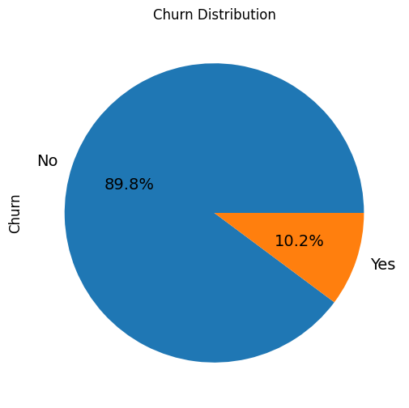
    


### Standardizing Columns


```python
# columns with numerical data
condition1 = X.dtypes == 'int'
condition2 = X.dtypes == 'float'
numerical_vars = X.columns[condition1 | condition2].to_list()
```


```python


# Standard scaling
scaler = StandardScaler()

# Fit and transform train set
X_train[numerical_vars] = scaler.fit_transform(X_train[numerical_vars])

# Transform test set
X_test[numerical_vars] = scaler.transform(X_test[numerical_vars])

X_train.describe()
```


<div>
<style scoped>
    .dataframe tbody tr th:only-of-type {
        vertical-align: middle;
    }

    .dataframe tbody tr th {
        vertical-align: top;
    }

    .dataframe thead th {
        text-align: right;
    }
</style>
<table border="1" class="dataframe">
  <thead>
    <tr style="text-align: right;">
      <th></th>
      <th>onnet_mou_6</th>
      <th>onnet_mou_7</th>
      <th>onnet_mou_8</th>
      <th>offnet_mou_6</th>
      <th>offnet_mou_7</th>
      <th>offnet_mou_8</th>
      <th>roam_ic_mou_6</th>
      <th>roam_ic_mou_7</th>
      <th>roam_ic_mou_8</th>
      <th>roam_og_mou_6</th>
      <th>...</th>
      <th>total_rech_amt_data_7</th>
      <th>total_rech_amt_data_8</th>
      <th>delta_vol_2g</th>
      <th>delta_vol_3g</th>
      <th>delta_total_og_mou</th>
      <th>delta_total_ic_mou</th>
      <th>delta_vbc_3g</th>
      <th>delta_arpu</th>
      <th>delta_total_rech_amt</th>
      <th>aon_months</th>
    </tr>
  </thead>
  <tbody>
    <tr>
      <th>count</th>
      <td>4.899900e+04</td>
      <td>4.899900e+04</td>
      <td>4.899900e+04</td>
      <td>4.899900e+04</td>
      <td>4.899900e+04</td>
      <td>4.899900e+04</td>
      <td>4.899900e+04</td>
      <td>4.899900e+04</td>
      <td>4.899900e+04</td>
      <td>4.899900e+04</td>
      <td>...</td>
      <td>4.899900e+04</td>
      <td>4.899900e+04</td>
      <td>4.899900e+04</td>
      <td>4.899900e+04</td>
      <td>4.899900e+04</td>
      <td>4.899900e+04</td>
      <td>4.899900e+04</td>
      <td>4.899900e+04</td>
      <td>4.899900e+04</td>
      <td>4.899900e+04</td>
    </tr>
    <tr>
      <th>mean</th>
      <td>3.364271e-17</td>
      <td>-2.624711e-17</td>
      <td>-8.700701e-18</td>
      <td>9.048729e-17</td>
      <td>6.017985e-17</td>
      <td>-1.226799e-16</td>
      <td>7.540607e-18</td>
      <td>-9.570771e-18</td>
      <td>-1.595128e-17</td>
      <td>-4.582369e-17</td>
      <td>...</td>
      <td>-6.815549e-17</td>
      <td>-4.350350e-18</td>
      <td>1.392112e-17</td>
      <td>-1.377611e-17</td>
      <td>-6.960561e-18</td>
      <td>4.930397e-18</td>
      <td>1.602379e-17</td>
      <td>-5.800467e-19</td>
      <td>2.320187e-18</td>
      <td>1.856150e-17</td>
    </tr>
    <tr>
      <th>std</th>
      <td>1.000010e+00</td>
      <td>1.000010e+00</td>
      <td>1.000010e+00</td>
      <td>1.000010e+00</td>
      <td>1.000010e+00</td>
      <td>1.000010e+00</td>
      <td>1.000010e+00</td>
      <td>1.000010e+00</td>
      <td>1.000010e+00</td>
      <td>1.000010e+00</td>
      <td>...</td>
      <td>1.000010e+00</td>
      <td>1.000010e+00</td>
      <td>1.000010e+00</td>
      <td>1.000010e+00</td>
      <td>1.000010e+00</td>
      <td>1.000010e+00</td>
      <td>1.000010e+00</td>
      <td>1.000010e+00</td>
      <td>1.000010e+00</td>
      <td>1.000010e+00</td>
    </tr>
    <tr>
      <th>min</th>
      <td>-5.056733e-01</td>
      <td>-4.958513e-01</td>
      <td>-4.921167e-01</td>
      <td>-6.952121e-01</td>
      <td>-6.855406e-01</td>
      <td>-6.818200e-01</td>
      <td>-2.474371e-01</td>
      <td>-2.239588e-01</td>
      <td>-2.202920e-01</td>
      <td>-2.669667e-01</td>
      <td>...</td>
      <td>-3.158894e-01</td>
      <td>-3.198908e-01</td>
      <td>-7.939264e+00</td>
      <td>-8.337432e+00</td>
      <td>-7.535326e+00</td>
      <td>-9.412602e+00</td>
      <td>-8.811266e+00</td>
      <td>-7.010198e+00</td>
      <td>-6.720701e+00</td>
      <td>-1.078905e+00</td>
    </tr>
    <tr>
      <th>25%</th>
      <td>-4.830130e-01</td>
      <td>-4.756027e-01</td>
      <td>-4.750416e-01</td>
      <td>-5.860899e-01</td>
      <td>-5.837791e-01</td>
      <td>-5.903120e-01</td>
      <td>-2.474371e-01</td>
      <td>-2.239588e-01</td>
      <td>-2.202920e-01</td>
      <td>-2.669667e-01</td>
      <td>...</td>
      <td>-3.158894e-01</td>
      <td>-3.198908e-01</td>
      <td>9.286588e-03</td>
      <td>-3.642018e-02</td>
      <td>-2.213436e-01</td>
      <td>-2.895331e-01</td>
      <td>-3.928852e-02</td>
      <td>-4.101719e-01</td>
      <td>-4.277242e-01</td>
      <td>-7.946275e-01</td>
    </tr>
    <tr>
      <th>50%</th>
      <td>-3.770007e-01</td>
      <td>-3.765103e-01</td>
      <td>-3.766423e-01</td>
      <td>-3.576343e-01</td>
      <td>-3.627562e-01</td>
      <td>-3.648741e-01</td>
      <td>-2.474371e-01</td>
      <td>-2.239588e-01</td>
      <td>-2.202920e-01</td>
      <td>-2.669667e-01</td>
      <td>...</td>
      <td>-3.158894e-01</td>
      <td>-3.198908e-01</td>
      <td>9.286588e-03</td>
      <td>-3.642018e-02</td>
      <td>8.077982e-03</td>
      <td>3.145085e-03</td>
      <td>-3.928852e-02</td>
      <td>-1.257410e-02</td>
      <td>-1.588357e-03</td>
      <td>-3.524183e-01</td>
    </tr>
    <tr>
      <th>75%</th>
      <td>-3.288779e-02</td>
      <td>-5.411525e-02</td>
      <td>-5.010574e-02</td>
      <td>1.440601e-01</td>
      <td>1.333803e-01</td>
      <td>1.401526e-01</td>
      <td>-2.474371e-01</td>
      <td>-2.239588e-01</td>
      <td>-2.202920e-01</td>
      <td>-2.669667e-01</td>
      <td>...</td>
      <td>-2.795715e-01</td>
      <td>-2.671443e-01</td>
      <td>9.286588e-03</td>
      <td>-3.642018e-02</td>
      <td>2.138192e-01</td>
      <td>2.877976e-01</td>
      <td>-3.928852e-02</td>
      <td>3.926950e-01</td>
      <td>4.186014e-01</td>
      <td>6.267593e-01</td>
    </tr>
    <tr>
      <th>max</th>
      <td>5.522230e+00</td>
      <td>5.503825e+00</td>
      <td>5.595738e+00</td>
      <td>5.131937e+00</td>
      <td>5.098242e+00</td>
      <td>5.115873e+00</td>
      <td>7.102132e+00</td>
      <td>7.451739e+00</td>
      <td>7.651199e+00</td>
      <td>6.769081e+00</td>
      <td>...</td>
      <td>6.550457e+00</td>
      <td>6.466103e+00</td>
      <td>7.868771e+00</td>
      <td>8.714964e+00</td>
      <td>7.526624e+00</td>
      <td>9.295670e+00</td>
      <td>8.771378e+00</td>
      <td>9.479331e+00</td>
      <td>6.771078e+00</td>
      <td>3.280015e+00</td>
    </tr>
  </tbody>
</table>
<p>8 rows × 107 columns</p>
</div>


### Modelling

### Model 1 : Baseline Logistic Regression Model (Interpretable Model) :


```python
baseline_model = LogisticRegression(random_state=100, class_weight='balanced') # `weight of class` balancing technique used
baseline_model = baseline_model.fit(X_train, y_train)

baseline_coefficients = baseline_model.coef_

y_train_pred = baseline_model.predict_proba(X_train)[:,1]
y_test_pred  = baseline_model.predict_proba(X_test)[:,1]
```


```python
y_train_pred = pd.Series(y_train_pred,index = X_train.index, ) # converting test and train to a series to preserve index
y_test_pred = pd.Series(y_test_pred,index = X_test.index)
```


```python
# Prediction at threshold of 0.5
classification_threshold = 0.5

y_train_pred_classified = y_train_pred.map(lambda x : 1 if x > classification_threshold else 0)
y_test_pred_classified = y_test_pred.map(lambda x : 1 if x > classification_threshold else 0)
```


```python

train_matrix = confusion_matrix(y_train, y_train_pred_classified)
print('Confusion Matrix for train:\n', train_matrix)
test_matrix = confusion_matrix(y_test, y_test_pred_classified)
print('\nConfusion Matrix for test: \n', test_matrix)
```

    Confusion Matrix for train:
     [[34842  9180]
     [  747  4230]]
    
    Confusion Matrix for test: 
     [[14844  4001]
     [  297  1858]]
    


```python
def DisplayClassificationReport(y, y_p):
    rep = classification_report(y, y_p, labels=[0, 1])
    print(rep)
    return rep


report_train = DisplayClassificationReport(y_train, y_train_pred_classified)
report_test = DisplayClassificationReport(y_test, y_test_pred_classified)

```

                  precision    recall  f1-score   support
    
               0       0.98      0.79      0.88     44022
               1       0.32      0.85      0.46      4977
    
        accuracy                           0.80     48999
       macro avg       0.65      0.82      0.67     48999
    weighted avg       0.91      0.80      0.83     48999
    
                  precision    recall  f1-score   support
    
               0       0.98      0.79      0.87     18845
               1       0.32      0.86      0.46      2155
    
        accuracy                           0.80     21000
       macro avg       0.65      0.82      0.67     21000
    weighted avg       0.91      0.80      0.83     21000
    
    

**Baseline model Coeeficients**


```python

coeffient_df = pd.DataFrame({"columns" : list(X_train.columns) , "baseline_coefficients" : list(baseline_coefficients[0]) })

PlotAsTable(coeffient_df.sort_values(by='baseline_coefficients', ascending = False, key=abs), "Baseline model Coefficients")

```

    ----------------------------------------------------------------------------------------------------- 
     Note: If you dont see the table 'Baseline model Coefficients' below,
     please ensure the Jupyter Notebook is marked Trusted (File --> Trusted Notebook) 
    -----------------------------------------------------------------------------------------------------
    


#### Baseline model Coefficients 


---


| columns               |   baseline_coefficients |
|:----------------------|------------------------:|
| aon_months            |            -0.327769    |
| delta_total_ic_mou    |            -0.327664    |
| spl_ic_mou_8          |            -0.326426    |
| roam_og_mou_8         |             0.26992     |
| loc_ic_t2m_mou_8      |            -0.241128    |
| loc_ic_mou_8          |            -0.239868    |
| loc_ic_t2t_mou_8      |            -0.178816    |
| loc_ic_t2f_mou_8      |            -0.160829    |
| loc_og_t2m_mou_8      |            -0.138874    |
| roam_ic_mou_8         |             0.134955    |
| isd_og_mou_8          |             0.132096    |
| spl_ic_mou_7          |            -0.131111    |
| loc_og_mou_8          |            -0.129051    |
| std_ic_t2f_mou_8      |            -0.119395    |
| delta_total_og_mou    |            -0.116189    |
| delta_vbc_3g          |            -0.103887    |
| isd_og_mou_7          |             0.0994905   |
| std_ic_mou_8          |            -0.0991107   |
| loc_og_t2t_mou_8      |            -0.0955863   |
| total_rech_num_8      |            -0.0948075   |
| std_ic_t2m_mou_8      |            -0.0930518   |
| loc_ic_t2m_mou_7      |            -0.0908159   |
| total_rech_data_8     |            -0.0870278   |
| spl_ic_mou_6          |            -0.0869539   |
| isd_og_mou_6          |             0.0861188   |
| delta_arpu            |            -0.0726869   |
| ic_others_8           |            -0.0725407   |
| delta_vol_2g          |            -0.071264    |
| std_og_t2f_mou_8      |            -0.0674591   |
| delta_vol_3g          |            -0.0614914   |
| roam_og_mou_7         |             0.0609883   |
| loc_ic_mou_7          |            -0.0602747   |
| isd_ic_mou_6          |             0.0583407   |
| spl_og_mou_8          |            -0.0582962   |
| std_ic_t2t_mou_8      |            -0.0561639   |
| std_og_t2m_mou_7      |             0.0516418   |
| av_rech_amt_data_8    |            -0.0498101   |
| std_og_mou_7          |             0.0485413   |
| loc_ic_t2f_mou_7      |            -0.046918    |
| roam_og_mou_6         |             0.0434897   |
| offnet_mou_7          |             0.0434486   |
| monthly_2g_8_0        |             0.0414274   |
| loc_ic_t2f_mou_6      |            -0.0405536   |
| loc_ic_t2m_mou_6      |            -0.0389376   |
| monthly_2g_8_1        |            -0.038206    |
| sachet_2g_8_0         |             0.0368269   |
| std_ic_t2f_mou_7      |            -0.0367835   |
| roam_ic_mou_7         |             0.0354719   |
| offnet_mou_8          |            -0.0346231   |
| monthly_2g_7_0        |             0.034233    |
| av_rech_amt_data_6    |             0.0333936   |
| total_rech_amt_data_8 |            -0.0333216   |
| loc_og_t2f_mou_8      |            -0.033029    |
| isd_ic_mou_7          |             0.0316455   |
| std_ic_t2m_mou_7      |            -0.0313858   |
| og_others_6           |             0.0300942   |
| delta_total_rech_amt  |            -0.0286255   |
| loc_ic_t2t_mou_7      |            -0.0276505   |
| std_ic_t2f_mou_6      |            -0.0275193   |
| monthly_3g_7_0        |            -0.0269576   |
| onnet_mou_8           |            -0.026879    |
| monthly_2g_7_1        |            -0.0265288   |
| std_og_t2f_mou_6      |            -0.0264478   |
| monthly_3g_6_0        |            -0.0259671   |
| loc_og_t2c_mou_7      |             0.0258183   |
| std_og_t2t_mou_8      |            -0.0256217   |
| monthly_2g_6_0        |             0.0256083   |
| ic_others_7           |            -0.0253111   |
| loc_og_t2m_mou_7      |            -0.0243136   |
| std_ic_t2t_mou_7      |             0.023522    |
| monthly_3g_6_1        |             0.0225538   |
| sachet_2g_7_0         |             0.0221848   |
| onnet_mou_6           |             0.0218306   |
| monthly_3g_7_1        |             0.0214911   |
| av_rech_amt_data_7    |             0.021491    |
| monthly_2g_6_1        |            -0.0212618   |
| total_rech_amt_data_7 |             0.0211671   |
| onnet_mou_7           |             0.0197463   |
| total_rech_amt_data_6 |             0.0187046   |
| isd_ic_mou_8          |             0.0182411   |
| std_ic_t2t_mou_6      |             0.0181748   |
| loc_og_t2c_mou_6      |            -0.0173621   |
| offnet_mou_6          |             0.0173414   |
| std_ic_mou_7          |            -0.0171305   |
| std_og_mou_6          |             0.0155207   |
| loc_og_mou_7          |            -0.015293    |
| loc_ic_mou_6          |            -0.0150031   |
| std_og_t2t_mou_6      |             0.014739    |
| std_og_t2t_mou_7      |             0.0145025   |
| spl_og_mou_7          |             0.0144105   |
| total_rech_data_7     |            -0.0136287   |
| total_rech_data_6     |             0.0135395   |
| monthly_3g_8_0        |            -0.0132515   |
| sachet_2g_7_1         |            -0.0123963   |
| std_og_t2m_mou_6      |             0.0119727   |
| spl_og_mou_6          |            -0.0109916   |
| sachet_2g_6_0         |             0.0106756   |
| sachet_3g_8_0         |             0.0106738   |
| roam_ic_mou_6         |            -0.00998974  |
| total_rech_num_7      |             0.009466    |
| std_ic_t2m_mou_6      |            -0.0094561   |
| sachet_2g_6_1         |            -0.0092175   |
| monthly_3g_8_1        |             0.00906512  |
| sachet_2g_8_2         |            -0.00845652  |
| std_og_t2m_mou_8      |             0.00799745  |
| sachet_2g_8_1         |            -0.00760673  |
| monthly_3g_7_2        |             0.00746073  |
| loc_og_t2m_mou_6      |            -0.00689465  |
| std_ic_mou_6          |            -0.00648548  |
| sachet_3g_8_1         |            -0.00643921  |
| sachet_2g_8_3         |            -0.00631022  |
| sachet_3g_6_1         |            -0.00557579  |
| monthly_3g_8_2        |             0.0049996   |
| ic_others_6           |            -0.00481901  |
| loc_og_mou_6          |             0.00470407  |
| last_day_rch_amt_8    |            -0.00441374  |
| total_rech_num_6      |            -0.00386013  |
| loc_og_t2f_mou_6      |             0.00378966  |
| sachet_3g_7_0         |            -0.00374116  |
| sachet_2g_7_4         |            -0.00371052  |
| loc_og_t2f_mou_7      |            -0.00342478  |
| loc_og_t2t_mou_6      |             0.00306849  |
| sachet_3g_7_1         |             0.00306774  |
| sachet_2g_7_2         |            -0.00294313  |
| sachet_2g_6_2         |            -0.00275553  |
| sachet_3g_6_0         |             0.00255828  |
| max_rech_amt_8        |            -0.00225404  |
| sachet_2g_8_4         |            -0.00218944  |
| loc_og_t2t_mou_7      |            -0.00193069  |
| last_day_rch_amt_7    |            -0.00130614  |
| max_rech_amt_7        |            -0.00108298  |
| std_og_mou_8          |             0.000997923 |
| last_day_rch_amt_6    |            -0.000852651 |
| sachet_2g_6_3         |            -0.000604907 |
| sachet_2g_7_3         |             0.000589667 |
| loc_ic_t2t_mou_6      |             0.000493854 |
| max_rech_amt_6        |            -0.00020097  |
| loc_og_t2c_mou_8      |            -0.00018902  |
| std_og_t2f_mou_7      |            -4.87198e-05 |
| og_others_8           |             0           |
| og_others_7           |             0           |


```python
def model_metrics(matrix, name) :
    TN = matrix[0][0]
    TP = matrix[1][1]
    FP = matrix[0][1]
    FN = matrix[1][0]
    print(f'{name} : \n' )
    accuracy = round((TP + TN)/float(TP+TN+FP+FN),3)
    print('Accuracy :' ,accuracy )
    sensitivity = round(TP/float(FN + TP),3)
    print('Sensitivity / True Positive Rate / Recall :', sensitivity)
    specificity = round(TN/float(TN + FP),3)
    print('Specificity / True Negative Rate : ', specificity)
    precision = round(TP/float(TP + FP),3)
    print('Precision / Positive Predictive Value :', precision)
    f1_score = round(2*precision*sensitivity/(precision + sensitivity),3)
    print('F1-score :', f1_score)
    return accuracy,sensitivity,specificity,precision,f1_score
```


```python
# Baseline Model Performance :
model_perf_df = pd.DataFrame(columns=['model','accuracy','sensitivity/recall', 'specificity',  'precision', 'f1-score'])

def PlotMetricsComparission(t = "Metrics by Model (sorted by accuracy)"):
    PlotAsTable(model_perf_df.sort_values(by='accuracy', ascending = False), t)

def AppendToModelPerfDF(corr_matrix, name):
    metrics = model_metrics(corr_matrix, name)
     #Combining the "name" value with the NumPy array metrics
    new_row = np.concatenate([[name], metrics])
    # Inserting the new row into the DataFrame using the loc method
    new_row_index = len(model_perf_df)
    model_perf_df.loc[new_row_index] = new_row

AppendToModelPerfDF(train_matrix,"Logistic Regr Train (0.5 Thres)")
AppendToModelPerfDF(test_matrix,"Logistic Regr Test (0.5 Thres)")
```

    Logistic Regr Train (0.5 Thres) : 
    
    Accuracy : 0.797
    Sensitivity / True Positive Rate / Recall : 0.85
    Specificity / True Negative Rate :  0.791
    Precision / Positive Predictive Value : 0.315
    F1-score : 0.46
    Logistic Regr Test (0.5 Thres) : 
    
    Accuracy : 0.795
    Sensitivity / True Positive Rate / Recall : 0.862
    Specificity / True Negative Rate :  0.788
    Precision / Positive Predictive Value : 0.317
    F1-score : 0.464
    

##### Baseline Performance - Finding Optimum Probability Cutoff


```python
# Specificity / Sensitivity Tradeoff

# Classification at probability thresholds between 0 and 1
def thresholder(x, thresh) :
    if x > thresh :
        return 1
    else :
        return 0

def CalculateProbablityThresholds(y_pred_now, X_now):
  y_train_pred_thres = pd.DataFrame(index=X_now.index)
  thresholds = [float(x)/10 for x in range(10)]
  for i in thresholds:
      y_train_pred_thres[i]= y_pred_now.map(lambda x : thresholder(x,i))
  print("Y pred by threshold: \n")
  print(y_train_pred_thres.head())
  return (thresholds, y_train_pred_thres)


```


```python
# # sensitivity, specificity, accuracy for each threshold
# Function for calculation of metrics for each threshold
def model_metrics_thres(matrix) :
    TN = matrix[0][0]
    TP = matrix[1][1]
    FP = matrix[0][1]
    FN = matrix[1][0]
    accuracy = round((TP + TN)/float(TP+TN+FP+FN),3)
    sensitivity = round(TP/float(FN + TP),3)
    specificity = round(TN/float(TN + FP),3)
    precision = round(TP/float(TP + FP),3)
    return sensitivity,specificity,accuracy,precision

def ViewMetricsByThreshold(y_act, y_pred_now, X_now):
  metrics_df = pd.DataFrame(columns=['precision','sensitivity/recall', 'specificity', 'accuracy'])
  (thresholds, y_train_pred_thres) = CalculateProbablityThresholds(y_pred_now, X_now)
  # generating a data frame for metrics for each threshold
  for thres,column in zip(thresholds,y_train_pred_thres.columns.to_list()) :
      confusion = confusion_matrix(y_act, y_train_pred_thres.loc[:,column])
      sensitivity,specificity,accuracy,precision = model_metrics_thres(confusion)

      metrics_df =  metrics_df.append({
          'precision' : precision,
          'sensitivity/recall' :sensitivity,
          'specificity' : specificity,
          'accuracy' : accuracy
      }, ignore_index = True)

  metrics_df.index = thresholds
  print("Y pred metrics by threshold: \n")
  print(metrics_df)
  metrics_df.plot(kind='line', figsize=(24,8), grid=True, xticks=np.arange(0,1,0.02),
                title='Specificity-Sensitivity TradeOff');


ViewMetricsByThreshold(y_train, y_train_pred, X_train)
```

    Y pred by threshold: 
    
           0.0  0.1  0.2  0.3  0.4  0.5  0.6  0.7  0.8  0.9
    id                                                     
    61787    1    1    1    0    0    0    0    0    0    0
    19961    1    1    1    0    0    0    0    0    0    0
    11040    1    0    0    0    0    0    0    0    0    0
    27673    1    1    1    1    1    1    1    1    1    0
    22876    1    1    1    0    0    0    0    0    0    0
    Y pred metrics by threshold: 
    
         precision  sensitivity/recall  specificity  accuracy
    0.0      0.102               1.000        0.000     0.102
    0.1      0.137               0.972        0.310     0.377
    0.2      0.167               0.947        0.467     0.516
    0.3      0.203               0.919        0.592     0.625
    0.4      0.250               0.887        0.699     0.718
    0.5      0.315               0.850        0.791     0.797
    0.6      0.397               0.798        0.863     0.856
    0.7      0.495               0.716        0.917     0.897
    0.8      0.583               0.511        0.959     0.913
    0.9      0.561               0.143        0.987     0.902
    


    
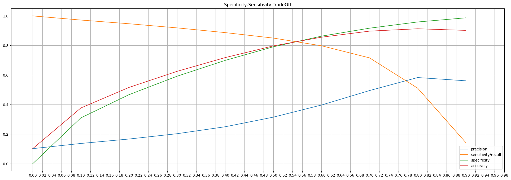
    


```python
optimum_cutoff = 0.53
y_train_pred_final = y_train_pred.map(lambda x : 1 if x > optimum_cutoff else 0)
y_test_pred_final = y_test_pred.map(lambda x : 1 if x > optimum_cutoff else 0)

train_matrix = confusion_matrix(y_train, y_train_pred_final)
print('Confusion Matrix for train:\n', train_matrix)
test_matrix = confusion_matrix(y_test, y_test_pred_final)
print('\nConfusion Matrix for test: \n', test_matrix)
```

    Confusion Matrix for train:
     [[35854  8168]
     [  812  4165]]
    
    Confusion Matrix for test: 
     [[15290  3555]
     [  331  1824]]
    


```python
AppendToModelPerfDF(train_matrix,f"Logistic Regr Train (Optimal:{str(optimum_cutoff)} Thres)")
AppendToModelPerfDF(test_matrix,f"Logistic Regr Test (Optimal:{str(optimum_cutoff)} Thres)")
```

    Logistic Regr Train (Optimal:0.53 Thres) : 
    
    Accuracy : 0.817
    Sensitivity / True Positive Rate / Recall : 0.837
    Specificity / True Negative Rate :  0.814
    Precision / Positive Predictive Value : 0.338
    F1-score : 0.482
    Logistic Regr Test (Optimal:0.53 Thres) : 
    
    Accuracy : 0.815
    Sensitivity / True Positive Rate / Recall : 0.846
    Specificity / True Negative Rate :  0.811
    Precision / Positive Predictive Value : 0.339
    F1-score : 0.484
    


```python
report_train = DisplayClassificationReport(y_train, y_train_pred_classified)
report_test = DisplayClassificationReport(y_test, y_test_pred_classified)

```

                  precision    recall  f1-score   support
    
               0       0.98      0.79      0.88     44022
               1       0.32      0.85      0.46      4977
    
        accuracy                           0.80     48999
       macro avg       0.65      0.82      0.67     48999
    weighted avg       0.91      0.80      0.83     48999
    
                  precision    recall  f1-score   support
    
               0       0.98      0.79      0.87     18845
               1       0.32      0.86      0.46      2155
    
        accuracy                           0.80     21000
       macro avg       0.65      0.82      0.67     21000
    weighted avg       0.91      0.80      0.83     21000
    
    


```python
PlotMetricsComparission()
```

    ----------------------------------------------------------------------------------------------------- 
     Note: If you dont see the table 'Metrics by Model (sorted by accuracy)' below,
     please ensure the Jupyter Notebook is marked Trusted (File --> Trusted Notebook) 
    -----------------------------------------------------------------------------------------------------
    


#### Metrics by Model (sorted by accuracy) 


---


| model                                    |   accuracy |   sensitivity/recall |   specificity |   precision |   f1-score |
|:-----------------------------------------|-----------:|---------------------:|--------------:|------------:|-----------:|
| Logistic Regr Train (Optimal:0.53 Thres) |      0.817 |                0.837 |         0.814 |       0.338 |      0.482 |
| Logistic Regr Test (Optimal:0.53 Thres)  |      0.815 |                0.846 |         0.811 |       0.339 |      0.484 |
| Logistic Regr Train (0.5 Thres)          |      0.797 |                0.85  |         0.791 |       0.315 |      0.46  |
| Logistic Regr Test (0.5 Thres)           |      0.795 |                0.862 |         0.788 |       0.317 |      0.464 |


**Logistin Regression with RFE**

**RFE Feature selection**


```python
lr = LogisticRegression(random_state=100 , class_weight='balanced')
rfe = RFE(estimator=lr, n_features_to_select=15)
results = rfe.fit(X_train,y_train)
results.support_
```


    array([False, False, False, False, False,  True, False, False, False,
           False, False, False, False, False, False, False, False,  True,
           False, False, False, False, False, False, False, False, False,
           False, False,  True, False, False, False, False, False, False,
           False, False,  True, False, False, False, False, False, False,
           False, False, False, False, False,  True, False, False,  True,
           False, False,  True, False, False,  True, False, False, False,
           False, False, False, False, False, False, False, False, False,
           False, False,  True, False, False, False, False, False, False,
           False, False, False, False, False, False, False, False, False,
           False, False,  True, False, False, False, False, False, False,
           False, False, False, False, False, False,  True,  True, False,
           False, False, False, False, False, False, False, False, False,
            True, False, False, False, False, False, False, False, False,
           False, False, False, False, False, False, False, False, False,
           False, False, False, False,  True,  True])


```python
# DataFrame with features supported by RFE
rfe_support = pd.DataFrame({'Column' : X.columns.to_list(), 'Rank' : rfe.ranking_,
                                      'Support' :  rfe.support_}).sort_values(by=
                                       'Rank', ascending=True)
PlotAsTable(rfe_support, "RFE Feature Selection")
```

    ----------------------------------------------------------------------------------------------------- 
     Note: If you dont see the table 'RFE Feature Selection' below,
     please ensure the Jupyter Notebook is marked Trusted (File --> Trusted Notebook) 
    -----------------------------------------------------------------------------------------------------
    


#### RFE Feature Selection 


---


| Column                |   Rank | Support   |
|:----------------------|-------:|:----------|
| monthly_2g_7_1        |      1 | True      |
| loc_ic_t2m_mou_8      |      1 | True      |
| loc_ic_t2f_mou_8      |      1 | True      |
| std_og_mou_8          |      1 | True      |
| loc_ic_mou_8          |      1 | True      |
| monthly_2g_7_0        |      1 | True      |
| std_og_t2t_mou_8      |      1 | True      |
| spl_ic_mou_8          |      1 | True      |
| total_rech_data_8     |      1 | True      |
| aon_months            |      1 | True      |
| loc_og_t2m_mou_8      |      1 | True      |
| monthly_2g_8_1        |      1 | True      |
| delta_total_rech_amt  |      1 | True      |
| loc_ic_t2t_mou_8      |      1 | True      |
| offnet_mou_8          |      1 | True      |
| loc_og_t2t_mou_8      |      2 | False     |
| loc_og_mou_8          |      3 | False     |
| roam_og_mou_8         |      4 | False     |
| monthly_3g_8_0        |      5 | False     |
| sachet_2g_7_1         |      6 | False     |
| monthly_3g_6_1        |      7 | False     |
| std_ic_t2f_mou_8      |      8 | False     |
| sachet_2g_8_2         |      9 | False     |
| monthly_3g_7_2        |     10 | False     |
| monthly_3g_6_0        |     11 | False     |
| sachet_2g_7_4         |     12 | False     |
| delta_total_ic_mou    |     13 | False     |
| monthly_3g_8_1        |     14 | False     |
| av_rech_amt_data_8    |     15 | False     |
| std_ic_t2m_mou_8      |     16 | False     |
| sachet_2g_8_3         |     17 | False     |
| loc_ic_mou_7          |     18 | False     |
| loc_ic_t2m_mou_7      |     19 | False     |
| monthly_2g_8_0        |     20 | False     |
| sachet_3g_7_0         |     21 | False     |
| isd_og_mou_8          |     22 | False     |
| spl_ic_mou_7          |     23 | False     |
| sachet_3g_6_1         |     24 | False     |
| onnet_mou_8           |     25 | False     |
| std_og_t2f_mou_8      |     26 | False     |
| sachet_2g_7_2         |     27 | False     |
| delta_vbc_3g          |     28 | False     |
| offnet_mou_7          |     29 | False     |
| std_ic_t2t_mou_8      |     30 | False     |
| std_ic_t2m_mou_7      |     31 | False     |
| std_ic_mou_7          |     32 | False     |
| sachet_2g_6_1         |     33 | False     |
| roam_og_mou_6         |     34 | False     |
| std_og_t2t_mou_6      |     35 | False     |
| isd_ic_mou_8          |     36 | False     |
| ic_others_8           |     37 | False     |
| monthly_2g_6_1        |     38 | False     |
| delta_vol_2g          |     39 | False     |
| std_ic_t2m_mou_6      |     40 | False     |
| std_ic_mou_6          |     41 | False     |
| std_ic_t2t_mou_6      |     42 | False     |
| total_rech_num_8      |     43 | False     |
| std_og_mou_7          |     44 | False     |
| spl_ic_mou_6          |     45 | False     |
| roam_ic_mou_7         |     46 | False     |
| total_rech_data_7     |     47 | False     |
| loc_og_t2t_mou_7      |     48 | False     |
| spl_og_mou_8          |     49 | False     |
| loc_og_t2c_mou_8      |     50 | False     |
| delta_total_og_mou    |     51 | False     |
| offnet_mou_6          |     52 | False     |
| og_others_6           |     53 | False     |
| isd_og_mou_6          |     54 | False     |
| loc_ic_t2m_mou_6      |     55 | False     |
| monthly_3g_8_2        |     56 | False     |
| loc_og_t2c_mou_7      |     57 | False     |
| loc_og_t2f_mou_6      |     58 | False     |
| monthly_3g_7_0        |     59 | False     |
| loc_og_t2c_mou_6      |     60 | False     |
| isd_og_mou_7          |     61 | False     |
| std_og_t2f_mou_6      |     62 | False     |
| loc_og_mou_7          |     63 | False     |
| onnet_mou_6           |     64 | False     |
| monthly_2g_6_0        |     65 | False     |
| delta_arpu            |     66 | False     |
| loc_ic_t2t_mou_6      |     67 | False     |
| std_og_t2m_mou_6      |     68 | False     |
| sachet_3g_8_1         |     69 | False     |
| total_rech_num_7      |     70 | False     |
| sachet_2g_6_2         |     71 | False     |
| monthly_3g_7_1        |     72 | False     |
| onnet_mou_7           |     73 | False     |
| sachet_2g_8_1         |     74 | False     |
| std_og_t2t_mou_7      |     75 | False     |
| std_ic_t2t_mou_7      |     76 | False     |
| std_ic_mou_8          |     77 | False     |
| spl_og_mou_6          |     78 | False     |
| ic_others_7           |     79 | False     |
| total_rech_amt_data_7 |     80 | False     |
| last_day_rch_amt_8    |     81 | False     |
| std_og_t2m_mou_7      |     82 | False     |
| roam_ic_mou_8         |     83 | False     |
| loc_ic_mou_6          |     84 | False     |
| isd_ic_mou_6          |     85 | False     |
| sachet_2g_8_0         |     86 | False     |
| roam_og_mou_7         |     87 | False     |
| loc_og_t2f_mou_7      |     88 | False     |
| total_rech_amt_data_8 |     89 | False     |
| total_rech_amt_data_6 |     90 | False     |
| loc_ic_t2f_mou_6      |     91 | False     |
| std_ic_t2f_mou_6      |     92 | False     |
| sachet_2g_8_4         |     93 | False     |
| std_ic_t2f_mou_7      |     94 | False     |
| max_rech_amt_8        |     95 | False     |
| loc_ic_t2t_mou_7      |     96 | False     |
| sachet_2g_6_3         |     97 | False     |
| roam_ic_mou_6         |     98 | False     |
| sachet_2g_7_0         |     99 | False     |
| loc_og_t2m_mou_7      |    100 | False     |
| loc_ic_t2f_mou_7      |    101 | False     |
| spl_og_mou_7          |    102 | False     |
| ic_others_6           |    103 | False     |
| std_og_t2m_mou_8      |    104 | False     |
| av_rech_amt_data_6    |    105 | False     |
| total_rech_data_6     |    106 | False     |
| last_day_rch_amt_7    |    107 | False     |
| sachet_3g_7_1         |    108 | False     |
| std_og_mou_6          |    109 | False     |
| total_rech_num_6      |    110 | False     |
| isd_ic_mou_7          |    111 | False     |
| loc_og_t2f_mou_8      |    112 | False     |
| delta_vol_3g          |    113 | False     |
| sachet_2g_6_0         |    114 | False     |
| loc_og_mou_6          |    115 | False     |
| av_rech_amt_data_7    |    116 | False     |
| max_rech_amt_7        |    117 | False     |
| last_day_rch_amt_6    |    118 | False     |
| sachet_3g_6_0         |    119 | False     |
| loc_og_t2t_mou_6      |    120 | False     |
| sachet_2g_7_3         |    121 | False     |
| loc_og_t2m_mou_6      |    122 | False     |
| max_rech_amt_6        |    123 | False     |
| sachet_3g_8_0         |    124 | False     |
| std_og_t2f_mou_7      |    125 | False     |
| og_others_7           |    126 | False     |
| og_others_8           |    127 | False     |


```python
# RFE Selected columns
rfe_selected_columns = rfe_support.loc[rfe_support['Rank'] == 1,'Column'].to_list()
rfe_selected_columns
```


    ['monthly_2g_7_1',
     'loc_ic_t2m_mou_8',
     'loc_ic_t2f_mou_8',
     'std_og_mou_8',
     'loc_ic_mou_8',
     'monthly_2g_7_0',
     'std_og_t2t_mou_8',
     'spl_ic_mou_8',
     'total_rech_data_8',
     'aon_months',
     'loc_og_t2m_mou_8',
     'monthly_2g_8_1',
     'delta_total_rech_amt',
     'loc_ic_t2t_mou_8',
     'offnet_mou_8']


**Logistic Regression using RFE Columns**

**Model 1**


```python
# Note that the SMOTE resampled Train set is used with statsmodels.api.GLM since it doesnot support class_weight
logr = sm.GLM(y_train,(sm.add_constant(X_train[rfe_selected_columns])), family = sm.families.Binomial())
logr_fit = logr.fit()
logr_fit.summary()
```


<table class="simpletable">
<caption>Generalized Linear Model Regression Results</caption>
<tr>
  <th>Dep. Variable:</th>   <td>churn_probability</td> <th>  No. Observations:  </th>  <td> 48999</td> 
</tr>
<tr>
  <th>Model:</th>                  <td>GLM</td>        <th>  Df Residuals:      </th>  <td> 48983</td> 
</tr>
<tr>
  <th>Model Family:</th>        <td>Binomial</td>      <th>  Df Model:          </th>  <td>    15</td> 
</tr>
<tr>
  <th>Link Function:</th>         <td>Logit</td>       <th>  Scale:             </th> <td>  1.0000</td>
</tr>
<tr>
  <th>Method:</th>                <td>IRLS</td>        <th>  Log-Likelihood:    </th> <td> -11177.</td>
</tr>
<tr>
  <th>Date:</th>            <td>Tue, 08 Aug 2023</td>  <th>  Deviance:          </th> <td>  22354.</td>
</tr>
<tr>
  <th>Time:</th>                <td>22:01:12</td>      <th>  Pearson chi2:      </th> <td>9.19e+07</td>
</tr>
<tr>
  <th>No. Iterations:</th>          <td>9</td>         <th>  Pseudo R-squ. (CS):</th>  <td>0.1820</td> 
</tr>
<tr>
  <th>Covariance Type:</th>     <td>nonrobust</td>     <th>                     </th>     <td> </td>   
</tr>
</table>
<table class="simpletable">
<tr>
            <td></td>              <th>coef</th>     <th>std err</th>      <th>z</th>      <th>P>|z|</th>  <th>[0.025</th>    <th>0.975]</th>  
</tr>
<tr>
  <th>const</th>                <td>   -5.9077</td> <td>    0.478</td> <td>  -12.364</td> <td> 0.000</td> <td>   -6.844</td> <td>   -4.971</td>
</tr>
<tr>
  <th>monthly_2g_7_1</th>       <td>    1.1766</td> <td>    0.483</td> <td>    2.435</td> <td> 0.015</td> <td>    0.230</td> <td>    2.124</td>
</tr>
<tr>
  <th>loc_ic_t2m_mou_8</th>     <td>   -2.8351</td> <td>    0.149</td> <td>  -18.966</td> <td> 0.000</td> <td>   -3.128</td> <td>   -2.542</td>
</tr>
<tr>
  <th>loc_ic_t2f_mou_8</th>     <td>   -0.8691</td> <td>    0.084</td> <td>  -10.383</td> <td> 0.000</td> <td>   -1.033</td> <td>   -0.705</td>
</tr>
<tr>
  <th>std_og_mou_8</th>         <td>   -0.7844</td> <td>    0.123</td> <td>   -6.387</td> <td> 0.000</td> <td>   -1.025</td> <td>   -0.544</td>
</tr>
<tr>
  <th>loc_ic_mou_8</th>         <td>    1.7571</td> <td>    0.197</td> <td>    8.923</td> <td> 0.000</td> <td>    1.371</td> <td>    2.143</td>
</tr>
<tr>
  <th>monthly_2g_7_0</th>       <td>    1.7485</td> <td>    0.475</td> <td>    3.679</td> <td> 0.000</td> <td>    0.817</td> <td>    2.680</td>
</tr>
<tr>
  <th>std_og_t2t_mou_8</th>     <td>    0.2000</td> <td>    0.082</td> <td>    2.436</td> <td> 0.015</td> <td>    0.039</td> <td>    0.361</td>
</tr>
<tr>
  <th>spl_ic_mou_8</th>         <td>   -0.9475</td> <td>    0.061</td> <td>  -15.458</td> <td> 0.000</td> <td>   -1.068</td> <td>   -0.827</td>
</tr>
<tr>
  <th>total_rech_data_8</th>    <td>   -0.6301</td> <td>    0.042</td> <td>  -15.094</td> <td> 0.000</td> <td>   -0.712</td> <td>   -0.548</td>
</tr>
<tr>
  <th>aon_months</th>           <td>   -0.3161</td> <td>    0.022</td> <td>  -14.056</td> <td> 0.000</td> <td>   -0.360</td> <td>   -0.272</td>
</tr>
<tr>
  <th>loc_og_t2m_mou_8</th>     <td>   -0.9796</td> <td>    0.089</td> <td>  -11.032</td> <td> 0.000</td> <td>   -1.154</td> <td>   -0.806</td>
</tr>
<tr>
  <th>monthly_2g_8_1</th>       <td>   -0.8322</td> <td>    0.143</td> <td>   -5.838</td> <td> 0.000</td> <td>   -1.112</td> <td>   -0.553</td>
</tr>
<tr>
  <th>delta_total_rech_amt</th> <td>   -0.4774</td> <td>    0.019</td> <td>  -25.210</td> <td> 0.000</td> <td>   -0.515</td> <td>   -0.440</td>
</tr>
<tr>
  <th>loc_ic_t2t_mou_8</th>     <td>   -1.7059</td> <td>    0.119</td> <td>  -14.354</td> <td> 0.000</td> <td>   -1.939</td> <td>   -1.473</td>
</tr>
<tr>
  <th>offnet_mou_8</th>         <td>    0.3185</td> <td>    0.087</td> <td>    3.647</td> <td> 0.000</td> <td>    0.147</td> <td>    0.490</td>
</tr>
</table>


```python

def vif(X_train_resampled, logr_fit, selected_columns) :
    vif = pd.DataFrame()
    vif['Features'] = rfe_selected_columns
    vif['VIF'] = [variance_inflation_factor(X_train_resampled[selected_columns].values, i) for i in range(X_train_resampled[selected_columns].shape[1])]
    vif['VIF'] = round(vif['VIF'], 2)
    vif = vif.set_index('Features')
    vif['P-value'] = round(logr_fit.pvalues,4)
    vif = vif.sort_values(by = ["VIF",'P-value'], ascending = [False,False])
    return vif
```


```python
# vif and p-values
vif(X_train, logr_fit,  rfe_selected_columns)
```


<div>
<style scoped>
    .dataframe tbody tr th:only-of-type {
        vertical-align: middle;
    }

    .dataframe tbody tr th {
        vertical-align: top;
    }

    .dataframe thead th {
        text-align: right;
    }
</style>
<table border="1" class="dataframe">
  <thead>
    <tr style="text-align: right;">
      <th></th>
      <th>VIF</th>
      <th>P-value</th>
    </tr>
    <tr>
      <th>Features</th>
      <th></th>
      <th></th>
    </tr>
  </thead>
  <tbody>
    <tr>
      <th>loc_ic_mou_8</th>
      <td>28.61</td>
      <td>0.0000</td>
    </tr>
    <tr>
      <th>std_og_mou_8</th>
      <td>23.81</td>
      <td>0.0000</td>
    </tr>
    <tr>
      <th>loc_ic_t2m_mou_8</th>
      <td>15.45</td>
      <td>0.0000</td>
    </tr>
    <tr>
      <th>offnet_mou_8</th>
      <td>14.76</td>
      <td>0.0003</td>
    </tr>
    <tr>
      <th>std_og_t2t_mou_8</th>
      <td>11.03</td>
      <td>0.0148</td>
    </tr>
    <tr>
      <th>loc_ic_t2t_mou_8</th>
      <td>6.34</td>
      <td>0.0000</td>
    </tr>
    <tr>
      <th>loc_og_t2m_mou_8</th>
      <td>6.10</td>
      <td>0.0000</td>
    </tr>
    <tr>
      <th>loc_ic_t2f_mou_8</th>
      <td>1.80</td>
      <td>0.0000</td>
    </tr>
    <tr>
      <th>monthly_2g_8_1</th>
      <td>1.39</td>
      <td>0.0000</td>
    </tr>
    <tr>
      <th>monthly_2g_7_1</th>
      <td>1.35</td>
      <td>0.0149</td>
    </tr>
    <tr>
      <th>delta_total_rech_amt</th>
      <td>1.13</td>
      <td>0.0000</td>
    </tr>
    <tr>
      <th>aon_months</th>
      <td>1.12</td>
      <td>0.0000</td>
    </tr>
    <tr>
      <th>total_rech_data_8</th>
      <td>1.04</td>
      <td>0.0000</td>
    </tr>
    <tr>
      <th>spl_ic_mou_8</th>
      <td>1.03</td>
      <td>0.0000</td>
    </tr>
    <tr>
      <th>monthly_2g_7_0</th>
      <td>1.02</td>
      <td>0.0002</td>
    </tr>
  </tbody>
</table>
</div>


loc_ic_mou_8 has very high VIF, hence can be eliminated


```python
selected_columns = rfe_selected_columns
selected_columns.remove('loc_ic_mou_8')
selected_columns
```


    ['monthly_2g_7_1',
     'loc_ic_t2m_mou_8',
     'loc_ic_t2f_mou_8',
     'std_og_mou_8',
     'monthly_2g_7_0',
     'std_og_t2t_mou_8',
     'spl_ic_mou_8',
     'total_rech_data_8',
     'aon_months',
     'loc_og_t2m_mou_8',
     'monthly_2g_8_1',
     'delta_total_rech_amt',
     'loc_ic_t2t_mou_8',
     'offnet_mou_8']


**Manual elimination, Model 2**


```python
logr2 = sm.GLM(y_train,(sm.add_constant(X_train[selected_columns])), family = sm.families.Binomial())
logr2_fit = logr2.fit()
logr2_fit.summary()
```


<table class="simpletable">
<caption>Generalized Linear Model Regression Results</caption>
<tr>
  <th>Dep. Variable:</th>   <td>churn_probability</td> <th>  No. Observations:  </th>  <td> 48999</td> 
</tr>
<tr>
  <th>Model:</th>                  <td>GLM</td>        <th>  Df Residuals:      </th>  <td> 48984</td> 
</tr>
<tr>
  <th>Model Family:</th>        <td>Binomial</td>      <th>  Df Model:          </th>  <td>    14</td> 
</tr>
<tr>
  <th>Link Function:</th>         <td>Logit</td>       <th>  Scale:             </th> <td>  1.0000</td>
</tr>
<tr>
  <th>Method:</th>                <td>IRLS</td>        <th>  Log-Likelihood:    </th> <td> -11196.</td>
</tr>
<tr>
  <th>Date:</th>            <td>Tue, 08 Aug 2023</td>  <th>  Deviance:          </th> <td>  22391.</td>
</tr>
<tr>
  <th>Time:</th>                <td>23:02:01</td>      <th>  Pearson chi2:      </th> <td>2.15e+08</td>
</tr>
<tr>
  <th>No. Iterations:</th>          <td>9</td>         <th>  Pseudo R-squ. (CS):</th>  <td>0.1813</td> 
</tr>
<tr>
  <th>Covariance Type:</th>     <td>nonrobust</td>     <th>                     </th>     <td> </td>   
</tr>
</table>
<table class="simpletable">
<tr>
            <td></td>              <th>coef</th>     <th>std err</th>      <th>z</th>      <th>P>|z|</th>  <th>[0.025</th>    <th>0.975]</th>  
</tr>
<tr>
  <th>const</th>                <td>   -5.9173</td> <td>    0.478</td> <td>  -12.387</td> <td> 0.000</td> <td>   -6.854</td> <td>   -4.981</td>
</tr>
<tr>
  <th>monthly_2g_7_1</th>       <td>    1.1763</td> <td>    0.483</td> <td>    2.435</td> <td> 0.015</td> <td>    0.230</td> <td>    2.123</td>
</tr>
<tr>
  <th>loc_ic_t2m_mou_8</th>     <td>   -1.6930</td> <td>    0.089</td> <td>  -18.949</td> <td> 0.000</td> <td>   -1.868</td> <td>   -1.518</td>
</tr>
<tr>
  <th>loc_ic_t2f_mou_8</th>     <td>   -0.5776</td> <td>    0.073</td> <td>   -7.873</td> <td> 0.000</td> <td>   -0.721</td> <td>   -0.434</td>
</tr>
<tr>
  <th>std_og_mou_8</th>         <td>   -0.7873</td> <td>    0.123</td> <td>   -6.410</td> <td> 0.000</td> <td>   -1.028</td> <td>   -0.547</td>
</tr>
<tr>
  <th>monthly_2g_7_0</th>       <td>    1.7506</td> <td>    0.475</td> <td>    3.685</td> <td> 0.000</td> <td>    0.819</td> <td>    2.682</td>
</tr>
<tr>
  <th>std_og_t2t_mou_8</th>     <td>    0.2006</td> <td>    0.082</td> <td>    2.444</td> <td> 0.015</td> <td>    0.040</td> <td>    0.361</td>
</tr>
<tr>
  <th>spl_ic_mou_8</th>         <td>   -0.9481</td> <td>    0.061</td> <td>  -15.469</td> <td> 0.000</td> <td>   -1.068</td> <td>   -0.828</td>
</tr>
<tr>
  <th>total_rech_data_8</th>    <td>   -0.6297</td> <td>    0.042</td> <td>  -15.093</td> <td> 0.000</td> <td>   -0.712</td> <td>   -0.548</td>
</tr>
<tr>
  <th>aon_months</th>           <td>   -0.3196</td> <td>    0.022</td> <td>  -14.215</td> <td> 0.000</td> <td>   -0.364</td> <td>   -0.275</td>
</tr>
<tr>
  <th>loc_og_t2m_mou_8</th>     <td>   -0.9921</td> <td>    0.089</td> <td>  -11.144</td> <td> 0.000</td> <td>   -1.167</td> <td>   -0.818</td>
</tr>
<tr>
  <th>monthly_2g_8_1</th>       <td>   -0.8348</td> <td>    0.142</td> <td>   -5.859</td> <td> 0.000</td> <td>   -1.114</td> <td>   -0.556</td>
</tr>
<tr>
  <th>delta_total_rech_amt</th> <td>   -0.4787</td> <td>    0.019</td> <td>  -25.275</td> <td> 0.000</td> <td>   -0.516</td> <td>   -0.442</td>
</tr>
<tr>
  <th>loc_ic_t2t_mou_8</th>     <td>   -1.0085</td> <td>    0.077</td> <td>  -13.142</td> <td> 0.000</td> <td>   -1.159</td> <td>   -0.858</td>
</tr>
<tr>
  <th>offnet_mou_8</th>         <td>    0.3218</td> <td>    0.087</td> <td>    3.685</td> <td> 0.000</td> <td>    0.151</td> <td>    0.493</td>
</tr>
</table>


```python
# vif and p-values
vif(X_train,logr2_fit,selected_columns)
```


<div>
<style scoped>
    .dataframe tbody tr th:only-of-type {
        vertical-align: middle;
    }

    .dataframe tbody tr th {
        vertical-align: top;
    }

    .dataframe thead th {
        text-align: right;
    }
</style>
<table border="1" class="dataframe">
  <thead>
    <tr style="text-align: right;">
      <th></th>
      <th>VIF</th>
      <th>P-value</th>
    </tr>
    <tr>
      <th>Features</th>
      <th></th>
      <th></th>
    </tr>
  </thead>
  <tbody>
    <tr>
      <th>std_og_mou_8</th>
      <td>23.81</td>
      <td>0.0000</td>
    </tr>
    <tr>
      <th>offnet_mou_8</th>
      <td>14.75</td>
      <td>0.0002</td>
    </tr>
    <tr>
      <th>std_og_t2t_mou_8</th>
      <td>11.03</td>
      <td>0.0145</td>
    </tr>
    <tr>
      <th>loc_og_t2m_mou_8</th>
      <td>6.08</td>
      <td>0.0000</td>
    </tr>
    <tr>
      <th>loc_ic_t2m_mou_8</th>
      <td>1.78</td>
      <td>0.0000</td>
    </tr>
    <tr>
      <th>monthly_2g_8_1</th>
      <td>1.39</td>
      <td>0.0000</td>
    </tr>
    <tr>
      <th>monthly_2g_7_1</th>
      <td>1.35</td>
      <td>0.0149</td>
    </tr>
    <tr>
      <th>loc_ic_t2t_mou_8</th>
      <td>1.19</td>
      <td>0.0000</td>
    </tr>
    <tr>
      <th>loc_ic_t2f_mou_8</th>
      <td>1.17</td>
      <td>0.0000</td>
    </tr>
    <tr>
      <th>delta_total_rech_amt</th>
      <td>1.13</td>
      <td>0.0000</td>
    </tr>
    <tr>
      <th>aon_months</th>
      <td>1.11</td>
      <td>0.0000</td>
    </tr>
    <tr>
      <th>total_rech_data_8</th>
      <td>1.04</td>
      <td>0.0000</td>
    </tr>
    <tr>
      <th>spl_ic_mou_8</th>
      <td>1.03</td>
      <td>0.0000</td>
    </tr>
    <tr>
      <th>monthly_2g_7_0</th>
      <td>1.02</td>
      <td>0.0002</td>
    </tr>
  </tbody>
</table>
</div>


std_og_mou_8 has high VIF hence can be eliminated


```python
selected_columns.remove('std_og_mou_8')
selected_columns
```


    ['monthly_2g_7_1',
     'loc_ic_t2m_mou_8',
     'loc_ic_t2f_mou_8',
     'monthly_2g_7_0',
     'std_og_t2t_mou_8',
     'spl_ic_mou_8',
     'total_rech_data_8',
     'aon_months',
     'loc_og_t2m_mou_8',
     'monthly_2g_8_1',
     'delta_total_rech_amt',
     'loc_ic_t2t_mou_8',
     'offnet_mou_8']


**Manual elimination, Model 3**


```python
logr3 = sm.GLM(y_train,(sm.add_constant(X_train[selected_columns])), family = sm.families.Binomial())
logr3_fit = logr3.fit()
logr3_fit.summary()
```


<table class="simpletable">
<caption>Generalized Linear Model Regression Results</caption>
<tr>
  <th>Dep. Variable:</th>   <td>churn_probability</td> <th>  No. Observations:  </th>  <td> 48999</td> 
</tr>
<tr>
  <th>Model:</th>                  <td>GLM</td>        <th>  Df Residuals:      </th>  <td> 48985</td> 
</tr>
<tr>
  <th>Model Family:</th>        <td>Binomial</td>      <th>  Df Model:          </th>  <td>    13</td> 
</tr>
<tr>
  <th>Link Function:</th>         <td>Logit</td>       <th>  Scale:             </th> <td>  1.0000</td>
</tr>
<tr>
  <th>Method:</th>                <td>IRLS</td>        <th>  Log-Likelihood:    </th> <td> -11214.</td>
</tr>
<tr>
  <th>Date:</th>            <td>Tue, 08 Aug 2023</td>  <th>  Deviance:          </th> <td>  22428.</td>
</tr>
<tr>
  <th>Time:</th>                <td>23:02:36</td>      <th>  Pearson chi2:      </th> <td>3.03e+08</td>
</tr>
<tr>
  <th>No. Iterations:</th>          <td>9</td>         <th>  Pseudo R-squ. (CS):</th>  <td>0.1807</td> 
</tr>
<tr>
  <th>Covariance Type:</th>     <td>nonrobust</td>     <th>                     </th>     <td> </td>   
</tr>
</table>
<table class="simpletable">
<tr>
            <td></td>              <th>coef</th>     <th>std err</th>      <th>z</th>      <th>P>|z|</th>  <th>[0.025</th>    <th>0.975]</th>  
</tr>
<tr>
  <th>const</th>                <td>   -5.9299</td> <td>    0.478</td> <td>  -12.415</td> <td> 0.000</td> <td>   -6.866</td> <td>   -4.994</td>
</tr>
<tr>
  <th>monthly_2g_7_1</th>       <td>    1.1920</td> <td>    0.483</td> <td>    2.468</td> <td> 0.014</td> <td>    0.245</td> <td>    2.139</td>
</tr>
<tr>
  <th>loc_ic_t2m_mou_8</th>     <td>   -1.7135</td> <td>    0.090</td> <td>  -19.128</td> <td> 0.000</td> <td>   -1.889</td> <td>   -1.538</td>
</tr>
<tr>
  <th>loc_ic_t2f_mou_8</th>     <td>   -0.5702</td> <td>    0.073</td> <td>   -7.777</td> <td> 0.000</td> <td>   -0.714</td> <td>   -0.427</td>
</tr>
<tr>
  <th>monthly_2g_7_0</th>       <td>    1.7619</td> <td>    0.475</td> <td>    3.709</td> <td> 0.000</td> <td>    0.831</td> <td>    2.693</td>
</tr>
<tr>
  <th>std_og_t2t_mou_8</th>     <td>   -0.2925</td> <td>    0.029</td> <td>  -10.254</td> <td> 0.000</td> <td>   -0.348</td> <td>   -0.237</td>
</tr>
<tr>
  <th>spl_ic_mou_8</th>         <td>   -0.9522</td> <td>    0.061</td> <td>  -15.533</td> <td> 0.000</td> <td>   -1.072</td> <td>   -0.832</td>
</tr>
<tr>
  <th>total_rech_data_8</th>    <td>   -0.6211</td> <td>    0.042</td> <td>  -14.961</td> <td> 0.000</td> <td>   -0.702</td> <td>   -0.540</td>
</tr>
<tr>
  <th>aon_months</th>           <td>   -0.3149</td> <td>    0.022</td> <td>  -14.016</td> <td> 0.000</td> <td>   -0.359</td> <td>   -0.271</td>
</tr>
<tr>
  <th>loc_og_t2m_mou_8</th>     <td>   -0.7237</td> <td>    0.079</td> <td>   -9.105</td> <td> 0.000</td> <td>   -0.879</td> <td>   -0.568</td>
</tr>
<tr>
  <th>monthly_2g_8_1</th>       <td>   -0.8239</td> <td>    0.142</td> <td>   -5.791</td> <td> 0.000</td> <td>   -1.103</td> <td>   -0.545</td>
</tr>
<tr>
  <th>delta_total_rech_amt</th> <td>   -0.4799</td> <td>    0.019</td> <td>  -25.254</td> <td> 0.000</td> <td>   -0.517</td> <td>   -0.443</td>
</tr>
<tr>
  <th>loc_ic_t2t_mou_8</th>     <td>   -1.0143</td> <td>    0.077</td> <td>  -13.191</td> <td> 0.000</td> <td>   -1.165</td> <td>   -0.864</td>
</tr>
<tr>
  <th>offnet_mou_8</th>         <td>   -0.2220</td> <td>    0.033</td> <td>   -6.818</td> <td> 0.000</td> <td>   -0.286</td> <td>   -0.158</td>
</tr>
</table>


```python
# vif and p-values
vif(X_train,logr3_fit,selected_columns)
```


<div>
<style scoped>
    .dataframe tbody tr th:only-of-type {
        vertical-align: middle;
    }

    .dataframe tbody tr th {
        vertical-align: top;
    }

    .dataframe thead th {
        text-align: right;
    }
</style>
<table border="1" class="dataframe">
  <thead>
    <tr style="text-align: right;">
      <th></th>
      <th>VIF</th>
      <th>P-value</th>
    </tr>
    <tr>
      <th>Features</th>
      <th></th>
      <th></th>
    </tr>
  </thead>
  <tbody>
    <tr>
      <th>loc_og_t2m_mou_8</th>
      <td>2.23</td>
      <td>0.0000</td>
    </tr>
    <tr>
      <th>loc_ic_t2m_mou_8</th>
      <td>1.77</td>
      <td>0.0000</td>
    </tr>
    <tr>
      <th>offnet_mou_8</th>
      <td>1.68</td>
      <td>0.0000</td>
    </tr>
    <tr>
      <th>monthly_2g_8_1</th>
      <td>1.39</td>
      <td>0.0000</td>
    </tr>
    <tr>
      <th>monthly_2g_7_1</th>
      <td>1.35</td>
      <td>0.0136</td>
    </tr>
    <tr>
      <th>loc_ic_t2t_mou_8</th>
      <td>1.19</td>
      <td>0.0000</td>
    </tr>
    <tr>
      <th>loc_ic_t2f_mou_8</th>
      <td>1.17</td>
      <td>0.0000</td>
    </tr>
    <tr>
      <th>delta_total_rech_amt</th>
      <td>1.13</td>
      <td>0.0000</td>
    </tr>
    <tr>
      <th>aon_months</th>
      <td>1.11</td>
      <td>0.0000</td>
    </tr>
    <tr>
      <th>std_og_t2t_mou_8</th>
      <td>1.09</td>
      <td>0.0000</td>
    </tr>
    <tr>
      <th>total_rech_data_8</th>
      <td>1.04</td>
      <td>0.0000</td>
    </tr>
    <tr>
      <th>spl_ic_mou_8</th>
      <td>1.03</td>
      <td>0.0000</td>
    </tr>
    <tr>
      <th>monthly_2g_7_0</th>
      <td>1.02</td>
      <td>0.0002</td>
    </tr>
  </tbody>
</table>
</div>


**Final GLM Model selected:**


```python
logr5 = sm.GLM(y_train,(sm.add_constant(X_train[selected_columns])), family = sm.families.Binomial())
logr5_fit = logr5.fit()
logr5_fit.summary()
```


<table class="simpletable">
<caption>Generalized Linear Model Regression Results</caption>
<tr>
  <th>Dep. Variable:</th>   <td>churn_probability</td> <th>  No. Observations:  </th>  <td> 48999</td> 
</tr>
<tr>
  <th>Model:</th>                  <td>GLM</td>        <th>  Df Residuals:      </th>  <td> 48985</td> 
</tr>
<tr>
  <th>Model Family:</th>        <td>Binomial</td>      <th>  Df Model:          </th>  <td>    13</td> 
</tr>
<tr>
  <th>Link Function:</th>         <td>Logit</td>       <th>  Scale:             </th> <td>  1.0000</td>
</tr>
<tr>
  <th>Method:</th>                <td>IRLS</td>        <th>  Log-Likelihood:    </th> <td> -11214.</td>
</tr>
<tr>
  <th>Date:</th>            <td>Tue, 08 Aug 2023</td>  <th>  Deviance:          </th> <td>  22428.</td>
</tr>
<tr>
  <th>Time:</th>                <td>23:03:04</td>      <th>  Pearson chi2:      </th> <td>3.03e+08</td>
</tr>
<tr>
  <th>No. Iterations:</th>          <td>9</td>         <th>  Pseudo R-squ. (CS):</th>  <td>0.1807</td> 
</tr>
<tr>
  <th>Covariance Type:</th>     <td>nonrobust</td>     <th>                     </th>     <td> </td>   
</tr>
</table>
<table class="simpletable">
<tr>
            <td></td>              <th>coef</th>     <th>std err</th>      <th>z</th>      <th>P>|z|</th>  <th>[0.025</th>    <th>0.975]</th>  
</tr>
<tr>
  <th>const</th>                <td>   -5.9299</td> <td>    0.478</td> <td>  -12.415</td> <td> 0.000</td> <td>   -6.866</td> <td>   -4.994</td>
</tr>
<tr>
  <th>monthly_2g_7_1</th>       <td>    1.1920</td> <td>    0.483</td> <td>    2.468</td> <td> 0.014</td> <td>    0.245</td> <td>    2.139</td>
</tr>
<tr>
  <th>loc_ic_t2m_mou_8</th>     <td>   -1.7135</td> <td>    0.090</td> <td>  -19.128</td> <td> 0.000</td> <td>   -1.889</td> <td>   -1.538</td>
</tr>
<tr>
  <th>loc_ic_t2f_mou_8</th>     <td>   -0.5702</td> <td>    0.073</td> <td>   -7.777</td> <td> 0.000</td> <td>   -0.714</td> <td>   -0.427</td>
</tr>
<tr>
  <th>monthly_2g_7_0</th>       <td>    1.7619</td> <td>    0.475</td> <td>    3.709</td> <td> 0.000</td> <td>    0.831</td> <td>    2.693</td>
</tr>
<tr>
  <th>std_og_t2t_mou_8</th>     <td>   -0.2925</td> <td>    0.029</td> <td>  -10.254</td> <td> 0.000</td> <td>   -0.348</td> <td>   -0.237</td>
</tr>
<tr>
  <th>spl_ic_mou_8</th>         <td>   -0.9522</td> <td>    0.061</td> <td>  -15.533</td> <td> 0.000</td> <td>   -1.072</td> <td>   -0.832</td>
</tr>
<tr>
  <th>total_rech_data_8</th>    <td>   -0.6211</td> <td>    0.042</td> <td>  -14.961</td> <td> 0.000</td> <td>   -0.702</td> <td>   -0.540</td>
</tr>
<tr>
  <th>aon_months</th>           <td>   -0.3149</td> <td>    0.022</td> <td>  -14.016</td> <td> 0.000</td> <td>   -0.359</td> <td>   -0.271</td>
</tr>
<tr>
  <th>loc_og_t2m_mou_8</th>     <td>   -0.7237</td> <td>    0.079</td> <td>   -9.105</td> <td> 0.000</td> <td>   -0.879</td> <td>   -0.568</td>
</tr>
<tr>
  <th>monthly_2g_8_1</th>       <td>   -0.8239</td> <td>    0.142</td> <td>   -5.791</td> <td> 0.000</td> <td>   -1.103</td> <td>   -0.545</td>
</tr>
<tr>
  <th>delta_total_rech_amt</th> <td>   -0.4799</td> <td>    0.019</td> <td>  -25.254</td> <td> 0.000</td> <td>   -0.517</td> <td>   -0.443</td>
</tr>
<tr>
  <th>loc_ic_t2t_mou_8</th>     <td>   -1.0143</td> <td>    0.077</td> <td>  -13.191</td> <td> 0.000</td> <td>   -1.165</td> <td>   -0.864</td>
</tr>
<tr>
  <th>offnet_mou_8</th>         <td>   -0.2220</td> <td>    0.033</td> <td>   -6.818</td> <td> 0.000</td> <td>   -0.286</td> <td>   -0.158</td>
</tr>
</table>


```python
# vif and p-values
vif(X_train,logr5_fit,selected_columns)
```


<div>
<style scoped>
    .dataframe tbody tr th:only-of-type {
        vertical-align: middle;
    }

    .dataframe tbody tr th {
        vertical-align: top;
    }

    .dataframe thead th {
        text-align: right;
    }
</style>
<table border="1" class="dataframe">
  <thead>
    <tr style="text-align: right;">
      <th></th>
      <th>VIF</th>
      <th>P-value</th>
    </tr>
    <tr>
      <th>Features</th>
      <th></th>
      <th></th>
    </tr>
  </thead>
  <tbody>
    <tr>
      <th>loc_og_t2m_mou_8</th>
      <td>2.23</td>
      <td>0.0000</td>
    </tr>
    <tr>
      <th>loc_ic_t2m_mou_8</th>
      <td>1.77</td>
      <td>0.0000</td>
    </tr>
    <tr>
      <th>offnet_mou_8</th>
      <td>1.68</td>
      <td>0.0000</td>
    </tr>
    <tr>
      <th>monthly_2g_8_1</th>
      <td>1.39</td>
      <td>0.0000</td>
    </tr>
    <tr>
      <th>monthly_2g_7_1</th>
      <td>1.35</td>
      <td>0.0136</td>
    </tr>
    <tr>
      <th>loc_ic_t2t_mou_8</th>
      <td>1.19</td>
      <td>0.0000</td>
    </tr>
    <tr>
      <th>loc_ic_t2f_mou_8</th>
      <td>1.17</td>
      <td>0.0000</td>
    </tr>
    <tr>
      <th>delta_total_rech_amt</th>
      <td>1.13</td>
      <td>0.0000</td>
    </tr>
    <tr>
      <th>aon_months</th>
      <td>1.11</td>
      <td>0.0000</td>
    </tr>
    <tr>
      <th>std_og_t2t_mou_8</th>
      <td>1.09</td>
      <td>0.0000</td>
    </tr>
    <tr>
      <th>total_rech_data_8</th>
      <td>1.04</td>
      <td>0.0000</td>
    </tr>
    <tr>
      <th>spl_ic_mou_8</th>
      <td>1.03</td>
      <td>0.0000</td>
    </tr>
    <tr>
      <th>monthly_2g_7_0</th>
      <td>1.02</td>
      <td>0.0002</td>
    </tr>
  </tbody>
</table>
</div>


*   All features have low p-values(<0.05) and VIF (<5)
*   This model could be used as the interpretable logistic regression model.


### Final Logistic Regression Model with RFE and Manual Elimination


```python
logr5_fit.summary()

```


<table class="simpletable">
<caption>Generalized Linear Model Regression Results</caption>
<tr>
  <th>Dep. Variable:</th>   <td>churn_probability</td> <th>  No. Observations:  </th>  <td> 48999</td> 
</tr>
<tr>
  <th>Model:</th>                  <td>GLM</td>        <th>  Df Residuals:      </th>  <td> 48985</td> 
</tr>
<tr>
  <th>Model Family:</th>        <td>Binomial</td>      <th>  Df Model:          </th>  <td>    13</td> 
</tr>
<tr>
  <th>Link Function:</th>         <td>Logit</td>       <th>  Scale:             </th> <td>  1.0000</td>
</tr>
<tr>
  <th>Method:</th>                <td>IRLS</td>        <th>  Log-Likelihood:    </th> <td> -11214.</td>
</tr>
<tr>
  <th>Date:</th>            <td>Tue, 08 Aug 2023</td>  <th>  Deviance:          </th> <td>  22428.</td>
</tr>
<tr>
  <th>Time:</th>                <td>23:03:05</td>      <th>  Pearson chi2:      </th> <td>3.03e+08</td>
</tr>
<tr>
  <th>No. Iterations:</th>          <td>9</td>         <th>  Pseudo R-squ. (CS):</th>  <td>0.1807</td> 
</tr>
<tr>
  <th>Covariance Type:</th>     <td>nonrobust</td>     <th>                     </th>     <td> </td>   
</tr>
</table>
<table class="simpletable">
<tr>
            <td></td>              <th>coef</th>     <th>std err</th>      <th>z</th>      <th>P>|z|</th>  <th>[0.025</th>    <th>0.975]</th>  
</tr>
<tr>
  <th>const</th>                <td>   -5.9299</td> <td>    0.478</td> <td>  -12.415</td> <td> 0.000</td> <td>   -6.866</td> <td>   -4.994</td>
</tr>
<tr>
  <th>monthly_2g_7_1</th>       <td>    1.1920</td> <td>    0.483</td> <td>    2.468</td> <td> 0.014</td> <td>    0.245</td> <td>    2.139</td>
</tr>
<tr>
  <th>loc_ic_t2m_mou_8</th>     <td>   -1.7135</td> <td>    0.090</td> <td>  -19.128</td> <td> 0.000</td> <td>   -1.889</td> <td>   -1.538</td>
</tr>
<tr>
  <th>loc_ic_t2f_mou_8</th>     <td>   -0.5702</td> <td>    0.073</td> <td>   -7.777</td> <td> 0.000</td> <td>   -0.714</td> <td>   -0.427</td>
</tr>
<tr>
  <th>monthly_2g_7_0</th>       <td>    1.7619</td> <td>    0.475</td> <td>    3.709</td> <td> 0.000</td> <td>    0.831</td> <td>    2.693</td>
</tr>
<tr>
  <th>std_og_t2t_mou_8</th>     <td>   -0.2925</td> <td>    0.029</td> <td>  -10.254</td> <td> 0.000</td> <td>   -0.348</td> <td>   -0.237</td>
</tr>
<tr>
  <th>spl_ic_mou_8</th>         <td>   -0.9522</td> <td>    0.061</td> <td>  -15.533</td> <td> 0.000</td> <td>   -1.072</td> <td>   -0.832</td>
</tr>
<tr>
  <th>total_rech_data_8</th>    <td>   -0.6211</td> <td>    0.042</td> <td>  -14.961</td> <td> 0.000</td> <td>   -0.702</td> <td>   -0.540</td>
</tr>
<tr>
  <th>aon_months</th>           <td>   -0.3149</td> <td>    0.022</td> <td>  -14.016</td> <td> 0.000</td> <td>   -0.359</td> <td>   -0.271</td>
</tr>
<tr>
  <th>loc_og_t2m_mou_8</th>     <td>   -0.7237</td> <td>    0.079</td> <td>   -9.105</td> <td> 0.000</td> <td>   -0.879</td> <td>   -0.568</td>
</tr>
<tr>
  <th>monthly_2g_8_1</th>       <td>   -0.8239</td> <td>    0.142</td> <td>   -5.791</td> <td> 0.000</td> <td>   -1.103</td> <td>   -0.545</td>
</tr>
<tr>
  <th>delta_total_rech_amt</th> <td>   -0.4799</td> <td>    0.019</td> <td>  -25.254</td> <td> 0.000</td> <td>   -0.517</td> <td>   -0.443</td>
</tr>
<tr>
  <th>loc_ic_t2t_mou_8</th>     <td>   -1.0143</td> <td>    0.077</td> <td>  -13.191</td> <td> 0.000</td> <td>   -1.165</td> <td>   -0.864</td>
</tr>
<tr>
  <th>offnet_mou_8</th>         <td>   -0.2220</td> <td>    0.033</td> <td>   -6.818</td> <td> 0.000</td> <td>   -0.286</td> <td>   -0.158</td>
</tr>
</table>


```python
# Prediction
y_train_pred_lr = logr5_fit.predict(sm.add_constant(X_train[selected_columns]))
y_train_pred_lr.head()
```


    id
    61787    0.020542
    19961    0.011175
    11040    0.000185
    27673    0.418900
    22876    0.002049
    dtype: float64


```python
y_test_pred_lr = logr5_fit.predict(sm.add_constant(X_test[selected_columns]))
y_test_pred_lr.head()
```


    id
    57621    0.279476
    39559    0.000669
    41415    0.078137
    47731    0.079754
    64801    0.000105
    dtype: float64


#### Select Optimal threshold


```python


# View metricsthreshold
ViewMetricsByThreshold(y_train, y_train_pred_lr, X_train)
```

    Y pred by threshold: 
    
           0.0  0.1  0.2  0.3  0.4  0.5  0.6  0.7  0.8  0.9
    id                                                     
    61787    1    0    0    0    0    0    0    0    0    0
    19961    1    0    0    0    0    0    0    0    0    0
    11040    1    0    0    0    0    0    0    0    0    0
    27673    1    1    1    1    1    0    0    0    0    0
    22876    1    0    0    0    0    0    0    0    0    0
    Y pred metrics by threshold: 
    
         precision  sensitivity/recall  specificity  accuracy
    0.0      0.102               1.000        0.000     0.102
    0.1      0.281               0.862        0.751     0.762
    0.2      0.412               0.780        0.874     0.864
    0.3      0.548               0.654        0.939     0.910
    0.4      0.641               0.409        0.974     0.917
    0.5      0.668               0.150        0.992     0.906
    0.6      0.681               0.062        0.997     0.902
    0.7      0.701               0.026        0.999     0.900
    0.8      0.800               0.009        1.000     0.899
    0.9      0.889               0.002        1.000     0.899
    


    
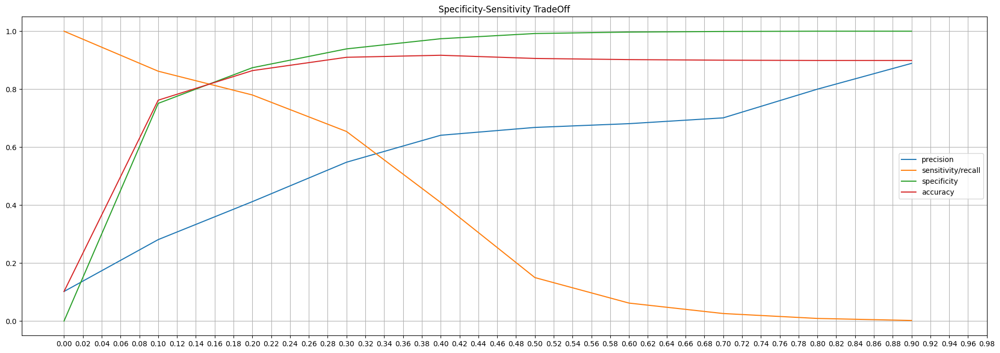
    


```python

```


```python
optimum_cutoff = 0.19
y_train_pred_lr_final = y_train_pred_lr.map(lambda x : 1 if x > optimum_cutoff else 0)
y_test_pred_lr_final = y_test_pred_lr.map(lambda x : 1 if x > optimum_cutoff else 0)

train_matrix = confusion_matrix(y_train, y_train_pred_lr_final)
print('Confusion Matrix for train:\n', train_matrix)
test_matrix = confusion_matrix(y_test, y_test_pred_lr_final)
print('\nConfusion Matrix for test: \n', test_matrix)
```

    Confusion Matrix for train:
     [[38107  5915]
     [ 1054  3923]]
    
    Confusion Matrix for test: 
     [[16313  2532]
     [  419  1736]]
    


```python
AppendToModelPerfDF(train_matrix,f"Logistic Regr RFE Train (Optimal:{str(optimum_cutoff)} Thres)")
AppendToModelPerfDF(test_matrix,f"Logistic Regr RFE Test (Optimal:{str(optimum_cutoff)} Thres)")
```

    Logistic Regr RFE Train (Optimal:0.19 Thres) : 
    
    Accuracy : 0.858
    Sensitivity / True Positive Rate / Recall : 0.788
    Specificity / True Negative Rate :  0.866
    Precision / Positive Predictive Value : 0.399
    F1-score : 0.53
    Logistic Regr RFE Test (Optimal:0.19 Thres) : 
    
    Accuracy : 0.859
    Sensitivity / True Positive Rate / Recall : 0.806
    Specificity / True Negative Rate :  0.866
    Precision / Positive Predictive Value : 0.407
    F1-score : 0.541
    


```python
PlotMetricsComparission()
```

    ----------------------------------------------------------------------------------------------------- 
     Note: If you dont see the table 'Metrics by Model (sorted by accuracy)' below,
     please ensure the Jupyter Notebook is marked Trusted (File --> Trusted Notebook) 
    -----------------------------------------------------------------------------------------------------
    


#### Metrics by Model (sorted by accuracy) 


---


| model                                        |   accuracy |   sensitivity/recall |   specificity |   precision |   f1-score |
|:---------------------------------------------|-----------:|---------------------:|--------------:|------------:|-----------:|
| Logistic Regr RFE Test (Optimal:0.19 Thres)  |      0.859 |                0.806 |         0.866 |       0.407 |      0.541 |
| Logistic Regr RFE Train (Optimal:0.19 Thres) |      0.858 |                0.788 |         0.866 |       0.399 |      0.53  |
| Logistic Regr Train (Optimal:0.53 Thres)     |      0.817 |                0.837 |         0.814 |       0.338 |      0.482 |
| Logistic Regr Test (Optimal:0.53 Thres)      |      0.815 |                0.846 |         0.811 |       0.339 |      0.484 |
| Logistic Regr Train (0.5 Thres)              |      0.797 |                0.85  |         0.791 |       0.315 |      0.46  |
| Logistic Regr Test (0.5 Thres)               |      0.795 |                0.862 |         0.788 |       0.317 |      0.464 |


```python
type(logr5_fit.summary().tables[1])
val = logr5_fit.summary().tables[1]
valdf = pd.DataFrame(val.data)
valdf.columns = valdf.iloc[0]
valdf.rename(columns= {'' : "columns", "coef": "rfe_coef" }, inplace = True)
valdf = valdf[2:]

valdf["rfe_coef"] = pd.to_numeric(valdf["rfe_coef"])
valdf.head(len(valdf))


```


<div>
<style scoped>
    .dataframe tbody tr th:only-of-type {
        vertical-align: middle;
    }

    .dataframe tbody tr th {
        vertical-align: top;
    }

    .dataframe thead th {
        text-align: right;
    }
</style>
<table border="1" class="dataframe">
  <thead>
    <tr style="text-align: right;">
      <th></th>
      <th>columns</th>
      <th>rfe_coef</th>
      <th>std err</th>
      <th>z</th>
      <th>P&gt;|z|</th>
      <th>[0.025</th>
      <th>0.975]</th>
    </tr>
  </thead>
  <tbody>
    <tr>
      <th>2</th>
      <td>monthly_2g_7_1</td>
      <td>1.1920</td>
      <td>0.483</td>
      <td>2.468</td>
      <td>0.014</td>
      <td>0.245</td>
      <td>2.139</td>
    </tr>
    <tr>
      <th>3</th>
      <td>loc_ic_t2m_mou_8</td>
      <td>-1.7135</td>
      <td>0.090</td>
      <td>-19.128</td>
      <td>0.000</td>
      <td>-1.889</td>
      <td>-1.538</td>
    </tr>
    <tr>
      <th>4</th>
      <td>loc_ic_t2f_mou_8</td>
      <td>-0.5702</td>
      <td>0.073</td>
      <td>-7.777</td>
      <td>0.000</td>
      <td>-0.714</td>
      <td>-0.427</td>
    </tr>
    <tr>
      <th>5</th>
      <td>monthly_2g_7_0</td>
      <td>1.7619</td>
      <td>0.475</td>
      <td>3.709</td>
      <td>0.000</td>
      <td>0.831</td>
      <td>2.693</td>
    </tr>
    <tr>
      <th>6</th>
      <td>std_og_t2t_mou_8</td>
      <td>-0.2925</td>
      <td>0.029</td>
      <td>-10.254</td>
      <td>0.000</td>
      <td>-0.348</td>
      <td>-0.237</td>
    </tr>
    <tr>
      <th>7</th>
      <td>spl_ic_mou_8</td>
      <td>-0.9522</td>
      <td>0.061</td>
      <td>-15.533</td>
      <td>0.000</td>
      <td>-1.072</td>
      <td>-0.832</td>
    </tr>
    <tr>
      <th>8</th>
      <td>total_rech_data_8</td>
      <td>-0.6211</td>
      <td>0.042</td>
      <td>-14.961</td>
      <td>0.000</td>
      <td>-0.702</td>
      <td>-0.540</td>
    </tr>
    <tr>
      <th>9</th>
      <td>aon_months</td>
      <td>-0.3149</td>
      <td>0.022</td>
      <td>-14.016</td>
      <td>0.000</td>
      <td>-0.359</td>
      <td>-0.271</td>
    </tr>
    <tr>
      <th>10</th>
      <td>loc_og_t2m_mou_8</td>
      <td>-0.7237</td>
      <td>0.079</td>
      <td>-9.105</td>
      <td>0.000</td>
      <td>-0.879</td>
      <td>-0.568</td>
    </tr>
    <tr>
      <th>11</th>
      <td>monthly_2g_8_1</td>
      <td>-0.8239</td>
      <td>0.142</td>
      <td>-5.791</td>
      <td>0.000</td>
      <td>-1.103</td>
      <td>-0.545</td>
    </tr>
    <tr>
      <th>12</th>
      <td>delta_total_rech_amt</td>
      <td>-0.4799</td>
      <td>0.019</td>
      <td>-25.254</td>
      <td>0.000</td>
      <td>-0.517</td>
      <td>-0.443</td>
    </tr>
    <tr>
      <th>13</th>
      <td>loc_ic_t2t_mou_8</td>
      <td>-1.0143</td>
      <td>0.077</td>
      <td>-13.191</td>
      <td>0.000</td>
      <td>-1.165</td>
      <td>-0.864</td>
    </tr>
    <tr>
      <th>14</th>
      <td>offnet_mou_8</td>
      <td>-0.2220</td>
      <td>0.033</td>
      <td>-6.818</td>
      <td>0.000</td>
      <td>-0.286</td>
      <td>-0.158</td>
    </tr>
  </tbody>
</table>
</div>


```python
coeffient_df = pd.merge(coeffient_df, valdf, how="left", on=["columns"])
coeffient_df.drop(columns=coeffient_df.columns[-5:], axis=1,  inplace=True)
PlotAsTable(coeffient_df.sort_values(by='rfe_coef', ascending = False, key=abs), "Important predictors of Churn: BaseLine & RFE Coefficients (Sorted by RFE Coeff)")
```

    ----------------------------------------------------------------------------------------------------- 
     Note: If you dont see the table 'Important predictors of Churn: BaseLine & RFE Coefficients (Sorted by RFE Coeff)' below,
     please ensure the Jupyter Notebook is marked Trusted (File --> Trusted Notebook) 
    -----------------------------------------------------------------------------------------------------
    


#### Important predictors of Churn: BaseLine & RFE Coefficients (Sorted by RFE Coeff) 


---


| columns               |   baseline_coefficients |   rfe_coef |
|:----------------------|------------------------:|-----------:|
| monthly_2g_7_0        |             0.034233    |     1.7619 |
| loc_ic_t2m_mou_8      |            -0.241128    |    -1.7135 |
| monthly_2g_7_1        |            -0.0265288   |     1.192  |
| loc_ic_t2t_mou_8      |            -0.178816    |    -1.0143 |
| spl_ic_mou_8          |            -0.326426    |    -0.9522 |
| monthly_2g_8_1        |            -0.038206    |    -0.8239 |
| loc_og_t2m_mou_8      |            -0.138874    |    -0.7237 |
| total_rech_data_8     |            -0.0870278   |    -0.6211 |
| loc_ic_t2f_mou_8      |            -0.160829    |    -0.5702 |
| delta_total_rech_amt  |            -0.0286255   |    -0.4799 |
| aon_months            |            -0.327769    |    -0.3149 |
| std_og_t2t_mou_8      |            -0.0256217   |    -0.2925 |
| offnet_mou_8          |            -0.0346231   |    -0.222  |
| onnet_mou_6           |             0.0218306   |   nan      |
| onnet_mou_7           |             0.0197463   |   nan      |
| onnet_mou_8           |            -0.026879    |   nan      |
| offnet_mou_6          |             0.0173414   |   nan      |
| offnet_mou_7          |             0.0434486   |   nan      |
| roam_ic_mou_6         |            -0.00998974  |   nan      |
| roam_ic_mou_7         |             0.0354719   |   nan      |
| roam_ic_mou_8         |             0.134955    |   nan      |
| roam_og_mou_6         |             0.0434897   |   nan      |
| roam_og_mou_7         |             0.0609883   |   nan      |
| roam_og_mou_8         |             0.26992     |   nan      |
| loc_og_t2t_mou_6      |             0.00306849  |   nan      |
| loc_og_t2t_mou_7      |            -0.00193069  |   nan      |
| loc_og_t2t_mou_8      |            -0.0955863   |   nan      |
| loc_og_t2m_mou_6      |            -0.00689465  |   nan      |
| loc_og_t2m_mou_7      |            -0.0243136   |   nan      |
| loc_og_t2f_mou_6      |             0.00378966  |   nan      |
| loc_og_t2f_mou_7      |            -0.00342478  |   nan      |
| loc_og_t2f_mou_8      |            -0.033029    |   nan      |
| loc_og_t2c_mou_6      |            -0.0173621   |   nan      |
| loc_og_t2c_mou_7      |             0.0258183   |   nan      |
| loc_og_t2c_mou_8      |            -0.00018902  |   nan      |
| loc_og_mou_6          |             0.00470407  |   nan      |
| loc_og_mou_7          |            -0.015293    |   nan      |
| loc_og_mou_8          |            -0.129051    |   nan      |
| std_og_t2t_mou_6      |             0.014739    |   nan      |
| std_og_t2t_mou_7      |             0.0145025   |   nan      |
| std_og_t2m_mou_6      |             0.0119727   |   nan      |
| std_og_t2m_mou_7      |             0.0516418   |   nan      |
| std_og_t2m_mou_8      |             0.00799745  |   nan      |
| std_og_t2f_mou_6      |            -0.0264478   |   nan      |
| std_og_t2f_mou_7      |            -4.87198e-05 |   nan      |
| std_og_t2f_mou_8      |            -0.0674591   |   nan      |
| std_og_mou_6          |             0.0155207   |   nan      |
| std_og_mou_7          |             0.0485413   |   nan      |
| std_og_mou_8          |             0.000997923 |   nan      |
| isd_og_mou_6          |             0.0861188   |   nan      |
| isd_og_mou_7          |             0.0994905   |   nan      |
| isd_og_mou_8          |             0.132096    |   nan      |
| spl_og_mou_6          |            -0.0109916   |   nan      |
| spl_og_mou_7          |             0.0144105   |   nan      |
| spl_og_mou_8          |            -0.0582962   |   nan      |
| og_others_6           |             0.0300942   |   nan      |
| og_others_7           |             0           |   nan      |
| og_others_8           |             0           |   nan      |
| loc_ic_t2t_mou_6      |             0.000493854 |   nan      |
| loc_ic_t2t_mou_7      |            -0.0276505   |   nan      |
| loc_ic_t2m_mou_6      |            -0.0389376   |   nan      |
| loc_ic_t2m_mou_7      |            -0.0908159   |   nan      |
| loc_ic_t2f_mou_6      |            -0.0405536   |   nan      |
| loc_ic_t2f_mou_7      |            -0.046918    |   nan      |
| loc_ic_mou_6          |            -0.0150031   |   nan      |
| loc_ic_mou_7          |            -0.0602747   |   nan      |
| loc_ic_mou_8          |            -0.239868    |   nan      |
| std_ic_t2t_mou_6      |             0.0181748   |   nan      |
| std_ic_t2t_mou_7      |             0.023522    |   nan      |
| std_ic_t2t_mou_8      |            -0.0561639   |   nan      |
| std_ic_t2m_mou_6      |            -0.0094561   |   nan      |
| std_ic_t2m_mou_7      |            -0.0313858   |   nan      |
| std_ic_t2m_mou_8      |            -0.0930518   |   nan      |
| std_ic_t2f_mou_6      |            -0.0275193   |   nan      |
| std_ic_t2f_mou_7      |            -0.0367835   |   nan      |
| std_ic_t2f_mou_8      |            -0.119395    |   nan      |
| std_ic_mou_6          |            -0.00648548  |   nan      |
| std_ic_mou_7          |            -0.0171305   |   nan      |
| std_ic_mou_8          |            -0.0991107   |   nan      |
| spl_ic_mou_6          |            -0.0869539   |   nan      |
| spl_ic_mou_7          |            -0.131111    |   nan      |
| isd_ic_mou_6          |             0.0583407   |   nan      |
| isd_ic_mou_7          |             0.0316455   |   nan      |
| isd_ic_mou_8          |             0.0182411   |   nan      |
| ic_others_6           |            -0.00481901  |   nan      |
| ic_others_7           |            -0.0253111   |   nan      |
| ic_others_8           |            -0.0725407   |   nan      |
| total_rech_num_6      |            -0.00386013  |   nan      |
| total_rech_num_7      |             0.009466    |   nan      |
| total_rech_num_8      |            -0.0948075   |   nan      |
| max_rech_amt_6        |            -0.00020097  |   nan      |
| max_rech_amt_7        |            -0.00108298  |   nan      |
| max_rech_amt_8        |            -0.00225404  |   nan      |
| last_day_rch_amt_6    |            -0.000852651 |   nan      |
| last_day_rch_amt_7    |            -0.00130614  |   nan      |
| last_day_rch_amt_8    |            -0.00441374  |   nan      |
| total_rech_data_6     |             0.0135395   |   nan      |
| total_rech_data_7     |            -0.0136287   |   nan      |
| av_rech_amt_data_6    |             0.0333936   |   nan      |
| av_rech_amt_data_7    |             0.021491    |   nan      |
| av_rech_amt_data_8    |            -0.0498101   |   nan      |
| total_rech_amt_data_6 |             0.0187046   |   nan      |
| total_rech_amt_data_7 |             0.0211671   |   nan      |
| total_rech_amt_data_8 |            -0.0333216   |   nan      |
| delta_vol_2g          |            -0.071264    |   nan      |
| delta_vol_3g          |            -0.0614914   |   nan      |
| delta_total_og_mou    |            -0.116189    |   nan      |
| delta_total_ic_mou    |            -0.327664    |   nan      |
| delta_vbc_3g          |            -0.103887    |   nan      |
| delta_arpu            |            -0.0726869   |   nan      |
| sachet_3g_6_0         |             0.00255828  |   nan      |
| sachet_3g_6_1         |            -0.00557579  |   nan      |
| sachet_2g_8_0         |             0.0368269   |   nan      |
| sachet_2g_8_1         |            -0.00760673  |   nan      |
| sachet_2g_8_2         |            -0.00845652  |   nan      |
| sachet_2g_8_3         |            -0.00631022  |   nan      |
| sachet_2g_8_4         |            -0.00218944  |   nan      |
| monthly_2g_6_0        |             0.0256083   |   nan      |
| monthly_2g_6_1        |            -0.0212618   |   nan      |
| monthly_2g_8_0        |             0.0414274   |   nan      |
| sachet_2g_6_0         |             0.0106756   |   nan      |
| sachet_2g_6_1         |            -0.0092175   |   nan      |
| sachet_2g_6_2         |            -0.00275553  |   nan      |
| sachet_2g_6_3         |            -0.000604907 |   nan      |
| monthly_3g_7_0        |            -0.0269576   |   nan      |
| monthly_3g_7_1        |             0.0214911   |   nan      |
| monthly_3g_7_2        |             0.00746073  |   nan      |
| sachet_3g_8_0         |             0.0106738   |   nan      |
| sachet_3g_8_1         |            -0.00643921  |   nan      |
| sachet_2g_7_0         |             0.0221848   |   nan      |
| sachet_2g_7_1         |            -0.0123963   |   nan      |
| sachet_2g_7_2         |            -0.00294313  |   nan      |
| sachet_2g_7_3         |             0.000589667 |   nan      |
| sachet_2g_7_4         |            -0.00371052  |   nan      |
| monthly_3g_8_0        |            -0.0132515   |   nan      |
| monthly_3g_8_1        |             0.00906512  |   nan      |
| monthly_3g_8_2        |             0.0049996   |   nan      |
| sachet_3g_7_0         |            -0.00374116  |   nan      |
| sachet_3g_7_1         |             0.00306774  |   nan      |
| monthly_3g_6_0        |            -0.0259671   |   nan      |
| monthly_3g_6_1        |             0.0225538   |   nan      |


### PCA


```python
pca = PCA(random_state = 42)
pca.fit(X_train)
pca.components_
```


    array([[ 1.00437883e-03,  1.14422393e-03,  1.14824869e-03, ...,
             3.50929273e-04, -3.14626085e-04,  2.76577257e-04],
           [ 1.06420343e-03,  1.32184433e-04, -1.09073273e-03, ...,
             2.95725056e-04, -4.50004070e-05,  4.30949588e-05],
           [-7.99189378e-05,  9.27217192e-04,  5.36918894e-04, ...,
            -1.58240252e-04, -3.17126815e-04,  2.76680250e-04],
           ...,
           [-8.67143445e-05,  5.61315293e-04, -7.82393253e-04, ...,
             2.35412120e-02, -1.52928659e-01, -8.42646738e-02],
           [-0.00000000e+00, -8.27094485e-16,  1.09755187e-15, ...,
            -2.63026552e-16,  2.26483875e-16,  6.01925167e-17],
           [ 0.00000000e+00,  2.76536144e-16,  1.82550678e-16, ...,
            -6.76754267e-17,  9.95267837e-17, -6.41768102e-17]])


```python
pca.explained_variance_ratio_
```


    array([5.61761442e-01, 1.42716583e-01, 1.29311366e-01, 6.86965952e-02,
           4.94133244e-02, 4.34914560e-02, 2.04828166e-03, 4.54334087e-04,
           2.26230894e-04, 2.01765639e-04, 1.59856077e-04, 1.15456793e-04,
           8.52193517e-05, 7.28107072e-05, 7.08258069e-05, 6.28824571e-05,
           6.03474318e-05, 5.59696033e-05, 5.49110163e-05, 4.74050609e-05,
           4.59038168e-05, 4.09884168e-05, 3.87767544e-05, 3.70356766e-05,
           3.20303146e-05, 3.04129518e-05, 2.87079232e-05, 2.78125952e-05,
           2.55554498e-05, 2.52398996e-05, 2.42494707e-05, 2.39135896e-05,
           2.26698539e-05, 2.06533222e-05, 1.96343046e-05, 1.86375061e-05,
           1.84329369e-05, 1.75119246e-05, 1.70607817e-05, 1.66017570e-05,
           1.64002344e-05, 1.52864944e-05, 1.51240658e-05, 1.42132740e-05,
           1.34937193e-05, 1.34171650e-05, 1.26126514e-05, 1.19039037e-05,
           1.18073089e-05, 1.15712952e-05, 1.09706379e-05, 9.55073321e-06,
           9.14672824e-06, 9.03747088e-06, 8.90980978e-06, 8.67591803e-06,
           7.59453973e-06, 7.38471641e-06, 7.31797992e-06, 7.22025305e-06,
           6.93426502e-06, 6.77553066e-06, 6.69069023e-06, 6.27746337e-06,
           6.19615313e-06, 6.12832658e-06, 5.89052021e-06, 5.30737103e-06,
           5.19637983e-06, 5.05512822e-06, 4.85669067e-06, 4.72368962e-06,
           4.62773855e-06, 4.32902476e-06, 4.21330146e-06, 4.00434161e-06,
           3.42622147e-06, 3.30734176e-06, 3.20103522e-06, 2.94428527e-06,
           2.93302184e-06, 2.59428572e-06, 2.47210294e-06, 2.14273432e-06,
           2.04771573e-06, 1.93702787e-06, 1.79866712e-06, 1.54132515e-06,
           1.45823709e-06, 1.40163258e-06, 1.34819252e-06, 1.32825617e-06,
           1.24477595e-06, 1.07912818e-06, 9.89103908e-07, 9.01827502e-07,
           8.61779520e-07, 8.08496229e-07, 7.86852772e-07, 7.73999638e-07,
           6.20386341e-07, 5.86265060e-07, 5.53908804e-07, 5.47955216e-07,
           4.79750260e-07, 4.57722728e-07, 4.31277728e-07, 4.21051047e-07,
           3.71381448e-07, 3.29995113e-07, 3.28517893e-07, 3.21561436e-07,
           2.94515624e-07, 2.78426340e-07, 2.67228145e-07, 2.44124924e-07,
           2.27590603e-07, 2.19393639e-07, 2.06888838e-07, 2.05169823e-07,
           1.71370513e-07, 1.62491346e-07, 1.59153213e-07, 1.48114982e-07,
           1.41725188e-07, 1.22533734e-07, 9.46516089e-08, 8.45475803e-08,
           7.53550710e-08, 7.23249706e-08, 6.36767447e-08, 6.13896711e-08,
           4.60094811e-08, 4.45821567e-08, 2.82162063e-08, 2.25988981e-08,
           1.76363957e-08, 1.47214497e-08, 1.00040620e-08, 5.05582192e-33,
           5.05582192e-33])


**Scree Plot**


```python

def Plot_ScreePlot(evr):
  var_cumu = np.cumsum(evr)
  fig = plt.figure(figsize=[12,8])
  plt.vlines(x=5, ymax=1, ymin=0, colors="r", linestyles="--")
  plt.hlines(y=0.1, xmax=140, xmin=0, colors="g", linestyles="--")
  plt.vlines(x=4, ymax=1, ymin=0, colors="r", linestyles="--")
  plt.hlines(y=0.95, xmax=140, xmin=0, colors="g", linestyles="--")
  plt.plot(var_cumu)
  plt.ylabel("Cumulative variance explained")
  plt.show()


Plot_ScreePlot(pca.explained_variance_ratio_)
```


    
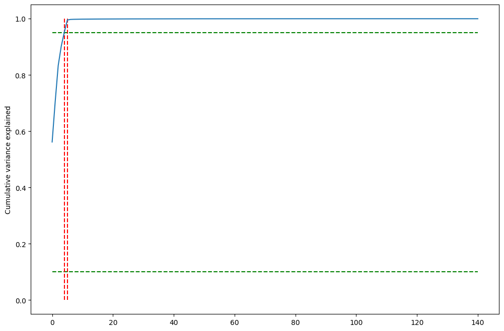
    


From the above scree plot, it is clear that 95% of variance in the train set can be explained by first 4 principal components and 99% of variance is explained by the first 5 principal components. by trial and error we have found  31 components provde the highest acucracy.


```python
# Perform PCA using the first 45 components
comp_count = 31
pca_final = PCA(n_components=comp_count, random_state=42)
transformed_pca_df = pca_final.fit_transform(X_train)
print(transformed_pca_df.shape)
corrmat = np.corrcoef(transformed_pca_df.transpose())
plt.figure(figsize=[45,20])
sns.heatmap(corrmat, annot=True)
```

    (48999, 31)
    


    <Axes: >


    

    


```python
X_train_pca = pd.DataFrame(transformed_pca_df, columns=["PC_"+str(x) for x in range(1,comp_count + 1)], index = X_train.index)
telecom_train_pca = pd.concat([X_train_pca, y_train], axis=1)

telecom_train_pca.head()
## Plotting principal components
sns.pairplot(data=telecom_train_pca, x_vars=["PC_1"], y_vars=["PC_2"], hue = "churn_probability", size=8);
```


    
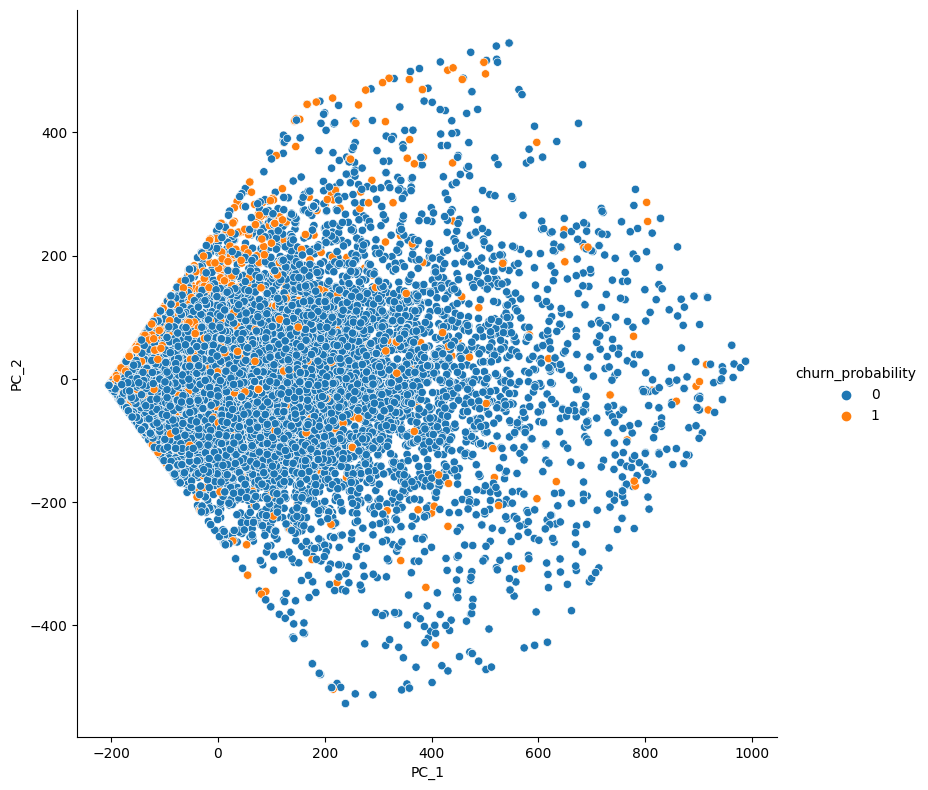
    


```python
def ApplyPCATransformation(df):
  return pca_final.transform(df)
```

### Model 2 : PCA + Logistic Regression Model


```python
# Transforming test set with pca ( 45 components)
X_test_pca = ApplyPCATransformation(X_test)
```


```python
# Logistic Regression
lr_pca = LogisticRegression(random_state=100, class_weight='balanced')
lr_pca.fit(X_train_pca, y_train)
```


    LogisticRegression(class_weight='balanced', random_state=100)


```python
# y_train predictions
y_train_pred_lr_pca = lr_pca.predict(X_train_pca)
y_train_pred_lr_pca[:5]
```


    array([0, 0, 0, 1, 0])


```python
# Test Prediction
y_test_pred_lr_pca = lr_pca.predict(X_test_pca)
y_test_pred_lr_pca[:5]
```


    array([1, 0, 0, 0, 0])


```python
train_matrix = confusion_matrix(y_train, y_train_pred_lr_pca)
print('Confusion Matrix for train:\n', train_matrix)
test_matrix = confusion_matrix(y_test, y_test_pred_lr_pca)
print('\nConfusion Matrix for test: \n', test_matrix)
```

    Confusion Matrix for train:
     [[34478  9544]
     [  786  4191]]
    
    Confusion Matrix for test: 
     [[14719  4126]
     [  320  1835]]
    


```python
AppendToModelPerfDF(train_matrix,f"Logistic Regr PCA Train Baseline)")
AppendToModelPerfDF(test_matrix,f"Logistic Regr PCA Test Baseline")
```

    Logistic Regr PCA Train Baseline) : 
    
    Accuracy : 0.789
    Sensitivity / True Positive Rate / Recall : 0.842
    Specificity / True Negative Rate :  0.783
    Precision / Positive Predictive Value : 0.305
    F1-score : 0.448
    Logistic Regr PCA Test Baseline : 
    
    Accuracy : 0.788
    Sensitivity / True Positive Rate / Recall : 0.852
    Specificity / True Negative Rate :  0.781
    Precision / Positive Predictive Value : 0.308
    F1-score : 0.452
    

#### Hyperparameter tuning using GRIDSEARCH


```python
param_grid = {
    'C': [0,1,2,3,4,5,10,50,100],  # Regularization strength
    'solver': ['lbfgs', 'liblinear', 'sag', 'saga'],  # Solver options
    'penalty' : ['l1','l2','none']
}

# Create the GridSearchCV object
grid_search = GridSearchCV(lr_pca, param_grid, scoring='accuracy', cv=20, verbose=True, n_jobs=-1)

# Fit the GridSearchCV to your data
grid_search.fit(X_train_pca, y_train)

# Get the best hyperparameters and best accuracy
best_params = grid_search.best_params_
best_accuracy = grid_search.best_score_

print("Best Hyperparameters:", best_params)
print("Best Accuracy:", best_accuracy)


```

    Fitting 20 folds for each of 108 candidates, totalling 2160 fits
    Best Hyperparameters: {'C': 50, 'penalty': 'l2', 'solver': 'liblinear'}
    Best Accuracy: 0.7879138757177023
    


```python
y_train_pred_lr_pca_grid = grid_search.best_estimator_.predict(X_train_pca)
y_test_pred_lr_pca_grid = grid_search.best_estimator_.predict(X_test_pca)

train_matrix = confusion_matrix(y_train, y_train_pred_lr_pca_grid)
print('Confusion Matrix for train:\n', train_matrix)
test_matrix = confusion_matrix(y_test, y_test_pred_lr_pca_grid)
print('\nConfusion Matrix for test: \n', test_matrix)
```

    Confusion Matrix for train:
     [[34434  9588]
     [  780  4197]]
    
    Confusion Matrix for test: 
     [[14724  4121]
     [  321  1834]]
    


```python
AppendToModelPerfDF(train_matrix,f"Logistic Regr PCA GRIDSEARCH Train Baseline")
AppendToModelPerfDF(test_matrix,f"Logistic Regr PCA GRIDSEARCH Test Baseline")
```

    Logistic Regr PCA GRIDSEARCH Train Baseline : 
    
    Accuracy : 0.788
    Sensitivity / True Positive Rate / Recall : 0.843
    Specificity / True Negative Rate :  0.782
    Precision / Positive Predictive Value : 0.304
    F1-score : 0.447
    Logistic Regr PCA GRIDSEARCH Test Baseline : 
    
    Accuracy : 0.788
    Sensitivity / True Positive Rate / Recall : 0.851
    Specificity / True Negative Rate :  0.781
    Precision / Positive Predictive Value : 0.308
    F1-score : 0.452
    

### Model 3 : PCA + Random Forest


```python
# Ratio of classes
class_0 = y[y == 0].count()
class_1 = y[y == 1].count()

pca_rf = RandomForestClassifier(random_state=42, class_weight= {0 : class_1/(class_0 + class_1) , 1 : class_0/(class_0 + class_1) } , oob_score=True, n_jobs=-1,verbose=1)
pca_rf
```


    RandomForestClassifier(class_weight={0: 0.10188716981671167,
                                         1: 0.8981128301832884},
                           n_jobs=-1, oob_score=True, random_state=42, verbose=1)


```python
# Hyper parameter Tuning
params = {
    'n_estimators'  : [30,40,50,100],
    'max_depth' : [3,4,5,6,7],
    'min_samples_leaf' : [15,20,25,30]
}
folds = StratifiedKFold(n_splits=4, shuffle=True, random_state=42)
pca_rf_model_search = GridSearchCV(estimator=pca_rf, param_grid=params,
                                   cv=folds, scoring='roc_auc', verbose=True, n_jobs=-1 )

pca_rf_model_search.fit(X_train_pca, y_train)
```

    Fitting 4 folds for each of 80 candidates, totalling 320 fits
    

    [Parallel(n_jobs=-1)]: Using backend ThreadingBackend with 8 concurrent workers.
    [Parallel(n_jobs=-1)]: Done  34 tasks      | elapsed:    1.3s
    [Parallel(n_jobs=-1)]: Done 100 out of 100 | elapsed:    3.4s finished
    


    GridSearchCV(cv=StratifiedKFold(n_splits=4, random_state=42, shuffle=True),
                 estimator=RandomForestClassifier(class_weight={0: 0.10188716981671167,
                                                                1: 0.8981128301832884},
                                                  n_jobs=-1, oob_score=True,
                                                  random_state=42, verbose=1),
                 n_jobs=-1,
                 param_grid={'max_depth': [3, 4, 5, 6, 7],
                             'min_samples_leaf': [15, 20, 25, 30],
                             'n_estimators': [30, 40, 50, 100]},
                 scoring='roc_auc', verbose=True)


```python
# Optimum Hyperparametersprint('Best ROC-AUC score :', pca_rf_model_search.best_score_)
print('Best Parameters :', pca_rf_model_search.best_params_)
```

    Best Parameters : {'max_depth': 7, 'min_samples_leaf': 30, 'n_estimators': 100}
    


```python
# Modelling using the best PCA-RandomForest Estimator
pca_rf_best = pca_rf_model_search.best_estimator_
pca_rf_best_fit = pca_rf_best.fit(X_train_pca, y_train)

# Prediction on Train set
y_train_pred_pca_rf_best = pca_rf_best_fit.predict(X_train_pca)
```

    [Parallel(n_jobs=-1)]: Using backend ThreadingBackend with 8 concurrent workers.
    [Parallel(n_jobs=-1)]: Done  34 tasks      | elapsed:    1.3s
    [Parallel(n_jobs=-1)]: Done 100 out of 100 | elapsed:    3.4s finished
    [Parallel(n_jobs=8)]: Using backend ThreadingBackend with 8 concurrent workers.
    [Parallel(n_jobs=8)]: Done  34 tasks      | elapsed:    0.0s
    [Parallel(n_jobs=8)]: Done 100 out of 100 | elapsed:    0.0s finished
    


```python
# Prediction on test set
y_test_pred_pca_rf_best = pca_rf_best_fit.predict(X_test_pca)
```

    [Parallel(n_jobs=8)]: Using backend ThreadingBackend with 8 concurrent workers.
    [Parallel(n_jobs=8)]: Done  34 tasks      | elapsed:    0.0s
    [Parallel(n_jobs=8)]: Done 100 out of 100 | elapsed:    0.0s finished
    


```python
## PCA - RandomForest Model Performance - Hyper Parameter Tuned

train_matrix = confusion_matrix(y_train, y_train_pred_pca_rf_best)
test_matrix = confusion_matrix(y_test, y_test_pred_pca_rf_best)
```


```python
AppendToModelPerfDF(train_matrix,f"Randomforest PCA GRIDSEARCH Train Baseline")
AppendToModelPerfDF(test_matrix,f"Randomforest PCA GRIDSEARCH Test Baseline")
```

    Randomforest PCA GRIDSEARCH Train Baseline : 
    
    Accuracy : 0.864
    Sensitivity / True Positive Rate / Recall : 0.798
    Specificity / True Negative Rate :  0.872
    Precision / Positive Predictive Value : 0.413
    F1-score : 0.544
    Randomforest PCA GRIDSEARCH Test Baseline : 
    
    Accuracy : 0.857
    Sensitivity / True Positive Rate / Recall : 0.77
    Specificity / True Negative Rate :  0.867
    Precision / Positive Predictive Value : 0.398
    F1-score : 0.525
    


```python
PlotMetricsComparission()
```

    ----------------------------------------------------------------------------------------------------- 
     Note: If you dont see the table 'Metrics by Model (sorted by accuracy)' below,
     please ensure the Jupyter Notebook is marked Trusted (File --> Trusted Notebook) 
    -----------------------------------------------------------------------------------------------------
    


#### Metrics by Model (sorted by accuracy) 


---


| model                                        |   accuracy |   sensitivity/recall |   specificity |   precision |   f1-score |
|:---------------------------------------------|-----------:|---------------------:|--------------:|------------:|-----------:|
| Randomforest PCA GRIDSEARCH Train Baseline   |      0.864 |                0.798 |         0.872 |       0.413 |      0.544 |
| Logistic Regr RFE Test (Optimal:0.19 Thres)  |      0.859 |                0.806 |         0.866 |       0.407 |      0.541 |
| Logistic Regr RFE Train (Optimal:0.19 Thres) |      0.858 |                0.788 |         0.866 |       0.399 |      0.53  |
| Randomforest PCA GRIDSEARCH Test Baseline    |      0.857 |                0.77  |         0.867 |       0.398 |      0.525 |
| Logistic Regr Train (Optimal:0.53 Thres)     |      0.817 |                0.837 |         0.814 |       0.338 |      0.482 |
| Logistic Regr Test (Optimal:0.53 Thres)      |      0.815 |                0.846 |         0.811 |       0.339 |      0.484 |
| Logistic Regr Train (0.5 Thres)              |      0.797 |                0.85  |         0.791 |       0.315 |      0.46  |
| Logistic Regr Test (0.5 Thres)               |      0.795 |                0.862 |         0.788 |       0.317 |      0.464 |
| Logistic Regr PCA Train Baseline)            |      0.789 |                0.842 |         0.783 |       0.305 |      0.448 |
| Logistic Regr PCA Test Baseline              |      0.788 |                0.852 |         0.781 |       0.308 |      0.452 |
| Logistic Regr PCA GRIDSEARCH Train Baseline  |      0.788 |                0.843 |         0.782 |       0.304 |      0.447 |
| Logistic Regr PCA GRIDSEARCH Test Baseline   |      0.788 |                0.851 |         0.781 |       0.308 |      0.452 |


### Model 4 : PCA + XGBoost


```python
pca_xgb = xgb.XGBClassifier(random_state=42, scale_pos_weight= class_0/class_1 ,
                                    tree_method='hist',
                                   objective='binary:logistic',


                                  )  # scale_pos_weight takes care of class imbalance
pca_xgb.fit(X_train_pca, y_train)
```


    XGBClassifier(base_score=None, booster=None, callbacks=None,
                  colsample_bylevel=None, colsample_bynode=None,
                  colsample_bytree=None, early_stopping_rounds=None,
                  enable_categorical=False, eval_metric=None, feature_types=None,
                  gamma=None, gpu_id=None, grow_policy=None, importance_type=None,
                  interaction_constraints=None, learning_rate=None, max_bin=None,
                  max_cat_threshold=None, max_cat_to_onehot=None,
                  max_delta_step=None, max_depth=None, max_leaves=None,
                  min_child_weight=None, missing=nan, monotone_constraints=None,
                  n_estimators=100, n_jobs=None, num_parallel_tree=None,
                  predictor=None, random_state=42, ...)


```python
print('Baseline Train AUC Score')
print(roc_auc_score(y_train, pca_xgb.predict_proba(X_train_pca)[:, 1]))

print('Baseline Test AUC Score')
print(roc_auc_score(y_test, pca_xgb.predict_proba(X_test_pca)[:, 1]))

```

    Baseline Train AUC Score
    0.9927243051899077
    Baseline Test AUC Score
    0.895996661001121
    


```python
# A parameter grid for XGBoost
params = {
        'n_estimators' : [400, 500, 600], # no of trees
        'learning_rate' : [0.04, 0.05, 0.07, 0.06],  # et
        'gamma': [0.05, 0.1, 0.2],
        'max_depth': [ 11, 12, 14, 15]
        }

## Hyper parameter Tuning
parameters = {
              'learning_rate': [0.1, 0.2, 0.3],
              'gamma' : [10,20,50],
              'max_depth': [2,3,4]}
folds = 3

param_comb = 100

#pca_xgb_search = RandomizedSearchCV(pca_xgb, param_distributions=params, n_iter=param_comb, scoring='accuracy', n_jobs=-1, cv=3, verbose=3, random_state=42)
pca_xgb_search = GridSearchCV(estimator=pca_xgb , param_grid=params,scoring='roc_auc', cv=3, n_jobs=-1, verbose=1)
pca_xgb_search.fit(X_train_pca, y_train)
```

    Fitting 3 folds for each of 144 candidates, totalling 432 fits
    


    GridSearchCV(cv=3,
                 estimator=XGBClassifier(base_score=None, booster=None,
                                         callbacks=None, colsample_bylevel=None,
                                         colsample_bynode=None,
                                         colsample_bytree=None,
                                         early_stopping_rounds=None,
                                         enable_categorical=False, eval_metric=None,
                                         feature_types=None, gamma=None,
                                         gpu_id=None, grow_policy=None,
                                         importance_type=None,
                                         interaction_constraints=None,
                                         learning_rate=None,...
                                         max_delta_step=None, max_depth=None,
                                         max_leaves=None, min_child_weight=None,
                                         missing=nan, monotone_constraints=None,
                                         n_estimators=100, n_jobs=None,
                                         num_parallel_tree=None, predictor=None,
                                         random_state=42, ...),
                 n_jobs=-1,
                 param_grid={'gamma': [0.05, 0.1, 0.2],
                             'learning_rate': [0.04, 0.05, 0.07, 0.06],
                             'max_depth': [11, 12, 14, 15],
                             'n_estimators': [400, 500, 600]},
                 scoring='roc_auc', verbose=1)


```python
# Optimum Hyperparameters
print('Best ROC-AUC score :', pca_xgb_search.best_score_)
print('Best Parameters :', pca_xgb_search.best_params_)
```

    Best ROC-AUC score : 0.9046821389020542
    Best Parameters : {'gamma': 0.05, 'learning_rate': 0.05, 'max_depth': 12, 'n_estimators': 600}
    


```python

```


```python
# Modelling using the best PCA-XGBoost Estimator
pca_xgb_best_1 = pca_xgb_search.best_estimator_
pca_xgb_best_fit = pca_xgb_best_1.fit(X_train_pca, y_train)

# Prediction on Train set
y_train_pred_pca_xgb_best = pca_xgb_best_fit.predict(X_train_pca)
y_test_pred_pca_xgb_best = pca_xgb_best_fit.predict(X_test_pca)
```


```python
## PCA - XGBOOST [Hyper parameter tuned] Model Performance

train_matrix = confusion_matrix(y_train, y_train_pred_pca_xgb_best)
test_matrix = confusion_matrix(y_test, y_test_pred_pca_xgb_best)
```


```python
AppendToModelPerfDF(train_matrix,f"XGBoost PCA RandomSEARCH Train ")
AppendToModelPerfDF(test_matrix,f"XGBoost PCA RandomSEARCH Test ")
```

    XGBoost PCA RandomSEARCH Train  : 
    
    Accuracy : 1.0
    Sensitivity / True Positive Rate / Recall : 1.0
    Specificity / True Negative Rate :  1.0
    Precision / Positive Predictive Value : 1.0
    F1-score : 1.0
    XGBoost PCA RandomSEARCH Test  : 
    
    Accuracy : 0.922
    Sensitivity / True Positive Rate / Recall : 0.548
    Specificity / True Negative Rate :  0.965
    Precision / Positive Predictive Value : 0.642
    F1-score : 0.591
    


```python
PlotMetricsComparission()
```

    ----------------------------------------------------------------------------------------------------- 
     Note: If you dont see the table 'Metrics by Model (sorted by accuracy)' below,
     please ensure the Jupyter Notebook is marked Trusted (File --> Trusted Notebook) 
    -----------------------------------------------------------------------------------------------------
    


#### Metrics by Model (sorted by accuracy) 


---


| model                                        |   accuracy |   sensitivity/recall |   specificity |   precision |   f1-score |
|:---------------------------------------------|-----------:|---------------------:|--------------:|------------:|-----------:|
| XGBoost PCA RandomSEARCH Train               |      1     |                1     |         1     |       1     |      1     |
| XGBoost PCA RandomSEARCH Test                |      0.922 |                0.548 |         0.965 |       0.642 |      0.591 |
| Randomforest PCA GRIDSEARCH Train Baseline   |      0.864 |                0.798 |         0.872 |       0.413 |      0.544 |
| Logistic Regr RFE Test (Optimal:0.19 Thres)  |      0.859 |                0.806 |         0.866 |       0.407 |      0.541 |
| Logistic Regr RFE Train (Optimal:0.19 Thres) |      0.858 |                0.788 |         0.866 |       0.399 |      0.53  |
| Randomforest PCA GRIDSEARCH Test Baseline    |      0.857 |                0.77  |         0.867 |       0.398 |      0.525 |
| Logistic Regr Train (Optimal:0.53 Thres)     |      0.817 |                0.837 |         0.814 |       0.338 |      0.482 |
| Logistic Regr Test (Optimal:0.53 Thres)      |      0.815 |                0.846 |         0.811 |       0.339 |      0.484 |
| Logistic Regr Train (0.5 Thres)              |      0.797 |                0.85  |         0.791 |       0.315 |      0.46  |
| Logistic Regr Test (0.5 Thres)               |      0.795 |                0.862 |         0.788 |       0.317 |      0.464 |
| Logistic Regr PCA Train Baseline)            |      0.789 |                0.842 |         0.783 |       0.305 |      0.448 |
| Logistic Regr PCA Test Baseline              |      0.788 |                0.852 |         0.781 |       0.308 |      0.452 |
| Logistic Regr PCA GRIDSEARCH Train Baseline  |      0.788 |                0.843 |         0.782 |       0.304 |      0.447 |
| Logistic Regr PCA GRIDSEARCH Test Baseline   |      0.788 |                0.851 |         0.781 |       0.308 |      0.452 |


```python
print(pca_xgb_best_fit.scale_pos_weight)
```

    8.814778463264162
    


```python
print(pca_xgb.scale_pos_weight)
```

    8.814778463264162
    

### Preparing the Kaggle TEST data set


```python
# reading the dataset
telecom_test = pd.read_csv("test.csv")
```


```python
ShowSummary(telecom_test) 
```

    <class 'pandas.core.frame.DataFrame'>
    RangeIndex: 30000 entries, 0 to 29999
    Data columns (total 171 columns):
     #    Column                    Non-Null Count  Dtype  
    ---   ------                    --------------  -----  
     0    id                        30000 non-null  int64  
     1    circle_id                 30000 non-null  int64  
     2    loc_og_t2o_mou            29684 non-null  float64
     3    std_og_t2o_mou            29684 non-null  float64
     4    loc_ic_t2o_mou            29684 non-null  float64
     5    last_date_of_month_6      30000 non-null  object 
     6    last_date_of_month_7      29798 non-null  object 
     7    last_date_of_month_8      29633 non-null  object 
     8    arpu_6                    30000 non-null  float64
     9    arpu_7                    30000 non-null  float64
     10   arpu_8                    30000 non-null  float64
     11   onnet_mou_6               28831 non-null  float64
     12   onnet_mou_7               28828 non-null  float64
     13   onnet_mou_8               28325 non-null  float64
     14   offnet_mou_6              28831 non-null  float64
     15   offnet_mou_7              28828 non-null  float64
     16   offnet_mou_8              28325 non-null  float64
     17   roam_ic_mou_6             28831 non-null  float64
     18   roam_ic_mou_7             28828 non-null  float64
     19   roam_ic_mou_8             28325 non-null  float64
     20   roam_og_mou_6             28831 non-null  float64
     21   roam_og_mou_7             28828 non-null  float64
     22   roam_og_mou_8             28325 non-null  float64
     23   loc_og_t2t_mou_6          28831 non-null  float64
     24   loc_og_t2t_mou_7          28828 non-null  float64
     25   loc_og_t2t_mou_8          28325 non-null  float64
     26   loc_og_t2m_mou_6          28831 non-null  float64
     27   loc_og_t2m_mou_7          28828 non-null  float64
     28   loc_og_t2m_mou_8          28325 non-null  float64
     29   loc_og_t2f_mou_6          28831 non-null  float64
     30   loc_og_t2f_mou_7          28828 non-null  float64
     31   loc_og_t2f_mou_8          28325 non-null  float64
     32   loc_og_t2c_mou_6          28831 non-null  float64
     33   loc_og_t2c_mou_7          28828 non-null  float64
     34   loc_og_t2c_mou_8          28325 non-null  float64
     35   loc_og_mou_6              28831 non-null  float64
     36   loc_og_mou_7              28828 non-null  float64
     37   loc_og_mou_8              28325 non-null  float64
     38   std_og_t2t_mou_6          28831 non-null  float64
     39   std_og_t2t_mou_7          28828 non-null  float64
     40   std_og_t2t_mou_8          28325 non-null  float64
     41   std_og_t2m_mou_6          28831 non-null  float64
     42   std_og_t2m_mou_7          28828 non-null  float64
     43   std_og_t2m_mou_8          28325 non-null  float64
     44   std_og_t2f_mou_6          28831 non-null  float64
     45   std_og_t2f_mou_7          28828 non-null  float64
     46   std_og_t2f_mou_8          28325 non-null  float64
     47   std_og_t2c_mou_6          28831 non-null  float64
     48   std_og_t2c_mou_7          28828 non-null  float64
     49   std_og_t2c_mou_8          28325 non-null  float64
     50   std_og_mou_6              28831 non-null  float64
     51   std_og_mou_7              28828 non-null  float64
     52   std_og_mou_8              28325 non-null  float64
     53   isd_og_mou_6              28831 non-null  float64
     54   isd_og_mou_7              28828 non-null  float64
     55   isd_og_mou_8              28325 non-null  float64
     56   spl_og_mou_6              28831 non-null  float64
     57   spl_og_mou_7              28828 non-null  float64
     58   spl_og_mou_8              28325 non-null  float64
     59   og_others_6               28831 non-null  float64
     60   og_others_7               28828 non-null  float64
     61   og_others_8               28325 non-null  float64
     62   total_og_mou_6            30000 non-null  float64
     63   total_og_mou_7            30000 non-null  float64
     64   total_og_mou_8            30000 non-null  float64
     65   loc_ic_t2t_mou_6          28831 non-null  float64
     66   loc_ic_t2t_mou_7          28828 non-null  float64
     67   loc_ic_t2t_mou_8          28325 non-null  float64
     68   loc_ic_t2m_mou_6          28831 non-null  float64
     69   loc_ic_t2m_mou_7          28828 non-null  float64
     70   loc_ic_t2m_mou_8          28325 non-null  float64
     71   loc_ic_t2f_mou_6          28831 non-null  float64
     72   loc_ic_t2f_mou_7          28828 non-null  float64
     73   loc_ic_t2f_mou_8          28325 non-null  float64
     74   loc_ic_mou_6              28831 non-null  float64
     75   loc_ic_mou_7              28828 non-null  float64
     76   loc_ic_mou_8              28325 non-null  float64
     77   std_ic_t2t_mou_6          28831 non-null  float64
     78   std_ic_t2t_mou_7          28828 non-null  float64
     79   std_ic_t2t_mou_8          28325 non-null  float64
     80   std_ic_t2m_mou_6          28831 non-null  float64
     81   std_ic_t2m_mou_7          28828 non-null  float64
     82   std_ic_t2m_mou_8          28325 non-null  float64
     83   std_ic_t2f_mou_6          28831 non-null  float64
     84   std_ic_t2f_mou_7          28828 non-null  float64
     85   std_ic_t2f_mou_8          28325 non-null  float64
     86   std_ic_t2o_mou_6          28831 non-null  float64
     87   std_ic_t2o_mou_7          28828 non-null  float64
     88   std_ic_t2o_mou_8          28325 non-null  float64
     89   std_ic_mou_6              28831 non-null  float64
     90   std_ic_mou_7              28828 non-null  float64
     91   std_ic_mou_8              28325 non-null  float64
     92   total_ic_mou_6            30000 non-null  float64
     93   total_ic_mou_7            30000 non-null  float64
     94   total_ic_mou_8            30000 non-null  float64
     95   spl_ic_mou_6              28831 non-null  float64
     96   spl_ic_mou_7              28828 non-null  float64
     97   spl_ic_mou_8              28325 non-null  float64
     98   isd_ic_mou_6              28831 non-null  float64
     99   isd_ic_mou_7              28828 non-null  float64
     100  isd_ic_mou_8              28325 non-null  float64
     101  ic_others_6               28831 non-null  float64
     102  ic_others_7               28828 non-null  float64
     103  ic_others_8               28325 non-null  float64
     104  total_rech_num_6          30000 non-null  int64  
     105  total_rech_num_7          30000 non-null  int64  
     106  total_rech_num_8          30000 non-null  int64  
     107  total_rech_amt_6          30000 non-null  int64  
     108  total_rech_amt_7          30000 non-null  int64  
     109  total_rech_amt_8          30000 non-null  int64  
     110  max_rech_amt_6            30000 non-null  int64  
     111  max_rech_amt_7            30000 non-null  int64  
     112  max_rech_amt_8            30000 non-null  int64  
     113  date_of_last_rech_6       29494 non-null  object 
     114  date_of_last_rech_7       29467 non-null  object 
     115  date_of_last_rech_8       28839 non-null  object 
     116  last_day_rch_amt_6        30000 non-null  int64  
     117  last_day_rch_amt_7        30000 non-null  int64  
     118  last_day_rch_amt_8        30000 non-null  int64  
     119  date_of_last_rech_data_6  7585 non-null   object 
     120  date_of_last_rech_data_7  7706 non-null   object 
     121  date_of_last_rech_data_8  7922 non-null   object 
     122  total_rech_data_6         7585 non-null   float64
     123  total_rech_data_7         7706 non-null   float64
     124  total_rech_data_8         7922 non-null   float64
     125  max_rech_data_6           7585 non-null   float64
     126  max_rech_data_7           7706 non-null   float64
     127  max_rech_data_8           7922 non-null   float64
     128  count_rech_2g_6           7585 non-null   float64
     129  count_rech_2g_7           7706 non-null   float64
     130  count_rech_2g_8           7922 non-null   float64
     131  count_rech_3g_6           7585 non-null   float64
     132  count_rech_3g_7           7706 non-null   float64
     133  count_rech_3g_8           7922 non-null   float64
     134  av_rech_amt_data_6        7585 non-null   float64
     135  av_rech_amt_data_7        7706 non-null   float64
     136  av_rech_amt_data_8        7922 non-null   float64
     137  vol_2g_mb_6               30000 non-null  float64
     138  vol_2g_mb_7               30000 non-null  float64
     139  vol_2g_mb_8               30000 non-null  float64
     140  vol_3g_mb_6               30000 non-null  float64
     141  vol_3g_mb_7               30000 non-null  float64
     142  vol_3g_mb_8               30000 non-null  float64
     143  arpu_3g_6                 7585 non-null   float64
     144  arpu_3g_7                 7706 non-null   float64
     145  arpu_3g_8                 7922 non-null   float64
     146  arpu_2g_6                 7585 non-null   float64
     147  arpu_2g_7                 7706 non-null   float64
     148  arpu_2g_8                 7922 non-null   float64
     149  night_pck_user_6          7585 non-null   float64
     150  night_pck_user_7          7706 non-null   float64
     151  night_pck_user_8          7922 non-null   float64
     152  monthly_2g_6              30000 non-null  int64  
     153  monthly_2g_7              30000 non-null  int64  
     154  monthly_2g_8              30000 non-null  int64  
     155  sachet_2g_6               30000 non-null  int64  
     156  sachet_2g_7               30000 non-null  int64  
     157  sachet_2g_8               30000 non-null  int64  
     158  monthly_3g_6              30000 non-null  int64  
     159  monthly_3g_7              30000 non-null  int64  
     160  monthly_3g_8              30000 non-null  int64  
     161  sachet_3g_6               30000 non-null  int64  
     162  sachet_3g_7               30000 non-null  int64  
     163  sachet_3g_8               30000 non-null  int64  
     164  fb_user_6                 7585 non-null   float64
     165  fb_user_7                 7706 non-null   float64
     166  fb_user_8                 7922 non-null   float64
     167  aon                       30000 non-null  int64  
     168  aug_vbc_3g                30000 non-null  float64
     169  jul_vbc_3g                30000 non-null  float64
     170  jun_vbc_3g                30000 non-null  float64
    dtypes: float64(135), int64(27), object(9)
    memory usage: 39.1+ MB
    

### PreProcess kaggle dataset by applying required transformations for predictions


```python
ConvertDateTimeColumns(telecom_test)
ApplyMeaningfulName(telecom_test)
ShowSummary(telecom_test)

ReplaceRechargeColsForNoRecharge(telecom_test)
ShowSummary(telecom_test)

CreateTotalRechAmtDataCols(telecom_test)
telecom_test.describe()


DropHighMissingColumns(telecom_test)

DropUniqueValColumns(telecom_test)

ConverToCategorical(telecom_test,change_to_cat.drop("churn_probability"))

HandleOutliers(telecom, 0.9, 0.99)

ShowSummary(telecom_test)

ImputeMOUCols(telecom_test)

ImputeNumericColumns(telecom_test)

CalculateDeltaCols(telecom_test)
ConvertAONToMonths(telecom_test)

GroupAsOtherInCategorical(telecom_test)
ShowSummary(telecom_test)

telecom_test = CreateDummyVars(telecom_test)
DropDateCols(telecom_test)
ShowSummary(telecom_test)

telecom_test.dropna()


X_K_test = telecom_test.drop(["id", "sachet_2g_6_4"],axis=1)
X_K_test.index = telecom_test["id"]

# Transform test set
X_K_test[numerical_vars] = scaler.transform(X_K_test[numerical_vars])

# Transforming test set with pca 
X_K_test_pca = ApplyPCATransformation(X_K_test)
```

    <class 'pandas.core.frame.DataFrame'>
    RangeIndex: 30000 entries, 0 to 29999
    Data columns (total 171 columns):
     #    Column                    Non-Null Count  Dtype         
    ---   ------                    --------------  -----         
     0    id                        30000 non-null  int64         
     1    circle_id                 30000 non-null  int64         
     2    loc_og_t2o_mou            29684 non-null  float64       
     3    std_og_t2o_mou            29684 non-null  float64       
     4    loc_ic_t2o_mou            29684 non-null  float64       
     5    last_date_of_month_6      30000 non-null  datetime64[ns]
     6    last_date_of_month_7      29798 non-null  datetime64[ns]
     7    last_date_of_month_8      29633 non-null  datetime64[ns]
     8    arpu_6                    30000 non-null  float64       
     9    arpu_7                    30000 non-null  float64       
     10   arpu_8                    30000 non-null  float64       
     11   onnet_mou_6               28831 non-null  float64       
     12   onnet_mou_7               28828 non-null  float64       
     13   onnet_mou_8               28325 non-null  float64       
     14   offnet_mou_6              28831 non-null  float64       
     15   offnet_mou_7              28828 non-null  float64       
     16   offnet_mou_8              28325 non-null  float64       
     17   roam_ic_mou_6             28831 non-null  float64       
     18   roam_ic_mou_7             28828 non-null  float64       
     19   roam_ic_mou_8             28325 non-null  float64       
     20   roam_og_mou_6             28831 non-null  float64       
     21   roam_og_mou_7             28828 non-null  float64       
     22   roam_og_mou_8             28325 non-null  float64       
     23   loc_og_t2t_mou_6          28831 non-null  float64       
     24   loc_og_t2t_mou_7          28828 non-null  float64       
     25   loc_og_t2t_mou_8          28325 non-null  float64       
     26   loc_og_t2m_mou_6          28831 non-null  float64       
     27   loc_og_t2m_mou_7          28828 non-null  float64       
     28   loc_og_t2m_mou_8          28325 non-null  float64       
     29   loc_og_t2f_mou_6          28831 non-null  float64       
     30   loc_og_t2f_mou_7          28828 non-null  float64       
     31   loc_og_t2f_mou_8          28325 non-null  float64       
     32   loc_og_t2c_mou_6          28831 non-null  float64       
     33   loc_og_t2c_mou_7          28828 non-null  float64       
     34   loc_og_t2c_mou_8          28325 non-null  float64       
     35   loc_og_mou_6              28831 non-null  float64       
     36   loc_og_mou_7              28828 non-null  float64       
     37   loc_og_mou_8              28325 non-null  float64       
     38   std_og_t2t_mou_6          28831 non-null  float64       
     39   std_og_t2t_mou_7          28828 non-null  float64       
     40   std_og_t2t_mou_8          28325 non-null  float64       
     41   std_og_t2m_mou_6          28831 non-null  float64       
     42   std_og_t2m_mou_7          28828 non-null  float64       
     43   std_og_t2m_mou_8          28325 non-null  float64       
     44   std_og_t2f_mou_6          28831 non-null  float64       
     45   std_og_t2f_mou_7          28828 non-null  float64       
     46   std_og_t2f_mou_8          28325 non-null  float64       
     47   std_og_t2c_mou_6          28831 non-null  float64       
     48   std_og_t2c_mou_7          28828 non-null  float64       
     49   std_og_t2c_mou_8          28325 non-null  float64       
     50   std_og_mou_6              28831 non-null  float64       
     51   std_og_mou_7              28828 non-null  float64       
     52   std_og_mou_8              28325 non-null  float64       
     53   isd_og_mou_6              28831 non-null  float64       
     54   isd_og_mou_7              28828 non-null  float64       
     55   isd_og_mou_8              28325 non-null  float64       
     56   spl_og_mou_6              28831 non-null  float64       
     57   spl_og_mou_7              28828 non-null  float64       
     58   spl_og_mou_8              28325 non-null  float64       
     59   og_others_6               28831 non-null  float64       
     60   og_others_7               28828 non-null  float64       
     61   og_others_8               28325 non-null  float64       
     62   total_og_mou_6            30000 non-null  float64       
     63   total_og_mou_7            30000 non-null  float64       
     64   total_og_mou_8            30000 non-null  float64       
     65   loc_ic_t2t_mou_6          28831 non-null  float64       
     66   loc_ic_t2t_mou_7          28828 non-null  float64       
     67   loc_ic_t2t_mou_8          28325 non-null  float64       
     68   loc_ic_t2m_mou_6          28831 non-null  float64       
     69   loc_ic_t2m_mou_7          28828 non-null  float64       
     70   loc_ic_t2m_mou_8          28325 non-null  float64       
     71   loc_ic_t2f_mou_6          28831 non-null  float64       
     72   loc_ic_t2f_mou_7          28828 non-null  float64       
     73   loc_ic_t2f_mou_8          28325 non-null  float64       
     74   loc_ic_mou_6              28831 non-null  float64       
     75   loc_ic_mou_7              28828 non-null  float64       
     76   loc_ic_mou_8              28325 non-null  float64       
     77   std_ic_t2t_mou_6          28831 non-null  float64       
     78   std_ic_t2t_mou_7          28828 non-null  float64       
     79   std_ic_t2t_mou_8          28325 non-null  float64       
     80   std_ic_t2m_mou_6          28831 non-null  float64       
     81   std_ic_t2m_mou_7          28828 non-null  float64       
     82   std_ic_t2m_mou_8          28325 non-null  float64       
     83   std_ic_t2f_mou_6          28831 non-null  float64       
     84   std_ic_t2f_mou_7          28828 non-null  float64       
     85   std_ic_t2f_mou_8          28325 non-null  float64       
     86   std_ic_t2o_mou_6          28831 non-null  float64       
     87   std_ic_t2o_mou_7          28828 non-null  float64       
     88   std_ic_t2o_mou_8          28325 non-null  float64       
     89   std_ic_mou_6              28831 non-null  float64       
     90   std_ic_mou_7              28828 non-null  float64       
     91   std_ic_mou_8              28325 non-null  float64       
     92   total_ic_mou_6            30000 non-null  float64       
     93   total_ic_mou_7            30000 non-null  float64       
     94   total_ic_mou_8            30000 non-null  float64       
     95   spl_ic_mou_6              28831 non-null  float64       
     96   spl_ic_mou_7              28828 non-null  float64       
     97   spl_ic_mou_8              28325 non-null  float64       
     98   isd_ic_mou_6              28831 non-null  float64       
     99   isd_ic_mou_7              28828 non-null  float64       
     100  isd_ic_mou_8              28325 non-null  float64       
     101  ic_others_6               28831 non-null  float64       
     102  ic_others_7               28828 non-null  float64       
     103  ic_others_8               28325 non-null  float64       
     104  total_rech_num_6          30000 non-null  int64         
     105  total_rech_num_7          30000 non-null  int64         
     106  total_rech_num_8          30000 non-null  int64         
     107  total_rech_amt_6          30000 non-null  int64         
     108  total_rech_amt_7          30000 non-null  int64         
     109  total_rech_amt_8          30000 non-null  int64         
     110  max_rech_amt_6            30000 non-null  int64         
     111  max_rech_amt_7            30000 non-null  int64         
     112  max_rech_amt_8            30000 non-null  int64         
     113  date_of_last_rech_6       29494 non-null  datetime64[ns]
     114  date_of_last_rech_7       29467 non-null  datetime64[ns]
     115  date_of_last_rech_8       28839 non-null  datetime64[ns]
     116  last_day_rch_amt_6        30000 non-null  int64         
     117  last_day_rch_amt_7        30000 non-null  int64         
     118  last_day_rch_amt_8        30000 non-null  int64         
     119  date_of_last_rech_data_6  7585 non-null   datetime64[ns]
     120  date_of_last_rech_data_7  7706 non-null   datetime64[ns]
     121  date_of_last_rech_data_8  7922 non-null   datetime64[ns]
     122  total_rech_data_6         7585 non-null   float64       
     123  total_rech_data_7         7706 non-null   float64       
     124  total_rech_data_8         7922 non-null   float64       
     125  max_rech_data_6           7585 non-null   float64       
     126  max_rech_data_7           7706 non-null   float64       
     127  max_rech_data_8           7922 non-null   float64       
     128  count_rech_2g_6           7585 non-null   float64       
     129  count_rech_2g_7           7706 non-null   float64       
     130  count_rech_2g_8           7922 non-null   float64       
     131  count_rech_3g_6           7585 non-null   float64       
     132  count_rech_3g_7           7706 non-null   float64       
     133  count_rech_3g_8           7922 non-null   float64       
     134  av_rech_amt_data_6        7585 non-null   float64       
     135  av_rech_amt_data_7        7706 non-null   float64       
     136  av_rech_amt_data_8        7922 non-null   float64       
     137  vol_2g_mb_6               30000 non-null  float64       
     138  vol_2g_mb_7               30000 non-null  float64       
     139  vol_2g_mb_8               30000 non-null  float64       
     140  vol_3g_mb_6               30000 non-null  float64       
     141  vol_3g_mb_7               30000 non-null  float64       
     142  vol_3g_mb_8               30000 non-null  float64       
     143  arpu_3g_6                 7585 non-null   float64       
     144  arpu_3g_7                 7706 non-null   float64       
     145  arpu_3g_8                 7922 non-null   float64       
     146  arpu_2g_6                 7585 non-null   float64       
     147  arpu_2g_7                 7706 non-null   float64       
     148  arpu_2g_8                 7922 non-null   float64       
     149  night_pck_user_6          7585 non-null   float64       
     150  night_pck_user_7          7706 non-null   float64       
     151  night_pck_user_8          7922 non-null   float64       
     152  monthly_2g_6              30000 non-null  int64         
     153  monthly_2g_7              30000 non-null  int64         
     154  monthly_2g_8              30000 non-null  int64         
     155  sachet_2g_6               30000 non-null  int64         
     156  sachet_2g_7               30000 non-null  int64         
     157  sachet_2g_8               30000 non-null  int64         
     158  monthly_3g_6              30000 non-null  int64         
     159  monthly_3g_7              30000 non-null  int64         
     160  monthly_3g_8              30000 non-null  int64         
     161  sachet_3g_6               30000 non-null  int64         
     162  sachet_3g_7               30000 non-null  int64         
     163  sachet_3g_8               30000 non-null  int64         
     164  fb_user_6                 7585 non-null   float64       
     165  fb_user_7                 7706 non-null   float64       
     166  fb_user_8                 7922 non-null   float64       
     167  aon                       30000 non-null  int64         
     168  vbc_3g_8                  30000 non-null  float64       
     169  vbc_3g_7                  30000 non-null  float64       
     170  vbc_3g_6                  30000 non-null  float64       
    dtypes: datetime64[ns](9), float64(135), int64(27)
    memory usage: 39.1 MB
    <class 'pandas.core.frame.DataFrame'>
    RangeIndex: 30000 entries, 0 to 29999
    Data columns (total 171 columns):
     #    Column                    Non-Null Count  Dtype         
    ---   ------                    --------------  -----         
     0    id                        30000 non-null  int64         
     1    circle_id                 30000 non-null  int64         
     2    loc_og_t2o_mou            29684 non-null  float64       
     3    std_og_t2o_mou            29684 non-null  float64       
     4    loc_ic_t2o_mou            29684 non-null  float64       
     5    last_date_of_month_6      30000 non-null  datetime64[ns]
     6    last_date_of_month_7      29798 non-null  datetime64[ns]
     7    last_date_of_month_8      29633 non-null  datetime64[ns]
     8    arpu_6                    30000 non-null  float64       
     9    arpu_7                    30000 non-null  float64       
     10   arpu_8                    30000 non-null  float64       
     11   onnet_mou_6               28831 non-null  float64       
     12   onnet_mou_7               28828 non-null  float64       
     13   onnet_mou_8               28325 non-null  float64       
     14   offnet_mou_6              28831 non-null  float64       
     15   offnet_mou_7              28828 non-null  float64       
     16   offnet_mou_8              28325 non-null  float64       
     17   roam_ic_mou_6             28831 non-null  float64       
     18   roam_ic_mou_7             28828 non-null  float64       
     19   roam_ic_mou_8             28325 non-null  float64       
     20   roam_og_mou_6             28831 non-null  float64       
     21   roam_og_mou_7             28828 non-null  float64       
     22   roam_og_mou_8             28325 non-null  float64       
     23   loc_og_t2t_mou_6          28831 non-null  float64       
     24   loc_og_t2t_mou_7          28828 non-null  float64       
     25   loc_og_t2t_mou_8          28325 non-null  float64       
     26   loc_og_t2m_mou_6          28831 non-null  float64       
     27   loc_og_t2m_mou_7          28828 non-null  float64       
     28   loc_og_t2m_mou_8          28325 non-null  float64       
     29   loc_og_t2f_mou_6          28831 non-null  float64       
     30   loc_og_t2f_mou_7          28828 non-null  float64       
     31   loc_og_t2f_mou_8          28325 non-null  float64       
     32   loc_og_t2c_mou_6          28831 non-null  float64       
     33   loc_og_t2c_mou_7          28828 non-null  float64       
     34   loc_og_t2c_mou_8          28325 non-null  float64       
     35   loc_og_mou_6              28831 non-null  float64       
     36   loc_og_mou_7              28828 non-null  float64       
     37   loc_og_mou_8              28325 non-null  float64       
     38   std_og_t2t_mou_6          28831 non-null  float64       
     39   std_og_t2t_mou_7          28828 non-null  float64       
     40   std_og_t2t_mou_8          28325 non-null  float64       
     41   std_og_t2m_mou_6          28831 non-null  float64       
     42   std_og_t2m_mou_7          28828 non-null  float64       
     43   std_og_t2m_mou_8          28325 non-null  float64       
     44   std_og_t2f_mou_6          28831 non-null  float64       
     45   std_og_t2f_mou_7          28828 non-null  float64       
     46   std_og_t2f_mou_8          28325 non-null  float64       
     47   std_og_t2c_mou_6          28831 non-null  float64       
     48   std_og_t2c_mou_7          28828 non-null  float64       
     49   std_og_t2c_mou_8          28325 non-null  float64       
     50   std_og_mou_6              28831 non-null  float64       
     51   std_og_mou_7              28828 non-null  float64       
     52   std_og_mou_8              28325 non-null  float64       
     53   isd_og_mou_6              28831 non-null  float64       
     54   isd_og_mou_7              28828 non-null  float64       
     55   isd_og_mou_8              28325 non-null  float64       
     56   spl_og_mou_6              28831 non-null  float64       
     57   spl_og_mou_7              28828 non-null  float64       
     58   spl_og_mou_8              28325 non-null  float64       
     59   og_others_6               28831 non-null  float64       
     60   og_others_7               28828 non-null  float64       
     61   og_others_8               28325 non-null  float64       
     62   total_og_mou_6            30000 non-null  float64       
     63   total_og_mou_7            30000 non-null  float64       
     64   total_og_mou_8            30000 non-null  float64       
     65   loc_ic_t2t_mou_6          28831 non-null  float64       
     66   loc_ic_t2t_mou_7          28828 non-null  float64       
     67   loc_ic_t2t_mou_8          28325 non-null  float64       
     68   loc_ic_t2m_mou_6          28831 non-null  float64       
     69   loc_ic_t2m_mou_7          28828 non-null  float64       
     70   loc_ic_t2m_mou_8          28325 non-null  float64       
     71   loc_ic_t2f_mou_6          28831 non-null  float64       
     72   loc_ic_t2f_mou_7          28828 non-null  float64       
     73   loc_ic_t2f_mou_8          28325 non-null  float64       
     74   loc_ic_mou_6              28831 non-null  float64       
     75   loc_ic_mou_7              28828 non-null  float64       
     76   loc_ic_mou_8              28325 non-null  float64       
     77   std_ic_t2t_mou_6          28831 non-null  float64       
     78   std_ic_t2t_mou_7          28828 non-null  float64       
     79   std_ic_t2t_mou_8          28325 non-null  float64       
     80   std_ic_t2m_mou_6          28831 non-null  float64       
     81   std_ic_t2m_mou_7          28828 non-null  float64       
     82   std_ic_t2m_mou_8          28325 non-null  float64       
     83   std_ic_t2f_mou_6          28831 non-null  float64       
     84   std_ic_t2f_mou_7          28828 non-null  float64       
     85   std_ic_t2f_mou_8          28325 non-null  float64       
     86   std_ic_t2o_mou_6          28831 non-null  float64       
     87   std_ic_t2o_mou_7          28828 non-null  float64       
     88   std_ic_t2o_mou_8          28325 non-null  float64       
     89   std_ic_mou_6              28831 non-null  float64       
     90   std_ic_mou_7              28828 non-null  float64       
     91   std_ic_mou_8              28325 non-null  float64       
     92   total_ic_mou_6            30000 non-null  float64       
     93   total_ic_mou_7            30000 non-null  float64       
     94   total_ic_mou_8            30000 non-null  float64       
     95   spl_ic_mou_6              28831 non-null  float64       
     96   spl_ic_mou_7              28828 non-null  float64       
     97   spl_ic_mou_8              28325 non-null  float64       
     98   isd_ic_mou_6              28831 non-null  float64       
     99   isd_ic_mou_7              28828 non-null  float64       
     100  isd_ic_mou_8              28325 non-null  float64       
     101  ic_others_6               28831 non-null  float64       
     102  ic_others_7               28828 non-null  float64       
     103  ic_others_8               28325 non-null  float64       
     104  total_rech_num_6          30000 non-null  int64         
     105  total_rech_num_7          30000 non-null  int64         
     106  total_rech_num_8          30000 non-null  int64         
     107  total_rech_amt_6          30000 non-null  int64         
     108  total_rech_amt_7          30000 non-null  int64         
     109  total_rech_amt_8          30000 non-null  int64         
     110  max_rech_amt_6            30000 non-null  int64         
     111  max_rech_amt_7            30000 non-null  int64         
     112  max_rech_amt_8            30000 non-null  int64         
     113  date_of_last_rech_6       29494 non-null  datetime64[ns]
     114  date_of_last_rech_7       29467 non-null  datetime64[ns]
     115  date_of_last_rech_8       28839 non-null  datetime64[ns]
     116  last_day_rch_amt_6        30000 non-null  int64         
     117  last_day_rch_amt_7        30000 non-null  int64         
     118  last_day_rch_amt_8        30000 non-null  int64         
     119  date_of_last_rech_data_6  7585 non-null   datetime64[ns]
     120  date_of_last_rech_data_7  7706 non-null   datetime64[ns]
     121  date_of_last_rech_data_8  7922 non-null   datetime64[ns]
     122  total_rech_data_6         30000 non-null  float64       
     123  total_rech_data_7         30000 non-null  float64       
     124  total_rech_data_8         30000 non-null  float64       
     125  max_rech_data_6           7585 non-null   float64       
     126  max_rech_data_7           7706 non-null   float64       
     127  max_rech_data_8           7922 non-null   float64       
     128  count_rech_2g_6           7585 non-null   float64       
     129  count_rech_2g_7           7706 non-null   float64       
     130  count_rech_2g_8           7922 non-null   float64       
     131  count_rech_3g_6           7585 non-null   float64       
     132  count_rech_3g_7           7706 non-null   float64       
     133  count_rech_3g_8           7922 non-null   float64       
     134  av_rech_amt_data_6        30000 non-null  float64       
     135  av_rech_amt_data_7        30000 non-null  float64       
     136  av_rech_amt_data_8        30000 non-null  float64       
     137  vol_2g_mb_6               30000 non-null  float64       
     138  vol_2g_mb_7               30000 non-null  float64       
     139  vol_2g_mb_8               30000 non-null  float64       
     140  vol_3g_mb_6               30000 non-null  float64       
     141  vol_3g_mb_7               30000 non-null  float64       
     142  vol_3g_mb_8               30000 non-null  float64       
     143  arpu_3g_6                 7585 non-null   float64       
     144  arpu_3g_7                 7706 non-null   float64       
     145  arpu_3g_8                 7922 non-null   float64       
     146  arpu_2g_6                 7585 non-null   float64       
     147  arpu_2g_7                 7706 non-null   float64       
     148  arpu_2g_8                 7922 non-null   float64       
     149  night_pck_user_6          7585 non-null   float64       
     150  night_pck_user_7          7706 non-null   float64       
     151  night_pck_user_8          7922 non-null   float64       
     152  monthly_2g_6              30000 non-null  int64         
     153  monthly_2g_7              30000 non-null  int64         
     154  monthly_2g_8              30000 non-null  int64         
     155  sachet_2g_6               30000 non-null  int64         
     156  sachet_2g_7               30000 non-null  int64         
     157  sachet_2g_8               30000 non-null  int64         
     158  monthly_3g_6              30000 non-null  int64         
     159  monthly_3g_7              30000 non-null  int64         
     160  monthly_3g_8              30000 non-null  int64         
     161  sachet_3g_6               30000 non-null  int64         
     162  sachet_3g_7               30000 non-null  int64         
     163  sachet_3g_8               30000 non-null  int64         
     164  fb_user_6                 7585 non-null   float64       
     165  fb_user_7                 7706 non-null   float64       
     166  fb_user_8                 7922 non-null   float64       
     167  aon                       30000 non-null  int64         
     168  vbc_3g_8                  30000 non-null  float64       
     169  vbc_3g_7                  30000 non-null  float64       
     170  vbc_3g_6                  30000 non-null  float64       
    dtypes: datetime64[ns](9), float64(135), int64(27)
    memory usage: 39.1 MB
    Columns with outliers :
     ['delta_vol_3g' 'delta_total_og_mou' 'delta_total_ic_mou' 'delta_vbc_3g'
     'delta_arpu' 'delta_total_rech_amt']
    ----------------------------------------------------------------------------------------------------- 
     Note: If you dont see the table 'Outliers handled(above 99.0 percentile)' below,
     please ensure the Jupyter Notebook is marked Trusted (File --> Trusted Notebook) 
    -----------------------------------------------------------------------------------------------------
    


#### Outliers handled(above 99.0 percentile) 


---


| Column               |   Outlier Threshold |   Outliers replaced |
|:---------------------|--------------------:|--------------------:|
| delta_vol_3g         |            1114.54  |                 700 |
| delta_total_og_mou   |            1011.39  |                 700 |
| delta_total_ic_mou   |             462.635 |                 700 |
| delta_vbc_3g         |             587.457 |                 700 |
| delta_arpu           |             619.774 |                 700 |
| delta_total_rech_amt |             769.01  |                 700 |


    <class 'pandas.core.frame.DataFrame'>
    RangeIndex: 30000 entries, 0 to 29999
    Data columns (total 137 columns):
     #    Column                 Non-Null Count  Dtype         
    ---   ------                 --------------  -----         
     0    id                     30000 non-null  int64         
     1    arpu_6                 30000 non-null  float64       
     2    arpu_7                 30000 non-null  float64       
     3    arpu_8                 30000 non-null  float64       
     4    onnet_mou_6            28831 non-null  float64       
     5    onnet_mou_7            28828 non-null  float64       
     6    onnet_mou_8            28325 non-null  float64       
     7    offnet_mou_6           28831 non-null  float64       
     8    offnet_mou_7           28828 non-null  float64       
     9    offnet_mou_8           28325 non-null  float64       
     10   roam_ic_mou_6          28831 non-null  float64       
     11   roam_ic_mou_7          28828 non-null  float64       
     12   roam_ic_mou_8          28325 non-null  float64       
     13   roam_og_mou_6          28831 non-null  float64       
     14   roam_og_mou_7          28828 non-null  float64       
     15   roam_og_mou_8          28325 non-null  float64       
     16   loc_og_t2t_mou_6       28831 non-null  float64       
     17   loc_og_t2t_mou_7       28828 non-null  float64       
     18   loc_og_t2t_mou_8       28325 non-null  float64       
     19   loc_og_t2m_mou_6       28831 non-null  float64       
     20   loc_og_t2m_mou_7       28828 non-null  float64       
     21   loc_og_t2m_mou_8       28325 non-null  float64       
     22   loc_og_t2f_mou_6       28831 non-null  float64       
     23   loc_og_t2f_mou_7       28828 non-null  float64       
     24   loc_og_t2f_mou_8       28325 non-null  float64       
     25   loc_og_t2c_mou_6       28831 non-null  float64       
     26   loc_og_t2c_mou_7       28828 non-null  float64       
     27   loc_og_t2c_mou_8       28325 non-null  float64       
     28   loc_og_mou_6           28831 non-null  float64       
     29   loc_og_mou_7           28828 non-null  float64       
     30   loc_og_mou_8           28325 non-null  float64       
     31   std_og_t2t_mou_6       28831 non-null  float64       
     32   std_og_t2t_mou_7       28828 non-null  float64       
     33   std_og_t2t_mou_8       28325 non-null  float64       
     34   std_og_t2m_mou_6       28831 non-null  float64       
     35   std_og_t2m_mou_7       28828 non-null  float64       
     36   std_og_t2m_mou_8       28325 non-null  float64       
     37   std_og_t2f_mou_6       28831 non-null  float64       
     38   std_og_t2f_mou_7       28828 non-null  float64       
     39   std_og_t2f_mou_8       28325 non-null  float64       
     40   std_og_mou_6           28831 non-null  float64       
     41   std_og_mou_7           28828 non-null  float64       
     42   std_og_mou_8           28325 non-null  float64       
     43   isd_og_mou_6           28831 non-null  float64       
     44   isd_og_mou_7           28828 non-null  float64       
     45   isd_og_mou_8           28325 non-null  float64       
     46   spl_og_mou_6           28831 non-null  float64       
     47   spl_og_mou_7           28828 non-null  float64       
     48   spl_og_mou_8           28325 non-null  float64       
     49   og_others_6            28831 non-null  float64       
     50   og_others_7            28828 non-null  float64       
     51   og_others_8            28325 non-null  float64       
     52   total_og_mou_6         30000 non-null  float64       
     53   total_og_mou_7         30000 non-null  float64       
     54   total_og_mou_8         30000 non-null  float64       
     55   loc_ic_t2t_mou_6       28831 non-null  float64       
     56   loc_ic_t2t_mou_7       28828 non-null  float64       
     57   loc_ic_t2t_mou_8       28325 non-null  float64       
     58   loc_ic_t2m_mou_6       28831 non-null  float64       
     59   loc_ic_t2m_mou_7       28828 non-null  float64       
     60   loc_ic_t2m_mou_8       28325 non-null  float64       
     61   loc_ic_t2f_mou_6       28831 non-null  float64       
     62   loc_ic_t2f_mou_7       28828 non-null  float64       
     63   loc_ic_t2f_mou_8       28325 non-null  float64       
     64   loc_ic_mou_6           28831 non-null  float64       
     65   loc_ic_mou_7           28828 non-null  float64       
     66   loc_ic_mou_8           28325 non-null  float64       
     67   std_ic_t2t_mou_6       28831 non-null  float64       
     68   std_ic_t2t_mou_7       28828 non-null  float64       
     69   std_ic_t2t_mou_8       28325 non-null  float64       
     70   std_ic_t2m_mou_6       28831 non-null  float64       
     71   std_ic_t2m_mou_7       28828 non-null  float64       
     72   std_ic_t2m_mou_8       28325 non-null  float64       
     73   std_ic_t2f_mou_6       28831 non-null  float64       
     74   std_ic_t2f_mou_7       28828 non-null  float64       
     75   std_ic_t2f_mou_8       28325 non-null  float64       
     76   std_ic_mou_6           28831 non-null  float64       
     77   std_ic_mou_7           28828 non-null  float64       
     78   std_ic_mou_8           28325 non-null  float64       
     79   total_ic_mou_6         30000 non-null  float64       
     80   total_ic_mou_7         30000 non-null  float64       
     81   total_ic_mou_8         30000 non-null  float64       
     82   spl_ic_mou_6           28831 non-null  float64       
     83   spl_ic_mou_7           28828 non-null  float64       
     84   spl_ic_mou_8           28325 non-null  float64       
     85   isd_ic_mou_6           28831 non-null  float64       
     86   isd_ic_mou_7           28828 non-null  float64       
     87   isd_ic_mou_8           28325 non-null  float64       
     88   ic_others_6            28831 non-null  float64       
     89   ic_others_7            28828 non-null  float64       
     90   ic_others_8            28325 non-null  float64       
     91   total_rech_num_6       30000 non-null  int64         
     92   total_rech_num_7       30000 non-null  int64         
     93   total_rech_num_8       30000 non-null  int64         
     94   total_rech_amt_6       30000 non-null  int64         
     95   total_rech_amt_7       30000 non-null  int64         
     96   total_rech_amt_8       30000 non-null  int64         
     97   max_rech_amt_6         30000 non-null  int64         
     98   max_rech_amt_7         30000 non-null  int64         
     99   max_rech_amt_8         30000 non-null  int64         
     100  date_of_last_rech_6    29494 non-null  datetime64[ns]
     101  date_of_last_rech_7    29467 non-null  datetime64[ns]
     102  date_of_last_rech_8    28839 non-null  datetime64[ns]
     103  last_day_rch_amt_6     30000 non-null  int64         
     104  last_day_rch_amt_7     30000 non-null  int64         
     105  last_day_rch_amt_8     30000 non-null  int64         
     106  total_rech_data_6      30000 non-null  float64       
     107  total_rech_data_7      30000 non-null  float64       
     108  total_rech_data_8      30000 non-null  float64       
     109  av_rech_amt_data_6     30000 non-null  float64       
     110  av_rech_amt_data_7     30000 non-null  float64       
     111  av_rech_amt_data_8     30000 non-null  float64       
     112  vol_2g_mb_6            30000 non-null  float64       
     113  vol_2g_mb_7            30000 non-null  float64       
     114  vol_2g_mb_8            30000 non-null  float64       
     115  vol_3g_mb_6            30000 non-null  float64       
     116  vol_3g_mb_7            30000 non-null  float64       
     117  vol_3g_mb_8            30000 non-null  float64       
     118  monthly_2g_6           30000 non-null  category      
     119  monthly_2g_7           30000 non-null  category      
     120  monthly_2g_8           30000 non-null  category      
     121  sachet_2g_6            30000 non-null  category      
     122  sachet_2g_7            30000 non-null  category      
     123  sachet_2g_8            30000 non-null  category      
     124  monthly_3g_6           30000 non-null  category      
     125  monthly_3g_7           30000 non-null  category      
     126  monthly_3g_8           30000 non-null  category      
     127  sachet_3g_6            30000 non-null  category      
     128  sachet_3g_7            30000 non-null  category      
     129  sachet_3g_8            30000 non-null  category      
     130  aon                    30000 non-null  int64         
     131  vbc_3g_8               30000 non-null  float64       
     132  vbc_3g_7               30000 non-null  float64       
     133  vbc_3g_6               30000 non-null  float64       
     134  total_rech_amt_data_6  30000 non-null  float64       
     135  total_rech_amt_data_7  30000 non-null  float64       
     136  total_rech_amt_data_8  30000 non-null  float64       
    dtypes: category(12), datetime64[ns](3), float64(108), int64(14)
    memory usage: 29.0 MB
    ----------------------------------------------------------------------------------------------------- 
     Note: If you dont see the table 'sachet_3g_6 categorical_counts' below,
     please ensure the Jupyter Notebook is marked Trusted (File --> Trusted Notebook) 
    -----------------------------------------------------------------------------------------------------
    


#### sachet_3g_6 categorical_counts 


---


|   sachet_3g_6 |
|--------------:|
|   95.7667     |
|    3.07667    |
|    0.6        |
|    0.223333   |
|    0.106667   |
|    0.0633333  |
|    0.0366667  |
|    0.03       |
|    0.0266667  |
|    0.0166667  |
|    0.01       |
|    0.00666667 |
|    0.00666667 |
|    0.00333333 |
|    0.00333333 |
|    0.00333333 |
|    0.00333333 |
|    0.00333333 |
|    0.00333333 |
|    0.00333333 |
|    0.00333333 |
|    0.00333333 |


    Replaced [2, 3, 4, 5, 6, 7, 9, 10, 8, 18, 11, 14, 15, 16, 17, 12, 19, 21, 22, 28] in sachet_3g_6 with category : Others
    ----------------------------------------------------------------------------------------------------- 
     Note: If you dont see the table 'sachet_2g_8 categorical_counts' below,
     please ensure the Jupyter Notebook is marked Trusted (File --> Trusted Notebook) 
    -----------------------------------------------------------------------------------------------------
    


#### sachet_2g_8 categorical_counts 


---


|   sachet_2g_8 |
|--------------:|
|   85.9467     |
|    5.72333    |
|    2.48       |
|    1.46333    |
|    1.11       |
|    0.92       |
|    0.606667   |
|    0.386667   |
|    0.343333   |
|    0.283333   |
|    0.21       |
|    0.15       |
|    0.09       |
|    0.0866667  |
|    0.0633333  |
|    0.0466667  |
|    0.0233333  |
|    0.02       |
|    0.01       |
|    0.00666667 |
|    0.00666667 |
|    0.00666667 |
|    0.00333333 |
|    0.00333333 |
|    0.00333333 |
|    0.00333333 |
|    0.00333333 |


    Replaced [5, 6, 7, 8, 9, 10, 11, 12, 14, 13, 15, 16, 19, 18, 17, 24, 25, 20, 21, 26, 33, 34] in sachet_2g_8 with category : Others
    ----------------------------------------------------------------------------------------------------- 
     Note: If you dont see the table 'monthly_2g_6 categorical_counts' below,
     please ensure the Jupyter Notebook is marked Trusted (File --> Trusted Notebook) 
    -----------------------------------------------------------------------------------------------------
    


#### monthly_2g_6 categorical_counts 


---


|   monthly_2g_6 |
|---------------:|
|    92.5933     |
|     6.8        |
|     0.576667   |
|     0.0266667  |
|     0.00333333 |


    Replaced [2, 3, 4] in monthly_2g_6 with category : Others
    ----------------------------------------------------------------------------------------------------- 
     Note: If you dont see the table 'monthly_2g_8 categorical_counts' below,
     please ensure the Jupyter Notebook is marked Trusted (File --> Trusted Notebook) 
    -----------------------------------------------------------------------------------------------------
    


#### monthly_2g_8 categorical_counts 


---


|   monthly_2g_8 |
|---------------:|
|    92.58       |
|     6.79       |
|     0.576667   |
|     0.0433333  |
|     0.00666667 |
|     0.00333333 |


    Replaced [2, 3, 4, 5] in monthly_2g_8 with category : Others
    ----------------------------------------------------------------------------------------------------- 
     Note: If you dont see the table 'sachet_2g_6 categorical_counts' below,
     please ensure the Jupyter Notebook is marked Trusted (File --> Trusted Notebook) 
    -----------------------------------------------------------------------------------------------------
    


#### sachet_2g_6 categorical_counts 


---


|   sachet_2g_6 |
|--------------:|
|   87.0467     |
|    5.69667    |
|    2.39       |
|    1.32333    |
|    1.01       |
|    0.566667   |
|    0.46       |
|    0.356667   |
|    0.263333   |
|    0.26       |
|    0.206667   |
|    0.103333   |
|    0.0933333  |
|    0.0533333  |
|    0.0366667  |
|    0.0266667  |
|    0.0266667  |
|    0.0233333  |
|    0.0166667  |
|    0.01       |
|    0.00666667 |
|    0.00666667 |
|    0.00666667 |
|    0.00333333 |
|    0.00333333 |
|    0.00333333 |


    Replaced [5, 6, 7, 8, 9, 10, 12, 11, 13, 14, 15, 18, 17, 19, 20, 16, 22, 24, 21, 27, 39] in sachet_2g_6 with category : Others
    ----------------------------------------------------------------------------------------------------- 
     Note: If you dont see the table 'monthly_3g_7 categorical_counts' below,
     please ensure the Jupyter Notebook is marked Trusted (File --> Trusted Notebook) 
    -----------------------------------------------------------------------------------------------------
    


#### monthly_3g_7 categorical_counts 


---


|   monthly_3g_7 |
|---------------:|
|    94.2133     |
|     4.36333    |
|     1.01667    |
|     0.213333   |
|     0.0866667  |
|     0.05       |
|     0.0266667  |
|     0.0133333  |
|     0.00666667 |
|     0.00333333 |
|     0.00333333 |
|     0.00333333 |


    Replaced [3, 4, 5, 6, 7, 11, 8, 9, 12] in monthly_3g_7 with category : Others
    ----------------------------------------------------------------------------------------------------- 
     Note: If you dont see the table 'sachet_3g_8 categorical_counts' below,
     please ensure the Jupyter Notebook is marked Trusted (File --> Trusted Notebook) 
    -----------------------------------------------------------------------------------------------------
    


#### sachet_3g_8 categorical_counts 


---


|   sachet_3g_8 |
|--------------:|
|   95.8333     |
|    2.71667    |
|    0.676667   |
|    0.276667   |
|    0.166667   |
|    0.0966667  |
|    0.07       |
|    0.0466667  |
|    0.0266667  |
|    0.0166667  |
|    0.0133333  |
|    0.0133333  |
|    0.0133333  |
|    0.01       |
|    0.00666667 |
|    0.00333333 |
|    0.00333333 |
|    0.00333333 |
|    0.00333333 |
|    0.00333333 |


    Replaced [2, 3, 4, 5, 6, 7, 8, 9, 12, 14, 10, 13, 15, 11, 16, 21, 27, 30] in sachet_3g_8 with category : Others
    ----------------------------------------------------------------------------------------------------- 
     Note: If you dont see the table 'sachet_2g_7 categorical_counts' below,
     please ensure the Jupyter Notebook is marked Trusted (File --> Trusted Notebook) 
    -----------------------------------------------------------------------------------------------------
    


#### sachet_2g_7 categorical_counts 


---


|   sachet_2g_7 |
|--------------:|
|   86.7233     |
|    5.08333    |
|    2.71       |
|    1.23333    |
|    1.07333    |
|    0.773333   |
|    0.633333   |
|    0.41       |
|    0.393333   |
|    0.23       |
|    0.22       |
|    0.136667   |
|    0.123333   |
|    0.0666667  |
|    0.0466667  |
|    0.0433333  |
|    0.03       |
|    0.02       |
|    0.02       |
|    0.0133333  |
|    0.00333333 |
|    0.00333333 |
|    0.00333333 |
|    0.00333333 |
|    0.00333333 |


    Replaced [5, 6, 8, 7, 9, 10, 11, 12, 13, 16, 14, 18, 15, 17, 20, 19, 24, 28, 29, 30] in sachet_2g_7 with category : Others
    ----------------------------------------------------------------------------------------------------- 
     Note: If you dont see the table 'monthly_3g_8 categorical_counts' below,
     please ensure the Jupyter Notebook is marked Trusted (File --> Trusted Notebook) 
    -----------------------------------------------------------------------------------------------------
    


#### monthly_3g_8 categorical_counts 


---


|   monthly_3g_8 |
|---------------:|
|    93.8133     |
|     4.62333    |
|     1.14667    |
|     0.226667   |
|     0.11       |
|     0.0333333  |
|     0.0233333  |
|     0.0166667  |
|     0.00333333 |
|     0.00333333 |


    Replaced [3, 4, 5, 6, 7, 9, 10] in monthly_3g_8 with category : Others
    ----------------------------------------------------------------------------------------------------- 
     Note: If you dont see the table 'sachet_3g_7 categorical_counts' below,
     please ensure the Jupyter Notebook is marked Trusted (File --> Trusted Notebook) 
    -----------------------------------------------------------------------------------------------------
    


#### sachet_3g_7 categorical_counts 


---


|   sachet_3g_7 |
|--------------:|
|   95.8933     |
|    2.86333    |
|    0.593333   |
|    0.21       |
|    0.14       |
|    0.1        |
|    0.05       |
|    0.03       |
|    0.0233333  |
|    0.02       |
|    0.0133333  |
|    0.0133333  |
|    0.00666667 |
|    0.00666667 |
|    0.00666667 |
|    0.00666667 |
|    0.00666667 |
|    0.00333333 |
|    0.00333333 |
|    0.00333333 |
|    0.00333333 |
|    0.00333333 |


    Replaced [2, 3, 4, 5, 6, 9, 7, 8, 12, 13, 15, 19, 18, 11, 10, 16, 17, 14, 21, 35] in sachet_3g_7 with category : Others
    ----------------------------------------------------------------------------------------------------- 
     Note: If you dont see the table 'monthly_3g_6 categorical_counts' below,
     please ensure the Jupyter Notebook is marked Trusted (File --> Trusted Notebook) 
    -----------------------------------------------------------------------------------------------------
    


#### monthly_3g_6 categorical_counts 


---


|   monthly_3g_6 |
|---------------:|
|    94.3333     |
|     4.40667    |
|     0.886667   |
|     0.233333   |
|     0.06       |
|     0.0566667  |
|     0.00666667 |
|     0.00666667 |
|     0.00333333 |
|     0.00333333 |
|     0.00333333 |


    Replaced [2, 3, 5, 4, 6, 11, 7, 8, 14] in monthly_3g_6 with category : Others
    ----------------------------------------------------------------------------------------------------- 
     Note: If you dont see the table 'monthly_2g_7 categorical_counts' below,
     please ensure the Jupyter Notebook is marked Trusted (File --> Trusted Notebook) 
    -----------------------------------------------------------------------------------------------------
    


#### monthly_2g_7 categorical_counts 


---


|   monthly_2g_7 |
|---------------:|
|    92.4667     |
|     6.83       |
|     0.673333   |
|     0.02       |
|     0.00666667 |
|     0.00333333 |


    Replaced [2, 3, 4, 5] in monthly_2g_7 with category : Others
    <class 'pandas.core.frame.DataFrame'>
    RangeIndex: 30000 entries, 0 to 29999
    Data columns (total 123 columns):
     #    Column                 Non-Null Count  Dtype         
    ---   ------                 --------------  -----         
     0    id                     30000 non-null  int64         
     1    onnet_mou_6            30000 non-null  float64       
     2    onnet_mou_7            30000 non-null  float64       
     3    onnet_mou_8            30000 non-null  float64       
     4    offnet_mou_6           30000 non-null  float64       
     5    offnet_mou_7           30000 non-null  float64       
     6    offnet_mou_8           30000 non-null  float64       
     7    roam_ic_mou_6          30000 non-null  float64       
     8    roam_ic_mou_7          30000 non-null  float64       
     9    roam_ic_mou_8          30000 non-null  float64       
     10   roam_og_mou_6          30000 non-null  float64       
     11   roam_og_mou_7          30000 non-null  float64       
     12   roam_og_mou_8          30000 non-null  float64       
     13   loc_og_t2t_mou_6       30000 non-null  float64       
     14   loc_og_t2t_mou_7       30000 non-null  float64       
     15   loc_og_t2t_mou_8       30000 non-null  float64       
     16   loc_og_t2m_mou_6       30000 non-null  float64       
     17   loc_og_t2m_mou_7       30000 non-null  float64       
     18   loc_og_t2m_mou_8       30000 non-null  float64       
     19   loc_og_t2f_mou_6       30000 non-null  float64       
     20   loc_og_t2f_mou_7       30000 non-null  float64       
     21   loc_og_t2f_mou_8       30000 non-null  float64       
     22   loc_og_t2c_mou_6       30000 non-null  float64       
     23   loc_og_t2c_mou_7       30000 non-null  float64       
     24   loc_og_t2c_mou_8       30000 non-null  float64       
     25   loc_og_mou_6           30000 non-null  float64       
     26   loc_og_mou_7           30000 non-null  float64       
     27   loc_og_mou_8           30000 non-null  float64       
     28   std_og_t2t_mou_6       30000 non-null  float64       
     29   std_og_t2t_mou_7       30000 non-null  float64       
     30   std_og_t2t_mou_8       30000 non-null  float64       
     31   std_og_t2m_mou_6       30000 non-null  float64       
     32   std_og_t2m_mou_7       30000 non-null  float64       
     33   std_og_t2m_mou_8       30000 non-null  float64       
     34   std_og_t2f_mou_6       30000 non-null  float64       
     35   std_og_t2f_mou_7       30000 non-null  float64       
     36   std_og_t2f_mou_8       30000 non-null  float64       
     37   std_og_mou_6           30000 non-null  float64       
     38   std_og_mou_7           30000 non-null  float64       
     39   std_og_mou_8           30000 non-null  float64       
     40   isd_og_mou_6           30000 non-null  float64       
     41   isd_og_mou_7           30000 non-null  float64       
     42   isd_og_mou_8           30000 non-null  float64       
     43   spl_og_mou_6           30000 non-null  float64       
     44   spl_og_mou_7           30000 non-null  float64       
     45   spl_og_mou_8           30000 non-null  float64       
     46   og_others_6            30000 non-null  float64       
     47   og_others_7            30000 non-null  float64       
     48   og_others_8            30000 non-null  float64       
     49   loc_ic_t2t_mou_6       30000 non-null  float64       
     50   loc_ic_t2t_mou_7       30000 non-null  float64       
     51   loc_ic_t2t_mou_8       30000 non-null  float64       
     52   loc_ic_t2m_mou_6       30000 non-null  float64       
     53   loc_ic_t2m_mou_7       30000 non-null  float64       
     54   loc_ic_t2m_mou_8       30000 non-null  float64       
     55   loc_ic_t2f_mou_6       30000 non-null  float64       
     56   loc_ic_t2f_mou_7       30000 non-null  float64       
     57   loc_ic_t2f_mou_8       30000 non-null  float64       
     58   loc_ic_mou_6           30000 non-null  float64       
     59   loc_ic_mou_7           30000 non-null  float64       
     60   loc_ic_mou_8           30000 non-null  float64       
     61   std_ic_t2t_mou_6       30000 non-null  float64       
     62   std_ic_t2t_mou_7       30000 non-null  float64       
     63   std_ic_t2t_mou_8       30000 non-null  float64       
     64   std_ic_t2m_mou_6       30000 non-null  float64       
     65   std_ic_t2m_mou_7       30000 non-null  float64       
     66   std_ic_t2m_mou_8       30000 non-null  float64       
     67   std_ic_t2f_mou_6       30000 non-null  float64       
     68   std_ic_t2f_mou_7       30000 non-null  float64       
     69   std_ic_t2f_mou_8       30000 non-null  float64       
     70   std_ic_mou_6           30000 non-null  float64       
     71   std_ic_mou_7           30000 non-null  float64       
     72   std_ic_mou_8           30000 non-null  float64       
     73   spl_ic_mou_6           30000 non-null  float64       
     74   spl_ic_mou_7           30000 non-null  float64       
     75   spl_ic_mou_8           30000 non-null  float64       
     76   isd_ic_mou_6           30000 non-null  float64       
     77   isd_ic_mou_7           30000 non-null  float64       
     78   isd_ic_mou_8           30000 non-null  float64       
     79   ic_others_6            30000 non-null  float64       
     80   ic_others_7            30000 non-null  float64       
     81   ic_others_8            30000 non-null  float64       
     82   total_rech_num_6       30000 non-null  int64         
     83   total_rech_num_7       30000 non-null  int64         
     84   total_rech_num_8       30000 non-null  int64         
     85   max_rech_amt_6         30000 non-null  int64         
     86   max_rech_amt_7         30000 non-null  int64         
     87   max_rech_amt_8         30000 non-null  int64         
     88   date_of_last_rech_6    29494 non-null  datetime64[ns]
     89   date_of_last_rech_7    29467 non-null  datetime64[ns]
     90   date_of_last_rech_8    28839 non-null  datetime64[ns]
     91   last_day_rch_amt_6     30000 non-null  int64         
     92   last_day_rch_amt_7     30000 non-null  int64         
     93   last_day_rch_amt_8     30000 non-null  int64         
     94   total_rech_data_6      30000 non-null  float64       
     95   total_rech_data_7      30000 non-null  float64       
     96   total_rech_data_8      30000 non-null  float64       
     97   av_rech_amt_data_6     30000 non-null  float64       
     98   av_rech_amt_data_7     30000 non-null  float64       
     99   av_rech_amt_data_8     30000 non-null  float64       
     100  monthly_2g_6           30000 non-null  category      
     101  monthly_2g_7           30000 non-null  category      
     102  monthly_2g_8           30000 non-null  category      
     103  sachet_2g_6            30000 non-null  category      
     104  sachet_2g_7            30000 non-null  category      
     105  sachet_2g_8            30000 non-null  category      
     106  monthly_3g_6           30000 non-null  category      
     107  monthly_3g_7           30000 non-null  category      
     108  monthly_3g_8           30000 non-null  category      
     109  sachet_3g_6            30000 non-null  category      
     110  sachet_3g_7            30000 non-null  category      
     111  sachet_3g_8            30000 non-null  category      
     112  total_rech_amt_data_6  30000 non-null  float64       
     113  total_rech_amt_data_7  30000 non-null  float64       
     114  total_rech_amt_data_8  30000 non-null  float64       
     115  delta_vol_2g           30000 non-null  float64       
     116  delta_vol_3g           30000 non-null  float64       
     117  delta_total_og_mou     30000 non-null  float64       
     118  delta_total_ic_mou     30000 non-null  float64       
     119  delta_vbc_3g           30000 non-null  float64       
     120  delta_arpu             30000 non-null  float64       
     121  delta_total_rech_amt   30000 non-null  float64       
     122  aon_months             30000 non-null  int32         
    dtypes: category(12), datetime64[ns](3), float64(97), int32(1), int64(10)
    memory usage: 25.6 MB
    <class 'pandas.core.frame.DataFrame'>
    RangeIndex: 30000 entries, 0 to 29999
    Data columns (total 143 columns):
     #    Column                 Non-Null Count  Dtype   
    ---   ------                 --------------  -----   
     0    id                     30000 non-null  int64   
     1    onnet_mou_6            30000 non-null  float64 
     2    onnet_mou_7            30000 non-null  float64 
     3    onnet_mou_8            30000 non-null  float64 
     4    offnet_mou_6           30000 non-null  float64 
     5    offnet_mou_7           30000 non-null  float64 
     6    offnet_mou_8           30000 non-null  float64 
     7    roam_ic_mou_6          30000 non-null  float64 
     8    roam_ic_mou_7          30000 non-null  float64 
     9    roam_ic_mou_8          30000 non-null  float64 
     10   roam_og_mou_6          30000 non-null  float64 
     11   roam_og_mou_7          30000 non-null  float64 
     12   roam_og_mou_8          30000 non-null  float64 
     13   loc_og_t2t_mou_6       30000 non-null  float64 
     14   loc_og_t2t_mou_7       30000 non-null  float64 
     15   loc_og_t2t_mou_8       30000 non-null  float64 
     16   loc_og_t2m_mou_6       30000 non-null  float64 
     17   loc_og_t2m_mou_7       30000 non-null  float64 
     18   loc_og_t2m_mou_8       30000 non-null  float64 
     19   loc_og_t2f_mou_6       30000 non-null  float64 
     20   loc_og_t2f_mou_7       30000 non-null  float64 
     21   loc_og_t2f_mou_8       30000 non-null  float64 
     22   loc_og_t2c_mou_6       30000 non-null  float64 
     23   loc_og_t2c_mou_7       30000 non-null  float64 
     24   loc_og_t2c_mou_8       30000 non-null  float64 
     25   loc_og_mou_6           30000 non-null  float64 
     26   loc_og_mou_7           30000 non-null  float64 
     27   loc_og_mou_8           30000 non-null  float64 
     28   std_og_t2t_mou_6       30000 non-null  float64 
     29   std_og_t2t_mou_7       30000 non-null  float64 
     30   std_og_t2t_mou_8       30000 non-null  float64 
     31   std_og_t2m_mou_6       30000 non-null  float64 
     32   std_og_t2m_mou_7       30000 non-null  float64 
     33   std_og_t2m_mou_8       30000 non-null  float64 
     34   std_og_t2f_mou_6       30000 non-null  float64 
     35   std_og_t2f_mou_7       30000 non-null  float64 
     36   std_og_t2f_mou_8       30000 non-null  float64 
     37   std_og_mou_6           30000 non-null  float64 
     38   std_og_mou_7           30000 non-null  float64 
     39   std_og_mou_8           30000 non-null  float64 
     40   isd_og_mou_6           30000 non-null  float64 
     41   isd_og_mou_7           30000 non-null  float64 
     42   isd_og_mou_8           30000 non-null  float64 
     43   spl_og_mou_6           30000 non-null  float64 
     44   spl_og_mou_7           30000 non-null  float64 
     45   spl_og_mou_8           30000 non-null  float64 
     46   og_others_6            30000 non-null  float64 
     47   og_others_7            30000 non-null  float64 
     48   og_others_8            30000 non-null  float64 
     49   loc_ic_t2t_mou_6       30000 non-null  float64 
     50   loc_ic_t2t_mou_7       30000 non-null  float64 
     51   loc_ic_t2t_mou_8       30000 non-null  float64 
     52   loc_ic_t2m_mou_6       30000 non-null  float64 
     53   loc_ic_t2m_mou_7       30000 non-null  float64 
     54   loc_ic_t2m_mou_8       30000 non-null  float64 
     55   loc_ic_t2f_mou_6       30000 non-null  float64 
     56   loc_ic_t2f_mou_7       30000 non-null  float64 
     57   loc_ic_t2f_mou_8       30000 non-null  float64 
     58   loc_ic_mou_6           30000 non-null  float64 
     59   loc_ic_mou_7           30000 non-null  float64 
     60   loc_ic_mou_8           30000 non-null  float64 
     61   std_ic_t2t_mou_6       30000 non-null  float64 
     62   std_ic_t2t_mou_7       30000 non-null  float64 
     63   std_ic_t2t_mou_8       30000 non-null  float64 
     64   std_ic_t2m_mou_6       30000 non-null  float64 
     65   std_ic_t2m_mou_7       30000 non-null  float64 
     66   std_ic_t2m_mou_8       30000 non-null  float64 
     67   std_ic_t2f_mou_6       30000 non-null  float64 
     68   std_ic_t2f_mou_7       30000 non-null  float64 
     69   std_ic_t2f_mou_8       30000 non-null  float64 
     70   std_ic_mou_6           30000 non-null  float64 
     71   std_ic_mou_7           30000 non-null  float64 
     72   std_ic_mou_8           30000 non-null  float64 
     73   spl_ic_mou_6           30000 non-null  float64 
     74   spl_ic_mou_7           30000 non-null  float64 
     75   spl_ic_mou_8           30000 non-null  float64 
     76   isd_ic_mou_6           30000 non-null  float64 
     77   isd_ic_mou_7           30000 non-null  float64 
     78   isd_ic_mou_8           30000 non-null  float64 
     79   ic_others_6            30000 non-null  float64 
     80   ic_others_7            30000 non-null  float64 
     81   ic_others_8            30000 non-null  float64 
     82   total_rech_num_6       30000 non-null  int64   
     83   total_rech_num_7       30000 non-null  int64   
     84   total_rech_num_8       30000 non-null  int64   
     85   max_rech_amt_6         30000 non-null  int64   
     86   max_rech_amt_7         30000 non-null  int64   
     87   max_rech_amt_8         30000 non-null  int64   
     88   last_day_rch_amt_6     30000 non-null  int64   
     89   last_day_rch_amt_7     30000 non-null  int64   
     90   last_day_rch_amt_8     30000 non-null  int64   
     91   total_rech_data_6      30000 non-null  float64 
     92   total_rech_data_7      30000 non-null  float64 
     93   total_rech_data_8      30000 non-null  float64 
     94   av_rech_amt_data_6     30000 non-null  float64 
     95   av_rech_amt_data_7     30000 non-null  float64 
     96   av_rech_amt_data_8     30000 non-null  float64 
     97   total_rech_amt_data_6  30000 non-null  float64 
     98   total_rech_amt_data_7  30000 non-null  float64 
     99   total_rech_amt_data_8  30000 non-null  float64 
     100  delta_vol_2g           30000 non-null  float64 
     101  delta_vol_3g           30000 non-null  float64 
     102  delta_total_og_mou     30000 non-null  float64 
     103  delta_total_ic_mou     30000 non-null  float64 
     104  delta_vbc_3g           30000 non-null  float64 
     105  delta_arpu             30000 non-null  float64 
     106  delta_total_rech_amt   30000 non-null  float64 
     107  aon_months             30000 non-null  int32   
     108  sachet_3g_6_0          30000 non-null  category
     109  sachet_3g_6_1          30000 non-null  category
     110  sachet_2g_8_0          30000 non-null  category
     111  sachet_2g_8_1          30000 non-null  category
     112  sachet_2g_8_2          30000 non-null  category
     113  sachet_2g_8_3          30000 non-null  category
     114  sachet_2g_8_4          30000 non-null  category
     115  monthly_2g_6_0         30000 non-null  category
     116  monthly_2g_6_1         30000 non-null  category
     117  monthly_2g_8_0         30000 non-null  category
     118  monthly_2g_8_1         30000 non-null  category
     119  sachet_2g_6_0          30000 non-null  category
     120  sachet_2g_6_1          30000 non-null  category
     121  sachet_2g_6_2          30000 non-null  category
     122  sachet_2g_6_3          30000 non-null  category
     123  sachet_2g_6_4          30000 non-null  category
     124  monthly_3g_7_0         30000 non-null  category
     125  monthly_3g_7_1         30000 non-null  category
     126  monthly_3g_7_2         30000 non-null  category
     127  sachet_3g_8_0          30000 non-null  category
     128  sachet_3g_8_1          30000 non-null  category
     129  sachet_2g_7_0          30000 non-null  category
     130  sachet_2g_7_1          30000 non-null  category
     131  sachet_2g_7_2          30000 non-null  category
     132  sachet_2g_7_3          30000 non-null  category
     133  sachet_2g_7_4          30000 non-null  category
     134  monthly_3g_8_0         30000 non-null  category
     135  monthly_3g_8_1         30000 non-null  category
     136  monthly_3g_8_2         30000 non-null  category
     137  sachet_3g_7_0          30000 non-null  category
     138  sachet_3g_7_1          30000 non-null  category
     139  monthly_3g_6_0         30000 non-null  category
     140  monthly_3g_6_1         30000 non-null  category
     141  monthly_2g_7_0         30000 non-null  category
     142  monthly_2g_7_1         30000 non-null  category
    dtypes: category(35), float64(97), int32(1), int64(10)
    memory usage: 25.6 MB
    


```python
# From train test split
print("Train Test Split: ")
ShowSummary(X_test)

print("\n \ n Kaggle dataset: ")
# Kaggle dataset
ShowSummary(X_K_test)
```

    Train Test Split: 
    <class 'pandas.core.frame.DataFrame'>
    Int64Index: 21000 entries, 57621 to 2571
    Data columns (total 141 columns):
     #    Column                 Non-Null Count  Dtype   
    ---   ------                 --------------  -----   
     0    onnet_mou_6            21000 non-null  float64 
     1    onnet_mou_7            21000 non-null  float64 
     2    onnet_mou_8            21000 non-null  float64 
     3    offnet_mou_6           21000 non-null  float64 
     4    offnet_mou_7           21000 non-null  float64 
     5    offnet_mou_8           21000 non-null  float64 
     6    roam_ic_mou_6          21000 non-null  float64 
     7    roam_ic_mou_7          21000 non-null  float64 
     8    roam_ic_mou_8          21000 non-null  float64 
     9    roam_og_mou_6          21000 non-null  float64 
     10   roam_og_mou_7          21000 non-null  float64 
     11   roam_og_mou_8          21000 non-null  float64 
     12   loc_og_t2t_mou_6       21000 non-null  float64 
     13   loc_og_t2t_mou_7       21000 non-null  float64 
     14   loc_og_t2t_mou_8       21000 non-null  float64 
     15   loc_og_t2m_mou_6       21000 non-null  float64 
     16   loc_og_t2m_mou_7       21000 non-null  float64 
     17   loc_og_t2m_mou_8       21000 non-null  float64 
     18   loc_og_t2f_mou_6       21000 non-null  float64 
     19   loc_og_t2f_mou_7       21000 non-null  float64 
     20   loc_og_t2f_mou_8       21000 non-null  float64 
     21   loc_og_t2c_mou_6       21000 non-null  float64 
     22   loc_og_t2c_mou_7       21000 non-null  float64 
     23   loc_og_t2c_mou_8       21000 non-null  float64 
     24   loc_og_mou_6           21000 non-null  float64 
     25   loc_og_mou_7           21000 non-null  float64 
     26   loc_og_mou_8           21000 non-null  float64 
     27   std_og_t2t_mou_6       21000 non-null  float64 
     28   std_og_t2t_mou_7       21000 non-null  float64 
     29   std_og_t2t_mou_8       21000 non-null  float64 
     30   std_og_t2m_mou_6       21000 non-null  float64 
     31   std_og_t2m_mou_7       21000 non-null  float64 
     32   std_og_t2m_mou_8       21000 non-null  float64 
     33   std_og_t2f_mou_6       21000 non-null  float64 
     34   std_og_t2f_mou_7       21000 non-null  float64 
     35   std_og_t2f_mou_8       21000 non-null  float64 
     36   std_og_mou_6           21000 non-null  float64 
     37   std_og_mou_7           21000 non-null  float64 
     38   std_og_mou_8           21000 non-null  float64 
     39   isd_og_mou_6           21000 non-null  float64 
     40   isd_og_mou_7           21000 non-null  float64 
     41   isd_og_mou_8           21000 non-null  float64 
     42   spl_og_mou_6           21000 non-null  float64 
     43   spl_og_mou_7           21000 non-null  float64 
     44   spl_og_mou_8           21000 non-null  float64 
     45   og_others_6            21000 non-null  float64 
     46   og_others_7            21000 non-null  float64 
     47   og_others_8            21000 non-null  float64 
     48   loc_ic_t2t_mou_6       21000 non-null  float64 
     49   loc_ic_t2t_mou_7       21000 non-null  float64 
     50   loc_ic_t2t_mou_8       21000 non-null  float64 
     51   loc_ic_t2m_mou_6       21000 non-null  float64 
     52   loc_ic_t2m_mou_7       21000 non-null  float64 
     53   loc_ic_t2m_mou_8       21000 non-null  float64 
     54   loc_ic_t2f_mou_6       21000 non-null  float64 
     55   loc_ic_t2f_mou_7       21000 non-null  float64 
     56   loc_ic_t2f_mou_8       21000 non-null  float64 
     57   loc_ic_mou_6           21000 non-null  float64 
     58   loc_ic_mou_7           21000 non-null  float64 
     59   loc_ic_mou_8           21000 non-null  float64 
     60   std_ic_t2t_mou_6       21000 non-null  float64 
     61   std_ic_t2t_mou_7       21000 non-null  float64 
     62   std_ic_t2t_mou_8       21000 non-null  float64 
     63   std_ic_t2m_mou_6       21000 non-null  float64 
     64   std_ic_t2m_mou_7       21000 non-null  float64 
     65   std_ic_t2m_mou_8       21000 non-null  float64 
     66   std_ic_t2f_mou_6       21000 non-null  float64 
     67   std_ic_t2f_mou_7       21000 non-null  float64 
     68   std_ic_t2f_mou_8       21000 non-null  float64 
     69   std_ic_mou_6           21000 non-null  float64 
     70   std_ic_mou_7           21000 non-null  float64 
     71   std_ic_mou_8           21000 non-null  float64 
     72   spl_ic_mou_6           21000 non-null  float64 
     73   spl_ic_mou_7           21000 non-null  float64 
     74   spl_ic_mou_8           21000 non-null  float64 
     75   isd_ic_mou_6           21000 non-null  float64 
     76   isd_ic_mou_7           21000 non-null  float64 
     77   isd_ic_mou_8           21000 non-null  float64 
     78   ic_others_6            21000 non-null  float64 
     79   ic_others_7            21000 non-null  float64 
     80   ic_others_8            21000 non-null  float64 
     81   total_rech_num_6       21000 non-null  int64   
     82   total_rech_num_7       21000 non-null  int64   
     83   total_rech_num_8       21000 non-null  int64   
     84   max_rech_amt_6         21000 non-null  int64   
     85   max_rech_amt_7         21000 non-null  int64   
     86   max_rech_amt_8         21000 non-null  int64   
     87   last_day_rch_amt_6     21000 non-null  int64   
     88   last_day_rch_amt_7     21000 non-null  int64   
     89   last_day_rch_amt_8     21000 non-null  int64   
     90   total_rech_data_6      21000 non-null  float64 
     91   total_rech_data_7      21000 non-null  float64 
     92   total_rech_data_8      21000 non-null  float64 
     93   av_rech_amt_data_6     21000 non-null  float64 
     94   av_rech_amt_data_7     21000 non-null  float64 
     95   av_rech_amt_data_8     21000 non-null  float64 
     96   total_rech_amt_data_6  21000 non-null  float64 
     97   total_rech_amt_data_7  21000 non-null  float64 
     98   total_rech_amt_data_8  21000 non-null  float64 
     99   delta_vol_2g           21000 non-null  float64 
     100  delta_vol_3g           21000 non-null  float64 
     101  delta_total_og_mou     21000 non-null  float64 
     102  delta_total_ic_mou     21000 non-null  float64 
     103  delta_vbc_3g           21000 non-null  float64 
     104  delta_arpu             21000 non-null  float64 
     105  delta_total_rech_amt   21000 non-null  float64 
     106  aon_months             21000 non-null  float64 
     107  sachet_3g_6_0          21000 non-null  category
     108  sachet_3g_6_1          21000 non-null  category
     109  sachet_2g_8_0          21000 non-null  category
     110  sachet_2g_8_1          21000 non-null  category
     111  sachet_2g_8_2          21000 non-null  category
     112  sachet_2g_8_3          21000 non-null  category
     113  sachet_2g_8_4          21000 non-null  category
     114  monthly_2g_6_0         21000 non-null  category
     115  monthly_2g_6_1         21000 non-null  category
     116  monthly_2g_8_0         21000 non-null  category
     117  monthly_2g_8_1         21000 non-null  category
     118  sachet_2g_6_0          21000 non-null  category
     119  sachet_2g_6_1          21000 non-null  category
     120  sachet_2g_6_2          21000 non-null  category
     121  sachet_2g_6_3          21000 non-null  category
     122  monthly_3g_7_0         21000 non-null  category
     123  monthly_3g_7_1         21000 non-null  category
     124  monthly_3g_7_2         21000 non-null  category
     125  sachet_3g_8_0          21000 non-null  category
     126  sachet_3g_8_1          21000 non-null  category
     127  sachet_2g_7_0          21000 non-null  category
     128  sachet_2g_7_1          21000 non-null  category
     129  sachet_2g_7_2          21000 non-null  category
     130  sachet_2g_7_3          21000 non-null  category
     131  sachet_2g_7_4          21000 non-null  category
     132  monthly_3g_8_0         21000 non-null  category
     133  monthly_3g_8_1         21000 non-null  category
     134  monthly_3g_8_2         21000 non-null  category
     135  sachet_3g_7_0          21000 non-null  category
     136  sachet_3g_7_1          21000 non-null  category
     137  monthly_3g_6_0         21000 non-null  category
     138  monthly_3g_6_1         21000 non-null  category
     139  monthly_2g_7_0         21000 non-null  category
     140  monthly_2g_7_1         21000 non-null  category
    dtypes: category(34), float64(98), int64(9)
    memory usage: 18.0 MB
    
     \ n Kaggle dataset: 
    <class 'pandas.core.frame.DataFrame'>
    Int64Index: 30000 entries, 69999 to 99998
    Data columns (total 141 columns):
     #    Column                 Non-Null Count  Dtype   
    ---   ------                 --------------  -----   
     0    onnet_mou_6            30000 non-null  float64 
     1    onnet_mou_7            30000 non-null  float64 
     2    onnet_mou_8            30000 non-null  float64 
     3    offnet_mou_6           30000 non-null  float64 
     4    offnet_mou_7           30000 non-null  float64 
     5    offnet_mou_8           30000 non-null  float64 
     6    roam_ic_mou_6          30000 non-null  float64 
     7    roam_ic_mou_7          30000 non-null  float64 
     8    roam_ic_mou_8          30000 non-null  float64 
     9    roam_og_mou_6          30000 non-null  float64 
     10   roam_og_mou_7          30000 non-null  float64 
     11   roam_og_mou_8          30000 non-null  float64 
     12   loc_og_t2t_mou_6       30000 non-null  float64 
     13   loc_og_t2t_mou_7       30000 non-null  float64 
     14   loc_og_t2t_mou_8       30000 non-null  float64 
     15   loc_og_t2m_mou_6       30000 non-null  float64 
     16   loc_og_t2m_mou_7       30000 non-null  float64 
     17   loc_og_t2m_mou_8       30000 non-null  float64 
     18   loc_og_t2f_mou_6       30000 non-null  float64 
     19   loc_og_t2f_mou_7       30000 non-null  float64 
     20   loc_og_t2f_mou_8       30000 non-null  float64 
     21   loc_og_t2c_mou_6       30000 non-null  float64 
     22   loc_og_t2c_mou_7       30000 non-null  float64 
     23   loc_og_t2c_mou_8       30000 non-null  float64 
     24   loc_og_mou_6           30000 non-null  float64 
     25   loc_og_mou_7           30000 non-null  float64 
     26   loc_og_mou_8           30000 non-null  float64 
     27   std_og_t2t_mou_6       30000 non-null  float64 
     28   std_og_t2t_mou_7       30000 non-null  float64 
     29   std_og_t2t_mou_8       30000 non-null  float64 
     30   std_og_t2m_mou_6       30000 non-null  float64 
     31   std_og_t2m_mou_7       30000 non-null  float64 
     32   std_og_t2m_mou_8       30000 non-null  float64 
     33   std_og_t2f_mou_6       30000 non-null  float64 
     34   std_og_t2f_mou_7       30000 non-null  float64 
     35   std_og_t2f_mou_8       30000 non-null  float64 
     36   std_og_mou_6           30000 non-null  float64 
     37   std_og_mou_7           30000 non-null  float64 
     38   std_og_mou_8           30000 non-null  float64 
     39   isd_og_mou_6           30000 non-null  float64 
     40   isd_og_mou_7           30000 non-null  float64 
     41   isd_og_mou_8           30000 non-null  float64 
     42   spl_og_mou_6           30000 non-null  float64 
     43   spl_og_mou_7           30000 non-null  float64 
     44   spl_og_mou_8           30000 non-null  float64 
     45   og_others_6            30000 non-null  float64 
     46   og_others_7            30000 non-null  float64 
     47   og_others_8            30000 non-null  float64 
     48   loc_ic_t2t_mou_6       30000 non-null  float64 
     49   loc_ic_t2t_mou_7       30000 non-null  float64 
     50   loc_ic_t2t_mou_8       30000 non-null  float64 
     51   loc_ic_t2m_mou_6       30000 non-null  float64 
     52   loc_ic_t2m_mou_7       30000 non-null  float64 
     53   loc_ic_t2m_mou_8       30000 non-null  float64 
     54   loc_ic_t2f_mou_6       30000 non-null  float64 
     55   loc_ic_t2f_mou_7       30000 non-null  float64 
     56   loc_ic_t2f_mou_8       30000 non-null  float64 
     57   loc_ic_mou_6           30000 non-null  float64 
     58   loc_ic_mou_7           30000 non-null  float64 
     59   loc_ic_mou_8           30000 non-null  float64 
     60   std_ic_t2t_mou_6       30000 non-null  float64 
     61   std_ic_t2t_mou_7       30000 non-null  float64 
     62   std_ic_t2t_mou_8       30000 non-null  float64 
     63   std_ic_t2m_mou_6       30000 non-null  float64 
     64   std_ic_t2m_mou_7       30000 non-null  float64 
     65   std_ic_t2m_mou_8       30000 non-null  float64 
     66   std_ic_t2f_mou_6       30000 non-null  float64 
     67   std_ic_t2f_mou_7       30000 non-null  float64 
     68   std_ic_t2f_mou_8       30000 non-null  float64 
     69   std_ic_mou_6           30000 non-null  float64 
     70   std_ic_mou_7           30000 non-null  float64 
     71   std_ic_mou_8           30000 non-null  float64 
     72   spl_ic_mou_6           30000 non-null  float64 
     73   spl_ic_mou_7           30000 non-null  float64 
     74   spl_ic_mou_8           30000 non-null  float64 
     75   isd_ic_mou_6           30000 non-null  float64 
     76   isd_ic_mou_7           30000 non-null  float64 
     77   isd_ic_mou_8           30000 non-null  float64 
     78   ic_others_6            30000 non-null  float64 
     79   ic_others_7            30000 non-null  float64 
     80   ic_others_8            30000 non-null  float64 
     81   total_rech_num_6       30000 non-null  int64   
     82   total_rech_num_7       30000 non-null  int64   
     83   total_rech_num_8       30000 non-null  int64   
     84   max_rech_amt_6         30000 non-null  int64   
     85   max_rech_amt_7         30000 non-null  int64   
     86   max_rech_amt_8         30000 non-null  int64   
     87   last_day_rch_amt_6     30000 non-null  int64   
     88   last_day_rch_amt_7     30000 non-null  int64   
     89   last_day_rch_amt_8     30000 non-null  int64   
     90   total_rech_data_6      30000 non-null  float64 
     91   total_rech_data_7      30000 non-null  float64 
     92   total_rech_data_8      30000 non-null  float64 
     93   av_rech_amt_data_6     30000 non-null  float64 
     94   av_rech_amt_data_7     30000 non-null  float64 
     95   av_rech_amt_data_8     30000 non-null  float64 
     96   total_rech_amt_data_6  30000 non-null  float64 
     97   total_rech_amt_data_7  30000 non-null  float64 
     98   total_rech_amt_data_8  30000 non-null  float64 
     99   delta_vol_2g           30000 non-null  float64 
     100  delta_vol_3g           30000 non-null  float64 
     101  delta_total_og_mou     30000 non-null  float64 
     102  delta_total_ic_mou     30000 non-null  float64 
     103  delta_vbc_3g           30000 non-null  float64 
     104  delta_arpu             30000 non-null  float64 
     105  delta_total_rech_amt   30000 non-null  float64 
     106  aon_months             30000 non-null  float64 
     107  sachet_3g_6_0          30000 non-null  category
     108  sachet_3g_6_1          30000 non-null  category
     109  sachet_2g_8_0          30000 non-null  category
     110  sachet_2g_8_1          30000 non-null  category
     111  sachet_2g_8_2          30000 non-null  category
     112  sachet_2g_8_3          30000 non-null  category
     113  sachet_2g_8_4          30000 non-null  category
     114  monthly_2g_6_0         30000 non-null  category
     115  monthly_2g_6_1         30000 non-null  category
     116  monthly_2g_8_0         30000 non-null  category
     117  monthly_2g_8_1         30000 non-null  category
     118  sachet_2g_6_0          30000 non-null  category
     119  sachet_2g_6_1          30000 non-null  category
     120  sachet_2g_6_2          30000 non-null  category
     121  sachet_2g_6_3          30000 non-null  category
     122  monthly_3g_7_0         30000 non-null  category
     123  monthly_3g_7_1         30000 non-null  category
     124  monthly_3g_7_2         30000 non-null  category
     125  sachet_3g_8_0          30000 non-null  category
     126  sachet_3g_8_1          30000 non-null  category
     127  sachet_2g_7_0          30000 non-null  category
     128  sachet_2g_7_1          30000 non-null  category
     129  sachet_2g_7_2          30000 non-null  category
     130  sachet_2g_7_3          30000 non-null  category
     131  sachet_2g_7_4          30000 non-null  category
     132  monthly_3g_8_0         30000 non-null  category
     133  monthly_3g_8_1         30000 non-null  category
     134  monthly_3g_8_2         30000 non-null  category
     135  sachet_3g_7_0          30000 non-null  category
     136  sachet_3g_7_1          30000 non-null  category
     137  monthly_3g_6_0         30000 non-null  category
     138  monthly_3g_6_1         30000 non-null  category
     139  monthly_2g_7_0         30000 non-null  category
     140  monthly_2g_7_1         30000 non-null  category
    dtypes: category(34), float64(98), int64(9)
    memory usage: 25.7 MB
    


```python
print("Mismatched columns if any:")
X_K_test.columns.difference(X_test.columns).tolist()
```

    Mismatched columns if any:
    


    []


```python
def ConvertToDFAndSave(ser, name_file):
    df = ser.to_frame().reset_index()
    ShowSummary(df)
    t = datetime.now().strftime("%Y_%m_%d-%I_%M_%S_%p")
    df.to_csv(f"Godwin-Paul-Vincent_{name_file}_{t}.csv", index = False)
```

## Kaggle Predict using Baseline Logistic Regressions Model


```python
y_train_pred_kaggle = baseline_model.predict_proba(X_K_test)[:,1]

y_train_pred_kaggle = pd.Series(y_train_pred_kaggle,index = X_K_test.index, name='churn_probability') # converting test and train to a series to preserve index

optimum_cutoff = 0.55
y_train_pred_kaggle_final = y_train_pred_kaggle.map(lambda x : 1 if x > optimum_cutoff else 0)
y_train_pred_kaggle_final = pd.Series(y_train_pred_kaggle_final,index = X_K_test.index, name='churn_probability') # converting test and train to a series to preserve index

ConvertToDFAndSave(y_train_pred_kaggle_final, "baseline_log_regr")
```

    <class 'pandas.core.frame.DataFrame'>
    RangeIndex: 30000 entries, 0 to 29999
    Data columns (total 2 columns):
     #   Column             Non-Null Count  Dtype
    ---  ------             --------------  -----
     0   id                 30000 non-null  int64
     1   churn_probability  30000 non-null  int64
    dtypes: int64(2)
    memory usage: 468.9 KB
    


```python
y_train_pred_kaggle_final
```


    id
    69999    0
    70000    0
    70001    1
    70002    0
    70003    0
            ..
    99994    0
    99995    0
    99996    1
    99997    1
    99998    0
    Name: churn_probability, Length: 30000, dtype: int64


## Kaggle Predict using RandomForest PCA


```python
# Prediction on RandomForest test set
y_k_test_pred_pca_rf_best = pca_rf_best_fit.predict(X_K_test_pca)
y_k_test_pred_pca_rf_best = pd.Series(y_k_test_pred_pca_rf_best,index = X_K_test.index, name='churn_probability')

ConvertToDFAndSave(y_k_test_pred_pca_rf_best, "rf_pca")
```

    <class 'pandas.core.frame.DataFrame'>
    RangeIndex: 30000 entries, 0 to 29999
    Data columns (total 2 columns):
     #   Column             Non-Null Count  Dtype
    ---  ------             --------------  -----
     0   id                 30000 non-null  int64
     1   churn_probability  30000 non-null  int32
    dtypes: int32(1), int64(1)
    memory usage: 351.7 KB
    

    [Parallel(n_jobs=8)]: Using backend ThreadingBackend with 8 concurrent workers.
    [Parallel(n_jobs=8)]: Done  34 tasks      | elapsed:    0.0s
    [Parallel(n_jobs=8)]: Done 100 out of 100 | elapsed:    0.0s finished
    

## Kaggle Predict using XGBoost PCA GridSearch Best Estimator


```python
y_k_test_pred_pca_xgb_best = pca_xgb_best_fit.predict(X_K_test_pca)
y_k_test_pred_pca_xgb_best = pd.Series(y_k_test_pred_pca_xgb_best,index = X_K_test.index, name='churn_probability')
ConvertToDFAndSave(y_k_test_pred_pca_xgb_best, "xgb_pca")
```

    <class 'pandas.core.frame.DataFrame'>
    RangeIndex: 30000 entries, 0 to 29999
    Data columns (total 2 columns):
     #   Column             Non-Null Count  Dtype
    ---  ------             --------------  -----
     0   id                 30000 non-null  int64
     1   churn_probability  30000 non-null  int32
    dtypes: int32(1), int64(1)
    memory usage: 351.7 KB
    

## Kaggle Predict using XGBoost Orginal Data ( Non PCA transformed data)


```python

class_0 = y[y == 0].count()
class_1 = y[y == 1].count()

pca_xgb_org = xgb.XGBClassifier(random_state=42, scale_pos_weight= class_0/class_1 ,
                                    tree_method='hist',
                                   objective='binary:logistic',enable_categorical = True


                                  )  # scale_pos_weight takes care of class imbalance
pca_xgb_org.fit(X_train, y_train)

print('Baseline Train AUC Score')
print(roc_auc_score(y_train, pca_xgb_org.predict_proba(X_train)[:, 1]))

print('Baseline Test AUC Score')
print(roc_auc_score(y_test, pca_xgb_org.predict_proba(X_test)[:, 1]))
```

    Baseline Train AUC Score
    0.9946002349072965
    Baseline Test AUC Score
    0.938009380469196
    


```python
# Prediction on RandomForest test set
y_k_test_pred_pca_rf_best = pca_rf_best_fit.predict(X_K_test_pca)
y_k_test_pred_xgb_org_best = pca_xgb_org.predict(X_K_test)
y_k_test_pred_xgb_org_best = pd.Series(y_k_test_pred_xgb_org_best,index = X_K_test.index, name='churn_probability')

ConvertToDFAndSave(y_k_test_pred_pca_rf_best, "xgb_org_data")
```

    [Parallel(n_jobs=8)]: Using backend ThreadingBackend with 8 concurrent workers.
    [Parallel(n_jobs=8)]: Done  34 tasks      | elapsed:    0.0s
    [Parallel(n_jobs=8)]: Done 100 out of 100 | elapsed:    0.0s finished
    

    <class 'pandas.core.frame.DataFrame'>
    RangeIndex: 30000 entries, 0 to 29999
    Data columns (total 2 columns):
     #   Column             Non-Null Count  Dtype
    ---  ------             --------------  -----
     0   id                 30000 non-null  int64
     1   churn_probability  30000 non-null  int32
    dtypes: int32(1), int64(1)
    memory usage: 351.7 KB
    

## Kaggle Predict using GridSearch BestEstimator for XGBoost Orginal Data ( Non PCA transformed data) 


```python
# A parameter grid for XGBoost
params = {
        'n_estimators' : [400, 500, 600], # no of trees
        'learning_rate' : [0.04, 0.05, 0.07, 0.06],  # et
        'gamma': [0.05, 0.1, 0.2],
        'max_depth': [ 11, 12, 14, 15]
        }

## Hyper parameter Tuning
parameters = {
              'learning_rate': [0.1, 0.2, 0.3],
              'gamma' : [10,20,50],
              'max_depth': [2,3,4]}
folds = 3

param_comb = 100

#pca_xgb_search = RandomizedSearchCV(pca_xgb, param_distributions=params, n_iter=param_comb, scoring='accuracy', n_jobs=-1, cv=3, verbose=3, random_state=42)
pca_xgb_search_org = GridSearchCV(estimator=pca_xgb_org , param_grid=params,scoring='roc_auc', cv=3, n_jobs=-1, verbose=1)
pca_xgb_search_org.fit(X_train, y_train)
```

    Fitting 3 folds for each of 144 candidates, totalling 432 fits
    


    GridSearchCV(cv=3,
                 estimator=XGBClassifier(base_score=None, booster=None,
                                         callbacks=None, colsample_bylevel=None,
                                         colsample_bynode=None,
                                         colsample_bytree=None,
                                         early_stopping_rounds=None,
                                         enable_categorical=True, eval_metric=None,
                                         feature_types=None, gamma=None,
                                         gpu_id=None, grow_policy=None,
                                         importance_type=None,
                                         interaction_constraints=None,
                                         learning_rate=None, m...
                                         max_delta_step=None, max_depth=None,
                                         max_leaves=None, min_child_weight=None,
                                         missing=nan, monotone_constraints=None,
                                         n_estimators=100, n_jobs=None,
                                         num_parallel_tree=None, predictor=None,
                                         random_state=42, ...),
                 n_jobs=-1,
                 param_grid={'gamma': [0.05, 0.1, 0.2],
                             'learning_rate': [0.04, 0.05, 0.07, 0.06],
                             'max_depth': [11, 12, 14, 15],
                             'n_estimators': [400, 500, 600]},
                 scoring='roc_auc', verbose=1)


```python
pca_xgb_best_1 = pca_xgb_search_org.best_estimator_
pca_xgb_best_fit = pca_xgb_best_1.fit(X_train, y_train)

# Prediction on Train set
y_train_pred_xgb_org = pca_xgb_best_fit.predict(X_train)
y_test_pred_xgb_org = pca_xgb_best_fit.predict(X_test)


train_matrix = confusion_matrix(y_train, y_train_pred_xgb_org)
test_matrix = confusion_matrix(y_test, y_test_pred_xgb_org)

AppendToModelPerfDF(train_matrix,f"XGBoost ORG Grid data Train ")
AppendToModelPerfDF(test_matrix,f"XGBoost ORG Grid data Test ")
```

    XGBoost ORG Grid data Train  : 
    
    Accuracy : 1.0
    Sensitivity / True Positive Rate / Recall : 1.0
    Specificity / True Negative Rate :  1.0
    Precision / Positive Predictive Value : 0.999
    F1-score : 0.999
    XGBoost ORG Grid data Test  : 
    
    Accuracy : 0.941
    Sensitivity / True Positive Rate / Recall : 0.696
    Specificity / True Negative Rate :  0.969
    Precision / Positive Predictive Value : 0.719
    F1-score : 0.707
    


```python
#prediction 
y_k_test_pred_xgb_org_best = pca_xgb_best_fit.predict(X_K_test)
y_k_test_pred_xgb_org_best = pd.Series(y_k_test_pred_xgb_org_best,index = X_K_test.index, name='churn_probability')

ConvertToDFAndSave(y_k_test_pred_xgb_org_best, "xgb_org_data_grid_search")
```

    <class 'pandas.core.frame.DataFrame'>
    RangeIndex: 30000 entries, 0 to 29999
    Data columns (total 2 columns):
     #   Column             Non-Null Count  Dtype
    ---  ------             --------------  -----
     0   id                 30000 non-null  int64
     1   churn_probability  30000 non-null  int32
    dtypes: int32(1), int64(1)
    memory usage: 351.7 KB
    

# Conclusions

### Rank Model by accuracy performance on Test dataset (train-test split data)


```python
testterms = ['Test', 'test']
model_performance_testdata = model_perf_df[model_perf_df['model'].str.contains('|'.join(testterms))]
model_performance_testdata.sort_values(by='accuracy', ascending = False).head(len(model_performance_testdata)) 
```


<div>
<style scoped>
    .dataframe tbody tr th:only-of-type {
        vertical-align: middle;
    }

    .dataframe tbody tr th {
        vertical-align: top;
    }

    .dataframe thead th {
        text-align: right;
    }
</style>
<table border="1" class="dataframe">
  <thead>
    <tr style="text-align: right;">
      <th></th>
      <th>model</th>
      <th>accuracy</th>
      <th>sensitivity/recall</th>
      <th>specificity</th>
      <th>precision</th>
      <th>f1-score</th>
    </tr>
  </thead>
  <tbody>
    <tr>
      <th>15</th>
      <td>XGBoost ORG Grid data Test</td>
      <td>0.941</td>
      <td>0.696</td>
      <td>0.969</td>
      <td>0.719</td>
      <td>0.707</td>
    </tr>
    <tr>
      <th>13</th>
      <td>XGBoost PCA RandomSEARCH Test</td>
      <td>0.922</td>
      <td>0.548</td>
      <td>0.965</td>
      <td>0.642</td>
      <td>0.591</td>
    </tr>
    <tr>
      <th>5</th>
      <td>Logistic Regr RFE Test (Optimal:0.19 Thres)</td>
      <td>0.859</td>
      <td>0.806</td>
      <td>0.866</td>
      <td>0.407</td>
      <td>0.541</td>
    </tr>
    <tr>
      <th>11</th>
      <td>Randomforest PCA GRIDSEARCH Test Baseline</td>
      <td>0.857</td>
      <td>0.77</td>
      <td>0.867</td>
      <td>0.398</td>
      <td>0.525</td>
    </tr>
    <tr>
      <th>3</th>
      <td>Logistic Regr Test (Optimal:0.53 Thres)</td>
      <td>0.815</td>
      <td>0.846</td>
      <td>0.811</td>
      <td>0.339</td>
      <td>0.484</td>
    </tr>
    <tr>
      <th>1</th>
      <td>Logistic Regr Test (0.5 Thres)</td>
      <td>0.795</td>
      <td>0.862</td>
      <td>0.788</td>
      <td>0.317</td>
      <td>0.464</td>
    </tr>
    <tr>
      <th>7</th>
      <td>Logistic Regr PCA Test Baseline</td>
      <td>0.788</td>
      <td>0.852</td>
      <td>0.781</td>
      <td>0.308</td>
      <td>0.452</td>
    </tr>
    <tr>
      <th>9</th>
      <td>Logistic Regr PCA GRIDSEARCH Test Baseline</td>
      <td>0.788</td>
      <td>0.851</td>
      <td>0.781</td>
      <td>0.308</td>
      <td>0.452</td>
    </tr>
  </tbody>
</table>
</div>


### Best performing model is determned to be:
#### Highest Accuracy + Good Recall : XGBoost GridSearch Best Estimator on the original data 
#### This is very closely followed by the XGBoost GridSearch Best Estimator on the PCA transformed features and can be considered for high performance with a minute tradoff on accuracy.

#### Interestingly Recall/Sensitivity is higher for Logistic regression

### Important predictors of Churn: Logistic Regression BaseLine & RFE Coefficients (Sorted by RFE Coeff)


```python
## Important predictors of Churn: Logistic Regression BaseLine & RFE Coefficients (Sorted by RFE Coeff)

coeffient_df.sort_values(by='rfe_coef', ascending = False, key=abs).head(25)
```


<div>
<style scoped>
    .dataframe tbody tr th:only-of-type {
        vertical-align: middle;
    }

    .dataframe tbody tr th {
        vertical-align: top;
    }

    .dataframe thead th {
        text-align: right;
    }
</style>
<table border="1" class="dataframe">
  <thead>
    <tr style="text-align: right;">
      <th></th>
      <th>columns</th>
      <th>baseline_coefficients</th>
      <th>rfe_coef</th>
    </tr>
  </thead>
  <tbody>
    <tr>
      <th>139</th>
      <td>monthly_2g_7_0</td>
      <td>0.034233</td>
      <td>1.7619</td>
    </tr>
    <tr>
      <th>53</th>
      <td>loc_ic_t2m_mou_8</td>
      <td>-0.241128</td>
      <td>-1.7135</td>
    </tr>
    <tr>
      <th>140</th>
      <td>monthly_2g_7_1</td>
      <td>-0.026529</td>
      <td>1.1920</td>
    </tr>
    <tr>
      <th>50</th>
      <td>loc_ic_t2t_mou_8</td>
      <td>-0.178816</td>
      <td>-1.0143</td>
    </tr>
    <tr>
      <th>74</th>
      <td>spl_ic_mou_8</td>
      <td>-0.326426</td>
      <td>-0.9522</td>
    </tr>
    <tr>
      <th>117</th>
      <td>monthly_2g_8_1</td>
      <td>-0.038206</td>
      <td>-0.8239</td>
    </tr>
    <tr>
      <th>17</th>
      <td>loc_og_t2m_mou_8</td>
      <td>-0.138874</td>
      <td>-0.7237</td>
    </tr>
    <tr>
      <th>92</th>
      <td>total_rech_data_8</td>
      <td>-0.087028</td>
      <td>-0.6211</td>
    </tr>
    <tr>
      <th>56</th>
      <td>loc_ic_t2f_mou_8</td>
      <td>-0.160829</td>
      <td>-0.5702</td>
    </tr>
    <tr>
      <th>105</th>
      <td>delta_total_rech_amt</td>
      <td>-0.028625</td>
      <td>-0.4799</td>
    </tr>
    <tr>
      <th>106</th>
      <td>aon_months</td>
      <td>-0.327769</td>
      <td>-0.3149</td>
    </tr>
    <tr>
      <th>29</th>
      <td>std_og_t2t_mou_8</td>
      <td>-0.025622</td>
      <td>-0.2925</td>
    </tr>
    <tr>
      <th>5</th>
      <td>offnet_mou_8</td>
      <td>-0.034623</td>
      <td>-0.2220</td>
    </tr>
    <tr>
      <th>0</th>
      <td>onnet_mou_6</td>
      <td>0.021831</td>
      <td>NaN</td>
    </tr>
    <tr>
      <th>1</th>
      <td>onnet_mou_7</td>
      <td>0.019746</td>
      <td>NaN</td>
    </tr>
    <tr>
      <th>2</th>
      <td>onnet_mou_8</td>
      <td>-0.026879</td>
      <td>NaN</td>
    </tr>
    <tr>
      <th>3</th>
      <td>offnet_mou_6</td>
      <td>0.017341</td>
      <td>NaN</td>
    </tr>
    <tr>
      <th>4</th>
      <td>offnet_mou_7</td>
      <td>0.043449</td>
      <td>NaN</td>
    </tr>
    <tr>
      <th>6</th>
      <td>roam_ic_mou_6</td>
      <td>-0.009990</td>
      <td>NaN</td>
    </tr>
    <tr>
      <th>7</th>
      <td>roam_ic_mou_7</td>
      <td>0.035472</td>
      <td>NaN</td>
    </tr>
    <tr>
      <th>8</th>
      <td>roam_ic_mou_8</td>
      <td>0.134955</td>
      <td>NaN</td>
    </tr>
    <tr>
      <th>9</th>
      <td>roam_og_mou_6</td>
      <td>0.043490</td>
      <td>NaN</td>
    </tr>
    <tr>
      <th>10</th>
      <td>roam_og_mou_7</td>
      <td>0.060988</td>
      <td>NaN</td>
    </tr>
    <tr>
      <th>11</th>
      <td>roam_og_mou_8</td>
      <td>0.269920</td>
      <td>NaN</td>
    </tr>
    <tr>
      <th>12</th>
      <td>loc_og_t2t_mou_6</td>
      <td>0.003068</td>
      <td>NaN</td>
    </tr>
  </tbody>
</table>
</div>


### Noteworthy factors identified during the exploratory data analysis (EDA) that can be combined for these insights:

1. Monitoring and tagging users whose total recharge amount shows a significant difference from the previous 2 month averages, as this indicates a high likelihood of churn.
2. Applying a tag to users whose maximum recharge amount remains below 200 even during the prevous 2 months, and re-evaluating their status periodically, given their increased likelihood to churn.
3. Keeping a close watch on users who have been part of the network for less than 4 years, as data suggests that those with less than 4 years of association are more prone to churning.
4. While Minutes of Usage (MOU) is a significant factor, it's important to also consider data usage, particularly Voluntary Base Contribution (VBC), for users not utilizing data packs, as it presents another important churn indicator.


```python

```
